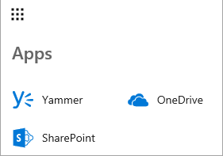
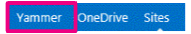

# Add Viva Engage to the SharePoint Server navigation

[!INCLUDE[appliesto-2013-2016-2019-SUB-xxx-md](../includes/appliesto-2013-2016-2019-SUB-xxx-md.md)]

You can choose whether users see a link to Viva Engage or Newsfeed in the site navigation.

The user account that is performing this procedure must be a member of the Farm Administrators group.

## In SharePoint Server 2019 and SharePoint Server 2016

1. Start the SharePoint Central Administration tool.

2. In the **Microsoft 365** section, select **Configure Viva Engage**.

3. On the **Viva Engage Configuration** page, select **Activate Viva Engage**.

      
   
     After a few minutes, the **Activate Viva Engage** button changes to **Deactivate Viva Engage**. This may take up to 30 minutes.

4. To verify that Viva Engage is selected, select the Microsoft 365 icon. You should the Viva Engage app listed.
    Here's what it looks like in SharePoint Server 2019:

     

    Here's what it looks like in SharePoint Server 2016: 

     

## In SharePoint Server 2013 running Service Pack 1 for SharePoint Server 2013
 
1. On the **Central Administration** website, in the **Microsoft 365** section, select **Configure Viva Engage**.

2. On the **Configure Viva Engage** page, select **Activate Viva Engage**. 
     
     
  
3. Look at the top navigation bar to verify that the Newsfeed link is replaced with a link to Viva Engage. 

    
    

