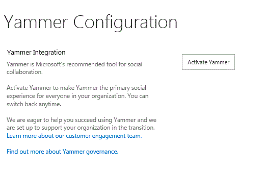

# Add Yammer to the navigation bar for SharePoint 2013

 **Summary:** Use a toggle switch to determine whether to show the SharePoint Newsfeed link or Yammer on the top navigation bar in SharePoint 2013 with Service Pack 1 (SP1). 
  
When you are running Service Pack 1 for SharePoint Server 2013, you can choose whether to show the SharePoint Newsfeed link or Yammer on the top navigation bar with a simple toggle switch. If you want to use Yammer, you select **Activate Yammer** in Central Administration. This replaces the Newsfeed link on the top navigation bar with a link to Yammer. 
  
 **To add Yammer to SharePoint on-premises navigation**
  
1. Verify that the user account that is performing this procedure is a member of the Farm Administrators group. 
    
2. On the Central Administration website, choose **Office 365** > **Configure Yammer**.
    
     
  
3. On the **Yammer Configuration** page, select **Activate Yammer**.
    

