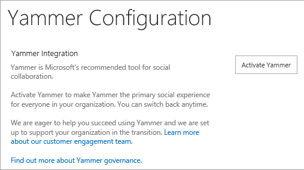
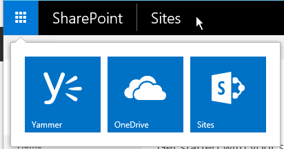
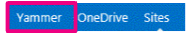

# Add Yammer to the SharePoint Server navigation

[!INCLUDE[appliesto-2013-2016-2019-xxx-md](../includes/appliesto-2013-2016-2019-xxx-md.md)]

You can choose whether users see a link to Yammer or Newsfeed in the site navigation.

The user account that is performing this procedure must be a member of the Farm Administrators group.

## In SharePoint Server 2019 and SharePoint Server 2016

1. Start the SharePoint Central Administration tool.

2. In the **Office 365** section, choose **Configure Yammer**.

3. On the **Yammer Configuration** page, choose **Activate Yammer**.

      
   
     After a few minutes, the **Activate Yammer** button changes to **Deactivate Yammer**. This may take up to 30 minutes.

4. Verify that Yammer is selected by clicking the Office 365 icon. You should the Yammer app listed.
    Here's what it looks like in SharePoint Server 2019:

     

    Here's what it looks like in SharePoint Server 2016: 

     

## In SharePoint Server 2013 running Service Pack 1 for SharePoint Server 2013
 
1. On the Central Administration website, in the **Office 365** section, choose **Configure Yammer**.

2. On the **Configure Yammer** page, select **Activate Yammer**. 
     
     
  
3. Look at the top navigation bar to verify that the Newsfeed link is replaced with a link to Yammer. 

    
    

