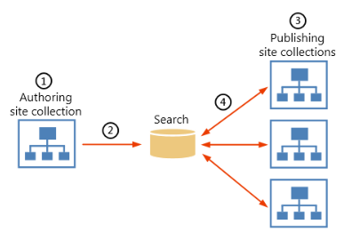

# An introduction to cross-site publishing in SharePoint Server

[!INCLUDE[appliesto-2013-2016-2019-xxx-md](../includes/appliesto-2013-2016-2019-xxx-md.md)]
  
To build our Contoso website, we'll use cross-site publishing, a publishing method introduced with SharePoint Server 2016. But before we start, let's get a bit more familiar with how cross-site publishing works.
  
> [!NOTE]
> Most of the features described in this series are available only for private sites collections in SharePoint Online. 
  
## What is cross-site publishing?

Cross-site publishing is a publishing method. It lets you to create and maintain content in one or more **authoring site collections**, and publish this content across one or more **publishing site collections** by using **Search Web Parts**. 
  
## When should you use cross-site publishing?

Use cross-site publishing when you want to store and maintain content in one or more authoring site collections and display this content in one or more publishing site collections.
  
Cross-site publishing will make life easy for you as it:
  
- Can be used across site collections, across web applications, and even across farms.
    
- Separates content authoring from branding and rendering. This means that that how you author content has nothing to do with how it is displayed to users.
    
- Allows you to mix pages and catalog content.
    
## How does cross-site publishing work?

Cross-site publishing uses search technology to retrieve content. Here's an overview of how it works in four simple steps:
  

  
1. You create content in libraries and lists in a site collection where cross-site publishing is enabled. You enable these libraries and lists as catalogs.
    
2. You crawl the content in your catalog-enabled libraries and lists. This adds the catalog content to the search index.
    
3. You add one or more Search Web Parts to the site collections where you want to display your catalog content.
    
4. When users view a page, the Search Web Parts issue queries to the search index. Query results are returned from the search index, and shown in the **Search Web Parts**. 
    
When you decide to change content in your authoring site collection, the changes that you make are shown across all publishing site collections that use that same content.
  
You can also add search-driven features such as faceted navigation, query rules, and usage analytics, which we'll explain later in this series.
  
Feeling confused? Don't panic! This series goes step-by-step through the details of how all this works.
  
The first thing we have to do is to create two site collections.
  
### Next article in this series

[Stage 1: Create site collections for cross-site publishing in SharePoint Server](stage-1-create-site-collections-for-cross-site-publishing.md)
  
## See also

#### Concepts

[Overview of cross-site publishing in SharePoint Server](overview-of-cross-site-publishing.md)

