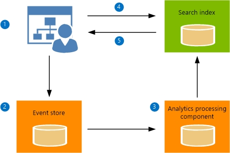
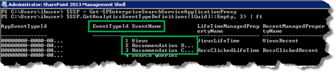
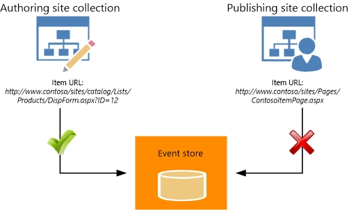
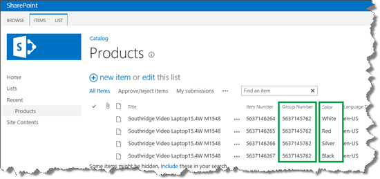
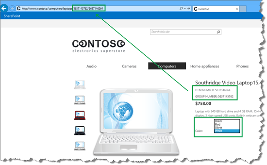
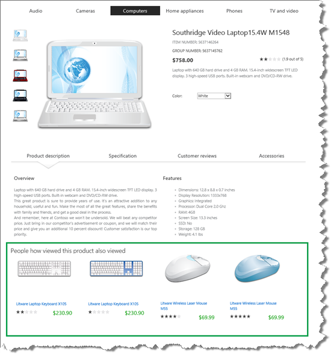
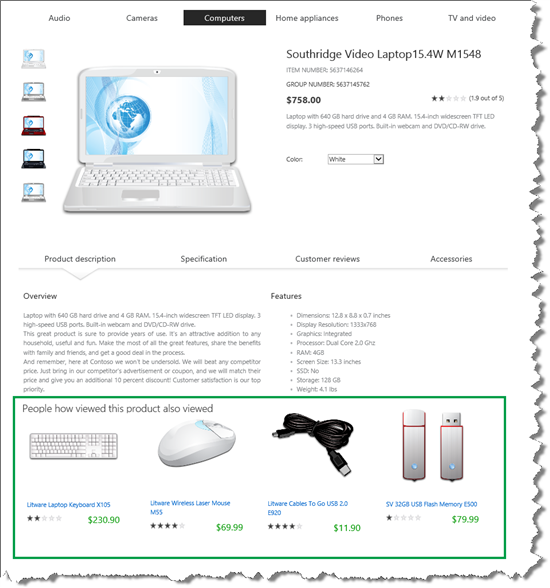

# An introduction to recommendations and popular items in SharePoint Server

[!INCLUDE[appliesto-2013-2016-2019-xxx-md](../includes/appliesto-2013-2016-2019-xxx-md.md)]
  
In SharePoint Server, recommendations and popular items can be displayed because a feature known as  *Usage analytics*  tracks and analyzes how visitors interact with your website. You can use the results that Usage analytics produces to add content to your website, for example "People who viewed this item also viewed" or "Popular items in this category." 
  
> [!NOTE]
> The examples in this series are based on an on-premises SharePoint Server deployment. 
  
Here's how the Usage analytics features work:
  

  
1. Visitors do something on our website, for example, they view an item. This generates a **usage event**. 
    
2. The usage event is recorded in the **Event store**. 
    
3. The usage events are sent to the **Analytics Processing Component**, where they are analyzed. The result is sent to the **Search index**. 
    
4. When visitors browse to a page that contains a **Recommendations** or **Popular Items Web Part**, a query is automatically issued and sent to the search index. 
    
5. The query results are returned from the search index and displayed in the **Recommendations** and **Popular Items Web Part** on your website. 
    
## View the usage event definitions
<a name="BKMK_ViewtheUsageEventDefinitions"> </a>

There are three default usage events in SharePoint Server:
  
- Views - a usage event is registered when a visitor views an item on your site.
    
- Recommendation Displayed - a usage event is registered when an item is displayed as a recommendation on your site.
    
- Recommendation Clicked - a usage event is registered when a visitor clicks an item that is displayed as a recommendation on your site.
    
To view the usage event definitions, do the following:
  
1. On the server where SharePoint Server is installed, open the **SharePoint 2016 Management Shell**. 
    
     
  
2. At the Microsoft PowerShell command prompt, type the following commands:
    
  ```
  $SSP = Get-SPEnterpriseSearchServiceApplicationProxy
  $SSP.GetAnalyticsEventTypeDefinitions([Guid]::Empty, 3) | ft
  ```

    The default usage event definitions are displayed. Some of the usage event settings will be explained later in this series. For now, just notice that each event has an **EventTypeId** and an **EventName**. 
    
     
  
    The default usage events have the following EventTypeID values:
    
|**EventTypeID**|**EventName**|
|:-----|:-----|
|1  <br/> |Views  <br/> |
|2  <br/> |Recommendation Displayed  <br/> |
|3  <br/> |Recommendation Clicked  <br/> |
   
## About Usage analytics in a cross-site publishing scenario
<a name="BKMK_AboutUsageAnalyticsinaCrossSitePublishingScenario"> </a>

> [!IMPORTANT]
> One important aspect of how Usage analytics works is step 2 of the overview:  *The usage event is recorded in the Event store*  . In the Event store, each usage event must be recorded using  *the URL of the item* . 
  
This is especially important in a cross-site publishing scenario (see [An introduction to cross-site publishing in SharePoint Server](an-introduction-to-cross-site-publishing.md)). With cross-site publishing, content is stored in an Authoring site collection and displayed in a Publishing site collection. Managed navigation is used together with category pages and catalog item pages to display content (see [Stage 8: Assign a category page and a catalog item page to a term in SharePoint Server](stage-8-assign-a-category-page-and-a-catalog-item-page-to-a-term.md)). This means that when a visitor views an item on the publishing site, the usage event happens on the catalog item page, for example  *http://www.contoso/sites/Pages/ContosoItemPage.aspx*  . Because the same catalog item page is used to display many items, the usage event cannot be recorded using the URL of the catalog item page. For Usage analytics to work in a cross-site publishing scenario, the usage event must be recorded using the URL of the item in the authoring site collection, for example:  *http://www.contoso/sites/catalog/Lists/Products/DispForm.aspx?ID=12*  . 
  

  
Depending on how you've set up your website, SharePoint Server can automatically record the usage event on the URL of the item in the authoring site. Here's the question that you must ask yourself: which Web Part are you using to display items on your catalog item page? If the answer is Catalog Item Reuse Web Parts, then you have nothing to worry about. The Catalog Item Reuse Web Part will automatically make sure that usage events are recorded correctly in the Event store. But, if you are using a Content Search Web Part to display items on your catalog item page, you must do some additional configuration steps. But don't worry, all these steps will be explained later in this series.
  
Before we move on, there's one more thing that you need to know about: the  *UsageAnalyticsID*  managed property. 
  
## About the UsageAnalyticsID managed property
<a name="BKMK_AbouttheUsageAnalyticsIDManagedProperty"> </a>

The items on our Contoso website are available in different colors. For example, the item  *Southridge Video Laptop15.4W M1548*  is available in four colors. On the authoring site, color versions are grouped under a common  *Group Number*  . 
  

  
On the publishing site, we use the value of both  *Group Number*  and  *Item Number*  in the friendly URL (FURL). Visitors can easily see that the product is available in other colors, and they can quickly view details about the product in another color without having to go back to the category page. 
  

  
The default Usage analytics calculation will consider the color of items when calculating recommendations. For example, recommendations for a white  *Southridge Video Laptop15.4W M1548*  could prove to be a white  *Litware Laptop Keyboard X105*  , a blue  *Litware Laptop Keyboard X105*  , a white  *Litware Wireless Laser Mouse M55*  and a blue  *Litware Wireless Laser Mouse M55*  . 
  

  
The two recommended keyboards are the same product, and so are the two mouse devices. These are not good recommendations. To get recommendations that will ignore the product color, we have to change the mapping of the  *UsageAnalyticsID*  managed property. 
  
By default,  *UsageAnalyticsID*  is mapped to the crawled property  *ows_ProductCatalogItemNumber*  . If you used the Product Catalog site template when you created your authoring site collection (as explained in [Stage 1: Create site collections for cross-site publishing in SharePoint Server](stage-1-create-site-collections-for-cross-site-publishing.md)), this crawled property represents the site column  *Item Number*  in your  *Products*  list. 
  
If you didn't use the Product Catalog site template when you created your authoring site collection, or, if you don't want to use the site column  *Item Number*  in the Usage analytics calculation, you must change the mapping of the  *UsageAnalyticsID*  managed property. But, when you change the mapping, you must make sure that the property that you map to  *UsageAnalyticsID*  is used in the friendly URL (FURL) of your catalog item page. Most likely, you specified this FURL when you [Specify URL details for a product page](stage-5-connect-your-publishing-site-to-a-catalog.md#BKMK_SpecifyURLDetailsforaProductPage). This is because the **Recommended Items Web Part** uses a value from the FURL to show the correct recommendations. A later article in this series will explain how to configure the **Recommended Items Web Part**. 
  
Remember, the color versions of our products are grouped under a common  *Group Number*  , and we use the value of  *Group Number*  in the FURL of our catalog item page. So, by mapping  *UsageAnalyticsID*  to the crawled property of  *Group Number*  , the Usage analytics calculation will be done on a group level. This means we can display one product per product group as a recommendation. 
  

  
There is of course, more to it than this. If you're confused, hang in there. The features will be described with step-by-step examples as we move through this series.
  
### Next article in this series

[Change the Content Search Web Part display template and use Windows PowerShell to start Usage analytics in SharePoint Server](change-the-content-search-web-part-display-template-and-use-windows-powershell-t.md)
  

