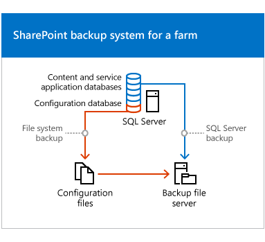
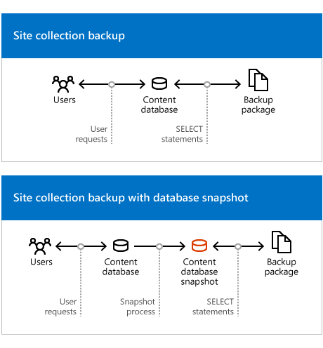

# Overview of backup and recovery in SharePoint Server

[!INCLUDE[appliesto-2013-2016-2019-xxx-md](../includes/appliesto-2013-2016-2019-xxx-md.md)] 
  
The SharePoint Server backup architecture and recovery processes include farm backup and recovery, granular backup and recovery, and recovery from an unattached content database. You can complete backup and recovery operations by using the SharePoint Central Administration website or PowerShell cmdlets. Note that some built-in backup and recovery tools may not meet all the requirements of your organization.
  
## SharePoint backup and recovery scenarios

Backing up and recovering data supports many business scenarios, including the following:
  
- Recovering unintentionally deleted content that is not protected by the recycle bin or versioning.
    
- Moving data between installations as part of a hardware or software upgrade.
    
- Recovering from an unexpected failure.
    
## Backup architecture in SharePoint Server

SharePoint Server provides two backup systems: farm and granular.
  
### Farm backup architecture in SharePoint Server 2016

The farm backup architecture in SharePoint Server starts a SQL Server backup of content and service application databases, writes configuration content to files, and also backs up the Search index files and synchronizes them with the Search database backups.
  
The following illustration shows the farm backup system.
  
**SharePoint backup system for a farm**

  
The architecture supports both full and differential backups. Full backups create a new backup of the complete system. Differential backups create a backup of all changes that are stored in databases since the last full backup. 
  
The farm backup system is organized hierarchically. The components in a farm that you can select for backup include the following:
  
- **Farm** The farm is the highest-level object. You can select from the following options when you perform a farm backup: 
    
  - Content and configuration data (default)
    
    The whole server farm is backed up. This includes settings from the configuration database.
    
  - Configuration-only
    
     Configuration database settings are backed up so that you can apply configurations across farms. For more information, see [Configuration-only backup use and benefits](#Section1a) later in this article. 
    
- **Web application** Within a web application, you can select one or more of the content databases to back up. 
    
    A web application backup includes the following:
    
  - Application pool name and application pool account
    
  - Authentication settings
    
  - General web application settings such as alerts and managed paths
    
  - Internet Information Services (IIS) binding information, such as the protocol type, host header and port number
    
  - Changes to the Web.config file that were made through the object model or Central Administration
    
    > [!NOTE]
    > Changes to the Web.config file that were made to support claims-based applications that use forms-based authentication are not included in backups, because those changes are made manually. For more information, see [Considerations for using farm backups](#Considerations) later in this article. 
  
  - Sandboxed solutions
    
    For recommendations about how to protect these settings, see [Plan for backup and recovery in SharePoint Server](backup-and-recovery-planning.md).
    
- **Services and service applications (not shared)** An example of a service that is not shared is the State Service. Service and service application backups contain the settings for a service or service application and any databases associated with it. 
    
    > [!IMPORTANT]
    > Backups of service applications do not include the related proxy. To back up both the service application and the service application proxy, you must either back up the farm or perform two consecutive backups. You select the service application in one backup, and you select the associated service application proxy in the second backup. 
  
    Many service application databases cannot be backed up individually from SharePoint Server. To back up service application databases only, you must use SQL Server backup. 
    
- **Proxies for service applications that are not shared**
    
- **Shared Services** Shared services require both a service application and a service application proxy to run. Select the Shared Services node to back up all of the service applications and the related service application proxies on the farm. 
    
    > [!NOTE]
    > The backup hierarchy enables you to select individual service applications and service application proxies to back up. However, when you select one or all service applications, or one or all proxies, the related objects are not backed up by default. 
  
Note that some settings in the SharePoint Server environment are not included in a farm backup. They include the following settings that are stored on web servers: 
  
- Application pool account passwords
    
- HTTP compression settings
    
- Time-out settings
    
- Custom Internet Server Application Programming Interface (ISAPI) filters
    
- Computer domain membership
    
- Internet Protocol security (IPsec) settings
    
- Network Load Balancing settings
    
- Secure Sockets Layer (SSL) certificates
    
- Dedicated IP address settings
    
#### Search service application backup process

Back up and recovery of the Search service application is a special case because of the complexity of interactions between the components of the application.
  
When you start a backup of the Search service application, SharePoint Server starts a SQL Server backup of the Search administration database, crawl databases, and property databases. The process also backs up the index partition files in parallel.
  
Consider how the backup and recovery processes for the Search service application affect your service-level agreement. For example, consider how pausing all crawls might affect the freshness of search results.
  
The backup process is as follows:
  
1. Master merges are paused to preserve the master index.
    
2. A full database backup starts.
    
3. The master index is backed up.
    
4. Crawls are paused.
    
    The pause in crawling is much shorter than during a backup of earlier versions of SharePoint search, and does not last the full duration of the backup process.
    
5. All shadow indexes are backed up.
    
6. An incremental database backup starts.
    
7. Crawls are resumed.
    
8. Master merges are resumed.
    
#### Configuration-only backup use and benefits

A configuration-only backup extracts and backs up the configuration settings from a configuration database. You can use built-in tools to back up the configuration of any configuration database, whether it is currently attached to a farm or not. For detailed information about how to back up a configuration, see [Back up farm configurations in SharePoint Server](back-up-a-farm-configuration.md). 
  
You can be restore a configuration backup to the same or another server farm. When you restore a configuration, you overwrite settings in the farm if values for those settings are in the configuration backup. Settings in the farm that are not in the configuration backup are not changed. For detailed information about how to restore a farm configuration, see [Restore farm configurations in SharePoint Server](restore-a-farm-configuration.md).
  
> [!NOTE]
> Web application and service application settings are not included in a configuration backup. You can use PowerShell cmdlets to document and copy settings for service applications. For more information, see [Document farm configuration settings in SharePoint Server](document-farm-configuration-settings.md) and [Copy configuration settings between farms in SharePoint Server](copy-configuration-settings-between-farms.md). 
  
Situations in which you might want to restore a configuration from one farm to another farm include the following:
  
- Replicating a standardized farm configuration to be used throughout an environment.
    
- Moving configurations from a development or test environment to a production environment.
    
- Moving configurations from a stand-alone installation to a farm environment.
    
- Configuring a farm to serve as part of a standby environment.
    
SharePoint Server stores the following kinds of settings in the configuration-only backup:
  
- Antivirus
    
- Information rights management (IRM)
    
- Outbound email settings (only restored when you perform an overwrite).
    
- Customizations deployed as trusted solutions
    
- Diagnostic logging
    
#### Considerations for using farm backups

Consider the following before you use farm backups:
  
- There is no built-in scheduling system for backups. To schedule a backup, we recommend that you use PowerShell to create a backup script, and then use Windows Task Scheduler to run the backup script regularly.
    
- We do not recommend that you use IIS metabase backup to protect IIS settings. Instead, document all IIS configurations for each web server by using a tool that provides the configuration monitoring you want, such as System Center Configuration Manager.
    
- SharePoint Server backup and recovery can be run together with SQL Server Enterprise features such as backup compression and transparent data encryption. 
    
    If you are running SQL Server Enterprise, we recommend that you use backup compression. For more information about backup compression, see [Backup Compression (SQL Server)](http://go.microsoft.com/fwlink/p/?LinkID=717243&amp;clcid=0x409).
    
    If you decide to run databases with transparent data encryption, you must manually back up the key and restore the key. SharePoint Server backup and restore will not remind you about the key. For more information about transparent data encryption, see [Transparent Data Encryption (TDE)](http://go.microsoft.com/fwlink/p/?LinkID=715778&amp;clcid=0x409). 
    
- If a content database is set to use the SQL FILESTREAM remote BLOB storage (RBS) provider, the RBS provider must be installed both on the database server that is being backed up and on the database server to which you recover the backup.
    
- SharePoint Server backup does not protect: 
    
  - Changes to the Web.config file on web servers that are not made through Central Administration or the object model.
    
  - Customizations to a site that are not deployed as part of a trusted or sandboxed solution.
    
- If you share service applications across farms, be aware that trust certificates that have been exchanged are not included in farm backups. You must back up the certificate store separately or keep the certificates in a separate location. When you restore a farm that shares a service application, you must import and redeploy the certificates and then establish any inter-farm trusts again.
    
    For more information, see [Exchange trust certificates between farms in SharePoint Server](exchange-trust-certificates-between-farms.md).
    
- When you restore a farm or Web application that is configured to use any kind of claims-based authentication, duplicate or additional providers may appear to be enabled. If duplicates appear, you must manually save each web application zone to remove them. 
    
- Additional steps are required when you restore a farm that contains a web application that is configured to use forms-based authentication. You must register the membership and role providers again in the Web.config file, and then deploy the providers again. You must perform these steps whether you are restoring at the web application level or at the farm level. 
    
    For more information, see [Back up web applications in SharePoint Server](back-up-a-web-application.md), and [Plan for user authentication methods in SharePoint Server](../security-for-sharepoint-server/plan-user-authentication.md).
    
### Granular backup and export architecture

The granular backup and export architecture uses Transact-SQL queries and export calls. Granular backup and export is a more read-intensive and processing-intensive operation than farm backup. 
  
From the granular backup system, you can back up a site collection or export a site or list.
  
> [!NOTE]
> Workflows are not included in exports of sites or lists. 
  
If you are running SQL Server Enterprise, the granular backup system can optionally use SQL Server database snapshots to make sure that data remains consistent while the backup or export is in progress. After you create a snapshot, SharePoint Server uses it to create the backup or export package, and then deletes the snapshot. Database snapshots are linked to the source database. When the source database is offline, the snapshot is unavailable. For more information about database snapshots, see [Database Snapshots](http://go.microsoft.com/fwlink/p/?LinkID=715786&amp;clcid=0x409).
  
Benefits of backing up a site collection by using a snapshot include the following: 
  
- The snapshot makes sure that the data that is being read remains consistent while the operation is being performed. 
    
- Users can continue to interact with the site collection while it is being backed up from the database snapshot. This includes adding, editing, and deleting content. However, the changes that users make to the live site will not be included in the site collection backup because the backup is based on the database snapshot.
    
However, database snapshots can adversely affect performance.
  
You can use granular backup and export for content that is stored in a database that is configured to use the SQL FILESTREAM RBS provider. 
  
> [!NOTE]
> If the RBS provider that you use does not support snapshots, you cannot use snapshots for content deployment or backup. For example, the SQL FILESTREAM provider does not support snapshots. 
  
> [!NOTE]
> We do not recommend that you use SharePoint Server site collection backup for site collections larger than 85 GB. 
  
The following illustration shows the granular backup and export system.
  
**Site collection backup**

  
## Recovery processes in SharePoint Server

SharePoint Server supports the following primary, built-in recovery options:
  
- Restore from a farm backup that was created by using built-in tools.
    
- Restore from the backup of a component taken by using the farm backup system.
    
- Restore from a site collection backup.
    
- Connect to a content database by using the unattached content database feature, back up or export data from it, and then restore or import the data. 
    
### Restoring from a farm backup

Items that can be recovered from a farm backup include the following:
  
- Farm
    
  - Content and configuration data (default)
    
    The whole server farm is restored.
    
    This includes settings from the configuration database, and trusted solution packages.
    
  - Configuration-only
    
    Only the configuration data is restored. This overwrites any settings in the farm that have values that are set within the configuration-only backup.
    
- Web applications
    
    Restores web applications. 
    
- Service applications
    
    Restores service applications. Service application recovery can be complex because SharePoint Server cannot fully reconfigure service application proxies during the restore process. Although service application proxies are restored, they are not put in proxy groups. Therefore, service application proxies are not associated with any web applications. For more information about how to restore a Search service application, see [Search service application recovery process](#Search). For specific information about how to restore specific service applications, see [Restore service applications in SharePoint Server](restore-a-service-application.md).
    
- Content databases
    
    When content databases are restored, the sandboxed solutions associated with the related site collections are also restored.
    
#### Restoring as new versus restoring as overwrite

By default, SharePoint Server recovery restores all objects as new instances of the object, instead of overwriting existing instances with the same name. 
  
When you restore a farm or object as new, the following objects will not work without adjustments, because all GUIDs for objects are assigned new values: 
  
- **Farm.**
    
    When you restore a farm as new, you must do the following:
    
  - Recreate alternate access mapping settings. SharePoint Server recovery only restores the Default zone of the web application.
    
  - Reconfigure settings for any Business Data Connectivity and Managed Metadata service application external sources.
    
  - Associate service application proxies with proxy groups again because service application proxies are not assigned to proxy groups when restored. All web applications will be associated with the default proxy group. You must associate web applications with other proxy groups if you want to do that.
    
- **Web application**
    
  - If the name and URL of a web application that you provide match the name and URL an existing web application in the farm, SharePoint Server recovery combines them.
    
  - If you do not want to combine web applications, you must rename the web application when you restore it as new.
    
  - When you restore a web application as new in the same environment but do not combine web applications, many other parameters and objects must also be changed. For example, you may have to provide different database file paths and different database names.
    
- **Service applications and service application proxies**
    
  - If you recover a service application and also recover the related service application proxy, you must associate the service application proxy with a proxy group.
    
  - If you recover a service application and do not also recover the related service application proxy, you must recreate the service application proxy.
    
    > [!NOTE]
    > You cannot restore a service application as new in the same farm. You can restore a service application as new in another farm. 
  
When you restore an object and overwrite the existing object, no changes are necessary.
  
#### Search service application recovery process

The recovery process for the Search service application varies depending on whether you are restoring as new or restoring as overwrite. When you restore as overwrite, no additional steps are necessary.
  
The restore as new process is as follows:
  
1. Restore the service application as new, and specify the new farm topology information as you restore. 
    
2. Restore the service application proxy as new. If you did not restore the service application proxy, you must create a new service application proxy and associate it with the Search service application.
    
3. Associate the service application proxy with the appropriate proxy group and associate the proxy group (if it is not the default proxy group) with the appropriate Web application. 
    
4. For least-privilege deployments, start the Search service and the Search admin query Web service with the appropriate account.
    
For more information about how to recover the Search service application, see [Restore Search service applications in SharePoint Server](restore-a-search-service-application.md).
  
### Restoring from a site collection backup

Only site collections can be recovered from a site collection backup.
  
### Recovering from an unattached content database

An unattached content database is a database that is attached to an instance of SQL Server but is not associated with a web application. SharePoint Server can connect to and back up from an unattached database. For example, SharePoint Server can connect to read-only content databases that were restored from any supported backup technology and SQL Server database snapshots of content databases. 
  
Recovery is the following two-stage process:
  
1. Back up or export the object from the unattached content database.
    
2. Restore or import the output of the prior step to SharePoint Server.
    
The following items can be backed up or exported from an unattached database by using granular backup and export, and then restored: 
  
- Site collection
    
    Back up by using site collection backup, and then recover by using a site collection restore.
    
- Site
    
    Export, and then import.
    
- Lists and libraries
    
    Export, and then import.
    
You can use import to recover content that you backed up from a database that is configured to use the SQL FILESTREAM RBS provider. SharePoint Server uses the currently defined storage provider for that content database to store recovered content. If the content database is not set to use RBS, the data will be stored in the content database; if the content database is set to use RBS, the data will be stored in RBS.
  
## See also

#### Concepts

[Plan for backup and recovery in SharePoint Server](backup-and-recovery-planning.md)
  

