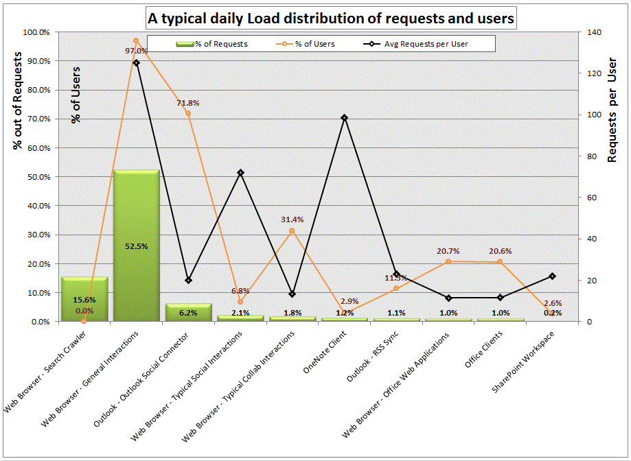
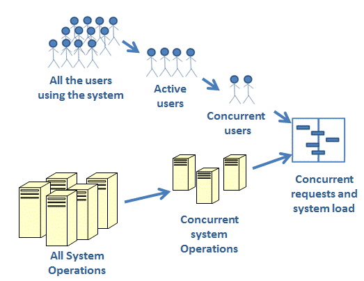

# Capacity planning for SharePoint Server 2013

[!INCLUDE[appliesto-2013-xxx-xxx-xxx-md](../includes/appliesto-2013-xxx-xxx-xxx-md.md)] 
  
This article describes how to plan the capacity of a SharePoint Server 2013 farm. When you have a good appreciation and understanding of capacity planning and management, you can apply your knowledge to system sizing. Sizing is the term used to describe the selection and configuration of appropriate data architecture, logical and physical topology, and hardware for a solution platform. There is a range of capacity management and usage considerations that affect how you should determine the most appropriate hardware and configuration options.
  
Before you read this article, you should read [Capacity management and sizing overview for SharePoint Server 2013](https://docs.microsoft.com/previous-versions/office/ff758647(v=office.15)).
  
> [!IMPORTANT]
> Some information and values in this article are based on test results and other information related to SharePoint 2010 Products and may not represent the final values for SharePoint Server 2013. 
  
In this article, we describe the steps you should take to undertake effective capacity management for your environment. Each step requires certain information for successful execution, and has a set of deliverables that you will use in the subsequent step. For each step, these requirements and deliverables are outlined in tables.
  
    
## Step 1: Model

Modeling your SharePoint Server 2013-based environment begins with analyzing your existing solutions and estimating the expected demand and targets for the deployment you are planning to set up. You start by gathering information about your user base, data requirements, latency and throughput targets, and document the SharePoint Server 2013 features you want to deploy. Use this section to understand what data you should collect, how to collect it, and how it can be used in subsequent steps. 
  
### Understand your expected workload and dataset

Proper sizing of a SharePoint Server 2013 implementation requires that you study and understand the demand characteristics that your solution is expected to handle. Understanding the demand requires that you be able to describe both the workload characteristics such as number of users and the most frequently used operations, and dataset characteristics such as content size and content distribution.
  
This section can help you understand some specific metrics and parameters you should collect and mechanisms by which they can be collected. 
  
#### Workload

Workload describes the demand that the system will need to sustain, the user base and usage characteristics. The following table provides some key metrics that are helpful in determining your workload. You can use this table to record these metrics as you collect them.
  
|**Workload Characteristics**|**Value**|
|:-----|:-----|
|Average daily RPS    ||
|Average RPS at peak time    ||
|Total number of unique users per day    ||
|Average daily concurrent users    ||
|Peak concurrent users at peak time    ||
|Total number of requests per day    ||
|Expected workload distribution    |No. of Requests per day    |%    |
|Web Browser - Search Crawl    |||
|Web Browser - General Collaboration Interaction    |||
|Web Browser - Social Interaction    |||
|Web Browser - General Interaction    |||
|Web Browser - Office Web Apps    |||
|Office Clients    |||
|OneNote Client    |||
|SharePoint Workspace    |||
|Outlook RSS Sync    |||
|Outlook Social Connector    |||
|Other interactions(Custom Applications/Web services)    |||
   
- **Concurrent users** - It is most common to measure the concurrency of operations executed on the server farm as the number of distinct users generating requests in a given time frame. The key metrics are the daily average and the concurrent users at peak load. 
    
- **Requests per second (RPS)** - RPS is a commonly used indicator used to describe the demand on the server farm expressed in the number of requests processed by the farm per second, but with no differentiation between the type or size of requests. Every organization's user base generates system load at a rate that is dependent on the organization's unique usage characteristics. See the **Glossary** section in [Capacity management and sizing overview for SharePoint Server 2013](/previous-versions/office/sharepoint-server-2010/ff758647(v=office.14)) for more information on this term. 
    
- **Total daily requests** - Total daily requests is a good indicator of the overall load the system will need to handle. It is most common to measure all requests except authentication handshake requests (HTTP status 401) over a 24 hour period. 
    
- **Total daily users** - Total users is another key indicator of the overall load the system will need to handle. This measurement is the actual number of unique users in a 24 hour period, not the total number of employees in the organization. 
    
    > [!NOTE]
    > The number of total daily users can indicate the growth potential of the load on the farm. For example, if the number of potential users is 100k employees, 15k daily users indicates that the load may significantly grow over time as user adoption increases. 
  
- **Workload Distribution** - Understanding the distribution of the requests based on the clients applications that are interacting with the farm can help predict the expected trend and load changes after migrating to SharePoint Server 2013. As users transition to more recent client versions such as Office 2013, and start using the new capabilities new load patterns, RPS and total requests are expected to grow. For each client we can describe the number of distinct users using it in a time frame of a day, and the amount of total requests that the client or feature generates on the server. 
    
    For example, the chart below shows a snapshot of a live internal Microsoft environment serving a typical social solution. In this example, you can see that the majority of the load is generated by the search crawler and typical end user web browsing. You can also observe that there is significant load introduced by the Outlook Social Connector feature (6.2 percent of the requests).
    
     
  
#### Estimating your production workload

In estimating the required throughput your farm needs to be able to sustain, begin with estimating the mix of transactions that will be used in your farm. Focus on analyzing the most frequently used transactions the system will serve, understanding how frequently they will be used and by how many users. That will help you validate later whether the farm can sustain such load in pre-production testing.
  
The following diagram describes the relationship of the workload and load on the system:
  

  
To estimate your expected workload, collect the following information:
  
- Identify user interactions such as typical web page browses, file downloads and uploads, Office Web Application views and edits in the browser, co-authoring interactions, SharePoint Workspace site syncs, Outlook Social Connections, RSS sync (in Outlook or other viewers), PowerPoint Broadcasts, OneNote shared notebooks, Excel Service shared workbooks, Access Service shared applications and others. See the **Services and Features** section of the article [Capacity management and sizing overview for SharePoint Server 2013](/previous-versions/office/sharepoint-server-2010/ff758647(v=office.14)) for more information. Focus on the identifying the interactions that may be unique to your deployment, and recognize the expected impact of such load, examples can be significant use of InfoPath Forms, Excel Service Calculations and similar dedicated solutions. 
    
- Identify system operations such as Search incremental crawls, daily backups, profile sync timer jobs, web analytics processing, logging timer jobs and others.
    
- Estimate the total number of users per day that are expected to utilize each capability, derive the estimated concurrent users and high level Requests per second, there are some assumptions you will be making such as present concurrency and the factor of RPS per concurrent users that is different across capabilities, you should use the workload table earlier in this section for your estimates. It is important to focus on peak hours, rather than average throughput. Planning for peak activity, you are able to proper size your SharePoint Server 2013-based solution.
    
If you have an existing Office SharePoint Server 2007 solution, you can mine the IIS log files or look to other Web monitoring tools you have to better understand some of the expected behaviors from the existing solution or see the instructions in the section below for more details. If you are not migrating from an existing solution, you should fill out the table using rough estimates. In later steps you will need to validate your assumptions and tune the system.
  
#### Analyzing your SharePoint Server 2013 IIS Logs

To discover key metrics about an existing SharePoint Server 2013 deployment, such as how many users are active, how heavily they are using the system, what kind of requests are coming in, and from what kind of clients they originate, it is necessary to extract data from ULS and IIS logs. One of the easiest ways to acquire this data is to use **Log Parser**, a powerful tool available free for download from Microsoft. Log Parser can read and write to a number of textual and binary formats, including all the IIS formats.
  
For detailed information about how to analyze SharePoint Server 2013 usage using Log Parser, read [Analyzing Microsoft SharePoint Products and Technologies Usage](http://www.microsoft.com/downloads/details.aspx?familyid=f159af68-c3a3-413c-a3f7-2e0be6d5532e&amp;displaylang=en&amp;tm) (http://www.microsoft.com/downloads/details.aspx?familyid=f159af68-c3a3-413c-a3f7-2e0be6d5532e&amp;displaylang=en&amp;tm). 
  
You can download Log Parser 2.2 at [http://www.microsoft.com/downloads/details.aspx?FamilyID=890CD06B-ABF8-4C25-91B2-F8D975CF8C07&amp;displaylang=en](http://www.microsoft.com/downloads/details.aspx?FamilyID=890CD06B-ABF8-4C25-91B2-F8D975CF8C07&amp;displaylang=en). 
  
#### Dataset

Dataset describes the volume of content stored in the system and how it can be distributed in the data store. The following table provides some key metrics that are helpful in determining your dataset. You can use this table to record these metrics as you collect them.
  
|**Object**|**Value**|
|:-----|:-----|
|DB size (in GB)    ||
|Number of Content DBs    ||
|Number of site collections    ||
|Number of web apps    ||
|Number of sites    ||
|Search index size (# of items)    ||
|Number of docs    ||
|Number of lists    ||
|Average size of sites    ||
|Largest site size    ||
|Number of user profiles    ||
   
- **Content size** - Understanding the size of the content that you expect to store in the SharePoint Server 2013 system is important for planning and architecting the system storage, and also for properly sizing the Search solution that will crawl and index this content. The content size is described in total disk space. If you are migrating content from an existing deployment you might find it simple to identify the total size that you will move; while planning you should leave room for growth over time based on the predicted trend. 
    
- Total number of documents - Other than the data corpus size, it is important to track the overall number of items. The system reacts differently if 100 GB of data is composed of 50 files of 2 GB each versus 100,000 files of 1 KB each. In large deployments, the less stress there is on a single item, document or area of documents, the better performance will be. Widely distributed content like multiple smaller files across many sites and site collection is easier to serve then a single large document library with very large files. 
    
- **Maximum site collection size** - It is important to identify what is the biggest unit of content that you will store in SharePoint Server 2013; usually it is an organizational need that prevents you from splitting that unit of content. Average size of all site collections and the estimated total number of site collections are additional indicators that will help you identify your preferred data architecture. 
    
- **Service applications data characteristics** - In addition to analysing the storage needs for the content store, you should analyse and estimate the sizes of other SharePoint Server 2013 stores, including: 
    
- Total size of the Search index
    
- The profile database total size based on the number of user in the profile store
    
- The social database total size based on the expected number of tags, colleagues and activities
    
- The metadata store size
    
- The size of the usage database
    
- The size of the Web Analytics data base
    
### Setting Farm Performance and Reliability Targets

One of the deliverables of [Step 1: Model](capacity-planning.md#step1) is a good understanding of the performance and reliability targets that best fit the needs of your organization. A properly designed SharePoint Server 2013 solution should be able to achieve "four nines" (99.99%) of uptime with sub-second server responsiveness. 
  
The indicators used to describe the performance and reliability of the farm can include:
  
- **Server availability** - Usually described by the percent of overall uptime of the system. You should track any unexpected downtime and compare the overall availability to the organizational target you set. The targets are commonly described by a number of nines (i.e. 99%, 99.9%, 99.99%) 
    
- **Server responsiveness** - The time it takes the farm to serve requests is a good indicator to track the health of the farm. This indicator is usually named server side latency, and it is common to use the average or median (the 50th percentile) latency of the daily requests being served. The targets are commonly described in sub seconds or seconds. Note that if your organization has a target to serve pages from SharePoint Server 2013 in less than two seconds, then the server side goal needs to be sub seconds to leave time for the page to reach the client over the network and time to render in the browser. Also in general longer server response times are an indication of an unhealthy farm, as this usually as an impact on throughput and rarely can RPS keep up if you spend more than a second on the server on most requests 
    
- **Server spikiness** - Another good server side latency indicator worth tracking is the behaviour of the slowest 5% of all requests. Slower requests are usually the requests that hit the system when it is under higher load or even more commonly, requests that are impacted by less frequent activity that occur while users interact with the system; a healthy system is one that has the slowest requests under control as well. The target here is similar to Server Responsiveness, but to achieve sub-second response on server spikiness, you will need to build the system with a lot of spare resources to handle the spikes in load. 
    
- **System resource utilization** - Other common indicators used to track the health of the system are a collection of system counters that indicate the health of each server in the farm topology. The most frequently used indicators to track are % CPU utilization and Available Memory; however, there are several additional counters that can help identify a non-healthy system; more details can be found in [Step 5: Monitor and Maintain](capacity-planning.md#step5).
    
## Step 2: Design

Now that you have finished collecting some facts or estimates on the solution you need to deliver, you are ready to start the next step of designing a proposed architecture that you predict will be able to sustain the expected demand.
  
By the end of this step you should have a design for your physical topology and a layout for your logical topology, so you should be able to go ahead with any necessary purchase orders.
  
The hardware specifications and the number of machines you layout are tightly related, to handle a specific load there are several solutions you can choose to deploy. It is common to either use a small set of strong machines (scale up) or a larger set of smaller machines (scale out); each solution has its advantages and disadvantages when it comes to capacity, redundancy, power, cost, space, and other considerations. 
  
We recommend that you begin this step by determining your architecture and topology. Define how you plan to layout the different farms and the different services in each farm, and then pick the hardware specifications for each of the individual servers in your design. You can also execute this process by identifying the hardware specifications you are expected to deploy (many organizations are constrained to a certain company standard) and then define your architecture and topology.
  
Use the following table to record your design parameters. The data included is sample data, and should not be used to size your farm. It is intended to demonstrate how to use this table for your own data.
  
|**Role**|**Type (Standard or virtual)**|**# of machines**|**Procs**|**RAM**|**IOPS need**|**Disk size OS+Log**|**Data drive**|
|:-----|:-----|:-----|:-----|:-----|:-----|:-----|:-----|
|Web servers    |Virtual    |4    |4 cores    |8    |N/A    |400 GB    |N/A    |
|Content database server    |Standard    |1 cluster    |4 quad-core 2.33 (GHz)    |48    |2k    |400 GB    |20 disks of 300GB    @ 15K RPM    |
|Application servers    |Virtual    |4    |4 cores    |16    |N/A    |400 GB    |N/A    |
|Search Crawl Target Web server    |Virtual    |1    |4 cores    |8    |N/A    |400 GB    |N/A    |
|Search Query server    |Standard    |2    |2 quad-core 2.33 (GHz)    |32    |N/A    |400 GB    |500 GB    |
|Search Crawler server    |Standard    |2    |2 quad-core 2.33 (GHz)    |16    |400    |400 GB    |N/A    |
|Search Crawl database server    |Standard    |1 cluster    |4 quad-core 2.33 (GHz)    |48    |4k (tuned for read)    |100 GB    |16 disks of 150GB @ 15K RPM    |
|Search Property Store database + Administration database server    |Standard    |1 cluster    |4 quad-core 2.33 (GHz)    |48    |2k (tuned for write)    |100 GB    |16 disks of 150GB @ 15K RPM    |
   
### Determine your starting point architecture

This section describes how to select a starting point architecture.
  
When you deploy SharePoint Server 2013, you can choose from a range of topologies to implement your solution; you may deploy a single server or scale out many servers to a SharePoint Server 2013 farm with clustered or mirrored database servers and discreet application servers for various services. Later you will select the hardware configurations based on the requirements of each of the roles, based on your capacity, availability, and redundancy needs. 
  
Start by reviewing the different reference architectures and figure out your farm structure, decide if you should split your solution across multiple farms, or federate some services, such as search, on a dedicated farm. See the **Reference Architectures** section in [Capacity management and sizing overview for SharePoint Server 2013](/previous-versions/office/sharepoint-server-2010/ff758647(v=office.14)) for more information. 
  
#### SharePoint Server 2010 Technical Case Studies

Capacity management guidance for SharePoint Server 2013 includes a number of technical case studies of existing production environments that present a detailed description of existing SharePoint Server 2013-based production environments. Technical case studies specific to SharePoint Server 2013 will be published as they become available; the existing SharePoint Server 2010 case studies can serve as a reference on how to design a SharePoint Server 2013-based environment for specific purposes. 
  
You can use these case studies as a reference while designing the architecture of your SharePoint Server 2013 solutions especially if you find the description of these deployment specific key differentiators similar to the demands and targets of the solution you are architecting.
  
These documents describe the following information for each documented case study:
  
- **Specifications**, such as hardware, farm topology and configuration; 
    
- **Workload** including the user base, and the usage characteristics; 
    
- **Dataset**, including contents sizes, content characteristics and content distribution 
    
- **Health and performance** including a set of recorded indicators describing the farm's reliability and performance characteristics 
    
For more information, download relevant documents from the [Performance and capacity technical case studies (SharePoint Server 2010)](https://go.microsoft.com/fwlink/p/?LinkId=95813) page. 
  
### Select your hardware

Selecting the right specifications for the machines in your farm is a crucial step to ensure proper reliability and performance of your deployment, one key concept to keep in mind is that you should plan for peak load and peak hours; in other words, when your farm is operating under average load conditions, there should be enough resources available to handle the greatest expected demand while still hitting latency and throughput targets. 
  
The core capacity and performance hardware features of servers reflect four main categories: processing power, disk performance, network capacity, and memory capabilities of a system. 
  
Another thing to consider is using virtualized machines. A SharePoint Server 2013 farm can be deployed using virtual machines. Although virtualization has not been found to add any performance benefits, it does provide manageability benefits. Virtualizing SQL Server-based computers is generally not recommended, but there may be certain benefits to virtualizing the Web server and application server tiers. For more information, see [Virtualization planning](/previous-versions/office/sharepoint-server-2010/ff607968(v=office.14)) (/previous-versions/office/sharepoint-server-2010/ff607968(v=office.14)). 
  
For more information about hardware requirements, see [Hardware and software requirements for SharePoint Server 2016](../install/hardware-and-software-requirements.md).
  
#### Hardware Selection Guidelines

#### Choosing Processors

SharePoint Server 2013 is available only for 64-bit processors. In general, more processors will enable you to serve greater demand.
  
In SharePoint Server 2013, individual web servers will scale up as you add more cores. The more cores the server has the more load it can sustain, all else being equal. In large SharePoint Server 2013 deployments, we recommend that you allocate either multiple 4-core web servers (which can be virtualized), or fewer stronger (8-/16-/24-cores) web servers.
  
Application servers' processor capacity requirements differ depending on the role of the server and the services it is running. Some SharePoint Server 2013 features demand greater processing power than others. For example, the SharePoint Search Service is highly dependent on the processing power of the application server. 
  
The processor capacity requirements for SQL Server also depend on the service databases that a SQL Server-based computer is hosting. 
  
#### Choosing Memory

Your servers will require varying amounts of memory, depending on server function and role. For example, servers that run Search crawl components will process data more quickly if they have a large amount of memory because documents are read into memory for processing. Web servers that take advantage of many of the caching features of SharePoint Server 2013 may require more memory as well.
  
In general, web server memory requirements are highly dependent on the number of application pools enabled in the farm and the number of concurrent requests being served. In most production SharePoint Server 2013 deployments, we recommend that you allocate at least 8 GB RAM on each web server, with 16 GB recommended for servers that have greater traffic or deployments with multiple application pools set up for isolation. 
  
Application servers' memory requirements differ also; some SharePoint Server 2013 features have greater memory requirements on the application tier than others. In most production SharePoint Server 2013 deployments we recommend that you allocate at least 8 GB RAM on each application server; 16 GB, 32 GB and 64 GB application servers are common when many application services are enabled on the same server, or when services that are highly dependent on memory, such as the Excel Calculation Service and SharePoint Server 2013 Search Service, are enabled. 
  
The memory requirements of database servers are tightly dependent on the database sizes. For more information about choosing memory for your SQL Server-based computers, see [Storage and SQL Server capacity planning and configuration (SharePoint Server)](storage-and-sql-server-capacity-planning-and-configuration.md).
  
#### Choosing Networks

In addition to the benefit offered to users if clients have fast data access through the network, a distributed farm must have fast access for inter-server communication. This is especially true when you distribute services across multiple servers or federate some services to other farms. There is significant traffic in a farm across the web server tier, the application server tier, and the database server tier, and network can easily become a bottleneck under certain conditions like dealing with very large files or very high loads.
  
Web servers and application servers should be configured to use at least two network interface cards (NICs): one NIC to handle end-user traffic and the other to handle the inter-server communication. Network latency between servers can have a significant effect on performance. Therefore, it is important to maintain less than 1 millisecond of network latency between the web server and the SQL Server-based computers hosting the content databases. The SQL Server-based computers that host each service application database should be as close as possible to the consuming application server also. The network between farm servers should have at least 1 Gbps of bandwidth. 
  
#### Choosing Disks and Storage

Disk management is not simply a function of providing sufficient space for your data. You must assess the on-going demand and growth, and make sure that that the storage architecture is not slowing the system down. You should always make sure that that you have at least 30 percent additional capacity on each disk, above your highest data requirement estimate, to leave room for future growth. Additionally, in most production environments, disk speed (IOps) is crucial to providing sufficient throughput to satisfy the servers' storage demands. You must estimate the amount of traffic (IOps) the major databases will require in your deployment and allocate enough disks to satisfy that traffic. 
  
For more information about how to choose disks for database servers, see [Storage and SQL Server capacity planning and configuration (SharePoint Server)](storage-and-sql-server-capacity-planning-and-configuration.md).
  
The web and application servers have storage requirements also. In most production environments, we recommend that you allocate at least 200 GB disk space for OS and temp and 150 GB of disk space for logs. 
  
## Step 3: Pilot, Test and Optimize

The testing and optimization stage is an extremely important component of effective capacity management. You should test new architectures before you deploy them to production and you should conduct acceptance testing together with following monitoring best practices in order to ensure the architectures you design achieve the performance and capacity targets. This allows you to identify and optimize potential bottlenecks before they affect users in a live deployment. If you are upgrading from an Office SharePoint Server 2007 environment and plan to make architectural changes, or are estimating user load of the new SharePoint Server 2013 features, then testing particularly important to make sure that your new SharePoint Server 2013-based environment will meet performance and capacity targets. 
  
Once you have tested your environment, you can analyze the test results to determine what changes must be made in order to achieve the performance and capacity targets you established in [Step 1: Model](capacity-planning.md#step1).
  
These are the recommended sub steps that you should follow for pre-production:
  
- Create the test environment that mimics the initial architecture you designed in [Step 2: Design](capacity-planning.md#step2).
    
- Populate the storage with the dataset or part of the dataset that you've identified in [Step 1: Model](capacity-planning.md#step1).
    
- Stress the system with synthetic load that represents the workload you've identified in [Step 1: Model](capacity-planning.md#step1).
    
- Run tests, analyze results, and optimize your architecture.
    
- Deploy your optimized architecture in your data center, and roll out a pilot with a smaller set of users.
    
- Analyze the pilot results, identify potential bottlenecks, and optimize the architecture. Retest if it is required. 
    
- Deploy to the production environment.
    
### Test

Testing is a critial factor in establishing the ability of your system design to support your workload and usage characteristics. See [Performance testing for SharePoint Server 2013](performance-testing.md) for detailed information about how to test your SharePoint Server 2013 deployment. 
  
- Create a test plan
    
- Create the test environment
    
- Create Tests and Tools
    
### Deploy the pilot environment

Before you deploy SharePoint Server 2013 to a production environment, it is important that you first deploy a pilot environment and thoroughly test the farm to make sure that that it can meet capacity and performance targets for your expected peak load. We recommend that the pilot environment is first tested with synthetic load especially for large deployments, and then stressed by a small set of live users and live content. The benefit of analyzing a pilot environment by using a small set of live users is the opportunity to validate some assumptions you made about the usage characteristics and the content growth before you go fully into production. 
  
### Optimize

If you cannot meet your capacity and performance targets by scaling your farm hardware or making changes to the topology, you may have to consider revising your solution. For example, if your initial requirements were for a single farm for collaboration, Search and Social, you may have to federate some services such as search to a dedicated services farm, or split the workload across more farms. One alternative is to deploy a dedicated farm for social and another for team collaboration.
  
## Step 4: Deploy

Once you have executed your final round of tests and confirmed that the architecture you have selected can achieve the performance and capacity targets you established in [Step 1: Model](capacity-planning.md#step1), you can deploy your SharePoint Server 2013-based environment to production.
  
The appropriate rollout strategy will vary depending on the environment and situation. While SharePoint Server 2013 deployment generally is outside the scope of this document, there are certain suggested activities that may come out of the capacity planning exercise. Here are some examples: 
  
- **Deploying a new SharePoint Server 2013 farm:** The capacity planning exercise should have guided and confirmed plans for a design and deployment of SharePoint Server 2016. In this case, the rollout will be the first broad deployment of SharePoint Server 2013. It will require moving or rebuilding the servers and services that were used during the capacity planning exercises into production. This is the most straight-forward scenario because there are not any upgrades or modifications needed to an existing farm. 
    
- **Upgrading an Office SharePoint Server 2007 farm to SharePoint Server 2013:** The capacity planning exercise should have validated the design for a farm that can meet existing demands and scale up to meet increased demand and usage of a SharePoint Server 2013 farm. Part of the capacity planning exercise should have included test migrations to validate how long the upgrade process will take, whether any custom code must be modified or replaced, whether any third-party tools have to be updated, and so on At the conclusion of capacity planning you should have a validated design, and understanding of how much time that it will take to upgrade, and a plan for how best to work through the upgrade process - for example, an in-place upgrade, or migrating content databases into a new farm. If you're doing an in-place upgrade then during capacity planning you may have found that additional or upgraded hardware will be needed, and considerations for downtime. Part of the output from the planning exercise should be a list of the hardware changes that are needed and a detailed plan to deploy the hardware changes to the farm first. Once the hardware platform that was validated during capacity planning is in place, you can move forward with the process of upgrading to SharePoint Server 2013. 
    
- **Improving the performance of an existing SharePoint Server 2013 farm:** The capacity planning exercise should have helped you to identify the bottlenecks in your current implementation, plan ways to reduce or eliminate those bottlenecks, and validate an improved implementation that meets your business requirements for SharePoint Server 2013 services. There are different ways in which performance issues could have been resolved, from something as easy as reallocating services across existing hardware, upgrading existing hardware, or adding additional hardware and adding additional services to it. The different approaches should be tested and validated during the capacity planning exercise, and then a deployment plan designed depending on the results of that testing. 
    
## Step 5: Monitor and Maintain

To maintain system performance, you must monitor your server to identify potential bottlenecks. Before you can monitor effectively, you must understand the key indicators that will tell you if a specific part of your farm requires attention, and know how to interpret these indicators. If you find that your farm is operating outside the targets you have defined, you can adjust your farm by adding or removing hardware resources, changing your topology, or changing how data is stored.
  
See [Monitoring and maintaining SharePoint Server 2013](monitoring-and-maintaining.md) for a list of the settings that you can change to monitor your environment in its early stages, which will help you determine whether any changes are needed. Keep in mind that increasing your monitoring capabilities will affect how much disk space that your usage database will require. Once the environment is stable and this detailed monitoring is no longer required, you may want to reverse the settings below to their default settings. 
  
For more information about health monitoring and troubleshooting using the health monitoring tools built into the SharePoint Server 2013 Central Admin interface, read the following:
  
[Monitoring and Reporting in SharePoint Server](monitoring-overview.md)
  
[Solving problems and troubleshooting](/previous-versions/office/sharepoint-server-2010/ee748639(v=office.14)) (/previous-versions/office/sharepoint-server-2010/ee748639(v=office.14)) 
  
## See also

#### Concepts

[Performance testing for SharePoint Server 2013](performance-testing.md)
  
[Monitoring and maintaining SharePoint Server 2013](monitoring-and-maintaining.md)
  
[Software boundaries and limits for SharePoint Server 2016](../install/software-boundaries-and-limits-0.md)
    
[Performance and capacity test results and recommendations (SharePoint Server 2013)](performance-and-capacity-test-results-and-recommendations-for-sharepoint-2013.md)
#### Other Resources

[Capacity management and sizing overview for SharePoint Server 2013](/previous-versions/office/sharepoint-server-2010/ff758647(v=office.14))
  
[Performance and capacity technical case studies (SharePoint Server 2010)](https://go.microsoft.com/fwlink/p/?LinkId=95813)

