# Change the Content Search Web Part display template and use Windows PowerShell to start Usage analytics in SharePoint Server

[!INCLUDE[appliesto-2013-2016-2019-xxx-md](../includes/appliesto-2013-2016-2019-xxx-md.md)] 
  
> [!NOTE]
> The examples in this series are based on an on-premises SharePoint Server deployment. 
  
## Change the mapping of the UsageAnalyticsID managed property
<a name="BKMK_ChangeTheMappingFoTheUsageAnalyticsIDManagedPriperty"> </a>

In our Contoso website, we want to recommend one product per product group, that is, we want Usage analytics to [ignore the product color](an-introduction-to-recommendations-and-popular-items.md). This means that our recommendations must be calculated on  *Group Number*  . We can do this, because  *Group Number*  is part of the friendly URL (FURL) on our item detail page (see [Stage 10: Configure the query in a Content Search Web Part on a catalog item page in SharePoint Server](stage-10-configure-the-query-in-a-content-search-web-part-on-a-catalog-item-page.md)).
  
In the previous blog post, we told you that managed property that's used to specify how recommendations between individual catalog items should be calculated is  *UsageAnalyticsID*  (see [About the UsageAnalyticsID managed property](an-introduction-to-recommendations-and-popular-items.md#BKMK_AbouttheUsageAnalyticsIDManagedProperty)). So, for Usage analytics to do its calculation on  *Group Number*  , we must change the mapping of the  *UsageAnalyticsID*  property. Here's how you do that: 
  
> [!IMPORTANT]
> You have to change the property mapping on the authoring site. 
  
1. On your authoring site, go to **Site settings --\> Search Schema**. 
    
     
  
2. On the **Managed Properties** page, in the **Managed property** field, type  *UsageAnalyticsID*  , and then select the arrow button. 
    
     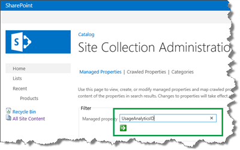
  
3. From the **Property Name** field, select **Edit/Map Property**. 
    
     
  
4. On the **Edit Managed Property** page, select **Add a Mapping**. Notice that by default, this property is mapped to the crawled property  *ows_ProductCatalogItemNumber*  . 
    
     
  
5. In the **Crawled property selection** dialog, use the **Search for crawled property name** field to search for the crawled property that you want to map to this managed property. 
    
    In our Contoso scenario, we want to map the site column called  *Group Number*  . Crawled properties don't contain spaces. Therefore, exclude the space, enter  *GroupNumber*  and select **Find**. 
    
     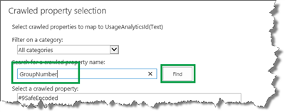
  
Two crawled properties are found. Select the crawled property with the  *ows_ prefix*  , and select **OK**. 
    
     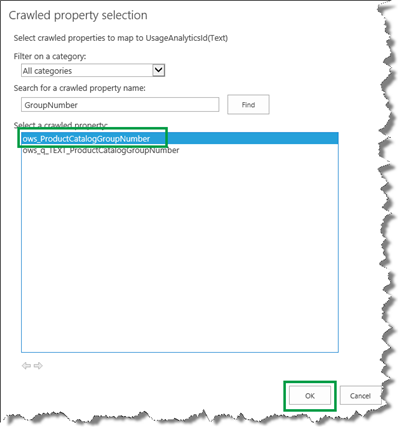
  
If you are confused because two crawled properties that look about the same are found, you're not alone. This is somewhat tricky. The article [From site column to managed property - What's up with that?](from-site-column-to-managed-propertywhat-s-up-with-that.md) explains the naming convention for crawled and managed properties. If you are interested in an abbreviated version, here it is as follows: When mapping a crawled property to the  *UsageAnalyticsID*  managed property, you should select the crawled property with the **ows_** prefix! 
    
6. On the **Edit Managed Property** page, select the  *ows_ProductCatalogItemNumber*  crawled property, and then **Remove Mapping**. 
    
     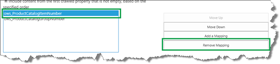
  
7. Select **OK** to save the new mapping. 
    
    > [!IMPORTANT]
    > Map only  *one crawled property*  to the  *UsageAnalyticsID*  managed property. If you map more than one crawled property, the Usage analytics calculation won't work correctly. 
  
    After you have changed the mapping of the  *UsageAnalyticsID*  managed property, do a full crawl of your catalog, as explained in [Stage 4: Set up search and enable the crawling of your catalog content in SharePoint Server](stage-4-set-up-search-and-enable-the-crawling-of-your-catalog-content.md).
    
## Change a Content Search Web Part display template so the usage events are logged correctly
<a name="BKMK_ModifyAContentSearchWebPartDisplayTemplateSoTheUsageEventsAreLoggedCorrectly"> </a>

On our Contoso site, we use a Content Search Web Part (CSWP) to display items on the catalog item page, as explained in [Stage 10: Configure the query in a Content Search Web Part on a catalog item page in SharePoint Server](stage-10-configure-the-query-in-a-content-search-web-part-on-a-catalog-item-page.md). By default, the CSWP does not log usage events. To enable our CSWP to log usage events we must change the display template the CSWP is using. Here's what you have to do:
  
1. In your [How to map your network drive](stage-6-upload-and-apply-a-new-master-page-to-a-publishing-site.md#BKMK_HowToMapYourNetworkDrive), open the display template that you have applied to your CSWP.
    
2. In the **ManagedPropertyMapping** element, add the following two properties: 
    
  ```
  'Original Path'{Original Path}:'OriginalPath',
  'SiteID'{SiteID}:'SiteID',
  ```

     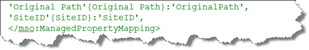
  
3. Add the following Java-Script just above the HTML part of your display template:
    
  ```
  //Log Views usage event on URL of catalog item
      window.LogViewsToEventStore = function(url, site)
      {    
          SP.SOD.executeFunc("sp.js", "SP.ClientContext", function()
          {
              var spClientContext = SP.ClientContext.get_current();
              if(!$isNull(spClientContext))
              {
                      var spWeb = spClientContext.get_web();
                      var spUser = spWeb.get_currentUser();
                      var spScope = "{00000000-0000-0000-0000-000000000000}";
                      
                      SP.Analytics.AnalyticsUsageEntry.logAnalyticsEvent2(spClientContext, 1, url, spScope, site, spUser);spClientContext.executeQueryAsync(null, null);                   
              }
          });
      };
      
      var originalPath = $getItemValue(ctx, "Original Path");
      var originalSite = $getItemValue(ctx, "SiteID");
      LogViewsToEventStore(originalPath.value, originalSite.value);
  ```

    In [View the usage event definitions](an-introduction-to-recommendations-and-popular-items.md#BKMK_ViewtheUsageEventDefinitions) we explained the EventTypeIDs for the usage events. The value  *1*  in this script represents the EventTypeID of the  *Views*  usage event. To log a different usage event, substitute this value with the EventTypeID of the usage event that you want to log. 
    
     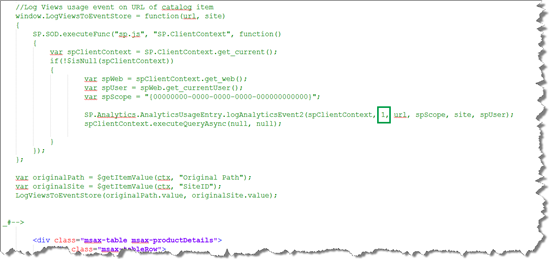
  
4. Save the file.
    
## Why you should simulate the generation of Views usage events
<a name="BKMK_WhyYouShouldSimulateTheGenerationOfViewsUsageEvents"> </a>

Now that our CSWP can correctly log usage events, the next step is to actually generate usage events. In our case, we changed the CSWP to log  *Views*  . If the Contoso site was LIVE, visitors would create a  *Views*  usage event every time that they viewed an item on the website. But, the Contoso site is only a demo site. Therefore, it doesn't have any visitors. 
  
When you set up your site, you'll most likely want to test the Usage analytics feature before you put it into production. To be able to test the Usage analytics feature, you'll have to generate usage events. To generate recommendations based on usage events,  *a minimum of three users have to click the same items* .
  
There is no single correct way of simulating the generation of  *Views*  usage events. To generate  *Views*  usage events for the Contoso site, you may want to invite coworkers to a "click party" (bribe them with candy if it is necessary). To to make sure that that recommendations are generated, give each user a list of items to click. That way, you can to make sure that that at least three users click the same items. 
  
Here's an example of the instructions that you can give your coworkers:
  

  
When Usage analytics is run,  *SV Keyboard E10*  will generate a recommendation for  *WWI Desktop PC2.30 M2300*  (people who viewed  *WWI Desktop PC2.30 M2300*  also viewed  *SV Keyboard E10*  ), and  *WWI Desktop PC2.30 M2300*  will generate a recommendation for  *SV Keyboard E10*  (people who viewed  *SV Keyboard E10*  also viewed  *WWI Desktop PC2.30 M2300*  ). 
  
## Run Microsoft PowerShell scripts to start search analytics and push usage events to the Event store
<a name="BKMK_RunWindowsPowerShellToStartSearchAnalyticsAndPushUsageEventsToTheEventStore"> </a>

After you have generated  *Views*  usage events, you have two options on how to continue. The Usage analytics timer job runs one time every 24 hours. If you are patient, you can now relax, go home, and let Usage analytics work its magic overnight. 
  
On the other hand, if you want results now, you can use some Microsoft PowerShell scripts to speed up the process. Here's what you have to do:
  
1. Verify that you meet the [minimum permission](/powershell/module/sharepoint-server/?view=sharepoint-ps#section3) requirements. 
    
2. On the server where SharePoint Server is installed, open the **SharePoint 2013 Management Shell** as an Administrator. 
    
     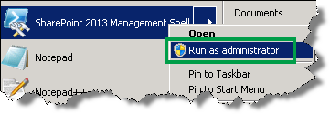
  
3. At the Microsoft PowerShell command prompt, type the following commands to start Search analytics. The output from Search analytics is used by Usage analytics to map usage events against the actual items in the search index.
    
  ```
  $a = Get-SPTimerJob -Type Microsoft.Office.Server.Search.Analytics.AnalyticsJobDefinition
  $sa = $a.GetAnalysis("Microsoft.Office.Server.Search.Analytics.SearchAnalyticsJob")
  $sa.StartAnalysis()
  ```

4. Wait for the search analytics job to finish. To check the status of the search analytics job, type the following command:
    
  ```
  $sa.GetAnalysisInfo()
  ```

    As long as the search analytics job is running, **State** is **Running**. 
    
     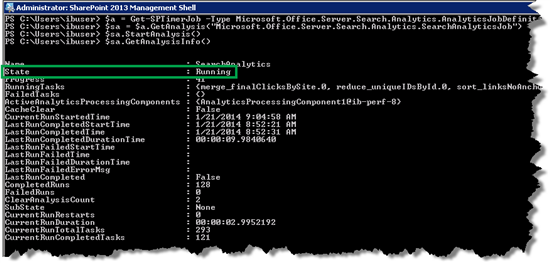
  
The search analytics job is finished when **State** is **Stopped** and **Status** is **100**. 
    
     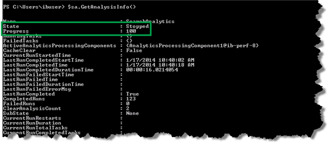
  
5. The usage events are added to the Event store in a 10 minute interval. To push the usage events to the Event store, type the following commands:
    
  ```
  $tj = Get-SPTimerJob -Identity ("job-usage-log-file-import")
  $tj.RunNow()
  ```

## View usage events in the Event store
<a name="BKMK_ViewUsageEventsInTheEventStore"> </a>

After you have pushed the usage events into the Event store, you should verify that the usage events are recorded correctly. To do this, on the machine where SharePoint Server is installed, go to the Event store. In most cases, you can find the Event store in the following folder:
  
 *C:\Program Files\Microsoft Office Servers\15.0\Data\Office Server\Analytics_\<GUID\>\EventStore* 
  
In the Event store, the usage events of each day are stored in a separate folder. In our scenario, we can see that a folder was added.
  
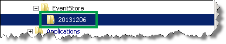
  
In this folder, you'll see some text files. These files contain our usage events. Notice that all file names start with 1_.
  
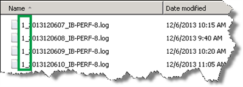
  
This number is the EventTypeID of the usage event that is logged in the file. Remember, **1** is the EventTypeID of the  *Views*  usage event (see [View the usage event definitions](an-introduction-to-recommendations-and-popular-items.md#BKMK_ViewtheUsageEventDefinitions)). At this point the only usage event we are logging is the  *Views*  event. So this is a good sign that we are doing things right. 
  
Open one of the files in a text editor, for example Notepad++. This file contains lots of information, but you should really only be looking for two things:
  
- Verify that the usage events are logged correctly.
    
- Verify that different users have generated the usage event.
    
In [About Usage analytics in a cross-site publishing scenario](an-introduction-to-recommendations-and-popular-items.md#BKMK_AboutUsageAnalyticsinaCrossSitePublishingScenario) we explained that for Usage analytics to work, the usage event must be recorded on the URL of the item. In the Event store file, you'll see many URLs. Look for URLs that end in  *dispform.aspx?id=*  followed by a number. In our Contoso version of this file, we see there are many entries with such URLs. 
  
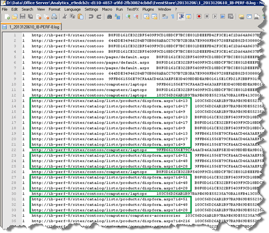
  
This is a very good sign, because it means that the usage events are being recorded correctly. To verify that the URLs actually belong to one of our catalog items, copy one of the URLs from this file, and paste it into your browser.
  
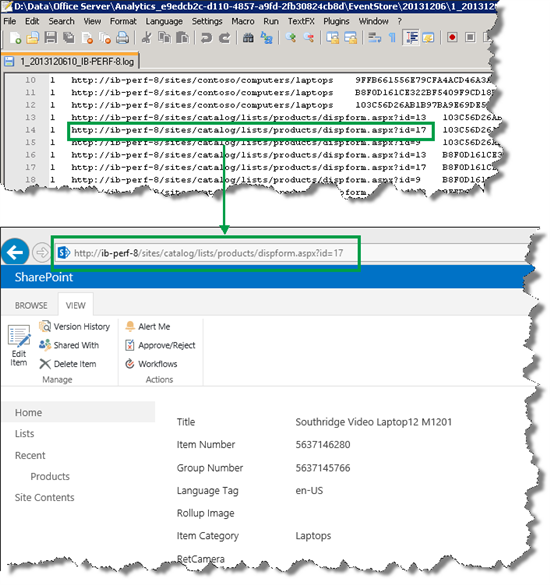
  
To verify that different users have generated the usage event, look in the third column of the file. In our scenario, we can see that we have at least three user IDs.
  
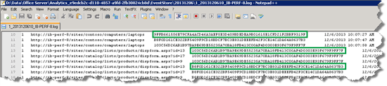
  
Now that we have verified that the usage events are correctly logged, you might be tempted to think that we are ready to run the Usage analytics job. But remember, by using Microsoft PowerShell to start Usage analytics, we are actually kick-starting timer jobs.
  
When the Usage analytics timer job starts, it'll take the usage events from yesterday and process them. Since we want to process the files from today, we'll use a simple trick so that the correct files can be processed by Usage analytics.
  
## Prepare usage events files before you start Usage analytics with Windows PowerShell
<a name="BKMK_PrepareUsageEventFilesBeforeStartingUsageAnalyticsWithWindowsPowerShell"> </a>

1. In your EventStore folder, create a folder named  *myevents*  . 
    
     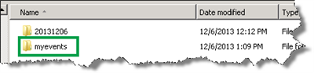
  
2. Copy the usage event files that you want Usage analytics to process into your  *myevents*  folder. In our Contoso scenario, copy all files from the [View usage events in the Event store](change-the-content-search-web-part-display-template-and-use-windows-powershell-t.md#BKMK_ViewUsageEventsInTheEventStore) folder into  *myevents*  . 
    
     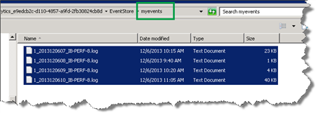
  
3. Right-click your  *myevents*  folder and select **Properties**. 
    
     
  
4. In the **Attributes** section, select **Read-only (Only applies to files in folder)**, and then click **OK**. 
    
     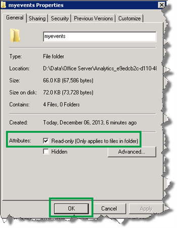
  
5. In the **Confirm Attribute Changes** dialog, select **Apply changes to this folder, subfolder and files** and then click **OK**. 
    
     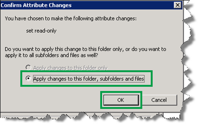
  
    Now you are ready to start the Usage analytics job.
    
## Start the Usage analytics job with Microsoft PowerShell
<a name="BKMK_StartTheUsageAnalyticsJobWithWindowsPowerShell"> </a>

1. At the Microsoft PowerShell command prompt, type the following commands:
    
  ```
  $tj = get-sptimerjob -type microsoft.office.server.search.analytics.usageanalyticsjobdefinition 
  $tj.DisableTimerJobSchedule() 
  $tj.StartAnalysis("\\<hostname>\Analytics_<guid>\EventStore\myevents") 
  $tj.EnableTimerJobSchedule()
  ```

    Notice that one command contains two placeholders:  *host name*  and  *guid*  . The host name is the name of the server where SharePoint Server is installed. You can see the guid in the file path of your EventStore. 
    
     
  
     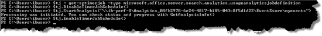
  
2. Check the status of the Usage analytics job by entering the following command:
    
  ```
  $tj.GetAnalysisInfo()
  ```

    The Usage analytics job is finished when **State** is **Stopped** and **Status** is **100**. 
    
     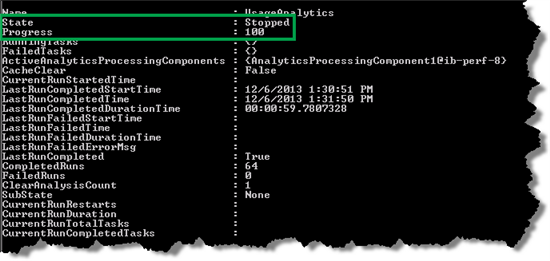
  
Now that Usage analytics have processed the usage events, the next step is to display the results of the analysis on our Publishing site. To do that, we'll add and configure two Web Parts.
  
### Next article in this series

[Add and configure the Recommended Items and Popular Items Web Part in SharePoint Server](add-and-configure-the-recommended-items-and-popular-items-web-part.md)
  

