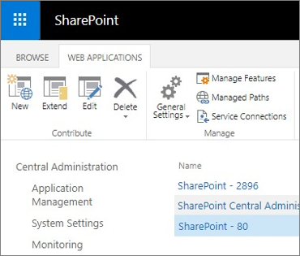
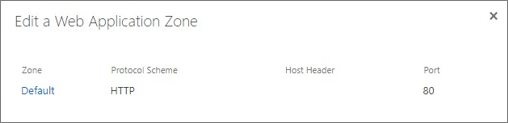
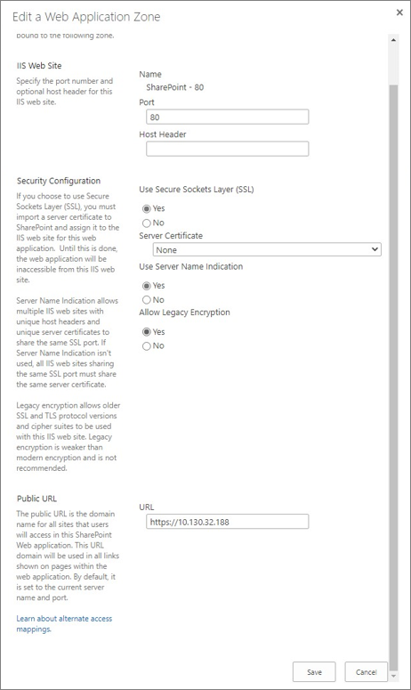

# Update a web application URL and IIS bindings for SharePoint Server Subscription Edition

[!INCLUDE[appliesto-xxx-xxx-xxx-SUB-xxx-md](../includes/appliesto-xxx-xxx-xxx-SUB-xxx-md.md)]

In SharePoint Server Subscription Edition, you can now easily change the IIS bindings of a SharePoint web application through PowerShell or Central Administration.

> [!NOTE]
> This functionality is available only to those users who are a member of the local Administrator's group on the server.
 
This article provides detailed guidance for changing the IIS bindings of a web application.

## Editing the web application bindings through Central Administration 

To edit the web application and set the port, URL, SSL certificate host header, do the following:

  1. Navigate to **SharePoint Central Administration** > **Application Management** > **Manage web applications**.

  2. Select a web application and click **Edit**.
 
     
    
  3. In the **Edit a Web Application Zone** dialog box, click the zone that contains the IIS binding you want to update.
 
     
    
  4. In the **IIS Web site** section, you can change the **Port** and **Host Header** settings.
 
  5. In the **Security Configuration** section, you can change the **Use Secure Sockets Layer (SSL)**, **Server Certificate**, **Use Server Name Indication**, and **Allow Legacy Encryption** settings.
     
  6. In the **Public URL** section, you can change the public URL for this zone.
  
  7. Click **Save** to save the changes.
    
     

## Editing the web application bindings through PowerShell 

To change the IIS bindings of a web application through PowerShell, use the `Set-SPWebApplication` cmdlet. This functionality is supported in all web application zones. 

For example, you can run the following PowerShell command to change a SharePoint web application on HTTP port 80 to instead use a host header binding on SSL port 443: 

 ```PowerShell
 Set-SPWebApplication -Identity http://servername -Zone Default -Port 443 -SecureSocketsLayer -HostHeader sharepoint.contoso.com -Url https://sharepoint.contoso.com 
 ```
 
 

