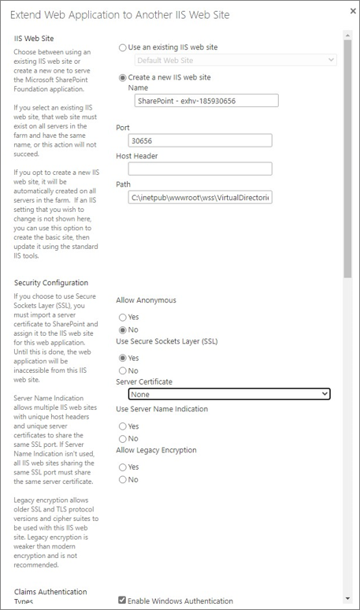
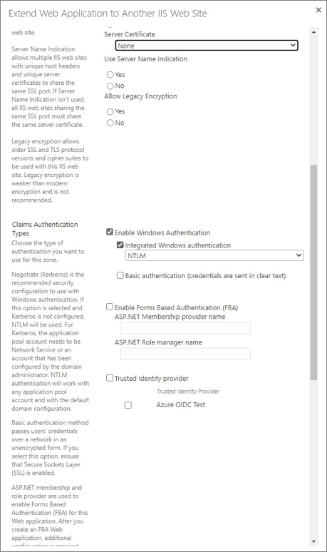
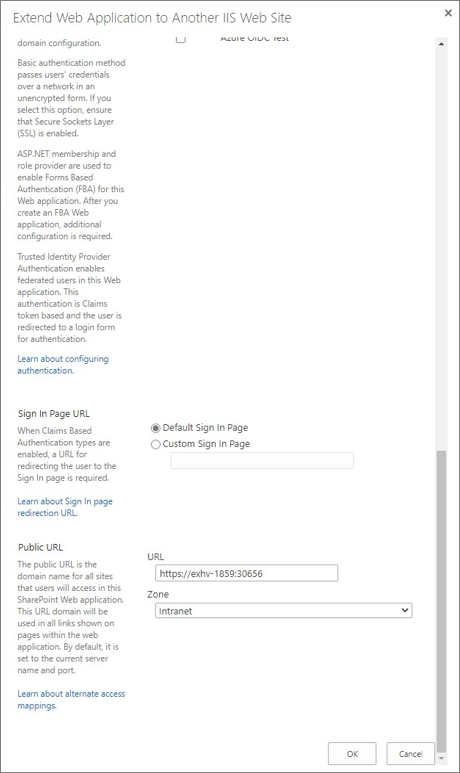

# Change web application bindings for SharePoint Server Subscription Edition

You can now easily change the SharePoint web application IIS bindings in PowerShell through Central Administration. The SharePoint farm administrators can use the new **Edit** button available in the Web Application Management page in Central Administration, to select a web application's zone. From here they can change the IIS bindings, SSL certificate, and public URL of the web application's zone. 
 
> [!NOTE]
> This functionality is only available to user's who are a member of the local Administrators group on the server.
 
This article provides detailed guidance for changing the IIS bindings of a web application.

## Editing a web appliction bindings for SharePoint Server Subscription Edition

To configure the existing zone attached with the web application and set the port, URL, SSL certificate host header, do the following:

 1. In Sharepoint, select **WEB APPLICATIONS** > **Edit** to edit the web application.
 
    
    
 2. In **Edit a Web Application Zone** dialog box, click **Default**.
 
    
    
 3. In **IIS Web site** section, enter the port and host header.
 
 4. In **Security Configuration** section, configure the following:
 
     - Select **Yes** for **Use Secure Sockets Layer (SSL)**.
     
     - Select a **Server Certificate** from the drop-down list.
     
     - Select **Yes** for **Use Server Name Indication**.
     
     - Select **Yes** for **Allow Legacy Encryption**.
  5. In **Public URL** section, enter the URL and click **Save** to save the changes.
    
     

## Extending a web appliction bindings for SharePoint Server Subscription Edition

You can extend a web application into a zone with a set of Internet Information Services (IIS) bindings and alternate access mapping URLs, or you might decide that you want to use a different URL to reach the web application.

> [!NOTE]
> If you want to add additional URLs and IIS bindings to a web application, you can do so by extending the web application into an unused zone. 

To extend a web application to existing or new zone with port, URL, SSL certificate and host header specified, do the following:

 1. In Sharepoint, select **WEB APPLICATIONS** > **Extend** to extend the web application.
    
    
    
 2. 

