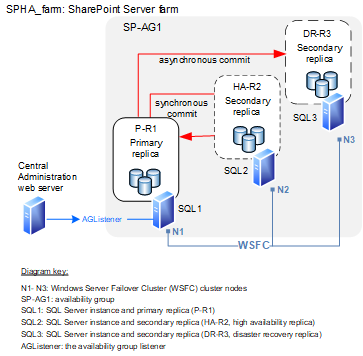

# Configure SQL Server AlwaysOn Availability Groups for SharePoint Server

[!INCLUDE[appliesto-2013-2016-2019-xxx-md](../includes/appliesto-2013-2016-2019-xxx-md.md)] 
  
This article provides the required information and detailed procedures to create and configure a Microsoft SQL Server Always On Availability Group for a SharePoint Server or Foundation farm.
  
> [!IMPORTANT]
>  The steps in this article show how to deploy a new SharePoint farm and doesn't cover upgrading from SQL Server 2008 R2 to a newer version of SQL Server.

> [!IMPORTANT]
> Verify the SQL Server version compatibility with the version of SharePoint you will be deploying.
>
> [Hardware and software requirements for SharePoint 2013](../install/hardware-and-software-requirements-0.md)
>
> [Hardware and software requirements for SharePoint Server 2016](../install/hardware-and-software-requirements.md)
>
> [Hardware and software requirements for SharePoint Server 2019](../install/hardware-and-software-requirements-2019.md)

## Process overview
<a name="overview"> </a>

We recommend following the installation and configuration steps in the order shown to deploy a SharePoint farm that uses an Always On availability group:
  
- Select or create a Windows Server failover cluster.
    
- Install SQL Server on each cluster node.
    
- Create and configure an availability group.
    
- Install and configure SharePoint Server or SharePoint Foundation 2013.
    
- Add the SharePoint databases to the availability group.
    
- Test failover for the availability group.
    
## Before you begin
<a name="begin"> </a>

Before you begin deployment review the following information about SQL Server Always On, the technologies that support Always On, and SharePoint Server: 
  
- Knowledge and skill requirements
    
- Always On Availability Group concepts
    
- Hardware and software requirements
    
- Permissions
    
### Knowledge and skill requirements

To implement SQL Server Always On Availability Groups as a high availability and disaster recovery solution, several technologies interact and have to be installed and configured correctly. We recommend that the team responsible for setting up an Always On environment for SharePoint products has a working knowledge of, and hands-on skills with the following technologies: 
  
- Windows Server Failover Clustering (WSFC) services
    
- SQL Server
    
- SharePoint Server or SharePoint Foundation 2013 
    
### SQL Server Always On Availability Group concepts

An availability group consists of the following components:
  
- Replicas, which are a discrete set of user databases called availability databases that fail over together as a single unit. Every availability group in SQL Server 2014 (SP1), SQL Server 2016, and SQL Server 2017 supports one primary replica and up to eight secondary replicas. Every availability group in SQL Server 2012 supports one primary replica and up to four secondary replicas.
    
- A specific instance of SQL Server to host each replica and to maintain a local copy of each database that belongs to the availability group. 

For more information, see [Always On Availability Groups (SQL Server)](https://go.microsoft.com/fwlink/?linkid=858061) and [Overview of Always On Availability Groups (SQL Server)](https://go.microsoft.com/fwlink/?linkid=858062)
  
**Replicas and failover**
  
The primary replica makes the availability databases available for read-write connections from clients and sends transaction log records for each primary database to every secondary replica. Each secondary replica applies transaction log records to its secondary databases.
  
All replicas can run under asynchronous-commit mode, or up to three of them can run under synchronous-commit mode. For more information about synchronous and asynchronous commit mode, see [Availability Modes (AlwaysOn Availability Groups)](https://go.microsoft.com/fwlink/?linkid=858063).
  
> [!NOTE]
> Database issues, such as a database becoming suspect due to a loss of a data file, deletion of a database, or corruption of a transaction log do not cause failovers. 
  
Read the following articles to learn important concepts about SQL Server Always On technology:
  
- For details about the benefits of Always On Availability Groups and an overview of Always On Availability Groups terms, see [AlwaysOn Availability Groups (SQL Server)](https://go.microsoft.com/fwlink/?linkid=858061).
    
- For detailed information about prerequisites, see [Prereqs, Restrictions, Recommendations - Always On Availability Groups](https://go.microsoft.com/fwlink/?linkid=858191). 
    
> [!IMPORTANT]
> You can install SQL Server on Windows Server core to improve security and reduce maintenance, but you cannot install SharePoint Server on Windows Server core. For more information, see [Server Core for Windows Server 2008 R2](https://go.microsoft.com/fwlink/p/?LinkId=245669). For information about server core and Windows Server 2012, see [Windows Server Installation Options](https://go.microsoft.com/fwlink/?linkid=858192). 
  
### Windows Server Failover Clustering

To create and use SQL Server Always On Availability Groups, you have to install both SQL Server versions on a Windows Server Failover Clustering (WSFC) cluster. For more information, see [Windows Server Failover Clustering (WSFC) with SQL Server](https://go.microsoft.com/fwlink/?LinkID=626888) and for SQL Server 2016 and 2017, [Windows Server Failover Clustering (WSFC) with SQL Server](https://go.microsoft.com/fwlink/?linkid=858193).
  
To create and use SQL Server AlwaysOn Availability Groups, you have to install SQL Server on a Windows Server Failover Clustering (WSFC) cluster. 
  
Although configuring a WSFC cluster is out of the scope for this article, you should be aware of the following requirements before you install and configure a cluster:
  
- All the cluster nodes must be in the same Active Directory Domain Services (AD DS) domain.
    
- Each availability replica in an availability group must reside on a different node of the same Windows Server Failover Clustering (WSFC) cluster.
    
- The cluster creator must have the following accounts and permissions:
    
  - Have a domain account in the domain where the cluster will exist.
    
  - Have local administrator permissions on each cluster node.
    
  - Have **Create Computer objects** and **Read All Properties** permissions in AD DS. For more information, see [Failover Cluster Step-by-Step Guide: Configuring Accounts in Active Directory](https://go.microsoft.com/fwlink/p/?LinkId=213267) and [How to Create a Cluster in a Restrictive Active Directory Environment](https://go.microsoft.com/fwlink/?LinkID=786442).
    
A very important aspect of configuring failover clustering and Always On is determining the quorum votes that are needed for the cluster nodes.
  
Failover clustering is based on a voting algorithm where more than one half of the voters, or quorum, must be online and able to communicate with each other. Because a given cluster has a specific number of nodes and a specific quorum configuration, the cluster service is able to determine what constitutes a quorum. The cluster service will stop on all the nodes if the number of voters drops below the required majority.
  
For more information, see [WSFC Quorum Modes and Voting Configuration (SQL Server)](https://go.microsoft.com/fwlink/?LinkID=723838) and [Configure Cluster Quorum NodeWeight Settings](https://go.microsoft.com/fwlink/?LinkID=723839).
  
### SharePoint Server and SharePoint Foundation 2013

Some SharePoint Server databases do not support SQL Server Always On Availability Groups. We recommend that you review [Supported high availability and disaster recovery options for SharePoint databases](supported-high-availability-and-disaster-recovery-options-for-sharepoint-databas.md) before you configure an Always On environment.
  
## Detailed steps to configure an Always On Availability Group for SharePoint
<a name="SPscenario"> </a>

The following illustration shows a SharePoint Server 2016 farm (SPHA_farm) that uses an availability group named SP_AG1. We'll use SPHA_farm as reference example in our steps to configure Always On.
  

  
### Prepare the Windows Server cluster environment

Obtain access to or create a three node Windows Server Failover Clustering (WSFC) cluster that you can use to install SQL Server on each cluster node. For information and detailed steps to configure a Windows Server failover cluster, see [Failover Clustering](https://docs.microsoft.com/en-us/windows-server/failover-clustering/failover-clustering-overview).
  
### Prepare the SQL Server environment
<a name="proc1"> </a>

Before you can create an Availability Group for SharePoint Server, you must prepare the SQL Server environment.
  
When you prepare the database server environment you must consider SharePoint Server database requirements. Review the following articles before you install SQL Server:

- [Hardware and software requirements for SharePoint Server 2019](../install/hardware-and-software-requirements-2019.md)
  
- [Hardware and software requirements for SharePoint Server 2016](../install/hardware-and-software-requirements.md)
    
- [Hardware and software requirements for SharePoint 2013](../install/hardware-and-software-requirements-0.md)
    
- [Install SharePoint Server](../install/install.md)
    
- [Install SharePoint 2013 across multiple servers for a three-tier farm](../install/multiple-servers-for-a-three-tier-farm.md)
    
- [Configure SQL Server security for SharePoint Server](../security-for-sharepoint-server/configure-sql-server-security-for-sharepoint-environments.md)
    
To prepare the environment, complete the following tasks:
  
- Install the SQL Server prerequisites.
    
- Install SQL Server
    
- Enable Always On.

### Install SQL Server 2012

 **To install SQL Server 2012**
  
1. Install SQL Server 2012 prerequisites on each cluster node.
    
    For more information, see [Prerequisites, Restrictions, and Recommendations for AlwaysOn Availability Groups (SQL Server)](https://go.microsoft.com/fwlink/p/?LinkID=245668).
    
2. Install SQL Server on each cluster node.
    
    For more information, see [Installation for SQL Server 2012](https://go.microsoft.com/fwlink/p/?LinkId=245717).
    
### Install SQL Server 2014 (SP1)

Use the following procedure to install SQL Server 2014 (SP1).
  
 **To install SQL Server 2014 (SP1)**
  
1. Install SQL Server 2014 (SP1) prerequisites on each cluster node.
    
    For more information, see [Hardware and Software Requirements for Installing SQL Server 2014](https://go.microsoft.com/fwlink/?LinkID=799531) and [Prerequisites, Restrictions, and Recommendations for AlwaysOn Availability Groups (SQL Server)](https://go.microsoft.com/fwlink/?LinkID=718033).
    
2. Install SQL Server on each cluster node.
    
    For more information, see [Quick-Start Installation of SQL Server 2014](https://docs.microsoft.com/en-us/sql/getting-started/quick-start-installation-of-sql-server-2014) and [Installing SQL Server 2014 Step by Step Tutorial](https://go.microsoft.com/fwlink/?LinkID=724036).
    
### Install SQL Server 2016 or SQL Server 2017

Use the following procedure to install SQL Server 2016 or 2017.
  
 **To install SQL Server 2016 or SQL Server 2017**
  
1. Install SQL Server prerequisites on each cluster node.
    
    For more information, see [Install SQL Server](https://go.microsoft.com/fwlink/?LinkID=735052).
    
2. Install SQL Server on each cluster node.
    
    For more information, see [SQL Server Failover Cluster Installation](https://go.microsoft.com/fwlink/?linkid=858195).
      
### Enable Always On

You must enable Always On for each database server in the cluster.
  
> [!NOTE]
> You can enable Always On by using SQL Server Management Studio, Transact-SQL, or Windows PowerShell. 
  
 **To enable Always On**
  
1. Your logon account must have the permission levels to create an availability group. The account must have membership in the **db_owner** fixed database role and either CREATE AVAILABILITY GROUP server permission, CONTROL AVAILABILITY GROUP permission, ALTER ANY AVAILABILITY GROUP permission, or CONTROL SERVER permission. 
    
2. Log on to the server that will host the primary replica and start SQL ServerConfiguration Manager. 
    
3. In Object Explorer, select **SQL Server Services**, right-click **SQL Server (**_\<instance name\>_**)**, where  _\<instance name\>_ is the name of a local server instance for which you want to enable Always On Availability Groups, and then click **Properties**.
    
4. Select the **AlwaysOn High Availability** tab. 
    
5. Select the **Enable AlwaysOn Availability Groups** check box, and then click **OK**.
    
6. Although the change is saved you must manually restart the SQL Server service (MSSQLSERVER) to commit the change. The manual restart enables you to choose a restart time that is best for your business requirements.
    
7. Repeat the previous steps to enable Always On for SQL Server on the other cluster nodes.
    
For more information, see [Enable and Disable AlwaysOn Availability Groups (SQL Server)](https://docs.microsoft.com/en-us/sql/database-engine/availability-groups/windows/enable-and-disable-always-on-availability-groups-sql-server).
  
### Create and configure the availability group
<a name="proc3"> </a>

Depending on the SQL Server 2014 (SP1), SQL Server 2016/2017, or SQL Server 2012 environment where you plan to create the Availability Group, you might have to create a temporary database to use before you create the Availability Group. 
  
The process that creates an availability group requires you to provide a name for the availability group and then select an eligible user database on the connected server instance as an availability database.
  
> [!NOTE]
> A database must be a user database in order to add it to an availability group. System databases can't belong to an availability group. For more information, see the "Availability Database Prerequisites and Restrictions" section of [Prerequisites, Restrictions, and Recommendations for AlwaysOn Availability Groups (SQL Server)](https://docs.microsoft.com/en-us/sql/database-engine/availability-groups/windows/prereqs-restrictions-recommendations-always-on-availability?view=sql-server-2017#PrerequisitesForAGs) and see [Creation and Configuration of Availability Groups (SQL Server)](https://go.microsoft.com/fwlink/?LinkID=724040). 
  
If there are no user databases on the instance of the connected server, which is the case in our example, you need to create one. Use the following procedure to create a temporary user database that will be a temporary primary replica for the group. 
  
 **To create a temporary user database**
  
1. Make sure that your logon account has the correct permissions for this task. You require one of the following permissions in the master database to create the new database:
    
  - CREATE DATABASE
    
  - CREATE ANY DATABASE
    
  - ALTER ANY DATABASE
    
2. Log on to the server that will host the primary replica, which is SP-SRV1 in our example.
    
3. Start Management Studio.
    
4. In Object Explorer, right-click **Databases** and then click **New Database**.
    
5. In the New Database dialog box, type the **Database name:**, which is "TemporaryUserDB" for this example.
    
    Because this is a temporary database that you delete after you create the availability group, you can use the default settings. Click **OK**.
    
    Because the New Availability Group Wizard will not create an availability group unless the user database was backed up, you have to back up the temporary database.
    
6. In Object Explorer expand **Databases** and right-click the temporary database that you just created. Pick **Tasks** and then choose **Back Up**.
    
7. In the **Back Up Database** dialog box, click **OK** to accept all the default settings and create the back up. 
    
### About replicas and data synchronization

You should be familiar with the following information about replicas and data synchronization before creating and configuring the availability groups for your SharePoint farm.
  
 **About replicas**
  
Every availability replica is assigned an initial role—either the primary role or the secondary role, which the availability databases of that replica inherit. The role of a given replica determines whether it hosts read-write databases or read-only databases, the type of failover and whether it uses synchronous commit or asynchronous commit.
  
> [!NOTE]
> The maximum number of secondary replicas is increased from 4 to 8 in SQL Server 2014 and later versions. 
  
The following table shows the information that you have to provide for each replica, either when you first create the availability group, or when you add secondary replicas.
  
**Replica configuration requirements**

|**Replica information**|**Description**|
|:-----|:-----|
|**Server Instance** <br/> |Displays the name of the instance of the server that will host the availability replica.  <br/> |
|**Initial Role** <br/> |Indicates the role that the new replica will first perform: Primary or Secondary.  <br/> |
|**Automatic Failover (Up to 2)** <br/> |Indicates the type of failover that the replica uses: automatic or manual.  <br/> |
|**Synchronous Commit (Up to 3)** <br/> |Indicates the type of commit that is used for the replica.  <br/> |
|**Readable Secondary** <br/> |Indicates whether a secondary replica can be read.  <br/> The configuration options are unavailable for read access, read-only, and read-only intent. For more information, see [Offload read-only workload to secondary replica of an Always On availability group](https://docs.microsoft.com/en-us/sql/database-engine/availability-groups/windows/active-secondaries-readable-secondary-replicas-always-on-availability-groups) and [Configure Read-Only Routing for an Availability Group (SQL Server)](https://go.microsoft.com/fwlink/?LinkID=626915).  <br/> **Note:** In SQL Server 2014 and later, readable secondary replicas now remain available for read workloads when they are disconnected from primary replicas or during cluster quorum loss.  <br/> |

> [!NOTE]
> SharePoint Server does not leverage read-only replicas. It will only leverage the primary replica in the availability group.
   
> [!NOTE]
> When you add replicas to a group, you will also provide the endpoint for each replica and configure backup preferences. For more information, see [Specify the Endpoint URL When Adding or Modifying an Availability Replica (SQL Server)](https://go.microsoft.com/fwlink/?LinkID=724042) and [Active Secondaries: Backup on Secondary Replicas (AlwaysOn Availability Groups)](https://go.microsoft.com/fwlink/?LinkID=724043). 
  
 **Data synchronization**
  
As part of the availability group creation process, you have to make an exact copy of the data on the primary replica and install the copy on the secondary replica. This is the initial data synchronization for the Availability Group. For more information, see [Select Initial Data Synchronization Page (AlwaysOn Availability Group Wizards)](https://go.microsoft.com/fwlink/?LinkID=691235).
  
A network share must exist and must be accessed by all the nodes in the Always On configuration to do the initial data synchronization between all the cluster nodes that host a replica. For more information, see [Network Shares Extension](https://go.microsoft.com/fwlink/p/?LinkId=245722) and [Storage](https://docs.microsoft.com/en-us/windows-server/storage/storage).
  
The following restrictions exist when you use the New Availability Group wizard to start data synchronization:
  
- If the file paths on the secondary replica location differ from the file paths on the primary location, you have to start data synchronization manually.
    
- If any secondary database exists on a secondary replica, you have to manually delete the secondary databases before you start data synchronization in the New Availability Group. However, if you want to use existing secondary databases, exit the New Availability Group wizard and start data synchronization manually.
    
- To use the availability group wizard to synchronize data, you have to have a backup share that all the replicas can write to. You can specify the share by browsing to it or by entering its fully qualified universal naming convention (UNC) path name, \\Systemname\ShareName\Path\, in the **Specify a shared network location accessible by all replicas** box. 
    
For each database in the availability group, the **Start Data Synchronization** page shows the progress of the following operations: 
  
- Creating a full database backup of the primary database on the network share.
    
- Restoring these backups to the secondary replica location.
    
    These restore operations both use RESTORE WITH NORECOVERY option and leave the new secondary database in the RESTORING state.
    
- Joining the secondary database to the availability group.
    
    This step puts the secondary database in the ONLINE state and starts data synchronization for this database.
    
**Login replication**
  
SharePoint logins that are created by using the same approach as in previous releases of SQL Server are not replicated in an availability group. This occurs because login information is stored in the master database, which is not replicated. Although the farm accounts are created when replicas are synchronized, login information is not available after a failover.
  
If you have already created an availability group and synchronized the primary and secondary replicas, the workaround is to manually copy the logins from the primary replica to the secondary replicas.

Review the article [How to transfer logins and passwords between instances of SQL Server](https://support.microsoft.com/help/918992) to copy logins between SQL Server instances.
  
### Create and configure the availability group

Use the following procedure to create an availability group on the primary replica, which is SP-SRV1 in our example. 
  
 **Create the availability group**
  
1. Make sure that your logon account has the required permissions to create an availability group. This requires membership in the **db_owner** fixed database role and either CREATE AVAILABILITY GROUP server permission, CONTROL AVAILABILITY GROUP permission, ALTER ANY AVAILABILITY GROUP permission, or CONTROL SERVER permission. 
    
2. Log on to the server that will host the primary replica and start SQL Server Management Studio. 
    
3. To start the New Availability Group Wizard, right-click **AlwaysOn High Availability** and then click **New Availability Group Wizard**.
    
4. Click **Next** to advance to the **Specify Name** page. Enter SP-AG1 as the name of the new availability group in the **Availability group name:** box. 
    
    This name must be: a valid SQL Server identifier, unique on the Windows Server Failover Clustering cluster and unique on the domain.
    
5. On the **Select Databases** page, all user databases that are eligible to become the primary database for the new availability group are listed on the **User databases on this instance of SQL Server** grid. Select **TemporaryUserDB**, and then click **Next**.
    
6. On the **Specify Replicas** page, use the following tabs to configure the replicas for SP-AG1: **Replicas**, **Endpoints**, and **Backup Preferences**. 
    
7. An availability group listener is a virtual network name that provides client connectivity to the database a given availability group. Availability group listeners direct incoming connections to the primary replica or to a read-only secondary replica. The listener provides fast application failover after an availability group fails over. For more information, see [Connect to an Always On availability group listener](https://docs.microsoft.com/en-us/sql/database-engine/availability-groups/windows/listeners-client-connectivity-application-failover).
    
    On the **Listener** tab, configure an availability group listener for our example, use the name AGListener. 
    
    > [!IMPORTANT]
    > Intermittent, unusually high latency might occur when you use availability groups that have replicas that are deployed on multiple subnets. As a best practice, connections to SharePoint availability groups in a multi-subnet environment should configure **specifyMultiSubnetFailover=True** to avoid issues caused by high network latency. For more information, see the [Supporting Availability Group Multi-Subnet Failovers](https://docs.microsoft.com/en-us/sql/database-engine/availability-groups/windows/listeners-client-connectivity-application-failover?#SupportAgMultiSubnetFailover) section. 
  
    You cannot directly specify **MultiSubnetFailover=True** because a SharePoint client cannot directly modify a connection string. You must use PowerShell via the SharePoint Management Shell to set this value on the **MultiSubnetFailover** database property. The following example shows how you can do this. 
    
  ```
  $dbs = Get-SPDatabase | ?{$_.MultiSubnetFailover -ne $true}
       foreach ($db in $dbs)
       {
            $db.MultiSubnetFailover = $true
            $db.Update()
       }
  ```

8. Select the desired configuration for each instance in the **Selected instances** grid, and then click **Next**.
    
9. Click **Finish** to create the availability group. 
    
10. The **Select Initial Data Synchronization** page lets you select a synchronization preference and specify the shared network location that all replicas can access. For our environment accept the default, **Full**, which performs full database and log backups. Click **Next**.
    
11. The **Validation** page of the wizard displays the results of six checks before it lets you continue with availability group creation. If all checks pass, click **Next** to continue. If any tests fail, you cannot continue until you correct the error and then click **Re-run Validation** to run the validation tests again. When all the tests pass, click **Next** to continue. 
    
12. On the **Summary** page, verify the configuration of the replica that you are adding and then click **Finish** to save it. To change the configuration, click **Previous** to return to previous wizard pages. 
    
### Install and configure SharePoint Server
<a name="proc4"> </a>

At this point in the process, you can install SharePoint Server and create the farm. Use the following procedure as a guide to install and configure SharePoint Server.
  
> [!NOTE]
> For detailed installation and configuration instructions, see [Install SharePoint Server 2019](../install/install-for-sharepoint-server-2019.md), [Install SharePoint Server 2016](../install/install-for-sharepoint-server-2016.md), or [Install for SharePoint 2013](../install/install-for-sharepoint-2013.md). 
  
 **To install SharePoint Server**
  
1. Copy the SharePoint Server program files to a local disk on the computer where you plan to install SharePoint or to a network file share.
    
2. Run the Microsoft SharePoint Products Preparation Tool, to install all the prerequisites to set up and use SharePoint Server.
    
3. Run Setup to install binaries, configure security permissions, and edit registry settings for SharePoint Server. 
    
4. Run the SharePoint Products Configuration Wizard to install and configure the configuration database, install and configure the content database, and install Central Administration.
    
5. On the **Specify Configuration Database Settings** page, in the **Database server** box, type AGListener as the name of the computer that is running SQL Server. 7
    
    > [!IMPORTANT]
    > To provide automatic failover, you must specify the name of the availability group listener as the name of the database for SharePoint Server. 
  
### Add SharePoint databases to the availability group
<a name="proc5"> </a>

To finalize setup of Always On for a SharePoint Server farm, add the SharePoint databases to the availability group and synchronize secondary replicas to the primary replica.
  
> [!IMPORTANT]
> Only add the databases that are supported for use with a SQL Server Always On Availability Group. For more information, see [Supported high availability and disaster recovery options for SharePoint databases](supported-high-availability-and-disaster-recovery-options-for-sharepoint-databas.md)
  
On the server that hosts the primary replica, you have to run the Add Databases to Availability Group wizard to add all the SharePoint databases to the availability group. The following procedure is the same as the procedure that we described earlier about how to create the availability group.
  
 **To add SharePoint databases to the availability group**
  
1. Log on to the server that will host the primary replica and start SQL Server Management Studio.
    
    The account must have at least one of the following permissions:
    
  - ALTER AVAILABILITY GROUP permission on the availability group
    
  - CONTROL AVAILABILITY GROUP permission
    
  - ALTER ANY AVAILABILITY GROUP permission
    
  - CONTROL SERVER permission
    
   To join a database to an availability group requires membership in the **db_owner** fixed database role. 
    
2. In Object Explorer, browse to, and if it is necessary expand the Availability Groups.
    
3. Right-click the example group, SP-AG1, and then click **Add Database**.
    
4. On the **Select Databases** page, all user databases that are eligible to become the primary database for the new availability group are listed on the **User databases on this instance of SQL Server** grid. Use the check boxes to select all the databases that you want to add to the group, and then click **Next**.
    
5. The **Select Initial Data Synchronization** page lets you select a synchronization preference and specify the shared network location that all replicas can access. For our environment we'll accept the default, **Full**, which performs full database and log backups. Click **Next**.
    
6. The **Validation** page of the wizard displays the results of six checks before it lets you continue with availability group creation. If any tests fail, you cannot continue until you correct the error and then click **Re-run Validation** to run the validation tests again. When all the tests pass, click **Next** to continue. 
    
7. On the **Summary** page, verify the configuration of the replica that you are adding, and then click **Finish** to keep it. To change the configuration, click **Previous** to return to previous wizard pages. 
    
> [!IMPORTANT]
> Databases that you add to a SharePoint farm are not automatically added to the availability group. You must add them by using the steps described in this article or by using scripts to automate the procedure. 
  
## Use failover tests to validate the Always On installation
<a name="Testfailover"> </a>

After you synchronize the SharePoint data with the secondary replicas, the final step is to test failover.
  
You must run extensive failover tests to make sure that the behavior of the Always On environment is as expected and that you completely understand the configuration requirements and procedures related to SQL Server Availability Groups. These tests include but aren't limited to the following: 
  
- Verify that all the farm services and features are completely functional.
    
- Verify that SharePoint Server data is preserved and not corrupted.
    
Test availability group failover by using either the planned manual failover or the forced manual failover described in the following articles: 
  
- [Perform a Planned Manual Failover of an Availability Group (SQL Server)](https://go.microsoft.com/fwlink/p/?LinkId=262795)
    
- [Perform a Forced Manual Failover of an Availability Group (SQL Server)](https://go.microsoft.com/fwlink/p/?LinkId=262796)
    
You can perform either of the previous failovers by using the Failover Wizard in SQL Server Management Studio, Transact-SQL, or PowerShell in SQL Server.
  
> [!NOTE]
> In an Active-Active failover cluster scenario where there are multiple SharePoint instances can fail over to each other you must ensure that each server has enough capacity to handle the local workload and the workload from the failed server. 
  
## Monitor the Always On environment
<a name="Monitor"> </a>

You have to monitor an Always On environment for performance, health, and capacity.
  
 **Performance**
  
The following new performance objects are available to monitor an Always On environment.
  
 **SQL Server 2012**
  
- [SQLServer:Database Replica](https://go.microsoft.com/fwlink/p/?LinkId=245745)
    
- [SQLServer:Availability Replica](https://go.microsoft.com/fwlink/p/?LinkId=245746)
    
**SQL Server 2014 (SP1)**
  
- [SQL Server, Database Replica](https://go.microsoft.com/fwlink/?LinkID=724069)
    
- [SQL Server, Availability Replica](https://go.microsoft.com/fwlink/?LinkID=724070)
    
**SQL Server 2016 and SQL Server 2017**
  
- [SQL Server, Database Replica](https://go.microsoft.com/fwlink/?linkid=858216)
    
- [SQL Server, Availability Replica](https://go.microsoft.com/fwlink/?linkid=858218)
    
**Health and capacity**
  
For general health monitoring you can use the Availability Groups Dashboard to obtain the health of the availability groups in the system. For more information, see [AlwaysOn Policies for Operational Issues with AlwaysOn Availability Groups (SQL Server)](https://go.microsoft.com/fwlink/?LinkID=724071) for SQL Server 2014 (SP1) and [Always On Policies for Operational Issues - Always On Availability](/sql/database-engine/availability-groups/windows/always-on-policies-for-operational-issues-always-on-availability) for SQL Server 2016 and SQL Server 2017. For more information about SQL Server 2012, see the following: 
  
- [The AlwaysOn Health Model Part 1 -- Health Model Architecture](https://go.microsoft.com/fwlink/p/?LinkId=245945)
    
- [The AlwaysOn Health Model Part 2 -- Extending the Health Model](https://go.microsoft.com/fwlink/p/?LinkId=245946)
    
You can also use Transact-SQL to monitor availability groups by using the set of catalog and dynamic management views that are provided for Always On Availability Groups. For more information, see [Monitor Availability Groups (Transact-SQL)](https://go.microsoft.com/fwlink/?LinkID=724072) for SQL Server 2014 (SP1) and [Monitor Availability Groups (Transact-SQL)](/sql/database-engine/availability-groups/windows/monitor-availability-groups-transact-sql?view=sql-server-2017) for SQL Server 2016 and SQL Server 2017. 
  
## See also
<a name="Monitor"> </a>

#### Concepts

[Install SharePoint Server](../install/install.md)
#### Other Resources

[Deploying SharePoint Server 2016 with SQL Server AlwaysOn Availability Groups in Azure](deploying-sharepoint-server-2016-with-sql-server-alwayson-availability-groups-in.md)

