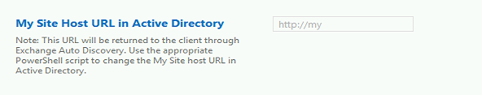

# Configure Exchange Autodiscover with a My Site Host URL in SharePoint Server

[!INCLUDE[appliesto-2013-2016-2019-xxx-md](../includes/appliesto-2013-2016-2019-xxx-md.md)] 
  
In SharePoint Server, a My Site gives users rich social networking and collaboration features that enable content sharing, discussions, and other features for users to do their jobs. The Exchange Server 2013 Autodiscover service configures profile settings on mail clients and mobile devices based on a supplied user name and password. The Autodiscover service can also be configured to allow for a simpler, seamless configuration experience to a My Site for Office 2016 client integration. For example, Office 2016 client and mobile phone apps can use Exchange Autodiscover to find a user's My Site based on the My Site Host URL stored in Active Directory Domain Services (AD DS). Instead of identifying and entering the My Site Host URL, a user's email address and password are the only requirements to configure and provision client functionality for:
  
- OneDrive for Business — Open and save a document to your OneDrive for Business location.
    
- Access a Newsfeed on a device.
    
- Office Hub — Set up the application on your Windows Phone.
    
This article provides the steps necessary to update AD DS with your My Site Host URL in SharePoint Server. It also details the steps necessary to retrieve or remove the current My Site Host URL if you need to see the current value or replace it respectively.
  
> [!IMPORTANT]
> Before you proceed to the next section, you must already have your SharePoint Server and Exchange Server 2013 environments installed and configured. Additionally, you need to set up and configure My Sites in SharePoint Server. For more information about how to implement My Sites and retrieve your My Site Host URL, see [Configure My Sites in SharePoint Server](../install/configure-my-sites.md). 
  
## Configure Exchange Autodiscover with a My Site Host URL

To update AD DS with the My Site Host URL, you must run a script on an Exchange Server computer by using the Exchange Management Shell. This procedure helps you create the PowerShell script, and then run the script to update AD DS with the specified URL value. This procedure also provides the optional steps to verify and remove a My Site Host URL entry if needed. For more information about how to run scripts, see [Scripting with the Exchange Management Shell](https://go.microsoft.com/fwlink/p/?LinkId=299662) in the Exchange Server 2013 Technical Library. 
  
 **To configure Exchange Autodiscover with a My Site Host URL**
  
1. On an Exchange Server 2013 computer, copy the contents of the following script into Notepad. Save this file to any location and use a .ps1 extension to designate it as a PowerShell script. Finally, rename the file **SetMySiteHostURLInAD.ps1**. 
    
  ```
  function PrintUsage
  {
  @"
  NAME:
  SetMySiteHostURLInAD.ps1
  SYNOPSIS:
  The purpose of this script is to set My Site Host URL in Active Directory.
  This URL will be returned through Exchange Autodiscover.
  MySiteHostURL - URL of My Site Host to set in Active Directory.
  Or use -get to get My Site Host URL from Active Directory.
  Or use -remove to remove My Site Host URL from Active Directory.
  SYNTAX:
  SetMySiteHostURLInAD.ps1 "MySiteHostURL" | -get | -remove
  EXAMPLES:
  SetMySiteHostURLInAD.ps1 "http://my"
  SetMySiteHostURLInAD.ps1 -get
  SetMySiteHostURLInAD.ps1 -remove
  "@
  }
  function GetConfigurationNamingContextPath
  {
      return GetEntryProperty "LDAP://RootDSE" "configurationNamingContext"
  }
  function GetExchangePath
  {
      param([string]$configurationNamingContextPath)
      return "LDAP://CN=Microsoft Exchange,CN=Services," + $configurationNamingContextPath
  }
  function GetOrganizationContainerPath
  {
      param([string]$exchangePath)
      [string]$organizationContainerPath = ""
      ([ADSI] $exchangePath).Children | foreach {
        if (!$organizationContainerPath -and $_.SchemaClassName -eq "msExchOrganizationContainer") {
           $organizationContainerPath = $_.Path
              }
      }
      return $organizationContainerPath
  }
  function GetEntryProperty
  {
      param([string]$entryPath, [string]$propertyName)
      $entry = [ADSI] $entryPath
      [string]$value = ""
      trap {
           continue
      }
      $value = $entry.Get($propertyName)
      return $value
  }
  function SetEntryProperty
  {
      param([string]$entryPath, [string]$propertyName, [string]$propertyValue)
      $entry = [ADSI] $entryPath
      if (!$propertyValue)
      {
          $entry.PutEx(1, $propertyName, $null)
      }
      else
      {
          $entry.Put($propertyName, $propertyValue)
      }
      trap {
          Write-Host "`nError setting property" -ForegroundColor Red
          continue
      }
      $entry.SetInfo()
  }
  function AddOrReplaceOrRemoveMySiteHostURL
  {
      param([string]$old, [string]$url)
      [string]$separator = ";"
      [string]$label = "SPMySiteHostURL" + $separator
      if (!$old)
        {
           if (!$url)
              {
                return ""
              }
           else
              {
                return $label + $url
              }
        }
      [int]$labelPosition = $old.IndexOf($label)
      if ($labelPosition -eq -1)
        {
           if (!$url)
              {
                return $old
              }
           else
              {
                if ($old[$old.Length - 1] -eq $separator)
                {
                return $old + $label + $url
                }
                else
                {
          return $old + $separator + $label + $url
                }
              }
          }
      [int]$valuePosition = $labelPosition + $label.Length
      [int]$nextLabelPosition = $old.IndexOf($separator, $valuePosition)
       if ($nextLabelPosition -eq -1)
         {
           if (!$url)
           {
                if ($labelPosition -eq 0)
                {
                   return ""
                }
                else
                {
                   return $old.Substring(0, $labelPosition - 1)
                }
            }
           else
           {
                return $old.Substring(0, $valuePosition) + $url
           }
        }
       if (!$url)
         {
            return $old.Substring(0, $labelPosition) + $old.Substring($nextLabelPosition + 1)
         }
        else
         {
            return $old.Substring(0, $valuePosition) + $url + $old.Substring($nextLabelPosition)
         }
  }
  if ($args.Count -ne 1)
  {
      Write-Host "`nError: Required argument missing or too many arguments" -ForegroundColor Red
      PrintUsage
      exit
  }
  if ($args[0] -eq "-?" -or $args[0] -eq "-h" -or $args[0] -eq "-help")
  {
      PrintUsage
      exit
  }
  [string]$url = ""
  if ($args[0] -ne "-r" -and $args[0] -ne "-remove")
  {
      $url = $args[0]
  }
  Write-Host "`nSetting My Site Host URL in Active Directory..."
  [string]$configurationNamingContextPath = GetConfigurationNamingContextPath
  Write-Host "`nConfiguration Naming Context path: $configurationNamingContextPath"
  [string]$exchangePath = GetExchangePath $configurationNamingContextPath
  Write-Host "`nExchange path: $exchangePath"
  [string]$organizationContainerPath = GetOrganizationContainerPath $exchangePath
  Write-Host "`nOrganization Container path: $organizationContainerPath"
  [string]$propertyName = "msExchServiceEndPointURL"
  Write-Host "`nProperty name: $propertyName"
  [string]$old = GetEntryProperty $organizationContainerPath $propertyName
  Write-Host "`nOld value: $old"
  if (!$url)
  {
      Write-Host "`nRemoving value"
  }
  elseif ($url -eq "-g" -or $url -eq "-get")
  {
      Write-Host ""
      exit
  }
  else
  {
      Write-Host "`nAdding or replacing value: $url"
  }
  [string]$new = AddOrReplaceOrRemoveMySiteHostURL $old $url
  Write-Host "`nNew value: $new"
  SetEntryProperty $organizationContainerPath $propertyName $new
  Write-Host ""
  ```

2. Open the **Exchange Management Shell**.
    
3. In the Exchange Management Shell, navigate to the directory where you have saved the script and run the script with your specified My Site Host URL. For example, if you have a host URL of http://server/sites/contoso, the syntax might look like the following in the Exchange Management Shell:
    
  ```
  [PS] C:\>  c:\SetMySiteHostURLInAD.ps1      http://server/sites/contoso
  ```

4. Press ENTER to run the script and update AD DS with the My Site Host URL.
    
5. To verify that the correct URL was updated, run the following command:
    
  ```
  [PS] C:\>  c:\SetMySiteHostURLInAD.ps1      -get
  ```

  Optionally, you can remove a My Site Host URL by entering the command:
    
  ```
  [PS] C:\>  c:\SetMySiteHostURLInAD.ps1  -remove
  ``` 
  
Once you have configured the My Site Host URL, you can also verify the value in SharePoint Central Administration Web site. From **Application Management**, go to **Manage service applications**, to **User Profile Service Application** (or other chosen name for User Profile Service Application), to **My Site Settings**, and finally to **Setup My Sites**. On the **My Site Settings** page, you will see that the **My Site Host URL in Active Directory** field is populated with your entry. 
  

  
> [!NOTE]
> The **My Site Host URL in Active Directory** field cannot be populated through Central Administration, and My Site Host URL value must be supplied by using the previous detailed process. 
  
## See also

#### Concepts

[Configure My Sites in SharePoint Server](../install/configure-my-sites.md)

