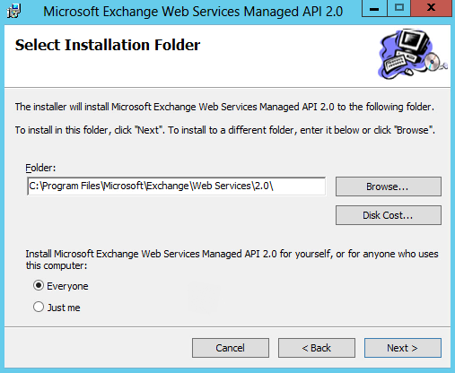
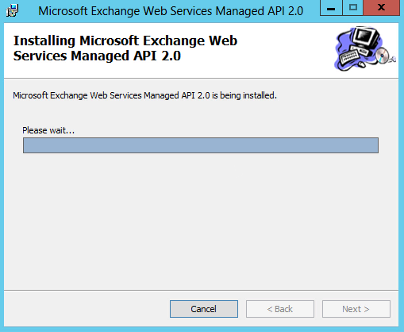

# Configure Exchange task synchronization in SharePoint Server 2013

[!INCLUDE[appliesto-2013-xxx-xxx-xxx-md](../includes/appliesto-2013-xxx-xxx-xxx-md.md)]
  
Configuring task Synchronization can be relatively complex. By following the guidance below, you should be able to quickly configure task synchronization between your Exchange Server 2016, SharePoint Server 2013 and Project Server 2013 environments. This is great functionality for any business, because you are able to integrate tasks from different applications into one application, like Outlook 2016 or SharePoint MySites.
  
> [!NOTE]
> It's possible you came here looking for the OOF Integration between Project Server and Exchange topic. If that's the case, see [Exchange Server calendar OOF integration with Project Server 2013](/project/exchange-server-calendar-oof-integration-with-project-server-2013). 
  
> [!IMPORTANT]
> The Work Management service application was deprecated in SharePoint Server 2016 so you can configure Exchange task synchronization in SharePoint Server 2013 only. 
  
## Before you begin
<a name="begin"> </a>

What you need to know before you begin:
  
- For SharePoint, **User profile synchronization** needs to be up and running, this typically means having a **User Profile service application** working in Central Administration, with the **synchronization service** running as well. There's further reading on this at the following links: [User profiles and identities](user-profiles-and-identities.md), and [Manage user profile synchronization in SharePoint Server](manage-profile-synchronization.md).
    
- You'll also need to have the **Work Management service application** running for your SharePoint farm. 
    
- For discovering task additions and changes, you need to have the **Search service application** running as well, and set for **incremental or continuous** crawling. For more information, you can read [Create and configure a Search service application in SharePoint Server 2016](../search/create-and-configure-a-search-service-application.md).
    
- It's very important that you have **Secure Sockets Layer (SSL)** running for your SharePoint web application, this is required for security reasons (if you're browsing to a site where the URL starts with http, that's using SSL). If you're not familiar with SSL, the [Create claims-based web applications in SharePoint Server](/previous-versions/office/sharepoint-server-2010/ee806885(v=office.14)) can help. If you're in a test environment and you're using **self-SSL**, I've put the steps for this at the bottom of this article. 
    
- You'll probably want to have **MySites** enabled for SharePoint, to see tasks in one place in SharePoint. You can also view them in **Outlook**. 
    
- Task Synchronization requires Exchange Server 2016, with end-user mailboxes.
    
- When taking the actions below, make sure you're logged in as a member of the SharePoint and Exchange Server administrator groups.
    
## Downloading and Installing Exchange Server Web Services API on SharePoint Server
<a name="begin"> </a>

We'll start by getting a copy of the **EWSManagedAPI.msi** from the [Microsoft Download Center](https://www.microsoft.com/en-us/download/details.aspx?id=42951) (https://www.microsoft.com/en-us/download/details.aspx?id=35371). Download this to each application server (App server) in your SharePoint environment. These are the servers which users browse to when going to your SharePoint site. This component is needed for SharePoint and Exchange to be able to have this cross-product functionality.You need to install the EWSManagedAPI.msi file via a command-line window. Open that window as an administrator, then make sure you change directories as needed to get to the location of the downloaded file. You'll need to run this one line of script once you're there, exactly as you see it below: 
  
```
msiexec /i EwsManagedApi.msi addlocal="ExchangeWebServicesApi_Feature,ExchangeWebServicesApi_Gac"
```

This will start the EWS API 2.2. wizard, where you'll be able to accept the license agreement terms and then get to the following screen.
  

  
Leave the install folder at the default, unless you need to put it somewhere else (like a different drive). You can choose the Everyone radio button for install. And that's it! Go ahead and choose Next to have the install proceed.
  

  
You get to look at this while the install happens. Once the install completes, you close out of the wizard.
  
Now that the wizard's completed successfully, you'll need to run an IISReset on each of the machines you installed to, before you can do the next step. You can do this in the same Administrator command window you ran the script from, just type IISReset and hit Enter to proceed.
  
## Establish an OAuth trust on the Exchange Server
<a name="begin"> </a>

What we need to do now is to establish an OAuth trust on the Exchange Server. This is a one-way trust that lets Exchange know the SharePoint environment is safe to partner with in this way.
  
Run this script (It's installed with Exchange, so it's already there) from the Exchange Management Shell on all Exchange Mailbox servers in your organization from this location, "C:\Program Files\Microsoft\Exchange Server\V15\Scripts.":
  
```
.\Configure-EnterprisePartnerApplication.ps1 -ApplicationType Sharepoint -AuthMetadataUrl https://<SP_FQDN>/_layouts/15/metadata/json/1
```

> [!NOTE]
> In the above script, \<SP_FQDN\> is a placeholder, so you need to put in your SharePoint root site collection's URL there. So if you browse to your site via https://tailspintoys.com then that's what you'd put there, with the /_layouts/15/metadata/json/1 added afterward. 
  
The script will run, creating the accounts and permissions necessary for the trust, and then give you a succeeded message. If you happen to have created a similar trust in the past you may get a message saying that a trust also exists, but the script is smart enough to create a new trust for you.
  
Well, that's it. Task Synchronization is configured for your users to start using. You can find more information in [My Tasks Aggregation in SharePoint Server and Exchange Task Integration](https://go.microsoft.com/fwlink/p/?LinkId=299837).
  
## Additional Information for Self-SSL
<a name="begin"> </a>

I mentioned up above that you might need to manually trust a certificate if you're setting up self-SSL. That just means that the SSL certificate generated in a server's IIS isn't going to be recognized on a different server, so there's a manual way to get it to work.
  
- On each Exchange server needing permission, open Internet Explorer.
    
- Browse to your SharePoint site that's running with a self-SSL certificate (it will start with https).
    
- When you are prompted that the site's unsafe, choose **Continue to website**. 
    
- When you get to the site, there should be a **Certificate Error** item by the address bar in IE, select that. 
    
- The **View Certificates** option should then become available, select that. 
    
- Choose the **Install Certificate** option. 
    
- Then choose **Place all certificates in the following store**. 
    
- Check the **Show physical stores** checkbox. 
    
- Now install the certificate to **Trusted Root Certification Authorities \> Local Computer**. 
    
Now that certificate will be trusted on the local computer.
  

