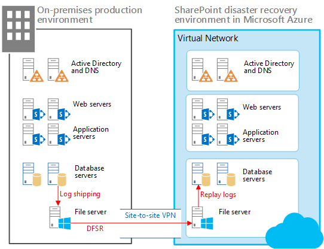
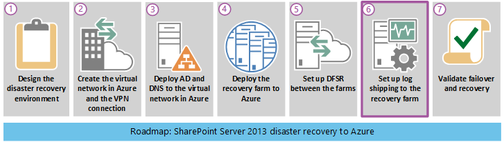
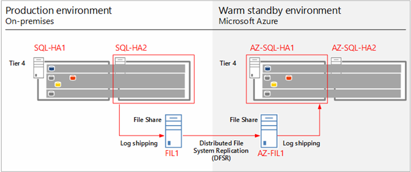

# Configure log shipping in SharePoint Server

[!INCLUDE[appliesto-2013-2016-2019-xxx-md](../includes/appliesto-2013-2016-2019-xxx-md.md)] 
  
With log shipping, you back up the transaction logs from a primary database to a secondary database on a separate instance of SQL Server. In the scenario described here, SQL Server log shipping is used together with Distributed File System Replication (DFSR) to copy databases and transaction logs to the recovery farm in Microsoft Azure as illustrated below. 
  
In this disaster recovery scenario the SharePoint Server production farm is located on-premises and the recovery farm is located in Azure. You can also adapt the guidance in this topic for other types of disaster-recovery scenarios. 
  
**Elements of a warm standby solution in Azure**


  
In the illustration:
  
- Two environments are illustrated side by side: the on-premises SharePoint farm and the recovery (standby) farm in Azure.
    
- Each environment includes a file share.
    
- Log shipping is used to copy logs from the secondary database server in the on-premises environment to the local file share.
    
- DFSR copies files from the file share in the on-premises environment to the file share in the Azure environment. In a WAN scenario, DFSR is more efficient than shipping the logs directly to the secondary server in Azure.
    
- Log shipping replays the logs from the file share in the Azure environment to the primary replica in the SQL Server AlwaysOn availability group in the recovery environment.
    
- Log-shipped databases are not attached to the SharePoint Server farm until a recovery exercise is performed.
    
The following diagram shows the seven phases that the complete SharePoint Server disaster recovery in Azure solution contains. Phase 6: Set up log shipping to the recovery farm is highlighted in this diagram and explained in the following sections.
  

  
    
## Using log shipping for disaster recovery
<a name="Use"> </a>

Log shipping enables you to automatically send transaction log files for databases from a primary database server instance to a secondary database server instance. In our on-premises test environment, we use AlwaysOn availability groups with two replicas for high availability. We configured log shipping on both replicas. Each replica must be able to ship transaction logs. Only the replica that is active and owns the database can ship logs. However, if a failover event occurred and the secondary replica became active, it would have to ship transaction logs instead of the failed replica.
  
After the transaction logs are received in the Azure environment, they are restored, one at a time, to each SharePoint database on the secondary database server. For more information about our test environment, see [Microsoft proof of concept environment](/office365/enterprise/sharepoint-server-2013-disaster-recovery-in-microsoft-azure#POC).
  
> [!NOTE]
> Some organizations use a third database server as a monitor to record the history and status of backup and restore operations. This optional monitor server creates alerts when backup operations fail. 
  
For detailed information about log shipping, refer to the articles listed in the following table.
  
**Table: Reference articles for log shipping**

|**URL**|**Description**|
|:-----|:-----|
|[About Log Shipping (SQL Server)](https://go.microsoft.com/fwlink/?LinkId=392694) <br/> |Describes log shipping transaction log backups and the options that are available.  <br/> |
|[Configure Log Shipping (SQL Server)](https://go.microsoft.com/fwlink/?LinkId=392695) <br/> |Describes how to configure log shipping in SQL Server 2012 by using SQL Server Management Studio or Transact-SQL.  <br/> |
|[View the Log Shipping Report (SQL Server Management Studio)](https://go.microsoft.com/fwlink/?LinkId=392693) <br/> |Explains how to view the Transaction Log Shipping Status report in SQL Server Management Studio. You can run a status report at a monitor server, primary server, or secondary server.  <br/> |
   
## Performance considerations
<a name="Perf"> </a>

Log shipping consists of three jobs. Each job performs one of the following operations:
  
1. Backs up the transaction log at the primary server instance.
    
2. Copies the transaction log file to the secondary server instance.
    
3. Restores the log backup on the secondary server instance.
    
Each job operates on a schedule and runs for an interval, which can have a significant impact on the database server and, by default, SharePoint farm performance.
  
To correctly set the backup, copy, and restore job intervals for log shipping, you must analyze the amount of data that is being log shipped. The amount of log shipped data is affected by the daily amount of change in the content databases. The percentage of change can vary greatly depending on the content, maintenance changes, and usage peaks.
  
To get an accurate percentage of change, calculate the sum of changes in the transaction log backups for each content database that you log ship over a given interval. Use this data to calculate the percentage of change compared to the primary database.
  
The following guidance is derived from the log-shipping experience of Microsoft field personnel with several releases of SharePoint Server.
  
- Avoid performance degradation due to all jobs starting at the same time by making sure that all log-shipping jobs are offset with at least a one-minute delay from the previous job.
    
- It is better to back up and copy many small transaction logs instead of a few large transaction logs.
    
- Schedule log backups and copying at frequent intervals. You can restore the transaction logs at less frequent intervals. For example, start by using backup and copy intervals of five minutes, and a restore interval of 15 minutes.
    
## Prerequisites for configuring log shipping
<a name="Prereq"> </a>

Make sure that you meet the following prerequisites for using log shipping for a disaster-recovery solution.
  
- The SQL Server logins are domain accounts that have the permission levels needed for log shipping. The log-shipping stored procedures require membership in the **sysadmin** fixed server role. 
    
- The primary database must use the full or bulk-logged recovery model.
    
    > [!CAUTION]
    > If you switch the database to simple recovery, log shipping will stop working. 
  
- Before you configure log shipping, you must create a share to make the transaction log backups available to the secondary server. This is a share of the directory where the transaction log backups are generated.
    
In addition to your Recovery Point Objectives (RPO), ensure that the recovered farm data is as complete and uncorrupt as possible. To reach these goals, you must carefully plan and schedule every aspect of log shipping.
  
## Log shipping infrastructure
<a name="Infra"> </a>

The log-shipping infrastructure used for our disaster-recovery solution environment is shown in the following diagram.
  
**Log shipping infrastructure and data flow**


  
The previous diagram shows the log shipping infrastructure and data flow. The diagram shows the SQL Server database servers and the file servers in the production farm and the Azure recovery farm. These farms are nearly identical, and each contains a primary and secondary replica for each AlwaysOn availability group. The file servers, FIL1 and AZ-FIL1, are configured the same, including the number of hard disks and disk sizes. Additional servers in the farm are not shown.
  
To provide high availability, each replica in an availability group stores a backup (full, differential, and transaction logs) of the other replica. 
  
The primary and secondary replicas (SQL-HA1 and SQL-HA2, respectively) make backups that are stored on its partner in the availability group.
  
Transaction log shipping is configured on the secondary replica to minimize the impact of backups on the production databases. These transaction logs are written to a shared folder on the on-premises file server (FIL1). The Windows Server Distributed File System (DFS) Replication Service copies the transaction logs from FIL1 to AZ-FIL1. The transaction logs on AZ-FIL1 are restored to AZ-SQL-HA1, the primary replica for the availability group in the recovery farm.
  
## Steps required to configure and validate log shipping
<a name="Config"> </a>

The required steps to configure, run, and validate log shipping are condensed and summarized in the following list:
  
1. Back up the database. 
    
1. Configure the full and differential backups to a local folder and also a shared folder on the file server.
    
2. Verify backups were made to both the local folder and shared folder.
    
2. Set up and test Distributed File System (DFS) Replication.
    
1. Create Namespace and Replication to transfer the transaction logs and backup files between the on-premises and Azure farms on the shared folder in file server.
    
2. Verify all transfers after log shipping runs.
    
3. Set up and test log shipping.
    
1. Set up log shipping on the primary database server by using the following script: **Primary-Logshippingsetupparameter**. This script creates backup jobs, schedules them for log shipping and then initiates the jobs. 
    
  ```
  SET NOCOUNT ON
  USE MSDB
  GO
  --@PrimServer : Primary Server name
  --@SecServer  : DR/Secondary Server Name
  --@SecInstance : DR/Secondary FQDN
  --@Domain  : Domain Name
  --@BkpDrive : Production Backup server Name
  --@DBName : DatabaseName
  DECLARE @LS_BackupJobIdAS uniqueidentifier,  @LS_PrimaryIdAS uniqueidentifier , @SP_Add_RetCode As int 
  DECLARE @Time as nvarchar(10),@SecInstance as nvarchar(250), @PrimServer as nvarchar(50),@SecServer as nvarchar(50),
  @Domain as nvarchar(50),@DBName as nvarchar(max),@BkpDrive as nvarchar(250),@CMD as nvarchar(max),@Counter int
  ----------------------------------------------------------------------------
  IF OBJECT_ID ('tempdb.DBO.#LogShipping','U') IS NOT NULL DROP TABLE #LogShipping
  Create table #LogShipping ( LSDBs nvarchar(max))
  Set @PrimServer ='SQL1'
  Set @SecServer ='SQL2'
  Set @SecInstance ='SQL2.corp.adventureworks.com'
  Set @Domain ='corp.adventureworks.com'
  Set @BkpDrive ='FS1.corp.adventureworks.com'
  Set @DBName = 'Social_DB'
  Set @Time = '0130'
  SET @DBName = UPPER(REPLACE(@DBName, ' ', ''))
  SET @DBName = '''' + REPLACE(@DBName, ',', ''', ''') + ''''
  Set @CMD =   ' Select ' +
  '''DECLARE  @SP_Add_RetCode As int, @LS_BackupJobIdAS uniqueidentifier,  @LS_PrimaryIdAS uniqueidentifier
  EXEC @SP_Add_RetCode = master.dbo.sp_add_log_shipping_primary_database ' + CHAR(10) +
  '@database = ''''''  + db.Name + ''''''' + CHAR(10) +
  ',@backup_directory = ''''\\' + @BkpDrive + '\LS\' + ''' + db.Name + ''''' + '''' + CHAR(10) +
  ',@backup_share = ' + '''''\\' + @BkpDrive + '\LS\' + ''' + db.Name + ''''' + ''''  + CHAR(10) +
  ',@backup_job_name = ''''' + 'LSBackup_' + ''' + db.Name + ''''' + '''' + CHAR(10) +
  ',@backup_retention_period = 4320
  ,@backup_compression = 1
  ,@backup_threshold = 180 
  ,@threshold_alert_enabled = 1
  ,@history_retention_period = 5760 
  ,@backup_job_id = @LS_BackupJobId OUTPUT 
  ,@primary_id = @LS_PrimaryId OUTPUT 
  ,@overwrite = 1 ' +
  'IF (@@ERROR = 0 AND @SP_Add_RetCode = 0) 
  BEGIN 
  DECLARE @LS_BackUpScheduleUIDAs uniqueidentifier ,@LS_BackUpScheduleIDAS int 
  EXEC msdb.dbo.sp_add_schedule 
  @schedule_name = ''''' + 'LSBackupSchedule_'+ @PrimServer + '_' + ''' + db.Name + ''''' + ''''  + CHAR(10) +
  ',@enabled = 1 
  ,@freq_type = 4 
  ,@freq_interval = 1 
  ,@freq_subday_type = 4 
  ,@freq_subday_interval = 13 
  ,@freq_recurrence_factor = 0 
  ,@active_start_date = 20090506 
  ,@active_end_date = 99991231 
  ,@active_start_time = ' + @Time  + CHAR(10) +
  ',@active_end_time = 235900 
  ,@schedule_uid = @LS_BackUpScheduleUID OUTPUT 
  ,@schedule_id = @LS_BackUpScheduleID OUTPUT 
  EXEC msdb.dbo.sp_attach_schedule @job_id = @LS_BackupJobId ,@schedule_id = @LS_BackUpScheduleID  
  EXEC msdb.dbo.sp_update_job @job_id = @LS_BackupJobId ,@enabled = 1 
  END 
  EXEC master.dbo.sp_add_log_shipping_alert_job 
  EXEC master.dbo.sp_add_log_shipping_primary_secondary 
  @primary_database = '''  + ''''' + db.Name + ''''' + ''''  + CHAR(10) + 
  ',@secondary_server = ''''' + @SecInstance + ''''''  + CHAR(10) +
  ',@secondary_database = ''' + ''''' + db.Name + ''''' + ''''  + CHAR(10) +
  ',@overwrite = 1 ''' +
  ' [LSDBs] FROM sys.databases db  where name in (' + @DBName + ')' +
  'and    db.name  not in (''master'',''model'',''msdb'',''tempdb'',''metricsops'',''periscope'' )
  and   Not (exists (select lss.Secondary_database from msdb.dbo.log_shipping_Secondary_databases lss where  db.Name = lss.Secondary_database)
  or exists (select lsp.primary_database from msdb.dbo.log_shipping_primary_databases lsp where  db.Name = lsp.primary_database)
     )'
  Insert #LogShipping (LSDBs)
  Exec ( @CMD)
  Set @Counter = @@rowcount
  While (@counter > 0)
    Begin
    select top 1  @CMD = LSDBs from #LogShipping
    exec sp_executesql @CMD
    set @counter = @counter - 1
    delete top (1) from #LogShipping
    End
  IF OBJECT_ID ('tempdb.DBO.#LogShipping','U') IS NOT NULL DROP TABLE #LogShipping
  -- ****** End: Script to be run at Primary: [DB1-PSMSQL-01] ******
  ```

2. Set up log shipping on a secondary database server by using the following script: **Secondary-Logshippingsetupparameter scripts**. In our lab environment, the secondary database server is in recovery farm located in Azure. 
    
  ```
  -- ****** Begin: Script to be run at Secondary:  9.3 BUILD******
  SET NOCOUNT ON
  USE MSDB
  GO
  --@PrimServer : Primary Server name
  --@SecServer  : DR/Secondary Server Name
  --@SecInstance : DR/Secondary FQDN
  --@Domain  : Domain Name
  --@PrimaryBkpDrive : Production Backup server Name
  --@BkpDrive : Secondary Backup server Name
  --@DBName : DatabaseName
  DECLARE @LS_BackupJobIdAS uniqueidentifier,  @LS_PrimaryIdAS uniqueidentifier , @SP_Add_RetCode As int 
  DECLARE @Time as nvarchar(10),@SecInstance as nvarchar(250), @PrimServer as nvarchar(50),@SecServer as nvarchar(50),
  @Domain as nvarchar(50),@DBName as nvarchar(max),@PrimaryBkpDrive as nvarchar(250),@BkpDrive as nvarchar(250),@CMD as nvarchar(max),@CMD2 as nvarchar(max),@Counter int
  DECLARE  @Delimeter char(1),@DB nvarchar(200), @StartPos int, @Length int
  IF OBJECT_ID ('tempdb.DBO.#LogShipping','U') IS NOT NULL DROP TABLE #LogShipping
  Create table #LogShipping ( LSDBs nvarchar(max))
  IF OBJECT_ID ('tempdb.DBO.#DBs','U') IS NOT NULL DROP TABLE #DBs
  Create TABLE #DBs (Name nvarchar(200))
  Set @PrimServer ='az-sql-ha1'
  Set @SecServer =' az-sql-ha2'
  Set @SecInstance ='SQL1.corp.adventureworks.com'
  Set @Domain =' corp.adventureworks.com '
  SET @PrimaryBkpDrive = 'fs1.corp.adventureworks.com'
  Set @BkpDrive =' az-sp-fs.corp.adventureworks.com '
  Set @DBName = 'Social_DB'
  Set @Time = '0130'
  --Parsing Function
  SET @Delimeter = ','
  WHILE LEN(@DBName) > 0
    BEGIN
      SET @StartPos = CHARINDEX(@Delimeter, @DBName)
      IF @StartPos < 0 SET @StartPos = 0
      SET @Length = LEN(@DBName) - @StartPos - 1
      IF @Length < 0 SET @Length = 0
      IF @StartPos > 0
        BEGIN
          SET @DB = Rtrim(Ltrim(SUBSTRING(@DBName, 1, @StartPos - 1)))
          SET @DBName = SUBSTRING(@DBName, @StartPos + 1, LEN(@DBName) - @StartPos)
        END
      ELSE
        BEGIN
          SET @DB = Rtrim(Ltrim(@DBName))
          SET @DBName = ''
        END
      INSERT #DBs (Name) VALUES(@DB)
  END
  --SET @DBName = UPPER(REPLACE(@DBName, ' ', ''))
  --SET @DBName = '''' + REPLACE(@DBName, ',', ''', ''') + ''''
  Set @CMD = 'Select ' +
  ''' DECLARE @LS_Secondary__CopyJobId AS uniqueidentifier, @LS_Secondary__RestoreJobId AS uniqueidentifier ,@LS_Secondary__SecondaryId AS uniqueidentifier , @LS_Add_RetCode As int ,@LS_Add_RetCode2 As int 
    DECLARE @LS_SecondaryCopyJobScheduleUIDAs uniqueidentifier ,@LS_SecondaryCopyJobScheduleIDAS int, @LS_SecondaryRestoreJobScheduleUIDAs uniqueidentifier ,@LS_SecondaryRestoreJobScheduleIDAS int 
    EXEC @LS_Add_RetCode = master.dbo.sp_add_log_shipping_secondary_primary 
  @primary_server = ''''' + @PrimServer + ''''''+  CHAR(10) +
  ',@primary_database = '' + ' +  ''''''''' + db.Name + ''''''''' +  CHAR(10) +
  ' + '',@backup_source_directory = ' + '''''\\' + @PrimaryBkpDrive + '\LS\'' + db.Name + ''''''' +  CHAR(10) +
  ' ,@backup_destination_directory =  ' + '''''\\' + @BkpDrive + '\LS\'' + db.Name + ''''''' +  CHAR(10) +
  ',@copy_job_name = ''''LSCopy_DB1-PSMSQL-01_'' + db.Name + ''''''' +  CHAR(10) +
  ',@restore_job_name = ''''LSRestore_'+ @PrimServer + '_'' + db.Name + ''''''' +  CHAR(10) +
  ',@file_retention_period = 4320 
  ,@overwrite = 1 
  ,@copy_job_id = @LS_Secondary__CopyJobId OUTPUT 
  ,@restore_job_id = @LS_Secondary__RestoreJobId OUTPUT 
  ,@secondary_id = @LS_Secondary__SecondaryId OUTPUT 
  IF (@@ERROR = 0 AND @LS_Add_RetCode = 0) 
  BEGIN 
  EXEC msdb.dbo.sp_add_schedule 
  @schedule_name =''''DefaultCopyJobSchedule'''' 
  ,@enabled = 1 
  ,@freq_type = 4 
  ,@freq_interval = 1 
  ,@freq_subday_type = 4 
  ,@freq_subday_interval = 15 
  ,@freq_recurrence_factor = 0 
  ,@active_start_date = 20090506 
  ,@active_end_date = 99991231 
  ,@active_start_time = ' + @Time + ' 
  ,@active_end_time = 235900 
  ,@schedule_uid = @LS_SecondaryCopyJobScheduleUID OUTPUT 
  ,@schedule_id = @LS_SecondaryCopyJobScheduleID OUTPUT 
  EXEC msdb.dbo.sp_attach_schedule 
  @job_id = @LS_Secondary__CopyJobId 
  ,@schedule_id = @LS_SecondaryCopyJobScheduleID  
  EXEC msdb.dbo.sp_add_schedule 
  @schedule_name =''''DefaultRestoreJobSchedule'''' 
  ,@enabled = 1 
  ,@freq_type = 4 
  ,@freq_interval = 1 
  ,@freq_subday_type = 4 
  ,@freq_subday_interval = 15 
  ,@freq_recurrence_factor = 0 
  ,@active_start_date = 20090506 
  ,@active_end_date = 99991231 
  ,@active_start_time = ' + @Time + '
  ,@active_end_time = 235900 
  ,@schedule_uid = @LS_SecondaryRestoreJobScheduleUID OUTPUT 
  ,@schedule_id = @LS_SecondaryRestoreJobScheduleID OUTPUT 
  EXEC msdb.dbo.sp_attach_schedule 
  @job_id = @LS_Secondary__RestoreJobId 
  ,@schedule_id = @LS_SecondaryRestoreJobScheduleID  
  END 
  IF (@@ERROR = 0 AND @LS_Add_RetCode = 0) 
  BEGIN 
  EXEC @LS_Add_RetCode2 = master.dbo.sp_add_log_shipping_secondary_database 
  @secondary_database = ' +  ''''''' + db.Name + ''''''' +  CHAR(10) + '
  ,@primary_server = ''''' + @PrimServer + '''''
  ,@primary_database = '+  ''''''' + db.Name + ''''''' +  CHAR(10) +
  ',@restore_delay = 0 
  ,@restore_mode = 1 
  ,@disconnect_users= 1 
  ,@restore_threshold = 180   
  ,@threshold_alert_enabled = 1 
  ,@history_retention_period= 5760 
  ,@overwrite = 1 
  END 
  IF (@@error = 0 AND @LS_Add_RetCode = 0) 
  BEGIN 
  EXEC msdb.dbo.sp_update_job @job_id = @LS_Secondary__CopyJobId ,@enabled = 0 
  EXEC msdb.dbo.sp_update_job @job_id = @LS_Secondary__RestoreJobId ,@enabled = 1 
  END '''  + '[LSDBs] FROM #DBs db'
  --Print @CMD
  Insert #LogShipping (LSDBs)
  Exec ( @CMD)
  Set @Counter = @@rowcount
  While (@counter > 0)
    Begin
    select top 1  @CMD = LSDBs from #LogShipping
    exec sp_executesql @CMD
    set @counter = @counter - 1
    delete top (1) from #LogShipping
    End
  IF OBJECT_ID ('tempdb.DBO.#LogShipping','U') IS NOT NULL DROP TABLE #LogShipping
  IF OBJECT_ID ('tempdb.DBO.#DBs','U') IS NOT NULL DROP TABLE #DBs
  -- ****** End: Script to be run at Secondary:  9.3 Build ******
  ```

3. Verify that the transaction logs are shipped to the share and that DFS is replicating these logs to the share on the Azure file server. Open the Job Activity Monitor in SQL Server to verify the transaction logs were shipped successfully. Open the shared folders on both file servers in the production and Azure farms to verify DFS is transferring the transaction logs.
    
## See also
<a name="Config"> </a>

#### Concepts

[Configure SQL Server AlwaysOn Availability Groups for SharePoint Server](configure-an-alwayson-availability-group.md)
#### Other Resources

[About Log Shipping (SQL Server)](http://go.microsoft.com/fwlink/?LinkID=392694&amp;clcid=0x409)
  
[Replication Tutorials](https://go.microsoft.com/fwlink/?linkid=858913)

