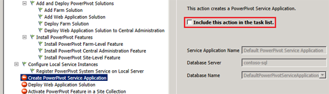
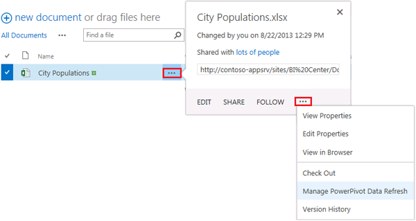

# Configure Power Pivot for SharePoint 2013

[!INCLUDE[appliesto-2013-xxx-xxx-xxx-md](../includes/appliesto-2013-xxx-xxx-xxx-md.md)]
  
> [!IMPORTANT]
> This scenario applies only to SharePoint Server 2013 and SQL Server 2012 with Service Pack 1 (SP1). 
  
In this scenario, we'll take a look at how to set up Power Pivot for SharePoint 2013. This includes installing Power Pivot for SharePoint on the servers in your farm, configuring a Power Pivot service application, and running some tests to make sure everything is working properly.
  
## Before you begin
<a name="begin"> </a>

Before getting started, make sure you have:
  
- [Configured Excel Services](configure-excel-services.md) in your SharePoint Server farm.
    
- [Configured a data model server](manage-excel-services-data-model-settings.md) in Excel Services. You'll need an instance of [Analysis Services 2012 SP1 configured in Power Pivot mode](https://msdn.microsoft.com/library/jj219067.aspx) in order to do this.
    
- [Configured Secure Store](configure-the-secure-store-service.md) in your SharePoint Server farm.
    
- Downloaded [Microsoft SQL Server 2012 SP1 PowerPivot for Microsoft SharePoint](https://www.microsoft.com/download/details.aspx?id=35577) (spPowerPivot.msi). (We'll be installing this program using the procedures in this article.)
    
- Created an Active Directory account for the Power Pivot application pool. This is a domain user account and doesn't require any special permissions. It should be a unique account created for this purpose.
    
- Created an Active Directory account for the Power Pivot unattended data refresh account. This is a domain user account and must have read permissions to the data sources that you plan to use for your Power Pivot reports. It should be a unique account created for this purpose.
    
You may notice that the Power Pivot configuration tool that we'll be using has options for deploying Excel Services and Secure Store. However, the Power Pivot configuration tool is not able to configure these services using the recommended accounts, so we recommend that you configure these services manually using the links above.
  
## Video demonstration
<a name="VideoDemonstration"> </a>

This video shows the steps involved in setting up Power Pivot for SharePoint 2013, as described in this article.
  
**Video: Configure Power Pivot for SharePoint 2013**

> [!VIDEO https://www.microsoft.com/videoplayer/embed/8a5c81a1-3524-4fe9-9b7c-d71e59fcf8ef?autoplay=false]
## Prepare the farm
<a name="proc1"> </a>

In this section, we will prepare the farm for Power Pivot installation. This includes registering a managed account and configuring some Secure Store settings in Central Administration, as well as configuring some security settings in SQL Server. You'll need to be a farm administrator and a SQL Server administrator to do these steps, as well as a [Shell Administrator](/powershell/module/sharepoint-server/Add-SPShellAdmin?view=sharepoint-ps) to do the PowerShell steps. 
  
 **Register a domain account as a managed account in SharePoint Server 2013**
  
The first step is to register the domain account that you want to use to run the Power Pivot application pool as a managed account in SharePoint Server 2013. This will make the account available for us to use when we create the Power Pivot service application later on.
  
 **To register a managed account**
  
1. In Central Administration, click **Security**.
    
2. Under **General Security**, click **Configure managed accounts**.
    
3. Click **Register Managed Account**.
    
4. Type the username and password of the account that you created to run the Power Pivot application pool.
    
5. If you want SharePoint Server 2013 to handle account password changes for you, select the **Enable password change** check box, and then fill in the details on when you want the password changed. 
    
6. Click **OK**.
    
 **Grant the managed account access to the content database**
  
You must also grant access to the SharePoint content database for this account. Use the following procedure for each web application that will be associated with Power Pivot.
  
 **To grant content database access to the managed account**
  
1. Click **Start**, click **All Programs**, click **Microsoft SharePoint 2013 Products**, right-click **SharePoint 2013 Management Shell**, and then click **Run as Administrator**.
    
2. At the Microsoft PowerShell Command Prompt, type the following syntax (press ENTER after each line):
    
  ```
  $w = Get-SPWebApplication -identity http://<WebApplication>
  $w.GrantAccessToProcessIdentity("<Domain>\<PowerPivotApplicationPoolAccount>")
  ```

> [!IMPORTANT]
> If in the future you add more content databases, you'll need to rerun these cmdlets to ensure that Power Pivot has access to the new databases. 
  
 **Create a target application in Secure Store**
  
The next step is to create a target application in Secure Store for the Power Pivot unattended data refresh account. This target application will be used to refresh the data in your Power Pivot reports.
  
 **To create a target application**
  
1. In Central Administration, under **Application Management**, click **Manage service applications**.
    
2. Click the Secure Store service application.
    
3. In the ribbon, click **New**.
    
4. In the **Target Application ID** box, type PowerPivotUnattendedAccount.
    
    > [!NOTE]
    > Be sure to use this value so that the Power Pivot for SharePoint 2013 Configuration tool will recognize it. 
  
5. Type a display name and email address.
    
6. For **Target Application Type**, make sure **Individual** is selected, and then click **Next**.
    
7. Ensure **Field Type** is set to **Windows User Name** and **Windows Password**, and click **Next**.
    
8. Type a name or group for the **Target Application Administrators**, and then click **OK**.
    
9. Select the target application that you just created, and then in the **Credentials** section of the ribbon, click **Set**.
    
10. For **Credential Owner**, type the account that you created for the Power Pivot application pool (the one that you just configured as a managed account).
    
11. Type the user name and password of the credentials that have access to your data sources.
    
12. Click **OK**.
    
 **Grant access to the SharePoint Server admin content database**
  
In order for the Power Pivot Management Dashboard reports to work, the account that runs the Excel Services application pool must have read access to the SharePoint Server 2013 admin content database. You configure this in SQL Server.
  
 **To grant admin content database access**
  
1. Open SQL Server Management Studio and connect to the database engine.
    
2. Expand **Security** and double-click the account that is used for the Excel Services application pool. 
    
3. On the **User Mapping** page, click the SharePoint Admin content database (usually named SharePoint_AdminContent_<GUID>). 
    
4. Select the **SPDataAccess** database role check box. 
    
5. Click **OK**.
    
The basic farm setup is now complete, so the next thing to do is to install and configure Power Pivot for SharePoint.
  
## Configure Power Pivot for SharePoint
<a name="proc2"> </a>

In this section, we'll configure Power Pivot itself, including installing the Power Pivot software and configuring a service application.
  
 **Install Power Pivot on each server in the farm**
  
The first step in configuring Power Pivot in a SharePoint Server 2013 farm is to install SQL Server 2012 SP1 PowerPivot for Microsoft SharePoint (sppowerpivot.msi) on each server in the farm.
  
Use the following procedure to run sppowerpivot.msi on each server in your farm.
  
 **To install Power Pivot for SharePoint 2013**
  
1. Double-click sppowerpivot.msi.
    
2. Follow the wizard to install Power Pivot for SharePoint 2013. When you see the Feature Selection page, leave all of the items selected (this is the default), and then complete the wizard.
    
 **Run the Power Pivot for SharePoint configuration tool**
  
Once you have installed sppowerpivot.msi on each server in the farm, the next step is to run the PowerPivot for SharePoint 2013 Configuration tool. Run this program on the server that is running the SharePoint Central Administration website.
  
 **To run the Power Pivot for SharePoint 2013 Configuration tool**
  
1. Click **Start** > **All Programs** > **Microsoft SQL Server 2012** > **PowerPivot for SharePoint 2013 Configuration**.
    
2. Choose the **Configure or Repair Power Pivot for SharePoint** option, and then click **OK**.
    
3. In the Power Pivot Configuration Tool, in the left pane, select **Create PowerPivot Service** application. 
    
4. On the **Parameters** tab, clear the **Include this action in the task list** check box. This will prevent the tool from creating a service application for Power Pivot. We will create the Power Pivot service application manually later. 
    
    
  
    This will also prevent further configuration steps from being completed, but we'll come back and do those later as well.
    
5. Click **Run**.
    
6. Click **Yes** to confirm. 
    
7. When the action completes, click **OK**, and then click **Exit**.
    
If you have additional servers in your farm, we'll eventually run the Power Pivot for SharePoint 2013 Configuration tool on those as well, but first there are a few more steps to do.
  
 **Create a Power Pivot service application**
  
We prevented the Power Pivot configuration tool from creating a Power Pivot service application, so that we could create one manually and use the application pool account that we created earlier. Now, we need to go back and create the service application.
  
 **To create a Power Pivot service application**
  
1. In Central Administration, under **Application Management**, **click Manage service applications**.
    
2. In the ribbon, click **New**, and then click **SQL Server Power Pivot Service Application**.
    
3. Type a name for the service application in the **Name** text box. 
    
4. Type a name for the new application pool in the **Application pool name** text box. 
    
5. From the **Configurable** dropdown list, choose the account that you registered as a managed account for the Power Pivot application pool. 
    
6. Click **OK**.
    
The Power Pivot service application has now been created, though you may need to refresh the page to see it.
  
 **Configure the Power Pivot unattended data refresh account**
  
The next step is to configure the Power Pivot unattended data refresh account. We do this in the Power Pivot service application settings by specifying the unattended data refresh account that we created in Secure Store.
  
 **To configure the unattended data refresh account**
  
1. In Central Administration, under **Application Management**, click **Manage service applications**.
    
2. Click the Power Pivot service application.
    
3. Under **Actions**, click **Configure service application settings**.
    
4. Under **Data Refresh** (about a third of the way down), type the target application ID of the target application that you created (PowerPivotUnattendedAccount) in the **PowerPivot Unattended Data Refresh Account** box. 
    
5. Click **OK**.
    
 **Rerun the Power Pivot for SharePoint 2013 Configuration tool**
  
Now that the service application has been created and we've configured the unattended data refresh account, we need to run the Power Pivot for SharePoint 2013 Configuration tool once again to complete the remainder of the steps.
  
 **To run the Power Pivot for SharePoint 2013 Configuration tool**
  
1. Click **Start** > **All Programs** > **Microsoft SQL Server 2012** > **Power Pivot for SharePoint 2013 Configuration**.
    
2. Choose the **Configure or Repair Power Pivot for SharePoint** option, and then click **OK**.
    
3. In the Power Pivot Configuration Tool, in the left pane, select **Activate Power Pivot Feature in a Site Collection**.
    
4. On the **Parameters** tab, choose the site collection where you want to active Power Pivot from the **Site URL** dropdown list. 
    
    > [!NOTE]
    > If you want to activate Power Pivot in more than one site collection, choose one to start with here. It's easy to add more later. 
  
5. If you changed the default site collection setting, click **Validate**.
    
6. Click **Run**, and then click **Yes** to confirm. 
    
7. When the action completes, click **OK**, and then click **Exit**.
    
Power Pivot setup is now complete and Power Pivot is ready to use.
  
 **Run the Power Pivot for SharePoint Configuration tool on other servers in the farm**
  
Because we've only run the Power Pivot for SharePoint 2013 Configuration tool on one server, the SQL Server Power Pivot System Service will only be available to run on this server. It's fine to use Power Pivot this way, but if you have multiple servers in your farm, we recommend that you install the service on all of them. This will allow you to change which server you run the service on (for example, if you want to balance out the services on your farm) or to run the service on multiple servers for greater capacity.
  
You install the SQL Server Power Pivot System Service by running the Power Pivot for SharePoint 2013 Configuration tool on the other servers in your farm.
  
Use the following procedure on each server in your farm.
  
 **To run the Power Pivot for SharePoint 2013 Configuration tool**
  
1. Click **Start** > **All Programs** > **Microsoft SQL Server 2012** > **PowerPivot for SharePoint 2013 Configuration**.
    
2. Choose the **Configure or Repair Power Pivot for SharePoint** option, and then click **OK**.
    
3. If you see **Activate PowerPivot Feature in a Site Collection** in the left pane, click on it, and then select the site collection where you want to activate Power Pivot or uncheck the **Include this action in the task list** check box if you don't want to activate Power Pivot in another site collection. 
    
4. If you made any changes, click **Validate**.
    
5. Click **Run**, and then click **Yes** to confirm. 
    
6. When the tasks complete, click **OK**, and then click **Exit**.
    
When you run the Power Pivot for SharePoint 2013 Configuration tool, it installs and turns on the SQL Server Power Pivot System Service on each server where you run it. You probably don't want this service running on every server, so be sure to go to **Manage services on server** in Central Administration and stop the service on the servers where you don't want to run it. 
  
## Test the Power Pivot for SharePoint installation
<a name="ver"> </a>

Now that everything is configured, we can do a simple test to see if it's working. We'll build a data model in Excel and publish it to a document library in the site collection where we enabled Power Pivot.
  
 **To create a test workbook**
  
1. In Excel, on the **Data** tab, choose **From Other Sources**, then choose **From SQL Server**.
    
2. Type the name of the instance of SQL Server where your data resides.
    
3. Follow the wizard through to connect to the table that contains your data.
    
4. When the wizard completes, you should see the **Import Data** dialog box. Choose the **Only Create Connection** option and select the **Add this data to the Data Model** check box. 
    
5. Click **OK**.
    
6. On the **Power Pivot** tab, click **Manage**.
    
7. In the **Power Pivot** ribbon, click **PivotTable**.
    
8. On the **Insert Pivot** dialog box, choose the **Existing Worksheet** option, and then click **OK**.
    
9. Select the fields that you want in the PivotTable report.
    
10. Save the workbook to a document library on the site collection where you enabled Power Pivot.
    
Once you've saved the workbook to the document library, you can access the Power Pivot settings by clicking the ellipsis (...) control twice, and then choosing **Manage Power Pivot Data Refresh**.
  

  
On the Manage Data Refresh page, select the **Enable** and **Also refresh as soon as possible** check boxes. Also, ensure that the **Use the data refresh account configured by the administrator** option is selected. (This is the default.) 
  

  
Repeat this several times while making some changes to your data. If the changes show up in the report when it's rendered in the browser, then data refresh is working properly.
  

