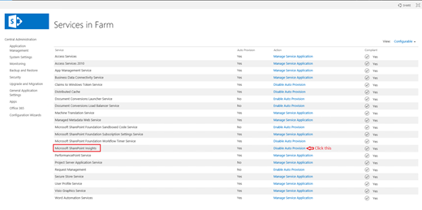

# Configure SharePoint Hybrid Auditing in SharePoint 2016 (Preview)

[!INCLUDE[appliesto-xxx-2016-xxx-xxx-md](../includes/appliesto-xxx-2016-xxx-xxx-md.md)]

> [!IMPORTANT]
> Microsoft will be ending support for the Hybrid Auditing in SharePoint 2016 preview in the near future. After support ends, no new logs will be sent to the Security and Compliance Center in Office 365.
  
## Microsoft SharePoint Auditing (Preview)

Microsoft SharePoint Hybrid Auditing is a new hybrid feature for SharePoint Server 2016 to help SharePoint administrators have visibility to user activities in their SharePoint environments. With this feature, SharePoint 2016 on-premise user activity logs can be uploaded to Office 365 and useful reports are generated. Configuration is simple and you can start viewing regularly updated reports in the Microsoft 365 admin center.
  
SharePoint Hybrid Auditing is currently in **Preview** mode: 
  
- It is not recommended or supported to use this feature in production environments.
    
- No data completeness or latency SLA is guaranteed.
    
- As SharePoint Online is continually changing, may see differences between the audit events on SharePoint Online versus the ones from SharePoint Server (on-premises)
    
## Prerequisites

Before you configure the SharePoint Hybrid Auditing feature, ensure you are:
  
- A member of the Farm Administrators group 
    
- A service application administrator (Full Control) for the User Profile Service 
    
- An Office 365 Global Administrator or a SharePoint Online Administrator 
    
- Logged into Office 365 and SharePoint Server from a server in your SharePoint Server farm 
    
- Able to launch the Hybrid Picker as a Farm Administrator with elevated permissions 
    
 **Elevate the privileges on the on-premises SharePoint farm account.** The on-premises SharePoint farm account must be granted elevated privilege on each SharePoint server in the farm before you launch the Hybrid Picker to deploy the on-premises Hybrid Auditing feature. You must: 
  
- Determine the Windows Service Account representing the SharePoint farm account. This is the Windows Service Account identity for the SharePoint Timer Service
    
- Add the SharePoint farm account to the Local Administrators group on each SharePoint server in the farm. 
    
- Recycle the SharePoint Timer Service on each server in the SharePoint farm
    
> [!IMPORTANT]
> This elevated privilege is only required for the duration of the SharePoint Hybrid Auditing feature deployment to allow the SharePoint farm account to create a new EventLog "OfficeDataLoader". The local administrator rights can be removed post provisioning. 
  
The configuration of Hybrid Auditing uses the Hybrid Picker in the SharePoint Online admin center.
  
Please read [Hybrid picker in the SharePoint Online admin center](/sharepoint/hybrid/hybrid-picker-in-the-sharepoint-online-admin-center) to make sure you have met all the prerequisites before you configure the Hybrid Auditing feature. 
  
## Part I: Turn On Audit Log Search Recording

1. Log in to your SharePoint Server 2016 on-premises as a Farm administrator.
    
2. Sign in to https://admin.microsoft.com as a global or SharePoint admin. (If you see a message that you don't have permission to access the page, you don't have Office 365 administrator permissions in your organization.)
    
    > [!NOTE]
    > If you have Office 365 Germany, sign in at https://portal.office.de. If you have Office 365 operated by 21Vianet (China), sign in at https://login.partner.microsoftonline.cn/. Then select the Admin tile to open the admin center.  
    
3. In the left pane, under **Admin centers**, select **Security &amp; Compliance**. (You might need to select **Show all** to see the list of admin centers.) 
        
4. In the left pane, select **Search &amp; investigation** \> **Audit log search**. 
    
5. If the **Turn on auditing** button appears, select it. 
  
## Part II: Turn On SharePoint Hybrid Auditing

Hybrid auditing uses the Hybrid Picker for configuration. Follow the steps in [Hybrid picker in the SharePoint Online admin center](https://go.microsoft.com/fwlink/?LinkID=537692).
  
## Part III: Check Audit Log Report
    
1. In the Security &amp; Compliance Center, select **Search &amp; investigation**. 
    
2. Select **Audit log search**. 
    
3. Use this page to search for on-premises auditing events alongside your Office 365 auditing events.
    
> [!NOTE]
>  You may need to wait approximately 30 minutes before on-premises auditing events show up in this display. <br>  While SharePoint Hybrid Auditing is in preview mode, it is possible to have some missing auditing events. <br>  Only a subset of the file activities is currently being uploaded from on-premises to Office 365. 
  
To learn more about Office 365 Auditing log search and how to use filtering to get tailored results, see [Search the audit log in the Office 365 Security &amp; Compliance Center](/office365/securitycompliance/search-the-audit-log-in-security-and-compliance).
  
## How to turn off SharePoint Hybrid Auditing

The SharePoint Hybrid Auditing feature uses the **Microsoft SharePoint Insights** service to upload activity logs to Office 365. To discontinue uploading the logs to Office 365 you must stop the Microsoft SharePoint Insights service. 
  
Make sure you have SharePoint OnPrem Farm Administrator privilege and Local Administrator privilege in SharePoint OnPrem VM.
  
Select one of the two following ways to stop the service in SharePoint 2016.
  
 **Stop the Insights Service using PowerShell**
  
1. Open **SharePoint 2016 Management Shell**. 
    
2. Run the following cmdlet:
    
  ```PowerShell
  Add-PSSnapin Microsoft.SharePoint.PowerShell
  (Get-SPService "Microsoft SharePoint Insights").Instances | Stop-SPServiceInstance 
  ```

 **Stop the Insights Service in SharePoint Central Administration**
  
1. On the SharePoint Server 2016 Central Administration website, click System Settings.
    
2. On the System Settings page, in the Servers section, click **Manage services in this farm**. 
    
3. Select **Microsoft SharePoint Insights** service, and then in the Action column click **Disable Auto Provision**
    
4. Click **OK**. 
    
     
  
5. On the System Settings page, in the Servers section, click **Manage services on server**. 
    
6. On the **Services on Server** page, switch server to each custom role server, and click **Stop** in the Action column. 
    
## What actions do I need to take after an In-Place-Upgrade?

Microsoft SharePoint Insights service must be restarted after an in-place-upgrade.
  
1. Open "SharePoint 2016 Management Shell".
    
2. Run the following:
    
  ```PowerShell
  Add-PSSnapin Microsoft.SharePoint.PowerShell 
  Stop-SPService -Identity "Microsoft SharePoint Insights" -IncludeCustomServerRole 
  Start-SPService -Identity "Microsoft SharePoint Insights" -IncludeCustomServerRole 
  ```

## What data/logs will be uploaded to Office 365?

All the audit logs under the folder **SPUnifiedAuditEntry** are uploaded to Office 365 for generating reports. The location of the folder can be found in SharePoint 2016 Central Administration. 
  
For more information see [Search the audit log in the Office 365 Security &amp; Compliance Center](/office365/securitycompliance/search-the-audit-log-in-security-and-compliance)
  
1. On the SharePoint Server 2016 Central Administration website, click **Monitoring** under **Central Administration**. 
    
2. In the **Reporting** section, click **Configure usage and health data collection**. 
    
3. In the **Usage Data Collection Settings**, **Log file location** can be found as follows. 
    
     
  
## Related Topics

[Search the audit log in the Office 365 Security &amp; Compliance Center](/office365/securitycompliance/search-the-audit-log-in-security-and-compliance)
  
[TechNet Forums: Hybrid Auditing](https://social.technet.microsoft.com/Forums/office/en-US/home?forum=hybridauditing)
  

