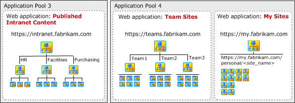
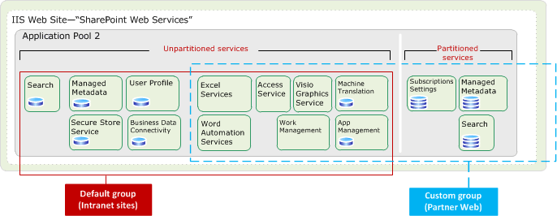
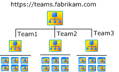
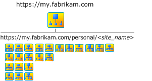

# SharePoint Server design samples: Corporate portal and extranet sites

[!INCLUDE[appliesto-2013-2016-2019-xxx-md](../includes/appliesto-2013-2016-2019-xxx-md.md)]
  
This article discusses several design samples that can be used as starting-point architectures for SharePoint sites. The design samples described in this article illustrate standard architectures for the most common types of SharePoint sites that are deployed within a company or organization. 
    
> [!IMPORTANT]
> The information in this article applies to SharePoint Foundation 2013 and SharePoint Server. However, the article discusses certain features, such as My Sites and enterprise search, that are not available in SharePoint Foundation 2013. 
  
## About the design samples

The following design samples are described in this article:
  
- [Corporate Portal with Path-based Sites](https://go.microsoft.com/fwlink/p/?LinkId=255238)
    
- [Corporate Portal with Host-named Sites](https://go.microsoft.com/fwlink/p/?LinkId=255239)
    
- [Extranet with Dedicated Zones for Authentication](https://go.microsoft.com/fwlink/p/?LinkId=255240)
    
The design samples illustrate sites for a fictitious company named Fabrikam, Inc. The design samples apply nearly all of the logical architecture components and illustrate how these are incorporated into the overall design. This article describes the design goals for the samples and explains how the logical architecture components illustrated in the samples achieved these goals. 
  
> [!NOTE]
> The models have SharePoint 2013 in the title, but still apply to SharePoint Server 2016 
  
### Corporate Portal design sample — two versions

Host-named site collections in SharePoint Server provide URL management and scalability of sites within a single web application. The two versions of the Corporate Portal design sample show implementations that are based on the use of the traditional path-based site collections or host-named site collections. Both of these design samples utilize claims-based authentication with a single zone. These samples are discussed in greater detail later in this article.
  
We recommend using the design based on host-named site collections unless requirements dictate that path-based sites with alternate access mapping are necessary (see [Host-named site collection architecture and deployment (SharePoint 2013)](host-named-site-collection-architecture-and-deployment.md), for more information). This design is recommended because it is the same architecture that the Office 365 environment uses. Consequently this is the most heavily tested configuration. New features, including the App model and Request Management, are optimized for this configuration, and it is the most reliable configuration going forward.
  
### Extranet with Dedicated Zones for Authentication

The Extranet with Dedicated Zones for Authentication design sample includes only the partner web site. It provides an alternate configuration for partner collaboration in which dedicated zones are used for each authentication method. Each design sample uses claims mode authentication for web applications. The difference between the Corporate Portal design samples and the Extranet Design sample is how the zones are configured. The Extranet with Dedicated Zones for Authentication design sample uses multiple zones, and one method of authentication is configured for each zone. The Corporate Portal design samples use one zone, and multiple authentication methods are configured for different classes of users. 
  
The Extranet with Dedicated Zones for Authentication design sample also introduces a new recommendation for remote employee access — Direct Access with Windows Server 2012. An alternative to this recommendation is to create a virtual private network (VPN). You can also use forms-based authentication on the firewall or gateway product to collect and forward credentials, if desired. 
  
### How site collections are implemented in the design samples

Whereas previous versions of the Corporate Portal design sample made use of path-based site collections, going forward host-named site collections are recommended unless requirements indicate that the traditional path-based sites with alternate access mapping (AAM) are necessary. This is reflected in the design samples in the following ways:
  
- Corporate Portal with Path-based Site Collections — This sample illustrates path-based site collections in the traditional way with sites organized into dedicated Web applications and a single top-level site collection per Web application. Use this approach if you want the additional security provided by multiple web apps with separate app pools. 
    
- Corporate Portal with Host-named Site Collections — This sample illustrates the use of host-named site collections with all sites deployed in a single Web application on the farm. This method is highly scalable and provides more flexibility in managing URLs.
    
- Extranet with Dedicated Zones for Authentication — This sample illustrates many top-level project sites with vanity URLs by using host-named sites for each project site (instead of organizing project sites underneath a top-level site collection). One advantage of using host-named site collections in this manner is creating additional isolation between domain URLs, which might be desired in a partner collaboration solution. However, the tradeoff of this approach is the additional costs of managing a greater number of host names, including managing SSL certificates. Also, if SAML authentication is used, additional configuration is required (see "Using SAML authentication with host-named sites" later in this article).
    
### Claims-based authentication for SharePoint Server

The way that authentication works in for SharePoint Server might influence design decisions that are related to implementing choices represented by these design samples. Here are some examples:
  
- In SharePoint Server, claims-based authentication is the default mode and the only option available through Central Administration. Classic-mode authentication can be implemented by using PowerShell.
    
- In SharePoint Server, you don't have to configure server affinity on the load balancer to use SAML claims authentication. SharePoint Server fully supports non-affinity load balancing.
    
In SharePoint Server the search crawl account requires access to content through the Default zone by using Integrated Windows authentication (NTLM or Kerberos). Because claims authentication allows multiple types of authentication in one zone, this requirement should not affect other authentication requirements.
  
### Summary of design sample features

The following table summarizes the three design samples that are discussed in this article.
  
**Table: Summary of design samples**

|**Design Sample**|**Includes**|**Key design elements**|
|:-----|:-----|:-----|
|Corporate Portal with Path-based Sites    |Most common types of sites deployed within an organization.    | Path-based site collections     Claims-based authentication     Multiple authentication providers and authentication types implemented in a single zone    |
|Corporate Portal with Host-names sites    |Most common types of sites deployed within an organization.    | Host-named site collections     Claims-based authentication     Multiple authentication providers and authentication types implemented in a single zone    |
|Extranet with Dedicated Zones for Authentication    |Only the partner web site. Provides an alternate configuration for partner collaboration.    | Host-named site collections     Claims-based authentication     Different zone for each authentication method    |
   
## Sites included in the design samples

This section describes the top-level sites that are included in the design samples.
  
### Intranet sites

The corporate portal includes the following sites for intranet use: 
  
- Published intranet content (such as HRweb)
    
- Collaborative team sites
    
- My Sites
    
Together, these are the content and collaboration sites that employees use on a day-to-day basis. Individually, each of these applications represents a distinct type of content. Each type of content has the following properties:
  
- Emphasizes different features of SharePoint Server.
    
- Hosts data with different data characteristics.
    
- Is subject to a different usage profile.
    
- Requires a different permissions management strategy.
    
Consequently, design choices for each of these applications are intended to optimize the performance and security for each application. 
  
The design of service applications brings these three applications together to provide the following features:
  
- Enterprise-wide search
    
- Shared profile data and enterprise metadata
    
The following illustration, from the Corporate Portal with Path-based Site Collections design sample, shows the three types of sites that make up the corporate intranet. 
  
**Types of sites that make up the corporate intranet**

  
### Partner web application

The partner web application hosts externally-available sites for secure collaboration with partner companies and individual partners. This application is intended for employees to easily create sites for secure collaboration. Partners cannot access other types of content that the server farm hosts. The design for zones and service applications addresses this goal. Additionally, individual site owners manage permissions for their sites and invite only necessary participants to collaborate.
  
In the extranet design sample, this is the only type of represented site. 
  
## Overall design goals

The design samples provide practical implementations of SharePoint Server features within several common types of sites. The design implementations for each of the individual applications are discussed in this article. Following are the key design goals for the design samples:
  
- Create a framework for designing an environment that can grow.
    
    Design decisions for individual types of sites do not prevent the addition of other types of sites. For example, an initial deployment might include only collaborative team sites or only the three types of sites that compose an intranet (team sites, My Sites, and published intranet content). If you use a similar logical architecture design, you can add sites to the solution without affecting the design of the initial solution. In other words, the design does not incorporate design choices that limit the use of the environment.
    
- Provide access for several groups of users without compromising the security of the content within the different types of sites.
    
    Users from different network zones (both internal and external) who use different authentication providers can participate in collaboration. Also, users can only access the content they are intended to access. If you follow a similar logical architecture design, you can provide access to users who are in multiple locations and have different objectives. For example, your initial design might be intended only for internal employee access. However, if you use a similar design, you can also enable access to remote employees, partner employees, partner companies, and customers.
    
- Ensure that the design can be used in an extranet environment.
    
    Make deliberate design choices to make sure that the solution can be securely deployed in a perimeter network.
    
The rest of this article discusses each of the logical components that appear in the design sample (from top to bottom) and discusses the design choices that are applied to the design sample. The purpose of this approach is to demonstrate the different ways in which logical architecture components can be configured based on the application.
  
## Server farms

This section describes the topologies of the server farms that are illustrated in the design sample and discusses scaling beyond a single farm.
  
### 

#### 

#### Topology of the server farms

Each server farm in the design sample is composed of six servers with the following fault-tolerant topology:
  
- Two front-end web servers
    
- Two application servers
    
- Two database servers with SQL Server installed and configured to support SQL Server clustering, mirroring, or AlwaysOn. AlwaysOn requires SQL Server 2012.
    
The concept of front-end and application server is different in SharePoint Server 2016, see [Overview of MinRole Server Roles in SharePoint Server](/sharepoint/install/overview-of-minrole-server-roles-in-sharepoint-server)
  
The design sample illustrates the logical architecture of SharePoint Server by showing that the following:
  
- All sites are mirrored across front-end web servers.
    
- The Central Administration site is installed on an application server to protect it from direct user access. 
    
In reality, the number of server computers and the topology of the server farm are important to the logical architecture only to increase capacity and improve performance. You can design the logical architecture independent of the server farm topology. The process of planning performance and capacity helps you plan the size the server farm to meet performance and capacity goals. For more information, see [Performance planning in SharePoint Server 2013](/SharePoint/administration/performance-planning-in-sharepoint-server-2013).
  
## Users, zones, and authentication

Claims is the default mode of authentication in SharePoint Server and each design sample incorporates claims-based authentication. You can use Windows PowerShell to implement classic-mode authentication; however, some features of SharePoint Server are not available in classic mode. For more information about design samples that incorporate classic-mode authentication, see [Design sample: Corporate deployment (SharePoint Server 2010)](/previous-versions/office/sharepoint-server-2010/cc261995(v=office.14))
  
The following table lists the differences in the two approaches that are represented by the Corporate Portal Design sample and the Extranet Design sample.
  
Table: Contrasting approaches for zone configurations in the design samples
  
||**Corporate Portal with Host-named sites and Corporate Portal with Path-based sites**|**Extranet with Dedicated Zones for Authentication**|
|:-----|:-----|:-----|
|Mode of authentication    |Claims    |Claims    |
|Zone configuration    |One zone with multiple authentication methods configured for different classes of users.    |Multiple zones with one method of authentication configured for each zone.    |
|URLs    |All classes of users use the same URL for each site. Employees use the same URL regardless of whether they are inside the corporate network or working remotely.    |Each class of user uses a different URL to access a site. Employees use a different URL depending on whether they are inside the corporate network or working remotely.    |
|Internal requests    |Requests that initiate inside the corporate network are routed out of the network and then back in through the gateway or proxy server. These requests are secured by using the Secure Sockets Layer (SSL) protocol.    Alternatively, split DNS can be used to route the requests directly to the internal interface for the servers.    |Requests that initiate inside the corporate network remain internal to the network.    |
|User experience    |All users are prompted to choose the type of account they are using to log in.    |The authentication method is predetermined. Users are not required to select the account type by using a logon page.    |
   
The following sections specifically discuss how authentication is incorporated by using the two different approaches.
  
### 

#### Extranet with dedicated zones design sample

The extranet design sample illustrates three different classes of users, and each is assigned to a different zone. Within each web application, you can create up to five zones by using one of the available zone names: Default, Intranet, Internet, Custom, or Extranet. The search crawl account requires access to the Default zone by using Integrated Windows authentication (NTLM or the Kerberos protocol), which is accounted for in the design sample. The following table shows how zones are set up in the extranet design sample.
  
**Table: Zones, users, and authentication type prescribed by the extranet design sample**

|**Zone**|**Users**|**Authentication**|
|:-----|:-----|:-----|
|Intranet    |Internal and remote employees    Search crawl account    |NTLM or Kerberos protocol    Remote employees who use Direct Access or VPN to connect.    |
|Default    |Individual partners    | Options:     LDAP directory using forms-based authentication     Externally-facing Active Directory Domain Services (AD DS) forest with a one-way trust to the internal forest and Integrated Windows authentication     Trusted identity provider with SAML authentication    |
|Extranet    |Partner companies    |Trusted partner identity provider with SAML authentication    |
   
#### Corporate Portal design samples

Claims-based authentication allows multiple types of authentication in the same zone. The two versions of the Corporate Portal design sample use the Default zone for all authentication types. 
  
The following table shows the zones, users, and authentication types that are prescribed by the design samples. 
  
**Table: Zones, users, and authentication for the corporate portal design samples**

|**Zone**|**Users**|**Provider and authentication type**|
|:-----|:-----|:-----|
|Default    |Internal and remote employees    |Active Directory Domain Services (AD DS) or LDAP store with forms-based authentication or SAML authentication.    |
|Default    |Individual partners    |Trusted identity provider with SAML authentication, or SQL Server database with forms-based authentication    |
|Default    |Partner companies    |Trusted partner identity provider with SAML authentication    |
|Default    |Search crawl account    |AD DS with Windows NTLM authentication    |
   
In the design sample, the Published Intranet Content site, Team Sites, and My Sites are only accessible to employees, whether they are inside or outside the network. The design sample implements only one URL (using SSL) for each of these sites that can be used both internally and externally. AD DS accounts are used. If needed, forms-based authentication or SAML can use LDAP, which requires additional configuration.
  
In the design sample, the partner web application represents an extranet site that partner employees and partner companies can access. Claims-based authentication in this scenario requires you to configure trust with one or more external identity providers. You can use either one of the following approaches:
  
- You can configure the SharePoint farm to trust an external identity provider, such as the provider that resides in a partner company (to authenticate directly against the partner directory).
    
- You can configure the identity provider inside the corporate environment to trust an external identity provider. Administrators in the two organizations must establish this relationship explicitly. In this scenario, the SharePoint farm trusts the identity provider from within its own corporate environment. When the identity provider sends a token, the farm uses the token signing certificate that was specified when the trust was established to confirm the validity of the token. We recommend this approach.
    
Forms-based authentication is an alternative to a claims-based environment to authenticate partners. You use a separate store, such as a database, to manage these accounts.
  
#### Zones

When you design zones, several key decisions are critical to the success of the deployment. These decisions include design and configuration decisions for the following zones:
  
- The Default zone
    
- Zones for external access
    
The following sections describe the decisions that are incorporated in the design sample.
  
#### Configuration requirements of the default zone

The zone that involves the greatest consideration is the Default zone. SharePoint Server places the following requirements on how you configure the Default zone:
  
- When a user request cannot be associated with a zone, the authentication and policies of the Default zone are applied. Consequently, the Default zone must be the most secure zone.
    
- Administrative e-mail messages include links from the Default zone. These include messages to owners of sites that are approaching quota limits. Consequently, users who receive these kinds of messages and alerts must be able to access links through the Default zone. This is especially important for site owners.
    
In SharePoint Server host-named site collections can be access from any zone.
  
#### Configuring zones for an extranet environment

In an extranet environment, the design of zones is critical for the following two reasons:
  
- Several different networks can initiate user requests. In the design samples, users initiate requests from the internal network, the Internet, and partner companies.
    
- Users consume content across multiple web applications. In the design sample, the intranet is composed of three web applications. Additionally, internal and remote employees can potentially contribute to and administer content in the partner web application.
    
If an extranet environment includes more than one zone, ensure that you follow these design principles:
  
- Configure zones across multiple web applications to mirror each other. The configuration of authentication and the intended users should be the same. However, policies that are associated with zones can differ across web applications. For example, make sure that you use the Intranet zone for the same employees across all web applications. In other words, do not configure the Intranet zone for internal employees in one web application and remote employees in another.
    
- If you use path-based site collections, configure alternate access mappings appropriately and accurately for each zone and each resource. Alternate access mappings are automatically created when you create a zone. However, you can configure SharePoint Server to crawl content in external resources, such as a file share. You must create links to these external resources manually for each zone by using alternate access mappings. 
    
- If you use host-named site collections, make sure that you use PowerShell to map URLs to the appropriate zones 
    
If zones across Web applications do not mirror each other and links to external resources are not appropriate, the following risks can occur:
  
- Server names, Domain Name System (DNS) names, and IP addresses can potentially be exposed outside the internal network.
    
- Users might be unable to access Web sites and other resources.
    
#### Using SAML authentication with host-named sites

If a design includes the use of SAML authentication with host-named sites, each vanity URL requires the following:
  
- A new realm on the **SPTrustedIdentityTokenIssuer**
    
- A corresponding relying party in the Identity Provider.
    
## Services

The service architectures vary depending on the design sample. The Corporate Portal with Host-named Sites design sample includes the simplest architecture for services. This is because it uses one web application, which can accommodate only one service application group (also known as proxy group). 
  
The Corporate Portal with Path-based Sites example uses partitioned services for the Partner sites to isolate data between projects. This design sample incorporates two service groups, one for the intranet sites and one for the partner collaboration sites. Separate instances of Managed Metadata and Search are deployed for the Partner sites and these services are partitioned. Partitioned services require the Subscription Settings Service which can only be deployed by using PowerShell.
  
**Service architecture for the Corporate Portal with Path-based Sites**

  
Deploying partitioned services adds complexity to the architecture and makes it difficult to migrate sites to Office 365 at a later time. A simpler option for the Partner sites is to deploy dedicated but unpartitioned instances of the Managed Metadata service and Search service if these are required to be separate. Many organizations rely on the security trimming feature of Search, rather than deploying dedicated instances of the Search service.
  
The Extranet design sample includes only one proxy group but it also uses partitioned services for both the Managed Metadata and Search service applications.
  
The primary design decision for deploying service applications is how broadly to spread the organization taxonomy. To simplify the services architecture, share Managed Metadata, User Profile, and Search across all web apps and rely on security trimming to manage access to content. In the Corporate Portal with Path-based Sites design sample, one instance of the Managed Metadata service is shared across all sites. However, all users can access to the corporate taxonomy with this configuration. Solution architects must decide whether to implement multiple instances of the Managed Metadata service. They'll also need to decide how broadly to share the User Profile data.
  
Within the Corporate Portal with Path-based Site Collections sample, partner web is configured to use dedicated Search and Managed Metadata service applications by using a custom service group. Other service applications are added to the custom group and these are shared with the default group. The design sample does not include the User Profile service application to prevent partner users from browsing people data in the organization. 
  
In the simplified architecture of the Corporate Portal with Host-named Site Collections (one service group), partners can access the entire corporate taxonomy and can browse people data in the organization. However, search limits results to sites and content that partners can access.
  
If your partner sites require content isolation between projects, deploying dedicated service applications is a good choice, as illustrated in this article. This increases the complexity of the services architecture but ensures that partners cannot access metadata that is associated with the Intranet content or even other projects within the partner web site. The Extranet design sample also uses partitioned services.
  
## Administration sites

In the design sample, an application server hosts the SharePoint Central Administration website for each server farm. This protects the site from direct user contact. If a performance bottleneck or security compromise affects the availability of the front-end web servers, the SharePoint Central Administration website remains available.
  
The design sample and this article do not mention the load-balanced URLs for administration sites. Recommendations include the following:
  
- If administrative URLs use port numbers, use non-standard ports. URLs include port numbers by default. While customer-facing URLs typically do not include port numbers, using port numbers for administration sites can increase security by limiting access to these sites to non-standard ports.
    
- Create separate DNS entries for administration sites.
    
In addition to these recommendations, you can optionally load-balance the SharePoint Central Administration website across multiple application servers to achieve redundancy. 
  
## Application pools

Separate Internet Information Services (IIS) application pools are typically implemented to achieve process isolation between content. Application pools provide a way for multiple sites to run on the same server computer but still have their own worker processes and identity. This helps to prevent an attacker who injects code on one site from affecting other servers or sites on other sites.
  
If a single application pool and web application is used together with host-named site collections, isolation is provided between domain URLs but only at the scripting level.
  
If you choose to implement more than one application pool, consider a dedicated application pool for each of the following scenarios:
  
- To separate authenticated content from anonymous content. If the same farm hosts the company Internet site, place this site in a dedicated web application and application pool.
    
- To isolate sites that store passwords for and interact with backend data systems (although the Secure Store Service can be used for this purpose instead).
    
The Corporate Portal with host-named sites design sample and the Extranet with Dedicated Zones for Authentication design sample both implement a single application pool and web application for all content. Separate application pools are required for service applications and the SharePoint Central Administration website.
  
The Corporate Portal with Path-based Sites design sample implements process isolation between content by using separate application pools in the following ways:
  
- The administration site is hosted in a dedicated application pool. This is a requirement of SharePoint Server.
    
- All service applications are deployed to a single application pool. Unless there is a compelling reason to deploy service applications to different application pools, this is the recommended configuration. One application pool for all service applications optimizes performance and reduces the number of application pools to manage. 
    
- Intranet content is divided into two different application pools. One application pool hosts collaborative content (My Sites and team sites). A separate application pool hosts the published intranet content. This configuration provides process isolation for the published intranet content in which business data connections are more likely to be used.
    
- A dedicated application pool hosts the partner web application.
    
## Web applications

A web application is an IIS web site that SharePoint Server creates and uses. Each Web application is represented by a different Web site in IIS.
  
If you choose to implement more than one web application, consider the following use cases:
  
- **Separate anonymous content from authenticated content.**
    
    If the same farm hosts the company Internet site, place this site in a dedicated web application and application pool.
    
- **Isolate users**
    
    In the design sample, a dedicated web application and application pool hosts the partner web site to make sure that partners do not have access to the intranet content.
    
- **Enforce permissions**
    
    A dedicated web application provides the opportunity to implement policies on the zones within the web application to enforce permissions. For example, you can create policies for the company Internet site to explicitly deny write access to one or more groups of users. Policies are enforced regardless of permissions that are configured on individual sites or documents in the web application.
    
- **Optimize performance**
    
    Applications achieve better performance if you place them in web applications with other applications of similar data characteristics. For example, the data characteristics of My Sites include a large number of sites that are small in size. In contrast, team sites typically encompass a smaller number of very large sites. By placing these two different types of sites in separate web applications, the resulting databases are composed of data with similar characteristics, which optimizes database performance. In the design sample, My Sites and team sites do not have unique data isolation requirements—they share the same application pool. Nonetheless, My Sites and team sites are placed in separate web applications to optimize performance.
    
- **Optimize manageability**
    
    Because creating separate Web applications results in separate sites and databases, you can implement different site limits (recycle bin, expiration, and size) and negotiate different service-level agreements. For example, you might allow more time to restore My Site content if this is not the most critical type of content within your organization. This enables you to restore more critical content before you restore My Site content. In the design sample, My Sites are in a separate web application to enable administrators to more aggressively manage growth compared to other applications.
    
If you implement host-named site collections with a single web application, each top-level site is a separate domain which enables you to achieve some of these goals, such as optimizing manageability by implementing different site limits.
  
## Site collections

The recommended configuration for deploying sites is using host-named site collections with all sites located within a single web application. This configuration is recommended to deploy sites because it is the same architecture that the Office 365 environment uses. Consequently this is the most heavily tested configuration. New features, including the App model and Request Management, are optimized for this configuration, and it is the most reliable configuration going forward.
  
Although we recommend host-named site collections for most architectures, you should use the traditional path-based site collections and alternate access mapping if any of the following conditions apply:
  
- You need to use the Self Service Site Creation feature that is part of the default installation of SharePoint Server 2016.
    
    This does not apply to custom self-service site creation solutions.
    
- A web application requires unique wild card inclusions or explicit inclusions.
    
    You create inclusions for host-named site collections at the farm level, and they are available for all host-named sites. All host-named site collections in a farm share the same inclusions but do not need to use them. In contrast, inclusions that you create for path-based site collections apply only to a single web application.
    
- SSL termination is required but your SSL termination device cannot be configured to produce the necessary custom HTTP header.
    
    You can still use SSL bridging with host-named site collections with these devices if SSL termination is not a requirement.
    
- You plan to use different application pools for the additional security that these provide or you need to use multiple proxy groups.
    
For more information about host-named site collections, including a comparison with path-based site collections, see [Host-named site collection architecture and deployment (SharePoint 2013)](host-named-site-collection-architecture-and-deployment.md).
  
### 

#### 

#### Design goals for site collections

Site collections bridge logical architecture and information architecture. The design goals for site collections are to fulfill requirements for URL design and to create logical divisions of content. For each site collection, managed paths incorporate a second tier of top-level site collections. For more information about URL requirements and using managed paths, see [Zones and URLs](#section12) later in this article. Beyond the second tier of site collections, each site is a subsite. 
  
The following diagram illustrates the site hierarchy of Team Sites.
  
**Site hierarchy for team sites**

  
For both path-based site collections and host-named collections, the information architecture revolves around the second tier of site collections. The following section describes how design samples incorporate choices based on the nature of the sites.
  
#### Published intranet content

The assumption for the published intranet content web application is that multiple divisions within the company will host published content. In the design sample, a separate site collection hosts each division's content. This provides the following advantages:
  
- Each division can manage content and administer permissions independently.
    
- Each division can store its content in a dedicated database.
    
The disadvantages of multiple site collections include the following:
  
- You cannot share master pages, page layouts, templates, Web Parts, and navigation be across site collections. 
    
- Coordination of customizations and navigation across site collections requires more effort.
    
Depending on the information architecture and design of the intranet sites together, the published content can appear to the user as a seamless experience. Alternatively, each site collection can appear to be a separate web site. 
  
#### My Sites

My Sites have distinct characteristics and the deployment recommendations for My Sites are straightforward. In the design samples, the My Sites site collection incorporates a top-level site with the URL of http://my. The first top-level site collection that is created uses the My Site Host template. A managed path is incorporated (by using wildcard inclusion), which allows an indefinite number of user-created sites. All sites below the managed path are independent site collections that use the Personal Site template. The user name is appended to the URL in the form http://my personal/ _username_. The following illustration illustrates My Sites. 
  
**Site hierarchy for My Sites**

  
#### Team sites

You can use either of the following two approaches to design site collections in a Team Site application:
  
- Allow teams to create site collections through self-service site creation. The advantage of this approach is that teams can easily create a site, as needed, without assistance from an administrator. Disadvantages to this approach include the following:
    
  - You lose the opportunity to implement a thoughtful taxonomy.
    
  - You cannot share templates and navigation across projects or teams that might otherwise share a site collection.
    
- Create a finite number of site collections for your organization based on the way your organization operates. In this approach, a SharePoint administrator creates site collections. After a site collection is created, teams can create sites within the site collection. This approach provides the opportunity to implement a thoughtful taxonomy that provides structure to the way team sites are managed and grow. There is also more opportunity to share templates and navigation between projects and teams that share a site collection. However, this approach also includes some disadvantages.
    
The design samples incorporate the second approach, which results in a similar site collection hierarchy for team sites and published intranet content. The challenge for information architects is to create a second tier of site collections that makes sense for the organization. The following table suggests different types of organizations.
  
**Table: Suggested site collection taxonomies**

|**Type of organization**|**Suggested site collection taxonomies**|
|:-----|:-----|
|Product development    | Create a site collection for each product under development. Allow contributing teams to create sites within the site collection.     For each long-term development project, create a site collection for each large team that contributes to the product. For example, create one site collection for each of the following teams: designers, engineers, and content developers.    |
|Research    | Create a site collection for each long-term research project.     Create a site collection for each category of research projects.    |
|Higher education institution    | Create a site collection for each academic department.    |
|State legislative office    | Create a site collection for each political party. Government officials who share party affiliation can share templates and navigation.     Create a site collection for each committee. Or, create one site collection for all committees.    |
|Corporate law office    | Create a site collection for each corporate client.    |
|Manufacturing    | Create a site collection for each line of products.    |
   
#### Partner web application

Partner web is intended to be used for collaboration with external partners on projects that have finite scopes or finite durations. By design, sites in the partner web application are not intended to be related. The requirements for the partner web application include ensuring that:
  
- Project owners can easily create sites for partner collaboration.
    
- Partners and other contributors can access only the project they work on.
    
- Site owners manage permissions.
    
- Search results from within one project do not expose content from other projects.
    
- Administrators can easily identify sites that are no longer used and delete these sites.
    
To satisfy these requirements, the design sample incorporates a site collection for each project. Both Corporate Portal design samples utilize a managed path to create a second tier of site collections below a root site collection. Alternatively, the Extranet design sample makes each partner site a top-level site collection by using host-named site collections. Either way, individual site collections provide the appropriate level of isolation between projects.
  
If you plan to use the Self Service Site Creation feature that is part of the default installation of SharePoint Server (as opposed to a custom solution developed for your organization), then use path-based site collections. Host-named site collections do not yet work with this feature.
  
## Content databases

You can use the following two approaches to incorporate content databases into the design (the design sample incorporates both approaches):
  
- Establish target sizes for content databases with appropriate size-warning thresholds. Create a new database when a database reaches size-warning thresholds. With this approach, site collections are automatically added to the available database or databases, based on size targets alone. This is the most commonly used approach.
    
- Associate site collections to specific content databases. This approach enables you to place one or more site collections in a dedicated database that administrators can manage independently from the rest. 
    
If you choose to associate site collections to specific content databases, you can use the following methods to accomplish this:
  
- Use PowerShell to create a site collection in a specific database.
    
- Dedicate a database to a single site collection by applying the following database capacity settings:
    
  - Number of sites before a warning event is generated = 1
    
  - Maximum number of sites that can be created in this database = 1
    
- Add a group of site collections to a dedicated database by completing the following steps:
    
1. Within the web application, create the database and set the database status to **Ready**.
    
2. Set the status of all other databases to **Offline**. While content databases are offline, new site collections cannot be created. However, existing site collections in offline databases are still accessible for both read and write operations.
    
3. Create the site collections. They are automatically added to the database.
    
4. Set the status of all other databases back to **Ready**.
    
### 

#### 

#### Published intranet content

For published intranet content, the corporate portal design samples incorporate a single database for ease of management. Add databases based on target size goals, if needed. 
  
#### My Sites

For My Sites, the corporate portal design samples achieve scale efficiency by managing databases to the maximum target size. The following settings are configured to achieve this goal:
  
- **Limit site storage to a maximum of**: This setting, which you configure on the **Quota Templates** page in Central Administration, limits the size of a personal site. 
    
- **Second stage Recycle Bin**: This setting, which you configure on the **Web Application General Settings** page, determines the amount of additional space that is allocated to the second-stage recycle bin. 
    
- **Maximum number of sites that can be created in this database**: This setting is configured when you create a database. Calculate the total allowable size of sites by using the numbers you specify for the previous two values. Then, based on the size goal for each database, determine how many sites will fit in the database. 
    
The design samples provide the following example size settings based on a target database size of 175 gigabytes (GB) and a target My Site size of 1 GB:
  
- Site size limits per site = 1 GB
    
- Target size of database = 175 GB
    
- Reserved for second-stage recycle bin = 15%
    
- Maximum number of sites = 180
    
- Site level warning = 150
    
When the site-level warning is reached, create a new database. After you create the new database, new My Sites are added to the content database that has the fewest site collections.
  
#### Team sites

Team sites for most organizations are expected to be much larger than My Sites. Team sites are created under a managed path, allowing one content database per team site collection. The design sample provides database settings based on a 30-GB limit for site collections. Choose a limit that is appropriate for team sites in your organization. 
  
#### Partner web

Similar to My Sites, partner web achieves scale efficiency by managing databases to the maximum target size. 
  
The design samples provide the following example size settings:
  
- Target size of database = 200 GB
    
- Storage quota per site = 5 GB
    
- Maximum number of sites = 40
    
- Authoring site collection hosted in dedicated database
    
## Zones and URLs

The design samples illustrate how to coordinate URLs across multiple sites within a corporate deployment. The following goals influence design decisions for URLs:
  
- URL conventions do not limit the zones through users can access content.
    
- The standard HTTP and HTTPS ports (80 and 443) can be used across all applications in the design sample.
    
- Port numbers are not included in URLs. In practice, port numbers are typically not used in production environments.
    
### 

#### Designing load-balanced URLs

When you create a web application, you must choose a load-balanced URL to assign to the application. The URL that you choose applies to the Default zone. Additionally, you must create a load-balanced URL for each additional zone that you create within a web application. The load-balanced URL includes the protocol, scheme, hostname, and port, if used. The load-balanced URL must be unique across all web applications and zones. Consequently, each web application and each zone within each web application requires a unique URL across the design sample.
  
#### Intranet

Each of the three site collections that make up the intranet requires a unique URL. In Corporate Portal design samples, the target audience for the intranet content is internal employees and remote employees. Employees use the same URLs for each of these sites regardless of whether they are on site or remote. This approach adds a layer of security to the SharePoint design (all traffic is SSL). However, this approach requires you to choose an alternative for additional configuration: 
  
- Route internal traffic through the firewall or gateway product along with remote traffic.
    
- Set up a split DNS environment to resolve internal requests within the internal network.
    
#### Partner web site

In the design samples, internal employees, remote employees, and partner employees access the partner web site. In the Corporate Portal design samples, all users enter the same URL regardless of the authentication method. In the Extranet design sample, each different type of user enters a different URL. Although both individual partners and partner companies use SSL (HTTPS) to access the partner web site externally, each group requires a different URL to apply the benefits of separate zones—that is, different authentication methods and different zone policies. 
  
Because the Extranet design sample uses Direct Access or VPN for remote employee access, both remote employees and internal employees use the same URLs. If access for remote employees is configured through a reverse proxy device, remote employees would require a separate URL using SSL, requiring an additional zone. Finally, the Extranet design sample incorporates host-named site collections instead of a single top-level site collection. Consequently, each project site has a different URL. 
  
The following table shows example URLs that internal employees, remote employees, and partners use to access the partner web site, as shown in the Extranet design sample.
  
**Table: Example URLs from the Extranet design sample**

|**Zone**|**Example URL**|
|:-----|:-----|
|Internal and remote employees    |http://project1    |
|Individual partners    |https://project2.fabrikam.com    |
|Partner companies    |https://TrustedPartnerProject1.fabrikam.com    |
   
#### Using explicit and wildcard inclusions for URL paths

Managed paths enable you to specify the paths in the URL namespace of a web application that are used for site collections. You can specify that one site collection or more than one site collection exists at a distinct path below the root site. Without managed paths, all sites below the root site collection are part of the root site collection.
  
You can create the following two types of managed paths: 
  
- **Explicit inclusion**: A site collection with the explicit URL that you assign. An explicit inclusion is applied to only one site collection. You can create many explicit inclusions below a root site collection. . An example URL for a site collection created by using this method is http://intranet/hr. There is a performance impact for every explicit path added so the recommendation is to limit the number of site collections created with an explicit inclusion to about 20.
    
- **Wildcard inclusion**: A path that is added to the URL. This path indicates that all sites that are specified directly after the path name are unique site collections. This option is typically used for site collections that support self-site creation, such as My Sites. An example URL for a site collection that is created by using this method is http://my/personal/user1.
    
When managed paths for host-named site collections are implemented, these managed paths are created at the farm level and paths apply across all web applications, if multiple web applications are included in the solution. When managed paths for path-based sites are implemented, these managed paths apply only to the Web application in which they were created. 
  
The design sample incorporates the use of both types of managed paths (explicit inclusions and wildcard inclusions, as described in the following sections.
  
#### Explicit inclusions: Published intranet content

In the design samples, the published intranet site collection incorporates explicit inclusions for each subsite, for example, HR, Facilities, and Purchasing. Each of these site collections can be associated with a different content database, if needed. Unless host-named site collections are used, the use of explicit inclusions in this example assumes that no other types of sites are created in the web application, including wildcard inclusions.
  
The use of explicit inclusions results in the URLs:
  
- https://intranet.fabrikam.com
    
- https://intranet.fabrikam.com/hr
    
- https://intranet.fabrikam.com/facilities
    
- https://intranet.fabrikam.com/purchasing
    
In this example, the root site collection, http://intranet.fabrikam.com, represents the default home page for the intranet. This site is intended to host content for users.
  
#### Wildcard inclusions: Team Sites, My Sites, and Partner Web

Team Sites, My Sites, and the partner web application incorporate the use of a wildcard inclusion. Wildcard inclusions are ideal for applications that allow users to create their own site collections and for web applications that include many site collections. A wildcard inclusion indicates that the next item after the wildcard is a root site of a site collection.
  
#### Team sites

Within the Team Sites application, wildcard inclusion is used for each team site collection. Good governance practices recommend that you keep the number of top-level team sites within a manageable number. Also, the taxonomy for team sites should be logical for the way your business operates. 
  
The use of wildcard inclusions results in the URLs: 
  
- https://teams.fabrikam.com/sites/Team1
    
- https://teams.fabrikam.com/sites/Team2
    
- https://teams.fabrikam.com/sites/Team3
    
In this example, the root site collection, https://teams.fabrikam.com, does not necessarily host content for users.
  
#### My Sites

My Sites offer self-service site creation. When a user who browses the intranet first clicks **My Site**, a My Site is automatically created for the user. In the design sample, My Sites include a wildcard inclusion named /personal (http://my/personal). The My Site feature automatically appends the user name to the URL. 
  
This results in URLs of the format:
  
- https://my.fabrikam.com/personal/User1
    
- https://my.fabrikam.com/personal/User2
    
- https://my.fabrikam.com/personal/User3
    
#### Partner web

If path-based site collections are used, you can implement the self-service site creation feature to allow employees to create secure sites for collaboration with external partners. If host-named site collections are used, you can implement a custom self-service site creation feature or administrators can create partner project sites by request.
  
In Corporate Portal design samples, the partner web application includes a wildcard inclusion named /sites (http://partnerweb/sites). This results in URLs of the following format:
  
- https://partnerweb.fabrikam.com/sites/Project1
    
- https://partnerweb.fabrikam.com/sites/Project2
    
- https://partnerweb.fabrikam.com/sites/Project3
    
#### Coordinating URLs with AAM and DNS

If path-based site collections are implemented, configure alternate access mappings (AAM) for each site URL in the farm. This makes sure that web requests are mapped to the correct site, especially in environments that use load balancing or reverse proxy technologies.
  
Single-name URLs, such as http://teams, can be configured for intranet access. A client computer resolves these URLs by appending the DNS suffix of the client computer, such as fabrikam.com, and then issuing a DNS lookup for the name with the suffix. For example, when a client computer in the fabrikam.com domain requests http://teams, the computer sends a request to DNS for http://teams.fabrikam.com.
  
DNS must be configured to use an A record, or AAAA for IPv6, for each fully qualified domain name (FQDN). The record points to the load-balanced IP address for the web servers that host a site. In a typical production deployment, servers are configured to use statically assigned IP addresses, in addition to statically assigned A or AAAA records in DNS.
  
After a client browser receives the load-balanced IP address, the client browser connects to a front-end web server in the farm, and then sends an HTTP request that has the original single-name URL, http://teams. IIS and SharePoint Server recognize this as a request for the Intranet zone, based on the settings that are configured in alternate access mappings. If a user instead requests https://teams.fabrikam.com, the process is similar, but IIS and SharePoint Server receive this FQDN instead, and therefore recognize this request for the Default zone.
  
In environments that have multiple domains, enter CNAME records for DNS in the domains that the sites do not reside in. For example, if the Fabrikam network environment includes a second domain named europe.fabrikam.com, CNAME records are entered for these sites in the Europe domain. For the Team Sites intranet site (http://teams), a CNAME record named teams is added to the europe.fabrikam.com domain that points to teams.fabrikam.com. Then, when a client computer's DNS suffix is appended to DNS lookup requests, a request for http://teams from the Europe domain will issue a DNS lookup of teams.europe.fabrikam.com, and will be directed by the CNAME record to teams.fabrikam.com.
  
> [!NOTE]
> There is a known issue with some clients that use Kerberos authentication and resolving CNAME records. For more information, see [Kerberos configuration known issues (SharePoint Server 2010)](/previous-versions/office/sharepoint-server-2010/gg502606(v=office.14)). 
  
## Zone policies

You can configure policies for one or more zones to enforce permissions for all content within a web application. In claims mode, a policy can be defined only for a specific zone (not for the web application in general). A policy enforces permissions on all content that users access through a zone. Policy permissions override all other security settings that are configured for sites and content. You can configure policy based on users or user groups, but not SharePoint groups. If you add or change a zone policy, search must crawl sites again to apply the new permissions.
  
The design samples do not use policies because either multiple types of authentication are enabled on a single zone or all sites are contained within on web application (or both). 
  

