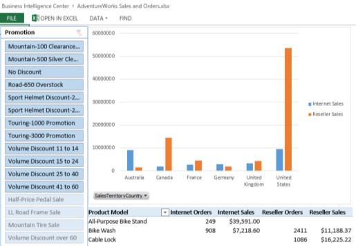
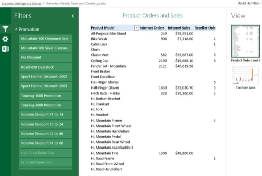

# Create an Excel Services dashboard using a Data Model (SharePoint Server 2013)

[!INCLUDE[appliesto-2013-xxx-xxx-xxx-md](../includes/appliesto-2013-xxx-xxx-xxx-md.md)]
  
This article describes, step by step, how to create a Data Model, how to create some reports and a slicer, and then how to publish the dashboard to SharePoint Server 2013. The example dashboard described in this article resembles the following image:
  
**Figure: Basic dashboard example**

  
This article also covers different display options that you can use when you publish a workbook. By following the steps in this article, you'll learn how to create and configure reports in a worksheet and connect a slicer to those reports.
  
    
## Before you begin

Before you begin this operation, review the following information about prerequisites:
  
- Excel must be installed on the computer that you are using to create and publish the dashboard.
    
- This scenario uses Adventure Works sample data and a Business Intelligence Center site in SharePoint Server 2013. If you do not have the sample data and a Business Intelligence Center site, have an IT administrator configure them for you using the instructions in [Configure AdventureWorks for Business Intelligence solutions](configure-adventureworks.md).
    
- Excel Services must be configured to support Data Models in the SharePoint environment that you are using. For information about how to deploy Excel Services, see [Configure Excel Services in SharePoint Server 2013](/SharePoint/administration/configure-excel-services) and [Manage Excel Services data model settings (SharePoint Server 2013)](manage-excel-services-data-model-settings.md).
    
- You must have some information about what authentication settings are used for Excel Services. For example, if your organization is using Secure Store Service, you will need the Secure Store target application ID for Excel Services data access. 
    
    For information about how to configure Secure Store, see [Plan the Secure Store Service in SharePoint Server](/previous-versions/office/sharepoint-server-2010/ee806889(v=office.14)) and [Configure the Secure Store Service in SharePoint Server](configure-the-secure-store-service.md).
    
## Plan the dashboard

Before you begin to create a dashboard, we recommend that you create a dashboard plan. The plan does not have to be extensive or complex. However, it should give you an idea of what you want to include in the dashboard. To help you prepare a dashboard plan, consider questions such as the following:
  
- Who will use the dashboard?
    
- What kinds of information do they want to see?
    
- Does data exist that you can use to create the dashboard?
    
Our example dashboard is designed to be a prototype that you can use to learn how to create and publish Excel Services dashboards. To show how we might create a dashboard plan for a similar dashboard, see the following table.
  
**Table: Basic plan for our example dashboard**

|**Question**|**Response**|
|:-----|:-----|
|Who will use the dashboard?    |The dashboard is intended for use by sales representatives, sales managers, corporate executives, and other stakeholders who are interested in sales information for the fictitious company Adventure Works Cycles.    |
|How will the dashboard be used? That is, what kinds of information do the dashboard consumers want to see?    | Sales representatives, managers, executives, and other dashboard consumers want to use the dashboard to view, explore, and analyze data. At a minimum, the dashboard consumers want to see the following kinds of information:     Sales amounts across different sales territories at the country level     Order quantities for products in the Internet and reseller sales channels     Order quantities and sales amounts for various promotions the company held     Dashboard consumers want to use the dashboard to view, explore, and analyze data to obtain answers to specific questions.     The dashboard consumers also want to be able to use a filter to focus on more specific information, such as how many orders and how much sales were generated from different promotions.    |
|Does data exist that we can use to create the dashboard?    |The Adventure Works sample database contains the data that we want to use for the dashboard. The sample database contains lots of tables. We can easily create a Data Model in Excel that will enable us to create reports using multiple tables as a single data source. This will enable us to create interactive reports that dashboard users can use to explore data by viewing different levels of detail.    |
|What items should the dashboard contain?    | Our example dashboard includes the following items:     A Data Model that includes several tables that are stored in SQL Server.     A report showing product sales information across different countries     A report showing orders and sales information for different products     A filter that dashboard consumers can use to view information for a particular promotion    |
   
Now that we have created our dashboard plan, we can begin to create the dashboard.
  
## Create the dashboard

To create the dashboard, we begin by creating the Data Model. Then, we use that Data Model to create the reports and the filter that we want to use. After that, we publish the workbook to SharePoint Server 2013.
  
### Part 1: Create a Data Model

Our example dashboard uses a Data Model that consists of five tables that are stored in SQL Server. 
  
 **To create a Data Model**
  
1. Open Excel.
    
2. Choose **Blank workbook** to create a workbook. 
    
3. On the **Data** tab, choose **Get External Data** group, choose **From Other Sources**, and then choose **From SQL Server**.
    
    The Data Connection Wizard opens.
    
4. In the **Data Connection Wizard**, in the **Server name** box, specify the name of the server where the Adventure Works sample dataset is stored. 
    
5. In the **Select Database and Table** dialog box, in the **Select the database that contains the data that you want** list, choose **AdventureWorksDW2012**.
    
6. Select both **Connect to a specific table** and **Enable section of multiple tables**, and then select the following tables:
    
  - **DimProduct**
    
  - **DimPromotion**
    
  - **DimSalesTerritory**
    
  - **FactInternetSales**
    
  - **FactResellerSales**
    
7. Verify that **Import relationships between tables is selected**, and then click **Next**.
    
8. In the **Save Connection and Finish** dialog box, next to **Excel Services**, click **Authentication Settings**.
    
9. In the **Excel Services Authentication Settings** dialog box, take one of the following steps: 
    
  - If Excel Services is configured to use Secure Store Service, select **Use a stored account**. In the **Application ID** box, specify the Secure Store target application ID, and then choose the **OK** button. 
    
  - If Excel Services is configured to use the unattended service account, select **None**, and then choose the **OK** button. 
    
    > [!IMPORTANT]
    > If you do not know which option to choose, contact a SharePoint administrator. 
  
10. Do not click **Finish** yet. In the **Save Data Connection File and Finish** dialog box, click **Browse**.
    
11. Type the address of the Business Intelligence Center site that you are using. The address typically takes the form http://servername/sites/bicenter.
    
12. Double-click **Data Connections**, and then click **Save**.
    
13. Click **Finish**. A Data Connections dialog box appears.
    
14. In the **Data Connections** dialog box, take the following steps: 
    
1. In the **Title** box, specify a title, such as Adventure Works Data Model.
    
2. In the **Description** box, specify a description for the Data Model. 
    
3. In the **Keywords** box, specify some words and phrases, such as **Adventure Works** and **Data Model**.
    
4. Click **OK** to close the Data Connections dialog box. 
    
15. On the **Import Data** dialog box, choose **Only Create Connection**. Make sure the **Add this data to the Data Model** is selected, and then click **OK**. The Data Model is created and saved in the Data Connections library in the Business Intelligence Center site.
    
    Keep the workbook open.
    
At this point, we have used Excel to create and upload an Adventure Works Data Model that uses five tables that are stored in SQL Server. 
  
The next step is to create reports for the dashboard. 
  
### Part 2: Create reports

For our example dashboard, we'll create two reports, as described in the following table:
  
**Table: Dashboard reports**

|**Report Type**|**Report Name**|**Description**|
|:-----|:-----|:-----|
|PivotChart report    |Territory Sales    |Bar chart report that shows sales amounts across different countries.    |
|PivotTable report    |Product Orders and Sales    |Table that shows order quantities and sales amounts for products across the Internet and Reseller channels.    |
   
We begin by creating the Territory Sales report.
  
 **To create the Territory Sales report**
  
1. In Excel, on the **Insert** tab, click **PivotChart**.
    
2. In the **Create PivotChart** dialog box, select **Use an external data source**, and then click **Choose Connection**.
    
3. In the **Existing Connections** dialog box, on the **Tables** tab, select **Tables in Workbook Data Model**, and then click **Open**.
    
4. In the **Create PivotChart** dialog box, choose **Existing Worksheet**, and then click **OK**. **Chart 1** opens for editing. In the PivotChart Fields section, notice the five tables that you selected for the Data Model are listed. 
    
5. Expand **DimSalesTerritory**, and then select **SalesTerritoryCountry**.
    
6. Expand **FactInternetSales**, and then select **SalesAmount**. The chart updates to show sales amounts across different countries.
    
7. Notice that the chart legend says **Total**, which is not necessarily useful information. To change that, follow these steps:
    
1. In the **PivotChart Fields** section, in the **Values** field well, click **Sum of SalesAmount**, and then click **Value Field Settings**.
    
2. In the **Value Field Settings** dialog box, in the **Custom Name** box, type **Internet Sales**, and then click **OK**. The chart does not seem to have changed at this point, but you will see the changes after you complete the next step.
    
8. In the **PivotChart Fields** section, expand **FactResellerSales**, and then select **SalesAmount**. The chart updates to show two sets of bars representing sales amounts across different countries.
    
9. To change how the sales amount information for the reseller channel is represented in the chart legend, follow these steps:
    
1. In the **PivotChart Fields** section, in the **Values** field well, click **Sum of SalesAmount**, and then click **Value Field Settings**.
    
2. In the **Value Field Settings** dialog box, in the **Custom Name** box, type **Reseller Sales**, and then click **OK**.
    
    The chart legend clearly indicates which values apply to Internet sales and which to reseller sales.
    
10. Somewhere on the chart, such as in a blank area, right-click, and then choose **PivotChart Options**.
    
11. In the **PivotChart Name** box, type a name for the report, such as **Territory Sales**, and then click **OK**.
    
12. To move the report, click a blank area in the PivotChart report, and then drag report so that its upper-left corner aligns with the upper-left corner of cell D1 in the worksheet.
    
    Keep the workbook open.
    
At this point, we have created a PivotChart report that displays information that comes from three tables in SQL Server. The Data Model in the workbook enables us to create a single view, such as the Territory Sales report by using those three tables. 
  
The next step is to create the Product Orders and Sales PivotTable report. 
  
 **To create the Product Orders and Sales report**
  
1. In Excel, click cell D21. Then, on the **Insert** tab, click **PivotTable**.
    
2. On the **Create PivotTable** dialog box, choose **Use an external data source**, and then click **Choose connection**.
    
3. On the **Tables** tab, select **Tables in Workbook Data Model**, and then click **Open**.
    
4. Verify that **Existing Worksheet** is selected, and then click **OK**. **PivotTable 2** opens for editing. 
    
5. In the **PivotTable Fields** section, expand **DimProduct**, and then select **ModelName**. The report updates to display a list of products.
    
6. To replace the default text that says **Row Labels**, click cell D21, and type Product Model.
    
7. In the **PivotTable Fields** section, expand **FactInternetSales**, and then select **OrderQuantity**.
    
8. In the **PivotTable Fields** section, in the **Values** field well, click **Sum of OrderQuantity**, and then click **Value Field Settings**.
    
9. In the **Value Field Settings** dialog box, in the **Custom Name** box, type Internet Orders, and then click **OK**.
    
10. In the **PivotTable Fields** section, expand **FactInternetSales**, and then select **SalesAmount**.
    
11. In the **PivotTable Fields** section, in the **Values** field well, select **Sum of SalesAmount**, and then click **Value Field Settings**.
    
12. In the **Format Cells** dialog box, in the **Category** pane, choose **Currency**, and then click **OK**.
    
13. Click **OK** to close the **Value Field Settings** dialog box. The report now shows order quantities and sales amounts for various products sold online. 
    
14. In the **PivotTable Fields** list, in the **FactResellerSales** section, select **OrderQuantity**.
    
15. In the **PivotTable Fields** section, in the **Values** field well, click **Sum of OrderQuantity**, and then click **Value Field Settings**.
    
16. In the **Value Field Settings** dialog box, in the **Custom Name** field, type Reseller Orders, and then click **OK**.
    
17. In the **PivotTable Fields** section, in the **FactResellerSales** section, select **SalesAmount**.
    
18. In the **PivotTable Fields** section, in the **Values** field well, select **Sum of SalesAmount**, and then click **Value Field Settings**.
    
19. In the **Custom Name** box, type Reseller Sales, and then click **Number Format**.
    
20. In the **Format Cells** dialog box, in the **Category** pane, choose **Currency**, and then click **OK**.
    
21. Click **OK** to close the **Value Field Settings** dialog box. 
    
    The report now shows order quantities and sales amounts for various products sold online and through resellers.
    
22. Somewhere inside the PivotTable report, right-click, and then choose **PivotTable Options**.
    
23. In the **PivotTable Name** box, type a name for the report, such as Product Orders and Sales. Clear the **Autofit column widths on update** option, and then click **OK**.
    
    Keep the workbook open.
    
Now we have a second report displaying information that comes from three tables in SQL Server. To resize the PivotChart report so that its width matches the width of the PivotTable report, drag the lower-right corner of the PivotChart report so that it aligns with the lower-right corner of cell H21.
  
The next step is to create a filter for the dashboard.
  
### Part 3: Create a filter

Using Excel, there are several different kinds of filters we can create. For example, we can create a simple filter by putting a field in the **Filter** section of the **Fields** list. We can create a slicer, or, if we are using a data source that has a date hierarchy defined, we can create a timeline control. For this example dashboard, we'll create a slicer. This filter will enable people to view information for a particular promotion. 
  
 **To create the Promotion slicer**
  
1. In Excel, click cell A1. Then, on the **Insert** tab, click **Slicer**.
    
2. In the **Existing Connections** dialog box, on the **Data Model** tab, select the Data Model we've been using in this workbook, and then click **Open**.
    
3. In the **Insert Slicers** dialog box, in the **DimPromotion** section, select **EnglishPromotionName**, and then click **OK**. The slicer appears on the worksheet.
    
4. Move the slicer so that its upper-left corner aligns with the upper-left corner of cell A1.
    
5. Expand the height of the slicer so that all its items are visible.
    
6. To change the default name of the slicer, on the **Options** tab, in the **Slicer Caption** box, type **Promotion**.
    
At this point, we have created the slicer but we have not connected it to the reports yet. The next step is to connect the slicer to the Territory Sales and Product Orders and Sales reports.
  
 **To connect the Promotion slicer to the reports**
  
1. Click to select the slicer. Then, on the **Slicer Tools Options** tab, in the **Slicer** group, click **Report Connections**.
    
2. In the **Report Connections** dialog box, select the **Product Orders and Sales** report and the **Territory Sales** report, and then click **OK**. The slicer is now connected to the reports.
    
To test the slicer, choose an item, such as **No Discount**. The reports refresh to show sales and order amounts for which No Discount was entered as the promotion type. Choose another item in the slicer, such as **Mountain-100 Clearance**. Notice that the reports update to show only reseller sales information. This means that for that promotion, no online sales were made. To clear the slicer, click the filter toolbar command next to the title of the slicer. The reports refresh to display information for all promotions.
  
The next step is to save the workbook.
  
 **To save the workbook**
  
1. In Excel, on the **File** tab, click **Save As**, and then click **Browse**.
    
2. In the **File name** box, type a name for the workbook such as Adventure Works Sales and Orders, and then click **Save**. The workbook is saved to your computer.
    
At this point, we have created a dashboard. The next step is to publish it to SharePoint Server 2013, where it can be used by others.
  
## Publish the dashboard

To publish the workbook to SharePoint Server 2013, we'll follow a three-step process. First, we make some adjustments that affect how the workbook is displayed. Next, we specify how we want the workbook to display in a web browser. Finally, we publish the workbook to SharePoint Server 2013.
  
We begin by making adjustments to the workbook. By default, our example dashboard displays gridlines on the worksheet that contains our dashboard. In addition, by default, the worksheet is called Sheet1. We can make some minor adjustments that will improve how the dashboard will be displayed.
  
 **To make minor display improvements to the workbook**
  
1. In Excel, choose the **View** tab. 
    
2. To remove gridlines from the view, on the **View** tab, in the **Show** group, clear the **Gridlines** check box. 
    
3. To remove row and column headings, on the **View** tab, in the **Show** group, clear the **Headings** check box. 
    
4. To rename the worksheet, right-click its tab where it says **Sheet1**, and then choose **Rename**. Immediately type a new name for the worksheet, such as Orders and Sales, and then press the Enter key.
    
5. On the **File** tab, choose **Save**.
    
6. Keep the workbook open.
    
When you publish a workbook to SharePoint Server 2013, you can choose from several display browser view options, as described in the following list.
  
- **Worksheet view**. You can have the workbook displayed in worksheet view in the browser window so that it looks much like it does in Excel. The slicer and reports are displayed together in the browser window, just like they look in the Excel client.
    
    The following image shows our example dashboard rendered in worksheet view.
    
     
  
- **Gallery view**. You can have the workbook displayed in a gallery view, which features one report at a time in the center part of the screen and a slicer along the left side of the screen.
    
    The following image shows our example dashboard rendered in gallery view.
    
     
  
Use one of the following procedures to specify browser view options for the workbook.
  
 **To configure the workbook to display using worksheet view**
  
1. In Excel, on the **File** tab, click **Browser View Options**.
    
2. On the **Show** tab, use the list to select **Sheets**, select **Orders and Sales**, and then click **OK**
    
3. Save the workbook, and then close Excel.
    
 **To configure the workbook to display using gallery view**
  
1. In Excel, on the **File** tab, click **Browser View Options**.
    
2. On the **Show** tab, use the list to select **Items in the Workbook**.
    
3. Select the **Territory Sales** report and the **Product Orders and Sales** reports, and then click the **Parameters** tab. 
    
4. Click **Add**, select the **Promotion** slicer, and then click **OK**.
    
5. Click **OK** to close the **Browser View Options** dialog box. 
    
6. Then close Excel.
    
The next step is to publish the workbook to the Documents library in the Business Intelligence Center site.
  
 **To upload the workbook to a Documents library**
  
1. Open a web browser. In the address line, type the website address (URL) to the Business Intelligence Center site that you are using. The address typically takes the form http://servername/sites/bicenter.
    
2. Click **Site Contents**, and then click **Documents**.
    
3. Click **+ new document** to open the **Add a document** dialog box. 
    
4. Click **Browse** to open the **Choose File to Upload** dialog box. 
    
5. Select the **Adventure Works Sales and Orders** workbook, and then click **Open**.
    
6. In the **Add a document** dialog box, click **OK**.
    
Now that we have created and published the dashboard, we can use it to explore data.
  
## Use the dashboard

After the dashboard was published to SharePoint Server 2013, it is available for people to view and use it. 
  
 **To open the dashboard**
  
1. Open a web browser.
    
2. In the address bar, type the address to the Business Intelligence Center site where the dashboard was published.
    
3. Choose **Site Contents**, and then choose **Documents**.
    
4. Choose the **Adventure Works Sales and Orders** dashboard. The dashboard opens in a browser window. 
    
Now that the dashboard is open for viewing, we can use it to obtain answers to specific questions, such as those that are described in the following table.
  
**Table: Using the dashboard to obtain answers to specific questions**

|**Question**|**Action**|
|:-----|:-----|
|Which two countries sold more on the Internet than through resellers?    |Look at the bar chart. Notice that in Australia and German, Internet sales amounts are greater than reseller sales amounts.    |
|For the Volume Discount 41 to 60 promotion, which item had the highest sales amount?    |In the **Promotion** slicer, select **Volume Discount 41 to 60**. Notice the reports update to show reseller sales information only. In the PivotTable report, notice that Women's Mountain Shorts has the highest sales amount.    |
|What product had the highest sales amounts for the reseller channel across all promotions?    |To answer this question, follow these steps.    Open the workbook in Excel. Make sure the slicer is cleared so that data for all promotions is displayed. In the PivotTable report, click a row in the Reseller Sales column. On the Data tab, click Sort to open the Sort by Value dialog box. Under Sort Options, select Largest to Smallest, and then click OK. Notice that the PivotTable report shows Mountain-200 with the highest sales amount in the reseller channel. |
|Is it possible to change the bar chart to display order quantities across different countries instead of sales amounts?    |Click the bar chart to open the **PivotChart Fields** list. In the **FactInternetSales** section, select **OrderQuantity** and clear **SalesAmount**. In the **FactResellerSales** section, select **OrderQuantity** and clear **SalesAmount**. The bar chart updates to display order quantities across the different countries.    |
   
## See also

#### Concepts

[Business intelligence capabilities in Excel Service (SharePoint Server 2013)](bi-capabilities-in-excel-and-excel-services.md)
  
[Create an Excel Services dashboard using SQL Server Analysis Services data](create-an-excel-services-dashboard-using-sql-server-analysis-services-data.md)

