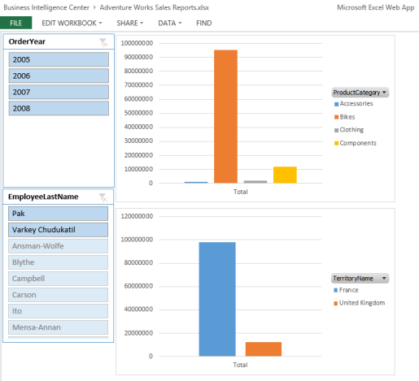

# Create an Excel Services dashboard using an OData data feed

[!INCLUDE[appliesto-2013-xxx-xxx-xxx-md](../includes/appliesto-2013-xxx-xxx-xxx-md.md)] 
  
This article describes, step by step, how to use Excel 2016 to create a basic dashboard that contains two reports and two filters. The example dashboard described in this article resembles the following image:
  
**Figure: Basic Excel Services dashboard that contains two reports and two slicers**

  
Our example dashboard uses data that is imported into Excel using an OData data feed. This makes it possible to publish the workbook to a library in SharePoint Server 2013. By following the steps in this article, you'll learn how to import data into Excel, use that data to create reports in a worksheet, and connect filters to those reports.
  
    
## Before you begin

Before you begin this operation, review the following information about prerequisites:
  
- Excel 2016 must be installed on the computer that you are using to create and publish the dashboard.
    
- This scenario uses Adventure Works sample data and a Business Intelligence Center site in SharePoint Server 2013. 
    
    The Adventure Works sample data that we'll use is available via an OData data feed. For more information, see [AdventureWorks OData Feed (on CodePlex)](https://go.microsoft.com/fwlink/p/?LinkId=275814).
    
    If you do not have a Business Intelligence Center site, have an IT administrator configure it for you by using the instructions in [Configure AdventureWorks for Business Intelligence solutions](configure-adventureworks.md).
    
-  Excel Services must be configured to support Data Models. For information about how to deploy Excel Services, see [Configure Excel Services in SharePoint Server 2013](/SharePoint/administration/configure-excel-services) and [Manage Excel Services data model settings (SharePoint Server 2013)](manage-excel-services-data-model-settings.md). 
    
## Plan the dashboard

Before you begin to create a dashboard, we recommend that you create a dashboard plan. The plan does not have to be extensive or complex. However, it should give you an idea of what you want to include in the dashboard. To help you prepare a dashboard plan, consider questions such as the following:
  
- Who will use the dashboard?
    
- What kinds of information do they want to see?
    
- Does data exist that you can use to create the dashboard?
    
Our example dashboard is designed to be a prototype that you can use to learn how to create and publish Excel Services dashboards. To show how we might create a dashboard plan for a similar dashboard, see the following table.
  
**Table: Basic plan for our example dashboard**

|**Question**|**Response**|
|:-----|:-----|
|Who will use the dashboard?    |The dashboard is intended for use by sales representatives, sales managers, corporate executives, and other stakeholders who are interested in sales information for the fictitious company Adventure Works Cycles.    |
|How will the dashboard be used? That is, what kinds of information do the dashboard consumers want to see?    | Sales representatives, managers, executives, and other dashboard consumers want to use the dashboard to view, explore, and analyze data. At a minimum, the dashboard consumers want to see the following kinds of information:     Sales amounts across different geographical areas     Sales amounts across different geographical areas     Sales amounts for different years     Sales amounts for different sales representatives     Dashboard consumers want to use the dashboard to view, explore, and analyze data to obtain answers to specific questions.     The dashboard consumers also want to be able to use filters to focus on more specific information, such as sales for a particular year or a particular sales representative.    |
|Does data exist that we can use to create the dashboard?    |Yes. The Adventure Works sample database that we'll use contains the data that we can use for the dashboard.    |
|What items should the dashboard contain?    | Our example dashboard includes the following items:     Data that is imported by using an OData data feed     A chart showing product sales information for different geographical areas     A chart showing sales information for different geographical areas     A slicer that dashboard consumers can use to view information for a particular year     A slicer that dashboard consumers can use to view information for a particular sales representative    |
|Where will the dashboard be published?    |Because our example dashboard uses native data in Excel, the dashboard can be published to a SharePoint library in SharePoint Server 2013 or in SharePoint Online. This enables people to consume the dashboard content internally or via an Internet connection. It also enables people to view the dashboard by using a mobile device, such as Apple iPad or Windows 8 tablet.    |
   
Now that we have created our dashboard plan, we can begin to create the dashboard.
  
## Create the dashboard

To create the dashboard, we begin by creating a data connection. Then, we use that data connection to import data into Excel. Next, we create the reports and the filter that we want to use. After that, we publish the workbook to SharePoint Server 2013.
  
### Part 1: Get data into Excel

Our example dashboard uses data that is imported into Excel via an OData data feed to connect to Adventure Works sample data. For more information, see [AdventureWorks OData Feed (on CodePlex)](https://go.microsoft.com/fwlink/p/?LinkId=275814). We begin by importing data into Excel.
  
 **To import data into Excel by using an OData data feed**
  
1. Open Microsoft Excel.
    
2. Choose **Blank workbook** to create a workbook. 
    
3. On the **Data** tab, choose **Get External Data** group, choose **From Other Sources**, and then choose **From OData Data Feed**.
    
    The Data Connection Wizard opens.
    
4. On the **Connect to Database Server** page, in the **Location of the data feed** box, specify the website address (URL) for the data feed. 
    
    For our example dashboard, we used http://services.odata.org/AdventureWorksV3/AdventureWorks.svc.
    
5. In the **Log on credentials** section, take one of the following steps: 
    
  - Choose **Use the sign-in information for the person opening this file**, and then choose the **Next** button. 
    
  - Choose **Use this name and password**, specify an appropriate user name and password, and then choose the **Next** button. 
    
    > [!TIP]
    > If you don't know which option to choose, contact a SharePoint administrator. 
  
6. On the **Select Tables** page, choose the **CompanySales** table and the **TerritorySalesDrilldown** table. Then choose the **Next** button. 
    
7. On the **Save Data Connection File and Finish** page, choose the **Finish** button. 
    
8. On the **Import Data** page, take the following steps: 
    
1. Select the **Table** option. 
    
2. Make sure the **Add this data to the Data Model** option is selected. 
    
3. Choose the **OK** button. 
    
    **Sheet2** and **Sheet3** that contain data are added to the workbook. 
    
9. Keep Excel open.
    
At this point, we have imported data into Excel by using an OData data feed. The next step is to create a relationship between the tables of data. To do that, we'll use the Power Pivot Add-In for Excel. If the **PowerPivot** tab is not visible in Excel, enable the add-in by using the following procedure. 
  
 **To enable the PowerPivot add-in for Excel**
  
1. In Excel, on the **File** tab, choose **Options**.
    
2. In the **Excel Options** dialog box, choose **Add-Ins**.
    
3. In the **Manage** list, choose **COM Add-Ins**, and then choose the **Go** button to open the **COM Add-Ins** dialog box. 
    
4. Select **Microsoft Office PowerPivot for Excel 2013**, and then choose **OK**. The **PowerPivot** tab is now visible in Excel. 
    
5. Keep Excel open.
    
Now that the Power Pivot add-in for Excel is enabled, the next step is to create a relationship between the tables of data. This will enable us to create reports and filters using data from the two tables.
  
 **To create a relationship between tables in a Data Model**
  
1. In Excel, on the **PowerPivot** tab, in the **Data Model** group, choose **Manage**. Power Pivot for Excel opens.
    
2. In the **PowerPivot for Excel** window, on the **Design** tab, in the **Relationships** group, choose **Create Relationship**.
    
3. In the **Create Relationship** dialog box, specify the following settings: 
    
  - In the **Table** list, verify that **CompanySales** is selected. 
    
  - In the **Column** list, choose **ID**.
    
  - In the **Related Lookup Table** list, choose **TerritorySalesDrilldown**.
    
  - In the **Related Column Lookup** list, verify that **ID** is selected. 
    
    Then choose the **Create** button. 
    
4. Close the **PowerPivot for Excel** window, but keep Excel open. 
    
At this point, we have imported two tables of data into Excel. We have also created a relationship between the tables so that we can create reports and filters that use the two tables as a single data source.
  
### Part 2: Create reports

For our example dashboard, we'll create two reports, as described in the following table:
  
**Table: Dashboard reports**

|**Report Type**|**Report Name**|**Description**|
|:-----|:-----|:-----|
|PivotChart report    |ProductSales    |Bar chart that shows sales amounts across different product categories.    |
|PivotChart report    |GeoSales    |Bar chart that shows sales amounts across different sales geographical areas.    |
   
We begin by creating the ProductSales report.
  
 **To create the ProductSalesReport chart**
  
1. In Excel, select **Sheet1**.
    
2. On the **Insert** tab, in the **Charts** section, choose **PivotChart**.The **Create PivotChart** dialog box appears. 
    
3. In the **Choose the data that you want to analyze** section, choose the **Use an external data source** option, and then choose the **Choose Connection** button. 
    
    The **Existing Connections** dialog box appears. 
    
4. On the **Tables** tab, select the **Tables in Workbook Data Model** option, and then choose the **Open** button. 
    
5. In the **Create PivotChart** dialog box, choose the **Existing Worksheet** option, and then choose the **OK** button. 
    
    **Chart1** opens for editing. 
    
6. In the **PivotChart Fields** list, specify the following options: 
    
  - From the **CompanySales** section, drag **ProductCategory** to the **Legend (Series)** field well. 
    
  - In the **CompanySales** section, select the check box next to **Sales**.
    
    The chart updates to display sales amounts across different product categories.
    
7. Move the PivotChart report closer to the upper-left corner of the worksheet. To do this, drag the report so that the upper-left corner aligns with the upper-left corner of cell D1 in the worksheet.
    
8. To avoid confusion about report names later, we'll specify a new name for the report. To do that, take the following steps: 
    
1. Somewhere in the PivotChart report, right-click, and then choose **PivotChart Options**.
    
2. In the **PivotChart Options** dialog box, in the **PivotChart Name** box, type ProductSalesReport.
    
    > [!TIP]
    > Make sure that the name that you specify contains only alphanumeric characters (no spaces). 
  
3. Choose the **OK** button. 
    
9. Save the workbook by using a file name such as Adventure Works Sales Reports. 
    
10. Keep the workbook open.
    
At this point, we have created a PivotChart report showing product sales. The next step is to create a PivotChart report that shows sales amounts across different geographical locations.
  
 **To create the GeoSalesReport chart**
  
1. In Excel, on the same worksheet that was used to create the ProductSales report, choose cell B17.
    
2. On the **Insert** tab, choose **PivotChart**.
    
3. In the **Choose the data that you want to analyze** section, choose the **Use an external data source** option, and then choose the **Choose Connection** button. 
    
    The **Existing Connections** dialog box appears. 
    
4. On the **Tables** tab, select the **Tables in Workbook Data Model** option, and then choose the **Open** button. 
    
5. In the **Create PivotChart** dialog box, choose the **Existing Worksheet** option, and then choose the **OK** button. 
    
    **PivotChart2** opens for editing. 
    
6. In the **PivotChart Fields** list, specify the following options: 
    
  - In the **CompanySales** section, select **Sales**.
    
  - In the **TerritorySalesDrilldown** section, drag **TerritoryName** to the **Legend (Series)** field well. 
    
    The report updates to display a chart showing sales amounts for different geographical areas.
    
7. Move the report so that its upper-left corner aligns with the upper-left corner of cell D16.
    
8. To specify a name for the report, take the following steps:
    
1. Somewhere in the report, right-click and then choose **PivotChart Options**.
    
2. In the **PivotChart Name** box, type GeoSalesReport.
    
3. Choose **OK**.
    
9. On the **File** tab, choose the **Save** button. 
    
10. Keep the workbook open.
    
At this point, we have created our two reports for our basic dashboard. The next step is to create filters.
  
### Part 3: Add filters

Using Excel, there are several different kinds of filters we can create and add to a dashboard. For example, we can create a simple filter by putting a field in the **Filter** section of the **Fields** list. We can create a slicer, or, if we are using a multidimensional data source such as Analysis Services, we can create a timeline control. For this example dashboard, we'll create two slicers. This filter will enable people to view information for a particular year or a particular sales representative. 
  
 **To add slicers to the dashboard**
  
1. In Excel, on the same worksheet that was used to create the reports, choose cell A1.
    
2. On the **Insert** tab, in the **Filter** group, choose **Slicer**.
    
    The Existing Connections dialog box appears.
    
3. On the **Data Model** tab, select the **Tables in Workbook Data Model** option, and then choose the **Open** button. 
    
4. In the **Insert Slicers** dialog box, take the following steps: 
    
1. In the **CompanySales** section, choose **OrderYear**.
    
2. In the **TerritorySalesDrilldown** section, choose **EmployeeLastName**.
    
3. Choose the **OK** button. 
    
5. Move the slicers so that the upper-left corner of the **OrderYear** slicer aligns with the upper-left corner of cell A1, and the **EmployeeLastName** slicer is positioned immediately below the **OrderYear** slicer. 
    
6. Connect the slicers to the reports by following these steps:
    
1. Select the **OrderYear** slicer. 
    
2. On the **Options** tab, in the **Slicer** group, choose the **Report Connections** toolbar command. 
    
3. In the **Report Connections** dialog box, choose the **ProductSalesReport** and **GeoSalesReport** check boxes, and then choose the **OK** button. 
    
4. Repeat these steps for the **EmployeeLastName** slicer. 
    
7. On the **File** tab, choose the **Save** button. 
    
8. Keep the Excel workbook open.
    
At this point, we have created a dashboard. The next step is to publish it to SharePoint Server 2013, where it can be used by others.
  
## Publish the dashboard

To publish the workbook to SharePoint Server 2013, we'll follow a two-step process. First, we make some adjustments that affect how the workbook is displayed. Then, we publish the workbook to a SharePoint library.
  
We begin by making adjustments to the workbook. By default, our example dashboard displays gridlines on the worksheet that contains our dashboard. In addition, by default, the worksheet is called Sheet1. We can make some minor adjustments that will improve how the dashboard will be displayed.
  
 **To make minor display improvements to the workbook**
  
1. In Excel, choose the **View** tab. 
    
2. To remove gridlines from the view, on the **View** tab, in the **Show** group, clear the **Gridlines** check box. 
    
3. To remove row and column headings, on the **View** tab, in the **Show** group, clear the **Headings** check box. 
    
4. To rename the worksheet, right-click its tab where it says **Sheet1**, and then choose **Rename**. Immediately type a new name for the worksheet, such as SalesInfo, and then press the Enter key.
    
5. On the **File** tab, choose **Save**.
    
6. Close Excel.
    
The next step is to publish the workbook to a SharePoint library. The workbook uses native data that we imported into Excel, which means that we can publish it to a library in SharePoint Server 2013. Use one of the following procedures to publish the workbook.
  
 **To publish the workbook to a library in SharePoint Server 2013**
  
1. Open a web browser.
    
2. In the address line, type the SharePoint address to a library in SharePoint Server 2013. 
    
    For our example, we used the Documents library that is available by default in a Business Intelligence Center site. The SharePoint address we used resembles http://servername/sites/bicenter/documents.
    
    > [!TIP]
    > Contact a SharePoint administrator if you do not know the SharePoint address for a library that you can use. 
  
3. In the **Documents** library, click **+ New Document** to open the **Add a Document** dialog box. 
    
4. Choose **Browse**, and then use the **Choose File to Upload** dialog box to select the Adventure Works Sales Reports workbook. Then choose **Open**.
    
5. In the **Add a document** dialog box, choose **OK**. The workbook is added to the library.
    
Now that we have created and published the dashboard, we can use it to explore data.
  
## Use the dashboard

After the dashboard was published to SharePoint Server 2013, it is available for people to view and use it. 
  
 **To open the dashboard**
  
1. Open a web browser.
    
2. In the address bar, type the address to the Business Intelligence Center site where the dashboard was published.
    
3. Choose **Site Contents**, and then choose **Documents**.
    
4. Choose the **Adventure Works Sales Reports** dashboard. The dashboard opens for viewing in a browser window. 
    
Now that the dashboard is open for viewing, we can use it to obtain answers to specific questions, such as those that are described in the following table.
  
**Table: Using the dashboard to obtain answers to specific questions**

|**Question**|**Action**|
|:-----|:-----|
|In 2005, which product category had the most sales?    |In the **OrderYear** slicer, choose 2005. Notice that in the **ProductSalesReport** chart, the Bikes product category has the highest sales amount.    |
|Which year had the highest amount of sales for the Bikes product category?    |To find the answer, we'll use the Quick Explore feature. Follow these steps:    Clear the OrderYear slicer. In the ProductSalesReport chart, select the Bikes bar. The Quick Explore button appears. Click (or tap) the Quick Explore button to open the Explore dialog box. Expand CompanySales, choose OrderYear, and then choose Drill To OrderYear. The ProductSalesReport chart updates to show sales amounts for the Bikes product category. According to the **ProductSalesReport** chart, 2007 was the year in which this company had the highest sales amounts for the Bikes category.    |
|In France, which product subcategory has the highest amount of sales?    | To find the answer, we'll use the Quick Explore feature. Follow these steps:     Refresh the browser window to restore the dashboard to its default view.     In the **GeoSalesReport** chart, select the **France** bar to display the Quick Explore button.     Click (or tap) the Quick Explore button.     Expand **CompanySales**, choose **ProductSubCategory**, and then choose **Drill To ProductSubCategory**. The chart updates to display lots of products.     Point to the tallest bar. A callout appears that indicates that bar corresponds to the Road Bikes subcategory.     According to the GeoSalesReport chart, Road Bikes has the highest amount of sales in France for this company.    |
   
## See also

#### Concepts

[Business intelligence capabilities in Excel Service (SharePoint Server 2013)](bi-capabilities-in-excel-and-excel-services.md)
  
[Create an Excel Services dashboard using a Data Model (SharePoint Server 2013)](create-an-excel-services-dashboard-using-a-data-model-sharepoint-server-2013.md)

