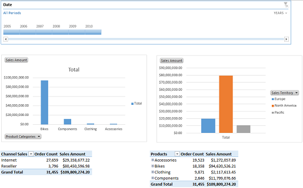

# Create an Excel Services dashboard using SQL Server Analysis Services data

[!INCLUDE[appliesto-2013-xxx-xxx-xxx-md](../includes/appliesto-2013-xxx-xxx-xxx-md.md)] 
  
This article describes, step by step, how to use Excel 2016 to create a basic sales dashboard that contains several reports and a filter using an external data connection. The example dashboard described in this article resembles the following image:
  
**Figure: Basic sales dashboard example**

  
This article also describes how to publish the dashboard to SharePoint Server 2013 where others can view and use it. By following the steps in this article, you'll learn how to create and arrange different reports in a worksheet and connect a filter to those reports.
  
    
## Before you begin

Before you begin this operation, review the following information about prerequisites:
  
- Excel must be installed on the computer that you are using to create and publish the dashboard.
    
- This scenario uses Adventure Works sample data and a Business Intelligence Center site in SharePoint Server 2013. If you do not have the sample data and a Business Intelligence Center site, have an IT administrator configure them for you using the instructions in [Configure AdventureWorks for Business Intelligence solutions](configure-adventureworks.md).
    
- Excel Services must be configured in the SharePoint environment that you are using. 
    
- You must have some information about what authentication settings are used for Excel Services. User access can be provided using Windows Authentication with Kerberos delegation, the Secure Store Service, or, with OLAP data sources, the EffectiveUserName feature. 
    
    For information about how to configure Secure Store, see [Plan the Secure Store Service in SharePoint Server](/previous-versions/office/sharepoint-server-2010/ee806889(v=office.14)) and [Configure the Secure Store Service in SharePoint Server](configure-the-secure-store-service.md). For information about how to configure the EffectiveUserName feature for OLAP data sources, see [Use Analysis Services EffectiveUserName in SharePoint Server](use-analysis-services-effectiveusername-in-sharepoint-server.md).
    
## Plan the dashboard

Before you begin to create a dashboard, we recommend that you create a dashboard plan. The plan does not have to be extensive or complex. However, it should give you an idea of what you want to include in the dashboard. To help you prepare a dashboard plan, consider questions such as the following:
  
- Who will use the dashboard?
    
- What kinds of information do they want to see?
    
- Does data exist that you can use to create the dashboard?
    
Our example dashboard is designed to be a prototype that you can use to learn how to create and publish Excel Services dashboards. To show how we might create a dashboard plan for a similar dashboard, see the following table.
  
**Table: Basic plan for our example dashboard**

|**Question**|**Response**|
|:-----|:-----|
|Who will use the dashboard?    |The dashboard is intended for use by sales representatives, sales managers, corporate executives, and other stakeholders who are interested in sales information for the fictitious company Adventure Works Cycles.    |
|How will the dashboard be used? That is, what kinds of information do the dashboard consumers want to see?    | Sales representatives, managers, executives, and other dashboard consumers want to use the dashboard to view, explore, and analyze data. At a minimum, the dashboard consumers want to see the following kinds of information:     Sales amounts for different product categories     Sales amounts for different sales territories     Sales for Internet and Reseller channels     Dashboard consumers want to use the dashboard to view, explore, and analyze data to obtain answers to specific questions.     The dashboard consumers also want to be able to use filters to focus on more specific information, such as sales for a particular period of time.    |
|Does data exist that we can use to create the dashboard?    |Yes. The Adventure Works sample database contains the data that we want to use for the dashboard. Because this sample data is a multidimensional data cube, it will enable us to create interactive reports that dashboard users can use to explore data by viewing different levels of detail.    |
|What items should the dashboard contain?    | Our example dashboard includes the following items:     A data connection to SQL Server Analysis Services     A report showing product sales information for different product categories     A report showing sales information for different sales territories     A report showing orders and sales information for different sales channels     A report showing orders and sales across different product categories     A filter that dashboard consumers can use to view information for a particular period of time or a range of time    |
   
Now that we have created our dashboard plan, we can begin to create the dashboard.
  
## Create the dashboard

To create the dashboard, we begin by creating a data connection. Then, we use that data connection to create the reports and the filter that we want to use. After that, we publish the workbook to SharePoint Server 2013.
  
### Part 1: Create a data connection

Our example dashboard uses a single data connection to data that is stored in SQL Server 2012 Analysis Services. We'll use this data connection to create the reports and filter for the dashboard. 
  
 **To create a connection to Analysis Services data**
  
1. Open Microsoft Excel.
    
2. Choose **Blank workbook** to create a workbook. 
    
3. On the **Data** tab, choose **Get External Data** group, choose **From Other Sources**, and then choose **From Analysis Services**.
    
    The Data Connection Wizard opens.
    
4. On the **Connect to Database Server** page, in the **Server name** box, specify the name of the server where the Analysis Services data that you want to use resides. 
    
5. In the **Log on credentials** section, take one of the following steps: 
    
  - If your organization is using Windows Authentication, choose **Use Windows Authentication**, and then choose the **Next** button. 
    
  - If your organization is using specific user credentials, choose **Use the following User Name and Password**, specify an appropriate user name and password, and then choose the **Next** button. 
    
    > [!TIP]
    > If you don't know which option to choose, contact a SharePoint administrator. 
  
6. On the **Select Database and Table** page, choose the **AdventureWorksDW2012Multidimensional-EE** database, choose the **Adventure Works** cube, and then choose the **Next** button. 
    
7. On the **Save Data Connection File and Finish** page, choose the **Finish** button. 
    
8. On the **Import Data** page, select the **Only Create Connection** option, and then choose the **OK** button. 
    
9. Keep Excel open.
    
At this point, we have created a connection to the Adventure Works cube in Analysis Services. By default, this data connection is saved in a **My Data Sources** folder in the **Documents** library on the computer and is embedded in the workbook. We'll use the ODC connection that is embedded in the workbook for the dashboard. 
  
The next step is to create reports for the dashboard. 
  
### Part 2: Create reports

For our example dashboard, we'll create four reports, as described in the following table:
  
**Table: Dashboard reports**

|**Report Type**|**Report Name**|**Description**|
|:-----|:-----|:-----|
|PivotChart report    |ProductSales    |Bar chart report that shows sales amounts across different product categories.    |
|PivotChart report    |GeoSales    |Bar chart report that shows sales amounts across different sales territories.    |
|PivotTable report    |ChannelSales    |Table that shows order quantities and sales amounts across the Internet and Reseller channels.    |
|PivotTable report    |OrderSales    |Table that shows order quantities and sales amounts across different product categories.    |
   
We begin by creating the ProductSales report.
  
 **To create the ProductSales report**
  
1. In Excel, on the **Insert** tab, in the **Charts** section, choose **PivotChart**.
    
    The **Create PivotChart** dialog box appears. 
    
2. In the **Choose the data that you want to analyze** section, choose the **Use an external data source** option, and then choose the **Choose Connection** button. 
    
    The **Existing Connections** dialog box appears. 
    
3. In the **Connections in this Workbook** section, select the **AdventureWorksDW2012Multidimensional-EE** data connection, and then choose the **Open** button. 
    
4. In the **Create PivotChart** dialog box, choose the **Existing Worksheet** option, and then choose the **OK** button. 
    
    **Chart1** opens for editing. 
    
5. In the **PivotChart Fields** list, specify the following options: 
    
  - In the **Sales Summary** section, choose **Sales Amount**.
    
    **Sales Amount** is displayed in the **Values** section, and the report updates to display a single bar. 
    
  - In the **Product** section, choose **Product Categories**.
    
    **Product Categories** is displayed in the **Axis** section, and the report updates to display sales amounts across different product categories. 
    
6. To sort the bars in descending order, take the following steps:
    
1. In the **PivotChart Fields** list, click (or touch) the **Product Categories** dimension, and then choose the down arrow that appears. 
    
    The **Select field** dialog box appears. 
    
2. Choose **More Sort Options…** to open the **Sort (Category)** dialog box. 
    
3. In the **Sort options** section, choose the **Descending (Z to A) by** option, and then use the list to select **Sales Amount**.
    
4. Click **OK**.
    
7. To ensure that there is room for more reports, we'll move the PivotChart report closer to the upper-left corner of the worksheet. To do this, drag the report so that the upper-left corner aligns with the upper-left corner of cell B10 in the worksheet.
    
8. To avoid confusion about report names later, we'll specify a new name for the report. On the **Analyze** tab, in the **PivotChart** group, in the **Chart Name** box, delete the text that says Chart1, type ProductSales, and then press the Enter key. 
    
    > [!TIP]
    > Ensure that the name that you specify contains only alphanumeric characters (no spaces). 
  
9. To ensure we don't encounter sizing issues later with the report, we'll specify size settings for the report. To do this, follow these steps:
    
1. In an empty section of the report, such as inside the upper-right corner of the report, right-click (or touch and hold for a second), and then choose **Format Chart Area**.
    
    The **Format Chart Area** list opens. 
    
2. Below the **Chart Options**, choose the **Size and Properties** toolbar command. 
    
3. Expand the **Size** section, and then choose the **Lock aspect ratio** option. 
    
4. Expand the **Properties** section, choose the **Don't move or size with cells** option, and verify that the **Locked** option is selected. 
    
5. To optionally specify alternate text for the report, expand the **Alt Text** section, and then type the text that you want to use for the report. 
    
6. Close the **Format Chart Area** list. 
    
10. Save the workbook by using a file name such as Adventure Works Sales. 
    
11. Keep the workbook open.
    
At this point, we have created a PivotChart report. The next step is to create another PivotChart report and name it GeoSales that shows sales amounts across different geographical locations.
  
 **To create the GeoSales report**
  
1. In Excel, on the same worksheet that was used to create the ProductSales report, choose cell K10.
    
2. On the **Insert** tab, choose **PivotChart**.
    
3. In the **Choose the data that you want to analyze** section, choose the **Use an external data source** option, and then choose the **Choose Connection** button. 
    
    The **Existing Connections** dialog box appears. 
    
4. In the **Connections in this Workbook** section, select the **AdventureWorksDW2012Multidimensional-EE** data connection, and then choose the **Open** button. 
    
5. In the **Create PivotChart** dialog box, choose the **Existing Worksheet** option, and then choose the **OK** button. 
    
    **Chart2** opens for editing. 
    
6. Move the chart so that its upper-left corner aligns with the upper-left corner of cell J10 in the worksheet.
    
7. In the **PivotChart Fields** list, specify the following options: 
    
  - In the **Sales Summary** section, choose **Sales Amount**.
    
  - In the **Sales Territory** section, drag **Sales Territory** to the **Legend** section. 
    
    The report updates to display a bar chart showing sales amounts for Europe, North America, and Pacific.
    
8. Specify size settings for the report by following these steps:
    
1. In an empty section of the report, right-click (or touch and hold for a second), and then choose the **Format Chart Area** option. 
    
    The **Format Chart Area** list opens. 
    
2. Below the **Chart Options**, choose the **Size and Properties** toolbar command. 
    
3. Expand the **Size** section, and then choose the **Lock aspect ratio** option. 
    
4. Expand the **Properties** section, choose the **Don't move or size with cells** option, and verify that **Locked** is selected. 
    
5. To optionally specify alt text for the report, expand the **Alt Text** section, and then type the text that you want to use for the report. 
    
6. Close the **Format Chart Area** list. 
    
9. Specify a new name for the report. On the **Analyze** tab, in the **PivotChart** group, in the **Chart Name** box, delete the text that says Chart2, type GeoSales, and then press the Enter key. 
    
10. On the **File** tab, choose the **Save** button. 
    
11. Keep the workbook open.
    
At this point, we have created two reports. The next step is to create the ChannelSales report.
  
 **To create the ChannelSales report**
  
1. In Excel, on the same worksheet that was used to create the previous reports, choose cell B26.
    
2. On the **Insert** tab, choose **PivotTable**.
    
3. In the **Choose the data that you want to analyze** section, choose the **Use an external data source** option, and then choose the **Choose Connection** button. 
    
    The **Existing Connections** dialog box appears. 
    
4. In the **Connections in this Workbook** section, select the **AdventureWorksDW2012Multidimensional-EE** data connection, and then choose the **Open** button. 
    
5. Choose the **Existing Worksheet** option, and then choose the **OK** button. 
    
    **PivotTable3** opens for editing. 
    
6. In the **PivotTable Fields** list, specify the following options: 
    
  - In the **Sales Orders** section, choose ** Order Count **.
    
  - In the **Sales Summary** section, choose **Sales Amount**.
    
  - In the **Sales Channel** section, choose **Sales Channel**.
    
    The report updates to display a table showing order counts and sales amounts for the Internet and Reseller channels. 
    
7. Choose cell B26, and then, in the **Formula** bar, delete the text that says Row Labels, and type Channel Sales. Then press the Enter key.
    
8. Specify a new name for the report. On the **Analyze** tab, in the **PivotTable** group, in the **PivotTable Name** box, delete the text that says PivotTable3, type ChannelSales, and then press the Enter key. 
    
9. On the **File** tab, choose the **Save** button. 
    
10. Keep the Excel workbook open.
    
At this point, we have created three reports using the same data source. The next step is to create the OrderSales report.
  
 **To create the OrderSales report**
  
1. In Excel, on the same worksheet that was used to create the previous reports, choose cell H26.
    
2. On the **Insert** tab, choose **PivotTable**.
    
3. In the **Choose the data that you want to analyze** section, choose the **Use an external data source** option, and then choose the **Choose Connection** button. 
    
    The **Existing Connections** dialog box appears. 
    
4. In the **Connections in this Workbook** section, select the **AdventureWorksDW2012Multidimensional-EE** data connection, and then choose the **Open** button. 
    
5. Choose the **Existing Worksheet** option, and then choose the **OK** button. 
    
    **PivotTable4** opens for editing. 
    
6. In the **PivotTable Fields** list, specify the following options: 
    
  - In the **Sales Orders** section, choose ** Order Count **.
    
  - In the **Sales Summary** section, choose **Sales Amount**.
    
  - In the **Product** section, choose **Product Categories**.
    
    The report updates to display a table showing order counts and sales amounts for different product categories. 
    
7. Choose cell H26, and then, in the **Formula** bar, delete the default text that says **Row Labels**, and then type Products. Then press the Enter key.
    
8. Specify a new name for the report. On the **Analyze** tab, in the **PivotTable** group, in the **PivotTable Name** box, delete the text that says PivotTable4, type OrderSales, and then press the Enter key. 
    
9. On the **File** tab, choose the **Save** button. 
    
10. Keep the workbook open.
    
At this point, we have created our four reports for our basic dashboard. The next step is to create a filter.
  
### Part 3: Create a filter

Using Excel, there are several different kinds of filters we can create. For example, we can create a simple filter by putting a field in the **Filter** section of the **Fields** list. We can create a slicer, or, if we are using a multidimensional data source such as Analysis Services, we can create a timeline control. For this example dashboard, we'll create a timeline control. This filter will enable people to view information for a particular time. 
  
 **To create a timeline control**
  
1. In Excel, on the same worksheet that was used to create the reports, choose cell B1.
    
2. On the **Insert** tab, in the **Filter** group, choose **Timeline**.
    
    The Existing Connections dialog box appears.
    
3. In the **Connections in this Workbook** section, select the **AdventureWorksDW2012Multidimensional-EE** data connection, and then choose the **Open** button. 
    
4. The **Insert Timelines** dialog box appears. 
    
5. Choose the **Date** option, and then choose the **OK** button. 
    
    A timeline control opens.
    
6. Move the timeline control so that its upper-left corner aligns with the upper-left corner of cell B1.
    
7. To make the timeline control wider, use the resizing handles, and drag the sizing handle on the right side of the control to column M.
    
8. Select the timeline control, and then, on the **Options** tab, in the **Timeline** group, choose the **Report Connections** toolbar command. 
    
    The **Report Connections** dialog box appears. 
    
9. Choose **ChannelSales**, **GeoSales**, **OrderSales**, and **ProductSales**, and then choose the **OK** button. 
    
10. On the **File** tab, choose the **Save** button. 
    
11. Keep the Excel workbook open.
    
At this point, we have created a dashboard. The next step is to publish it to SharePoint Server 2013, where it can be used by others.
  
## Publish the dashboard

To publish the workbook to SharePoint Server 2013, we'll follow a four-step process. First, we make some adjustments that affect how the workbook is displayed. Then, we specify Excel Services data authentication settings for the external data connection that we use. Next, we specify publish options for the workbook. Finally, we publish the workbook to SharePoint Server 2013.
  
We begin by making adjustments to the workbook. By default, our example dashboard displays gridlines on the worksheet that contains our dashboard. In addition, by default, the worksheet is called Sheet1. We can make some minor adjustments that will improve how the dashboard will be displayed.
  
 **To make minor display improvements to the workbook**
  
1. In Excel, choose the **View** tab. 
    
2. To remove gridlines from the view, on the **View** tab, in the **Show** group, clear the **Gridlines** check box. 
    
3. To remove row and column headings, on the **View** tab, in the **Show** group, clear the **Headings** check box. 
    
4. To rename the worksheet, right-click its tab where it says **Sheet1**, and then choose **Rename**. Immediately type a new name for the worksheet, such as SalesDashboard, and then press the Enter key.
    
5. On the **File** tab, choose **Save**.
    
6. Keep the workbook open.
    
The workbook we created uses an external data connection that we want to keep active when we publish the workbook. To ensure that the data connection remains live so that data refresh is supported in Excel Services, we must specify authentication settings.
  
 **To specify authentication settings for the external data connection**
  
1. In Excel, on the **Data** tab, choose the **Connections** toolbar command. 
    
    The **Workbook Connections** dialog box appears and displays the **AdventureWorksDW2012Multidimensional-EE** data connection. 
    
2. Choose the **Properties** button. 
    
3. In the **Connection Properties** dialog box, on the **Definition** tab, next to **Excel Services**, choose the **Authentication Settings…** button. 
    
4. In the **Excel Services Authentication Settings** dialog box, take one of the following steps: 
    
  - If Excel Services is configured to use Windows Authentication or the EffectiveUserName feature, select **Use the authenticated user's account**, and then choose the **OK** button. 
    
  - If Excel Services is configured to use Secure Store Service, select **Use a stored account**. In the **Application ID** box, specify the Secure Store target application ID, and then choose the **OK** button. 
    
  - If Excel Services is configured to use the unattended service account, select **None**, and then choose the **OK** button. 
    
    > [!IMPORTANT]
    > If you do not know which option to choose, contact a SharePoint administrator. 
  
5. Choose the **OK** button to close the **Connection Properties** dialog box. 
    
6. If you see a message that states that the connection in the workbook will no longer be identical to the connection that is defined in the external file, choose **Yes**.
    
7. Choose the **Close** button to close the **Workbook Connections** dialog box. 
    
When we created the reports for the dashboard, we gave each one a unique name and defined it as a named item in Excel. In addition to publishing the workbook to SharePoint Server 2013, we should publish the named items that we defined. This makes it possible to display a named item in its own SharePoint Web Part later. We do this by specifying publish options for the workbook. 
  
> [!TIP]
> This article does not describe how to display a named item in its own SharePoint Web Part. Therefore, the following procedure is optional. However, we recommend that, as a best practice, you perform the following procedure. This can save you from having to republish the workbook later. 
  
 **To specify publish options for the workbook**
  
1. On the **File** tab, choose **Info**, and then choose **Browser View Options**.
    
2. Choose the **Browser View Options** button. 
    
3. On the **Show** tab, use the list to choose **Items in the Workbook**.
    
4. Choose **All Charts** and **All PivotTables**, and then choose the **OK** button. 
    
5. On the **File** tab, choose the **Save** button. 
    
6. Keep the workbook open.
    
The next step is to publish the workbook to SharePoint Server 2013.
  
 **To publish the workbook to SharePoint Server**
  
1. In Excel, on the **File** tab, choose **Save As**, choose **Computer**, and then choose the **Browse** button. 
    
    The **Save As** dialog box appears. 
    
2. In the address line, type the SharePoint address to an Excel Services trusted file location.
    
3. Choose the **Save** button. 
    
    The workbook is published in the SharePoint library that you specified.
    
4. Close the Excel workbook.
    
Now that we have created and published the dashboard, we can use it to explore data.
  
## Use the dashboard

After the dashboard was published to SharePoint Server 2013, it is available for people to view and use it. 
  
 **To open the dashboard**
  
1. Open a web browser.
    
2. In the address bar, type the address to the Business Intelligence Center site where the dashboard was published.
    
3. Choose **Site Contents**, and then choose **Documents**.
    
4. Choose the **Adventure Works Sales** dashboard. 
    
    The dashboard opens for viewing.
    
Now that the dashboard is open for viewing, we can use it to obtain answers to specific questions, such as those that are described in the following table.
  
**Table: Using the dashboard to obtain answers to specific questions**

|**Question**|**Action**|
|:-----|:-----|
|Which product category has the largest number of orders?    |Using the OrderSales report, view the **Order Count** column for various product categories. You can see that Accessories has the largest number of orders. Notice also that Accessories also has the least total sales amount of all four product categories.    |
|Does this company sell more merchandise through the Internet channel, or the Reseller channel?    |Using the ChannelSales report, you can see that, although the Internet channel has more orders, the Reseller channel has the highest sales amount.    |
|Which year resulted in the highest total sales amount?    |Using the timeline control near the top of the screen, choose the down arrow next to **MONTHS** and select **YEARS**. Use the control to select one year at a time. Notice that the year 2007 has the highest sales amount.    |
|Which sales territory has the highest sales amount for this company for all time?    |Clear the filter from the timeline control by selecting the **Clear Filter** toolbar command in the upper-right corner of the timeline control. Notice that North America has the highest sales amount for this particular company.    |
|Which subcategory of bikes has the highest overall sales?    |Using the **ProductSales** report, double-click (or touch and hold for a second) the bar for **Bikes**. The report updates to display three subcategories: **Mountain Bikes**, **Road Bikes**, and **Touring Bikes**. Notice that the Mountain Bikes subcategory has the highest sales amount.    |
   
## See also

#### Concepts

[Business intelligence capabilities in Excel Service (SharePoint Server 2013)](bi-capabilities-in-excel-and-excel-services.md)
  
[Create an Excel Services dashboard using a Data Model (SharePoint Server 2013)](create-an-excel-services-dashboard-using-a-data-model-sharepoint-server-2013.md)

