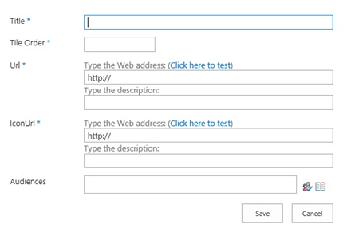
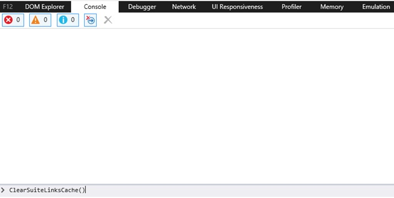
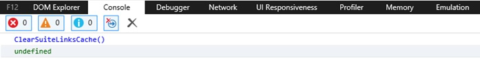
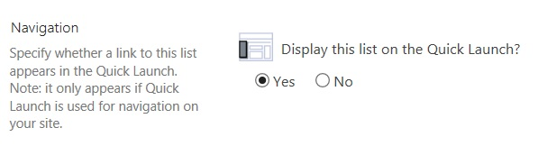

# Custom Tiles in SharePoint Server 2016

 **Summary:** This article describes Custom Tiles which is one of the new features in the November 2016 Public Update for SharePoint Server 2016 (Feature Pack 1). 
  
In SharePoint Server 2016, users can quickly and easily get to all of their SharePoint and Office 365 workloads directly from the app launcher. Now in addition to those, you can also add your own custom tiles that point to other SharePoint sites, external sites, legacy apps, and more. This makes it easy to find the relevant sites, apps, and resources to do your job
  
This feature is configured on the web app level by an ITPro administrator by using PowerShell cmdlets.
  
> [!NOTE]
> The list for the custom tiles is provisioned at the root level of the web application so anyone will be able to see or remove the list. 
  
## Enable Custom Tiles

The custom tile feature is not enabled by default. To enable the feature, do these steps.
  
1. Verify that you have the following memberships:
    
  - You must have membership in the **securityadmin** fixed server role on the SQL Server instance 
    
  - You must have membership in the **db_owner** fixed database role on all databases that are to be updated. 
    
  - You must be a member of the Administrators group on the server on which you are running the PowerShell cmdlet.
    
    If these permissions are not satisfied, contact your Setup administrator or SQL Server administrator to request these permissions.
    
    For additional information about PowerShell permissions, see [Permissions](http://technet.microsoft.com/library/ae4901b4-505a-42a9-b8d4-fca778abc12e.aspx#section3) and [Add-SPShellAdmin](http://technet.microsoft.com/library/2ddfad84-7ca8-409e-878b-d09cb35ed4aa.aspx).
    
2. On the **Start** menu, click **All Programs**
    
3. Click **Microsoft SharePoint 2016 Products**.
    
4. Click **SharePoint 2016 Management Shell**.
    
5. To ensure the feature is available, at the PowerShell command prompt, type the following command:
    
  ```
  Get-SPFeature -Identity CustomTiles
  ```

    > [!NOTE]
    > If the feature is not available, then you'll need to run the command: 
  
  ```
  Install-SPFeature -Path <path to CustomTiles>
  ```

6. To enable the feature, at the PowerShell command prompt, type the following command:
    
  ```
  Enable-SPFeature -Identity CustomTiles -Url http://web_app -Force
  ```

    > [!NOTE]
    > The URL you provide will be the location of where the Custom Tile list is provisioned, so you may need to provide permission access to the list accordingly. Custom Tiles List will be Created on specified URL on feature enable command as hidden list. 
  
7. Since this list is Created as a Hidden List, browse to http://web_app/lists/custom tiles to access Custom tiles list.
    
8. Click **new item** to add a new item to the list. 
    
     
  
9. Enter a **Title** for the new tile. The name will appear in the tile. 
    
10. Enter a number for **Tile Order**. This is the order you want the tile to appear after the default three tiles (that is, Newsfeeds, OneDrive, Sites).
    
11. Enter a **Url** for the tile. This is the location where you want your users to go when they select the tile. 
    
12. Enter an **IconURL** for the tile. The recommended size for an icon is 50 x50 pixels, however the thumbnail will automatically scale. The image appears on the app launcher 
    
13. Type the name of an **Audience** you want to use this tile. For example, Marketing. 
    
    > [!NOTE]
    > List or library items in SharePoint Server 2016 can be targeted to appear only to people who are members of a particular group or audience. An audience can be identified by using SharePoint groups, distribution lists, or security groups or by using a rules-based system to create a global audience. 
  
After you add a new item in the custom tiles list due to caching, it may take up to 24 hours before you can see it appear in the app launcher. If you want to see it immediately, you can run **ClearSuiteLinksCache()** function in the developer browser's console which is displayed by pressing **F12** while in a browser session as displayed in the following diagram. 
  

  
After the **ClearSuiteLinksCache()** function is run, it returns "undefined". 
  

  
You must refresh the page by pressing **F5** or the refresh button  on the Address bar of your browser for the tile to now appear in the app launcher. 
  
## Enable Custom Tiles across multiple web applications

If you want to use the same list of custom tiles across multiple web applications, enable the feature on each web application, and then update the web application property **CustomTilesListHostUrl** to the web application that contains the desired custom tiles list. To do this, follow these steps: 
  
1. Verify that you have the following memberships:
    
  - You must have membership in the **securityadmin** fixed server role on the SQL Server instance 
    
  - You must have membership in the **db_owner** fixed database role on all databases that are to be updated. 
    
  - You must be a member of the Administrators group on the server on which you are running the PowerShell cmdlet.
    
    If these permissions are not satisfied, contact your Setup administrator or SQL Server administrator to request these permissions.
    
    For additional information about PowerShell permissions, see [Permissions](http://technet.microsoft.com/library/ae4901b4-505a-42a9-b8d4-fca778abc12e.aspx#section3) and [Add-SPShellAdmin](http://technet.microsoft.com/library/2ddfad84-7ca8-409e-878b-d09cb35ed4aa.aspx).
    
2. On the **Start** menu, click **All Programs**
    
3. Click **Microsoft SharePoint 2016 Products**.
    
4. Click **SharePoint 2016 Management Shell**.
    
5. To ensure the feature is available, at the PowerShell command prompt, type the following commands:
    
  ```
  $w = Get-SPWebApplication http://web_app
  $w.Properties.CustomTilesListHostUrl = "http://web_app url"
  $w.Update()
  ```

If you want to unhide list of custom tiles you can do this by using PowerShell.
  
From a PowerShell command prompt, type the follow commands:
  
```
$web = get-spweb "http://web_app"
$list = $web.Lists["Custom Tiles"]
$list.hidden = $false
$list.update()
```

> [!NOTE]
> The List will be visible when site Contents is viewed. 
  
To add this list to Left Navigation pane, do the follow steps:
  
1. Browse to List settings.
    
2. Click on **List** name, description and navigation. 
    
3. Select **Yes** for Navigation setting to display list on **Quick Launch** as displayed with this image. 
    

  

