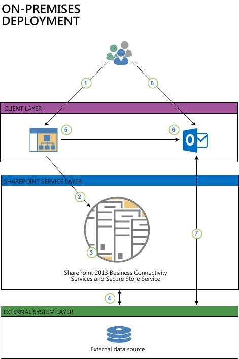

# Deploy a Business Connectivity Services on-premises solution in SharePoint Server

[!INCLUDE[appliesto-2013-2016-2019-xxx-md](../includes/appliesto-2013-2016-2019-xxx-md.md)] 
  
The following scenario shows you how to create a no-code business solution in Microsoft Business Connectivity Services (BCS) by using the SQL Server AdventureWorks sample database. You learn how to:
  
- Configure the accounts, and groups that you need to securely access the external data source.
    
- Configure the permission on the external data source, the external content type and the external lists.
    
- Create and configure an external content type.
    
- Create an external list that makes the external data available to users.
    
- Connect the external list to Microsoft Outlook to make the external data available when the user is offline.
    
## What these procedures help you deploy

Business Connectivity Services is a centralized infrastructure in SharePoint Server and Office that enables you to integrate data that is not in SharePoint Server and Office into SharePoint Server and Office. BCS implementations take many different forms, including the on-premises form. These procedures show you how to install and configure BCS to integrate data from an on-premises SQL data source into a SharePoint Server external list and into Outlook. For the purposes of building out this scenario, we use the AdventureWorks sample SQL database. The solution looks as shown in the following diagram.
  
**Figure: On-premises BCS solution**

  
1. A user goes to an external list on a SharePoint site. The external list creates a request for data by using the user's Windows credentials.
    
2. The request is sent to the BDC runtime in the SharePoint farm.
    
3. The BDC runtime accesses the external content type for the list (in the BDC Metadata Store) to see how to access the external system and which operations can be performed. By using either the user's credentials or the credentials from the Secure Store (as defined in the external content type), the BDC runtime passes the request to a connector that can handle the request, in this case the SQL connector.
    
4. The SQL connector accesses the external data source and retrieves the data, and applies any formatting and filtering as specified in the external content type. The data is passed back through the request chain to the list where the user can interact with it.
    
5. The user wants to take this data on a portable computer in Outlook so the user can use the **Connect to Outlook** feature on the external list to take the data offline. 
    
6. The Click Once installation runs and installs the required BDC model on the client. This lets the BDC Client-Side Runtime access the external data directly.
    
7. Outlook then connects to the external data by using the configuration in the BDC model and synchronizes it into an Outlook SharePoint external list, formatted as a contacts list.
    
8. The user can then interact with the contact data, and any changes that the user makes can be written back to the external data source either by an on-demand synch or by waiting six hours for the automated synchronization.
    
## Deploy the solution

The steps to completely deploy this scenario are presented below. Some of the procedures are in other articles. Links are provided where needed.
  
Before you start your installation of the on-premises Microsoft Business Connectivity Services (BCS) scenario, you must have these software and infrastructure requirements in place.
  
- A fully functional SharePoint Server server farm with a Web Application and site collection
    
- A properly configured [Business Data Connectivity Services service application](configure-a-business-data-connectivity-service-application.md)
    
- A fully functioning instance of SQL Server 2008 with Service Pack 1 (SP1) and Cumulative Update 2 or SQL Server 2008 R2
    
- SharePoint Designer 2013 
    
- Outlook 2016 client
    
- You have an account that has permissions to administer the **Business Data Connectivity Service Application**
    
- You have an account that has permissions to administer the Secure Store Service service application
    
- Download the [AdventureWorks sample database](https://go.microsoft.com/fwlink/?LinkId=260952) from Codeplex downloads for SQL Server. This database must be installed and functioning on your SQL Server 
    
- Create an Active Directory directory Service (AD DS) security group and add the users who will be using this BCS solution, for example create a group that is named AdventureWorksBCSUsers
    
 **AdventureWorks sample data**
  
The AdventureWorks sample database is developed and published by Microsoft. The AdventureWorks sample database is prepopulated with a large quantity of fictitious data from a fictitious company, AdventureWorks Cycles. We are using the AdventureWorks sample database here so we have a concrete example for illustrating the installation and configuration of the on-premises BCS scenario.
  
 **How to download and install the AdventureWorks sample database**
  
1. From a browser, go to [AdventureWorks sample database](https://go.microsoft.com/fwlink/?LinkId=260952) and download the AdventureWorks2008R2_Data.mdf file. 
    
2. Install the Adventure Works2008R2 sample database by following the procedures in the "Readme for AdventureWorks 2008 R2 Sample Database" section of the [SQL Server Samples Readme (en-US)](https://go.microsoft.com/fwlink/?LinkId=260956) page. 
    
### Create database logins

Microsoft Business Connectivity Services (BCS) requires an account that it can use to access the external data source. The account must have the necessary permissions on the external data source to perform all the operations that your BCS solution might require. For ease of configuration and ongoing management, you can map a group of SharePoint Server users to a single shared account on the external data source. 
  
In this procedure, you create a SQL Server login and then assign that login to a user account on the AdventureWorks sample database. You will use Secure Store Service services to map a group of SharePoint Server users to the single shared account in a later procedure.
  
 **Create a SQL Server login**
  
1. Start SQL Server Management Studio.
    
2. In the **Object Explorer**, expand the <database server name>, expand **Security**, and then expand **Logins**.
    
3. Right-click **Logins**, and then click **New Login**
    
4. In the **Login Name** box, enter SharePointGroupAccount.
    
5. Select **SQL Server authentication**, and then enter and confirm a password.
    
6. In the **Default database** box, select **AdventureWorks2008R2**, and then click **OK**.
    
 **Create a SQL Server user on the AdventureWorks database**
  
1. In the **Object Explorer**, expand **Databases**, expand **AdventureWorks2008R2**, expand **Security**, and then expand **Users**.
    
2. Right-click **Users**, and then click **New User**.
    
3. Under the **Login Name**, with the **User name** box pre-selected, in the first box, enter AdventureWorksUser
    
4. In the second box, click **Browse**, in the **Select Login** dialog box, click **Browse**, select the SQL Server account, **SharePointGroupAccount**, and then click **OK** twice. 
    
5. Under **Database Role** membership, select **db_owner**.
    
6. Click **OK**.
    
7. Close SQL Server Management Studio.
    
### Set permissions on the BCS Metadata Store

The BCS Metadata Store holds external content types, external systems and BDC model definitions for the BCS Service Application. In this procedure you configure administrative permissions on the Metadata Store and everything that it will contain.
  
 **Set permissions on the Business Connectivity Services Metadata Store**
  
1. Open the SharePoint Central Administration website with either a Farm administrator account or an account that has been delegated permissions to administer the Business Data Connectivity Service Applications. 
    
2. On the Quick Launch, click **Application Management**. 
    
3. On the **Application Management** page, under **Service Applications**, click **Manage service applications**.
    
4. In the list of services, select the row of the **Business Data Connectivity Service Application** that you created in [Configure a Business Data Connectivity service application in SharePoint Server](configure-a-business-data-connectivity-service-application.md) and then click **Manage** and then **Set Metadata Store Permissions**.
    
5. Enter the Farm Administrator account and any other delegate administrators if you have them and then click **Add**.
    
6. For each account or group that you added that is an administrator of the Business Data Connectivity Service Application, select the **Edit**, **Execute**, **Selectable In Clients**, and **Set Permissions** checkboxes. 
    
7. Select the **Propagate permissions to all BDC Models, External Systems and External Content Types in the BDC Metadata Store. Doing so will overwrite existing permissions** checkbox. For more information on setting permissions on the BDC Metadata Store, see [Overview of Business Connectivity Services security tasks in SharePoint Server](security-tasks-overview.md).
    
8. Click **OK**.
    
> [!NOTE]
> Edit is a highly privileged permission that is required to create or modify data sources, models and external content types in the Business Data Connectivity metadata store. Execute permission is required to query the external content type (because it grants create, read, update, delete, and query rights). Selectable in Clients gives the ability to make new external lists, choose external content types in the External Content Types picker, and use External Data web parts, while Set Permissions gives the user the ability to set permissions for the BDC service itself. It is important to plan permissions for BCS, and to be careful when granting Edit permission. 
  
### Configure the Secure Store Service

The Secure Store Service stores the credentials that Microsoft Business Connectivity Services uses to access the AdventureWorks external data source and performs credential mapping between your users accounts and the credentials used to access the external data source. 
  
In this procedure you perform all the steps in [Configure the Secure Store Services in SharePoint 2013 Preview](https://go.microsoft.com/fwlink/?LinkId=262211) article. You must perform the steps in the Configure the Secure Store Services in SharePoint 2013 article with these parameters from start to finish. 
  
 **Configure Secure Store Service for on-premises Business Connectivity Services**
  
1. Perform all the steps in [Configure the Secure Store Services in SharePoint 2013 Preview](https://go.microsoft.com/fwlink/?LinkId=262211) with the following parameters. 
    
2. Open the SharePoint Central Administration website for the server farm that your Secure Store Service is in with an account that has Farm Administrator permissions.
    
3. In the Configure the Secure Store Services in SharePoint 2013 Preview article, perform all procedures in the [Configure Secure Store in SharePoint Server](configure-the-secure-store-service.md#section1) section with these parameters 
    
1. For the **Register Managed Account**, **User name** type in the name of the service account that you created in the [Prerequisites for deploying a Business Connectivity Services on-premises solution in SharePoint 2013](/SharePoint/administration/deploy-an-on-premises-solution) procedure. 
    
2. Do not select the **Enable automatic password change** box. 
    
4. Perform the "To start the Secure Store Service" procedure
    
5. Perform the "To create a Secure Store Service application" procedures using these parameters
    
1. In the **Service Application Name** box enter the name you want the service to appear as on the **Manage Service Applications** page. 
    
2. In the **Database** area, leave the prepopulated values for **Database Server**, **Database Name**, and **Database authentication**, which is **Windows authentication (recommended)** unless you have specific design needs to change them. 
    
3. If you have SQL Server database mirroring configured and you want to include the Secure Store Service in mirroring, provide the name of the failover database server in the **Failover Database Server** box. 
    
4. For the **Configurable** dropdown, select the account that you registered as a managed account earlier in this procedure. 
    
6. Perform the steps in the [Work with Secure Store encryption keys](configure-the-secure-store-service.md#section2) section with these parameters: 
    
1. Don't perform the procedures in the "Refresh the encryption key" sub-section
    
7. Read the [Store credentials in Secure Store](configure-the-secure-store-service.md#section3) section and perform the [Create a target application](configure-the-secure-store-service.md#CreateTargetApp) procedure using these parameters. 
    
1. In the **Target Application ID** box type in a string for the target application; this is not the display name. For example type in AWTargetAppID.
    
2. In the **Display Name** box, enter the display name you want, for example Adventure Works Target Application ID.
    
3. In the **Target Application Type** dropdown, select **Group** (which indicates the mapping of many credentials to one credential). In this case, the **Target Application Page URL** is not needed and automatically selects to **None**.
    
4. On the **Create New Secure Store Target Application** page, under **Field Name**, change **Windows User Name** to SQL User Name, and **Windows Password** to SQL Password.
    
5. Under **Field Type** change **Windows User Name** to User Name and change **Windows Password** to Password.
    
6. In the **Target Application Administrators** add the accounts that you want to be administrators of the Target Application. Note that the Farm Administrator has access by default. 
    
7. In the **Members** box, add the names of the users whom you want to allow access to the external data source. For this example use the **AdventureWorksBCSUsers** security group you created in [Prerequisites for deploying a Business Connectivity Services on-premises solution in SharePoint 2013](/SharePoint/administration/deploy-an-on-premises-solution).
    
8. Perform the steps in the [Set credentials for a Secure Store target application](configure-the-secure-store-service.md#section4) procedure using these parameters: 
    
1. In the **SQL User Name** box, type **AdventureWorksUser** which is the name SQL Server account you created in [Create database logins for a Business Connectivity Services on-premises solution in SharePoint 2013](/SharePoint/administration/deploy-an-on-premises-solution).
    
2. In the **SQL Password**, and **Confirm SQL Password** boxes type the password for that account, which is actually the password for the SharePointGroupAccount account that you created in [Create database logins for a Business Connectivity Services on-premises solution in SharePoint 2013](/SharePoint/administration/deploy-an-on-premises-solution).
    
### Create an external content type

These procedures walk you through building an external content type for Business Connectivity Services using SharePoint Designer 2013 without writing any code. You will learn how to discover a SQL Server database, connect to the database table, and then return the required data. You will create an external content type named Customers that is based on the Customer view in the AdventureWorks sample database. This article uses the procedures in [How to: Create external content types for SQL Server in SharePoint 2013 Preview](https://go.microsoft.com/fwlink/?LinkId=268041). You must open that article and perform the steps there using the parameters given in the matching sections of this article.
  
 **Define general information**
  
1. Open [How to: Create external content types for SQL Server in SharePoint 2013 Preview](https://go.microsoft.com/fwlink/?LinkId=268041)
    
2. Create a new external content type named AWcustomers with a display name of AdventureWorks Customers.
    
 **Define general and Office behaviors**
  
1. Set the **Office Item Type** to **Contact**. The Office Item Type determines the Outlook behavior you want to attach to the external content type. In this case, this AWCustomer external content type behaves like a native Contact Item in Outlook.
    
2. In the **Offline Sync for External List** checkbox, make sure **Enabled** is selected, which is the default. 
    
> [!NOTE]
> If you disable this option, then the SharePoint Connect to Outlook ribbon command is not available for an external list. 
  
 **Create a connection to the external data**
  
1. Add a connection using SQL Server as the External Data Source Type.
    
2. In the Set the Database Server box, enter <The name of the database server> and in the **Set the Database Name** box, enter AdventureWorks2008R2. Optionally, in the **Name** box, enter AdventureWorks Sample Database.
    
3. Select **Connect with Impersonated Custom Identity**.
    
4. In the **Secure Store Application ID** box, enter AWTargetAppID.
    
> [!CAUTION]
> If you are prompted to enter a user name and password for **AWTargetAppID** it may be because when you created the SharePointGroupAccount SQL login, you did not uncheck the **User must change password at next login** option. To fix this, you must change the password via SQL query  `ALTER LOGIN <LoginName> WITH PASSWORD = '<originalpassword>'`
  
 **Select a table, view, or routine and Define Operation**
  
1. In the **AdventureWorks Sample Database** select the **vIndividualCustomer** view and right click **Create All Operations**.
    
> [!NOTE]
> Create All Operations is a convenient way to define all basic methods of operations ( **Create**, **Read**, **Read List**, **Update**, and **Delete**). 
  
> [!TIP]
> Always read carefully the messages in the **Errors and Warnings** pane. They provide useful information to confirm your actions or troubleshoot any issues. 
  
 **Add columns**
  
1. In the **Parameters Configuration** dialog box, by default all columns are selected. To remove unnecessary columns, clear the checkboxes next to the following columns: **Suffix** and **Demographics**.
    
2. For the **BusinessEntityID** select the **Map to Identifier** value. 
    
    > [!NOTE]
    > Uncheck the **Required** box to prevent it from being updated but select the **Read Only** checkbox, which is needed to retrieve items so you can update other fields. 
  
 **Map Outlook fields and set up the external item picker control**
  
1. For the **FirstName**, **LastName**, **EmailAddress**, and **PhoneNumber** fields, do the following: 
    
2. Click and highlight the field.
    
3. Under properties, in the **Office property** dropdown, select the appropriate matching field: **FirstName** to **First Name (FirstName)**, **LastName** to ** Last Name (LastName) **, and **PhoneNumber** to **Primary Telephone Phone Number (PrimaryTelephonePhoneNumber)**, **EmailAddress** to **EmailAddress1 (Email1Address)**.
    
    > [!NOTE]
    > Unmapped fields, depending on the number, are displayed as extended properties. For two to five fields they are listed as **Adjoining** meaning that they are appended to the form region at the bottom of an Outlook form's default page. For six or more fields they are listed as **Separate** and are added as a new page to a Microsoft Outlook. 
  
4. For the following fields, **BusinessEntityID**, **FirstName**, **LastName**, and **EmailAddress** click and highlight the field, and then under **Properties**, click **Show in Picker**.
    
 **Define filters**
  
1. Create a **Comparison** filter named ByRegion, use **CountryRegionName** for the value. 
    
2. Under **Properties**, next to **Default Value**, enter Canada.
    
3. Create **Limit** filter named AWLimit, use **BusinessEntityID** for the **Filter Field**
    
4. Set the default value to 200
    
> [!TIP]
> Click the **Errors and Warnings** pane and make sure there are no more errors or warnings. 
  
 **Set the Title field for an external list and complete the external content type**
  
1. Set **BusinessEntityID** as the **Title** and save the external content type. 
    
### Configure permission on an external content type

To configure user access and permissions to the external content type:
  
 **Set up permissions to the external content type**
  
1. Open the Central Administration page for your site.
    
2. On the Quick Launch, click **Application Management**.
    
3. On the **Application Management** page, under **Service Applications**, click **Manage service applications**.
    
4. In the list of services, click your Business Data Connectivity (BDC) Service.
    
5. Click **AWCustomers**.
    
6. On the ribbon, click **Set Object Permissions**.
    
7. Enter the user accounts to which you want to grant permissions, and then click **Add**. For this example, you would add the security group that was created in [Prerequisites for deploying a Business Connectivity Services on-premises solution in SharePoint 2013](/SharePoint/administration/deploy-an-on-premises-solution)AdventureWorksBCSUsers.
    
8. Select the user accounts that you just added, and then select **Execute** check boxe. 
    
9. Select the **Propagate permissions to all BDC Models, External Systems and External Content Types in the BDC Metadata Store** check box to overwrite existing permissions. 
    
10. Click **OK**.
    
The external content type is now available for use in SharePoint and Office products to the appropriate users.
  
### Create an external list

 An external list is a key building block for SharePoint solutions based on external data. You can read and write external data with the familiar experience of using a SharePoint list. An external list looks and behaves a lot like a native list, but there are some differences in behavior. For example, you can create views and use calculated values with formulas, but not attach files or track versions. For this exercise, you create the external list in the browser because that is a common approach. This article uses the procedures in [Create an external list](https://go.microsoft.com/fwlink/?LinkID=268084) on Office.com. You must open that article and perform the steps there using the parameters given in the matching sections of this article. 
  
 **Create an external list**
  
1. Open [Create an external list](https://go.microsoft.com/fwlink/?LinkID=268084)
    
2. Create an external list named AdventureWorksCustomers using the **AWCustomers** external content type. 
    
 **Create a view of an external list**
  
1. Create a view for the external list **AdventureWorksCustomers**. For this example use **ByRegion** **Data Source Filter**.
    
2. Make it the default view, and select your own **Sort**, **Filter**, and **Limit** values. 
    
### Manage user permissions

 Once you or an appropriate user has created the external list, it's important to make sure that you set appropriate permissions for other users. If the subsite that contains the external list inherits permissions from its parent site, then you may inadvertently give permission to inappropriate users. In this example, permissions are given to the **AdventureWorksBCSUsers** group. 
  
 **Manage user permissions to the external list**
  
1. On the **List** tab, in the **Settings** group, click **List Settings**.
    
2. Under **Permissions and Management**, click **Permissions for this list**...
    
3. Apply permissions to the list as you have planned them.
    
The following table summarizes the default external list permissions for SharePoint user groups:
  
|**Name**|**Permission levels**|
|:-----|:-----|
|Excel Services Viewers    |View Only    |
|\<Site Name\> Members    |Edit    |
|\<Site Name\> Owners    |Full Control    |
|\<Site Name\> Visitors    |Read    |
   
### Connect an external list to Outlook

The external list contains customer data mapped to Microsoft Outlook contacts for which you enabled **Offline Sync for External List,** so you can connect the list with Outlook 2016. Once connected, you can view, edit, and print the data using the familiar Outlook user interface. This article mirrors the procedures in [Connect an external list to Outlook](https://go.microsoft.com/fwlink/?LinkID=268093) on Office.com. Refer to that article for more information on connecting an external list to Outlook. 
  
 **Synchronize the external list with Outlook**
  
1. Open the SharePoint Server site that contains the external list. In the ribbon, on the **List** tab, in the **Connect &amp; Export** group, click **Connect to Outlook**.
    
2. In the **Microsoft Office Customization Installer** dialog box, click **Install**.The installation should take a minute or two. 
    
3. Once the installation is complete, click **Close**. 
    
### Verify offline access and synchronization of external data in Outlook

 **To update customer data offline and refresh it online**
  
1. To take Outlook 2016 offline, click **Send/Receive**, and in the **Preferences** group, click **Work Offline**.
    
2. Make a change or two to one of the AdventureWorks customers.
    
3. To bring Outlook 2016 back online, click **Send/Receive**, and in the **Preferences** group, click **Work Online**.
    
4. To synchronize the data, on the navigation pane, right-click the **\<Team Site Name\> AWCustomers** external list and then click **Sync now**
    
## See also

#### Concepts

[Configure Business Connectivity Services solutions for SharePoint Server](configure-business-connectivity-services-solutions.md)

