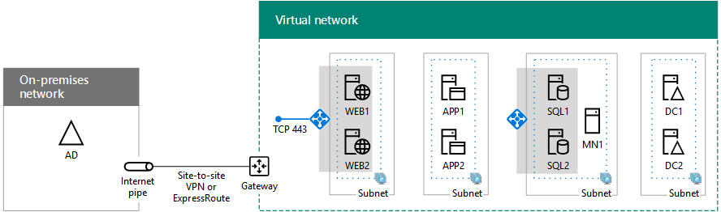

# Deploying SharePoint Server 2016 with SQL Server AlwaysOn Availability Groups in Azure

[!INCLUDE[appliesto-xxx-2016-xxx-xxx-md](../includes/appliesto-xxx-2016-xxx-xxx-md.md)]
  
Step through the deployment an intranet-only, high availability SharePoint Server 2016 farm in Azure with these virtual machines:
  
- Two SharePoint front end and distributed cache servers
    
- Two SharePoint application and search servers
    
- One cluster majority node server
    
- Two domain controllers
    
Here is the configuration, with placeholder names for each server.
  
**An intranet-only, high availability SharePoint Server 2016 farm in Azure**

  
Two virtual machines for each role ensure high availability. All of the virtual machines are in a single cross-premises Azure virtual network. Each group of virtual machines for a specific role is in its own subnet and availability set.
  
> [!NOTE]
> Because this VNet is connected to the on-premises network, this configuration does not include jumpbox or monitoring virtual machines on a management subnet. For more information, see [Running Windows VMs for an N-tier architecture](/azure/architecture/reference-architectures/n-tier/n-tier-sql-server). 
  
## Bill of materials

This baseline configuration requires the following set of Azure services and components:
  
- Nine virtual machines.
    
- Four availability sets.
    
- One cross-premises virtual network with five subnets.
    
- One Azure subscription.
    
Here are the virtual machines and their default sizes for this configuration.
  
|**Item**|**Virtual machine description**|**Gallery image**|**Default size**|
|:-----|:-----|:-----|:-----|
|1.    |First domain controller    |Windows Server 2016 Datacenter    |D2    |
|2.    |Second domain controller    |Windows Server 2016 Datacenter    |D2    |
|3.    |First database server    |Microsoft SQL Server 2016 Enterprise - Windows Server 2016    |DS4    |
|4.    |Second database server    |Microsoft SQL Server 2016 Enterprise - Windows Server 2016    |DS4    |
|5.    |Majority node for the cluster    |Windows Server 2016 Datacenter    |D2    |
|6.    |First SharePoint application and search server    |Microsoft SharePoint Server 2016 Trial - Windows Server 2012 R2    |DS4    |
|7.    |Second SharePoint application and search server    |Microsoft SharePoint Server 2016 Trial - Windows Server 2012 R2    |DS4    |
|8.    |First SharePoint front end and distributed cache server    |Microsoft SharePoint Server 2016 Trial - Windows Server 2012 R2    |DS4    |
|9.    |Second SharePoint front end and distributed cache server    |Microsoft SharePoint Server 2016 Trial - Windows Server 2012 R2    |DS4    |
   
To compute the estimated costs for this configuration, see the [Azure pricing calculator](https://azure.microsoft.com/pricing/calculator/). 
  
> [!NOTE]
> The Azure Pricing Calculator does not include the additional costs for the SQL Server license for the two virtual machines running SQL Server 2016 Enterprise. See [Virtual Machines Pricing-SQL](https://azure.microsoft.com/pricing/details/virtual-machines/#Sql) for more information. 
  
## Phases of deployment

You deploy this SharePoint Server 2016 farm with the following phases:
  
- [SharePoint Intranet Farm in Azure Phase 1: Configure Azure](/sharepoint/administration/sharepoint-intranet-farm-in-azure-phase-1-configure-azure)
    
    Create resource groups, availability sets, and a cross-premises virtual network.
    
- [SharePoint Intranet Farm in Azure Phase 2: Configure domain controllers](/sharepoint/administration/sharepoint-intranet-farm-in-azure-phase-2-configure-domain-controllers)
    
    Create and configure replica Windows Server Active Directory (AD) domain controllers
    
    > [!NOTE]
    > SharePoint Server 2016 also supports the use of [Azure Active Directory (AD) Domain Services](/azure/active-directory-domain-services/active-directory-ds-overview) as a substitute for virtual machines running as domain replicas. However, at this time, this deployment guide only describes the use of virtual machine-based replica domain controllers. 
  
- [SharePoint Intranet Farm in Azure Phase 3: Configure SQL Server Infrastructure](/sharepoint/administration/sharepoint-intranet-farm-in-azure-phase-3-configure-sql-server-infrastructure)
    
    Create and configure the SQL Server virtual machines, prepare them for use with SharePoint, and create the cluster.
    
- [SharePoint Intranet Farm in Azure Phase 4: Configure SharePoint servers](/sharepoint/administration/sharepoint-intranet-farm-in-azure-phase-4-configure-sharepoint-servers)
    
    Create and configure the four SharePoint server virtual machines.
    
- [SharePoint Intranet Farm in Azure Phase 5: Create the availability group and add the SharePoint databases](/sharepoint/administration/sharepoint-intranet-farm-in-azure-phase-5-create-the-availability-group-and-add)
    
    Prepare databases and create a SQL Server AlwaysOn availability group.
    
This configuration is a prescriptive, phase-by-phase guide for a predefined architecture to create a highly available intranet SharePoint Server 2016 farm in Azure infrastructure services. Keep the following in mind:
  
- If you are an experienced SharePoint implementer, feel free to adapt the instructions in phases 3 through 5 and build the farm that best suits your needs. 
    
- If you already have an existing Azure hybrid cloud deployment, feel free to adapt or skip the instructions in phases 1 and 2 and host the new SharePoint farm on the appropriate set of subnets. 
    
To build a dev/test environment or a proof-of-concept of this configuration, see [Intranet SharePoint Server 2016 in Azure dev/test environment](intranet-sharepoint-server-2016-in-azure-dev-test-environment.md).
  
## Next step

Start the configuration with [SharePoint Intranet Farm in Azure Phase 1: Configure Azure](/sharepoint/administration/sharepoint-intranet-farm-in-azure-phase-1-configure-azure).
  
## See also

#### Concepts

[Install SharePoint Server](../install/install.md)
#### Other Resources

[SharePoint Server 2016 in Microsoft Azure](sharepoint-server-2016-in-microsoft-azure.md)
  
[Designing a SharePoint Server 2016 farm in Azure](designing-a-sharepoint-server-2016-farm-in-azure.md)

