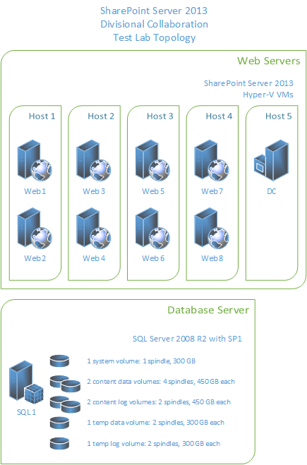
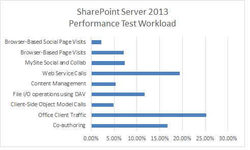
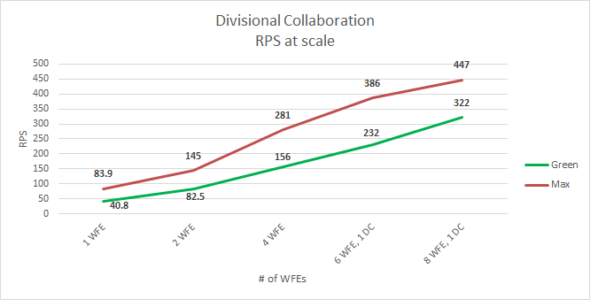
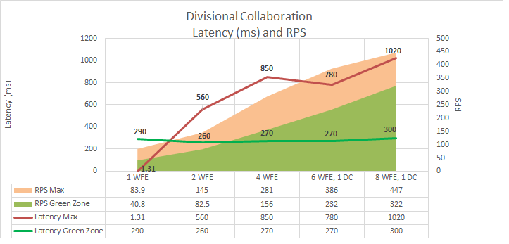
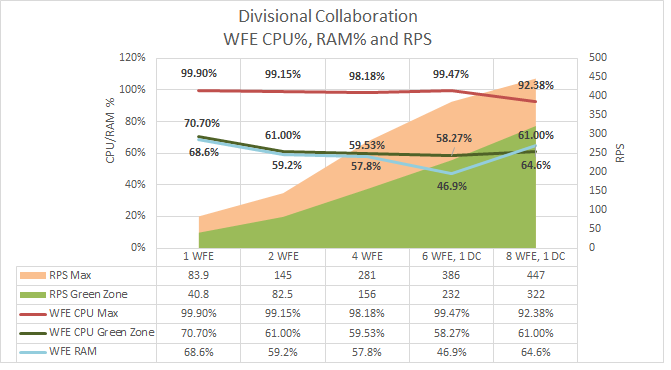
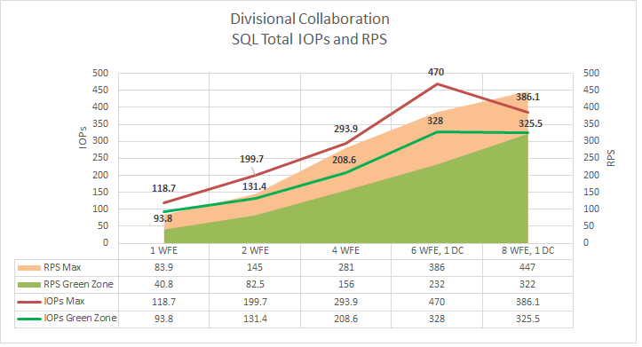
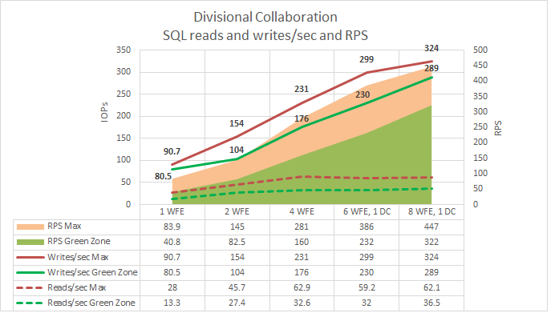
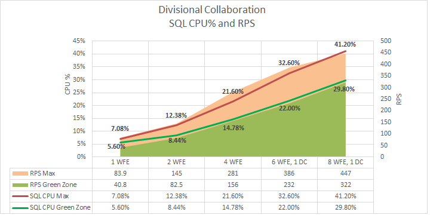

# Estimate performance and capacity requirements for divisional collaboration environments (SharePoint Server 2013)

[!INCLUDE[appliesto-2013-xxx-xxx-xxx-md](../includes/appliesto-2013-xxx-xxx-xxx-md.md)] 
  
This article describes guidance about performance and capacity planning for a divisional collaboration solution that is based on SharePoint Server 2013. The following information is included in this article:
  
- Test lab environment specifications, such as hardware, farm topology, and configuration
    
- The test farm workload and dataset that generated the test load
    
- Test results and analysis that demonstrate and explain trends in throughput, latency, and hardware demand under load at specific scale points.
    
Use the information in this article to understand the characteristics of the scenario under both normal and peak loads, and how performance trends change when farm servers are scaled out. This article can also help you estimate an appropriate starting point for your planned architecture, and understand things to consider when you develop a plan to maintain acceptable levels of performance under peak load.
  
    
## Introduction

This article outlines how to scale out servers in a SharePoint Server 2013 divisional collaboration solution. A divisional collaboration solution is a SharePoint Server 2013 deployment that has fewer computers involved in the collaborative activities than an enterprise collaboration solution. This article assumes that a division is an organization inside an enterprise that has 1,000 to 10,000 employees. 
  
Diverse scenarios will have different requirements. Therefore, supplement this guidance with additional testing on your own hardware and in your own environment. If your planned design and workload resembles the environment described in this article, you can draw conclusions about the performance to expect when you scale your environment up and out.
  
> [!IMPORTANT]
> Test results in this article were produced in a test lab that used a workload, dataset, and architecture to simulate a production environment under highly controlled conditions. While we carefully designed these tests, the performance characteristics of a test lab are never the same as the behavior of a production environment. These test results do not represent the performance and capacity characteristics of a production farm. Instead, the test results demonstrate observed trends in throughput, latency, and hardware demand. Use the analysis of the observed data to help you plan capacity and manage your own farm. 
  
As you read this article, you'll learn about the following:
  
- **Specifications**, which include hardware, topology, and configuration
    
- The **workload**, which includes an analysis of the demand on the farm, the number of users, and usage characteristics
    
- The **dataset**, such as database sizes and content types
    
- Test results and analysis to **scale out web servers**
    
Before you read this article, read the following articles to make sure that you understand the key concepts behind capacity management in [Software boundaries and limits for SharePoint 2013](../install/software-boundaries-and-limits.md)SharePoint Server 2013. 
  
- [Capacity management and sizing for SharePoint Server 2013](capacity-management-and-sizing-for-sharepoint-server-2013.md)
    
- [Estimate performance and capacity requirements for enterprise intranet collaboration environments (SharePoint Server 2013)](enterprise-intranet-collaboration-performance-and-capacity.md)
    
## Glossary

The following list contains definitions for key terms found in this article.
  
- **RPS:** Requests per second. RPS is the number of requests that a farm or server receives in one second. This is a common measurement of server and farm load. 
    
    > [!NOTE]
    > Requests differ from page loads. A page contains several components, each of which creates one or more requests when a browser loads the page. A single page load creates several requests. Normally, authentication checks and events that use insignificant resources are not counted in RPS measurements. 
  
- **Green Zone:** Green Zone represents a defined set of load characteristics under normal operating conditions, up to expected daily peak loads. A farm that operates in this range should be able to sustain response times and latency that are within acceptable parameters. 
    
    This is the state at which the server can maintain the following set of criteria:
    
  - The server-side latency for at least 75% of the requests is less than 1 second.
    
  - All farm servers maintain an average CPU utilization of less than 60%.
    
    > [!NOTE]
    > Our lab environment did not run an active search crawl. So we kept the database server close to 50% CPU utilization or lower to reserve 10% for the search crawl load. This assumes SQL Server Resource Governor is used in production to limit Search crawl load to 10% CPU. 
  
  - Failure rate is less than 0.01%.
    
- **Red Zone (Max):** Red Zone represents a defined set of load characteristics under peak operating conditions. At Red Zone, the farm experiences very high transient resource demands that it can sustain only for limited periods before failures and other performance and reliability issues occur. 
    
    This is the state at which the server can maintain the following set of criteria for a limited duration:
    
  - HTTP request throttling feature is enabled, but no 503 errors (Server Busy) are returned.
    
  - Failure rate is less than 0. 1%.
    
  - The server-side latency is less than 3 seconds for at least 75% of the requests.
    
  - All farm servers (excluding database servers) maintain an average CPU utilization of less than approximately 90%.
    
  - Database server average CPU utilization is less than approximately 50%, which allows for ample overhead to be reserved for the Search crawl load.
    
- **AxBxC (Graph notation):** The number of web servers, application servers, and database servers respectively in a farm. For example, 10x1x1 means that this environment has 10 web servers, 1 application server, and 1 database server. 
    
- **MDF and LDF:** SQL Server physical files. For more information, see [Files and Filegroups Architecture](https://go.microsoft.com/fwlink/p/?LinkID=164499).
    
## Overview

This section provides an overview of our scaling approach and test methodology.
  
### Scaling approach

This section describes the approach that we took to scale our lab environment. This approach will enable you to find the best configuration for your workload:
  
- We scaled out the web servers until four web servers were being used. Each server runs the Distributed Cache Service.
    
- We added a dedicated server that runs the Distributed Cache Service.
    
- We disabled the Distributed Cache Service on the web servers.
    
- We scaled out additional web servers to the maximum for the scope of testing.
    
### Methodology and test notes

Because this article contains results from a test lab environment, we could control certain factors to show specific aspects of performance for this workload. In addition, certain elements of the production environment, which are in the following list, were left out of the lab environment to simplify the overhead of testing.
  
> [!NOTE]
> We recommend that you include these elements in production environments. 
  
- Between test runs, we modified only one variable at a time to make it easy to compare results between test runs. 
    
- The database servers were not part of a cluster because redundancy was not necessary for the purposes of these tests. 
    
- Search crawl was not running during the tests. Of course, it might be running in a production environment. To take this into account, we lowered the SQL Server CPU utilization in our definitions of 'Green Zone' and 'Red Zone' to accommodate the resources that a search crawl would usually consume during testing.
    
## Specifications

This section provides details about the hardware, software, topology, and configuration of our test lab environment.
  
### Hardware

The following sections describe the hardware that we used in our test lab environment.
  
> [!IMPORTANT]
> We used Hyper-V hosts to virtualize all web servers and application servers in our test lab. Database servers were not virtualized. The physical host hardware and virtual machine virtual hardware are described separately in this section. 
  
#### Hyper-V Hosts

We used six identically configured Hyper-V hosts for our tests. Each host runs one to two virtual machines.
  
|****Host Hardware****|**Value**|
|:-----|:-----|
|**Processors**   |2 Quad-core 2.49 GHz processors    |
|**RAM**   |32 GB    |
|**Operating System**   |Windows Server 2008 R2 SP1    |
|**Number of network adapters**   |2    |
|**Network adapter speed**   |1 Gigabit    |
   
#### Virtual web servers and application servers

Our test farm uses eight virtual web servers. We also use a dedicated virtual server that runs the Distributed Cache Service.
  
> [!NOTE]
> Production environments typically deploy dedicated servers that run the Distributed Cache Service in a highly available configuration. In our test lab environment we use a single dedicated server for Distributed Cache because high availability is not an important factor. 
  
|**VM Hardware**|**WFE1-8 and DC1**|
|:-----|:-----|
|**Processors**   |4 virtual processors    |
|**RAM**   |12 GB    |
|**Operating system**   |Windows Server 2008 R2 SP1    |
|**Size of the SharePoint drive**   |100 GB    |
|**Number of network adapters**   |2    |
|**Network adapter speed**   |10 Gigabit (inter-host traffic limited to host network adapter speed)    |
|**Authentication**   |Windows NTLM    |
|**Load balancer type**   |F5 Big IP    |
|**Services running locally**   |WFE 1-8: Basic Federated Services. This includes the following: SharePoint Timer Service, Trace Service, Word Automation Services, Excel Services, and Microsoft SharePoint Foundation Sandboxed Code Service.    DC1: Distributed Cache Service.    |
   
#### Database servers

In our tests we use one physical database server and ran the default SQL Server instance that stores the SharePoint databases. We do not track the logging database in this article.
  
> [!NOTE]
> If you enable usage reporting, we recommend that you store the logging database on a separate Logical Unit Number (LUN). Large deployments and some medium deployments might require a dedicated logging database server to accommodate the demand on the processor that a high volume of logging events generates. 
  
In our lab environment we constrained the logging and stored the logging database in a separate SQL Server instance.
  
|**Database Server - Default Instance**|**SQL Server**|
|:-----|:-----|
|**Processors**   |4 Quad-core 2.4 GHz processors    |
|**RAM**   |32 GB    |
|**Operating system**   |Windows Server 2008 R2 SP1    |
|**Storage and geometry**   |Direct Attached Storage (DAS)    1 x system volume (RAID0, 1 spindle, 300 GB)    2 x content data volumes (RAID0, 4 spindles, 450 GB each)    2 x content log volumes (RAID0, 2 spindles, 450 GB each)    1 x temp data volume (RAID0, 2 spindles, 300 GB each)    1 x temp log volume (RAID0, 2 spindles, 300 GB each)    |
|**Number of network adapters**   |1    |
|**Network adapter speed**   |1 Gigabit    |
|**Authentication**   |Windows NTLM    |
|**Software version**   |SQL Server 2008 R2    |
   
### Topology

The following diagram shows the topology in our test lab environment.
  

  
### Configuration

The following table shows the significant configuration changes that we made to the database server in our lab environment. These configuration changes allow for optimal test performance and clear relationships between test parameters and results. Note that the MAXDOP setting is required for SharePoint Server 2013. The other setting changes only apply to our test lab environment and may not affect your production environment.
  
|**Setting**|**Value**|**Notes**|
|:-----|:-----|:-----|
|**Site collection**   |179 (total in environment)    |The site collections in our test environment use default settings and Windows claims authentication.    |
|**BLOB caching**   |On    |The default is Off. If you enable BLOB caching, you improve server efficiency by reducing calls to the database server for static page resources that browsers may request frequently.    |
|**Max degree of parallelism (MAXDOP)**   |1    |This parameter is set on the SQL Server instance or instances that contain SharePoint Server 2013 content databases. The default value is 0, which enables SQL Server to determine the maximum degree of parallelism. SharePoint Server 2013 requires MAXDOP to be set to 1 for SQL Server instances that contain SharePoint Server 2013 databases.    For more information about how to configure the MAXDOP setting for SQL Server 2008 R2, see [max degree of parallelism Option](https://go.microsoft.com/fwlink/p/?LinkId=189030).    For information about how to configure the MAXDOP setting for SQL Server 2012, see [Configure the max degree of parallelism Server Configuration Option](https://go.microsoft.com/fwlink/p/?LinkId=403867).    |
   
### Workload

This section explains the lab tests that we ran against SharePoint Server 2013. The test details are typical of a divisional collaboration environment.
  

  
### Dataset

The dataset that we used for our test lab environment represents a typical divisional collaboration environment. This dataset contains various site collections, sites, lists, libraries, file types, and file sizes.
  
|**Dataset Characteristics**|**Value**|
|:-----|:-----|
|**Database size (combined)**   |174 GB    |
|**MDF size**   |154 GB    |
|**LDF size**   |20 GB    |
|**BLOB size**   |152 GB    |
|**Number of content databases**   |2    |
|**Number of site collections**   |179    |
|**Number of web applications**   |1    |
|**Number of sites**   |1,471    |
   
## Results and analysis

The following results are ordered based on the scaling approach that is described in the [Overview](#overview) section. 
  
### Web server scale out

The following sections describe the test results which we obtained when we scaled out the number of web servers in our test lab environment.
  
#### Test methodology

- Add web server that use the same hardware specifications, and run the test again without changes to the farm or test parameters.
    
- Measure the RPS, latency, and resource utilization on each server in the test farm.
    
#### Analysis

In our tests we found the following:
  
- The environment scaled to ten web servers per database server. The increase in throughput was relatively linear.
    
- Even up to the maximum tested scale of ten web servers, the addition of more database servers did not increase throughput. The bottleneck was generally confined to web server resources.
    
- The average latency at Green Zone was almost constant throughout the whole test. The number of web servers and throughput did not affect Green Zone latency. Red Zone latency data shows an expected trend line. Latency is very high at a single web server. A curve between 2 and 8 web servers remains comfortably within Red Zone criteria.
    
    > [!NOTE]
    > Latency may be slightly affected when you move the Distributed Cache service from a farm's web servers to a server that is dedicated to the Distributed Cache. This may occur because Distributed Cache traffic, which was previously internal to each web server, begins to cross the network. Test scale-out performance in your own environment to determine whether this tradeoff is significant. Note that latency in our test environment increased slightly when the Distributed Cache service was migrated to a dedicated server. Latency decreased with each added web server as the nominal added latency was offset by the decreased processing and memory load on the web servers. > For more information about Distributed Cache capacity planning, see [Plan for feeds and the Distributed Cache service in SharePoint Server](plan-for-feeds-and-the-distributed-cache-service.md). 
  
- Because of improvements in caching and database usage characteristics in SharePoint Server 2013, the average load on the database server layer is low. We found that during our tests it was not necessary to scale out the database servers.
    
- Performance gains when you add virtual web servers depend partly on host hardware resources and on the resource usage of other virtual computers that are running on the same host. Virtual servers require additional planning and management strategies that are specific to virtualization.
    
    For more information about Hyper-V performance and capacity planning, see [Hyper-V virtualization requirements for SharePoint 2013](/previous-versions/office/sharepoint-server-2010/ff607795(v=office.14)) and [Use best practice configurations for the SharePoint 2013 virtual machines and Hyper-V environment](/previous-versions/office/sharepoint-server-2010/ff621103(v=office.14)).
    
> [!NOTE]
> Conclusions in this section are specific to the hardware that makes up the environment. The environment might have achieved the same throughput if the environment used more but less powerful Hyper-V host servers, or fewer but more powerful Hyper-V host servers. An increase of hardware resources on the database server wouldn't greatly affect the results. 
  
#### Results, graphs and charts

The x axis of the following graphs show the change in the number of web servers in the farm. The scale starts with one virtual web server and one physical database server (1x1). The maximum is eight virtual web servers, one dedicated virtual Distributed Cache server (added at four web servers) and one physical database server (8x1x1).
  
> [!NOTE]
> The graphs in this section represent the average values for each data point over the duration of the test. All graphs include the RPS baseline for both Green and Red zones to show the relationship between RPS and factors such as latency, server resource utilization, and SQL Server disk usage. 
  
 **1. RPS**
  
The following graph shows how scaling out affects the RPS baseline. 
  

  
 **2. Latency**
  
The following graph shows how scaling out affects latency. Note that Green Zone latency remains almost flat, but Red Zone latency shows increases that are within acceptable limits.
  

  
 **3. Web server processor and memory utilization**
  
The following graph shows how scaling out affects average processor and memory utilization on the web servers. Note that Green Zone processor utilization and average memory utilization remains relatively constant as RPS increases.
  
The trend of processor utilization in the Red Zone is down. This downward trend reflects the fact that the average demand of the web server's processor at maximum load gradually declines as the number of servers increases.
  

  
 **4. SQL Server I/O operations per second (IOPs) and processor utilization**
  
The following graphs show how average disk IOPs (both total and reads/writes) and the values of processor utilization change as the number of web servers is scaled out. We use the following performance counters to measure IOPs values:
  
- PhysicalDisk: Disk Reads / sec
    
- PhysicalDisk: Disk Writes / sec
    
The values of each counter over the duration of the test are averaged and then added together to produce total IOPs.
  
> [!NOTE]
> Because the data for SQL Server memory utilization wasn't available at the time of our tests, this data is not included in this graph. 
  
> [!IMPORTANT]
> These results for IOPs tests are not representative of a production environment because our dataset was much smaller than that of a production farm. This made it possible for a larger percentage of the data to be cached at the web servers than would be possible in a production environment. Because we cached a larger percentage of the data at the web server, the IOPs results in this section are calculated averages that are based on available test data. We expect that our IOPs results are generally lower than IOPs in a production environment. Thorough testing of your own farm in a pilot environment may produce different results. 
  
Note that in the graphs in this section, both IOPs and database server processor utilization show a drop at six front-end web servers, while RPS continues to increase. This variation is also reflected in web server processor utilization as shown in the previous graph.
  
This shows that the scale of the farm has reached a point at which maximum pressure on the farm server resources was achieved by using the baseline load and dataset. A lower average utilization of server resources is required to support the load on the farm.
  
It is possible to conclude the following from this trend:
  
- Had we increased the test load at the sixth web server scale point, greater RPS could have been achieved while maintaining a flat curve in the utilization of server resources.
    
- Had we scaled out the number of web servers further while maintaining the same test load, RPS would have continued to increase while pressure on server resources would have continued a downward trend.
    
1. **SQL Server Total IOPs**
    
    The following graph shows how scaling out affects total IOPs.
    
     
  
2. **SQL Server IOPs broken down into read and write operations**
    
    The following graph shows how scaling out affects IOPs for reads per second and writes per second.
    
     
  
3. **SQL Server processor utilization**
    
    The following graph shows how scaling out affects SQL Server processor utilization.
    
     
  
## See also

#### Concepts

[Performance planning in SharePoint Server 2013](performance-planning-in-sharepoint-server-2013.md)
  
[Performance and capacity test results and recommendations (SharePoint Server 2013)](performance-and-capacity-test-results-and-recommendations-for-sharepoint-2013.md)
  
[Estimate performance and capacity requirements for enterprise intranet collaboration environments (SharePoint Server 2013)](enterprise-intranet-collaboration-performance-and-capacity.md)

