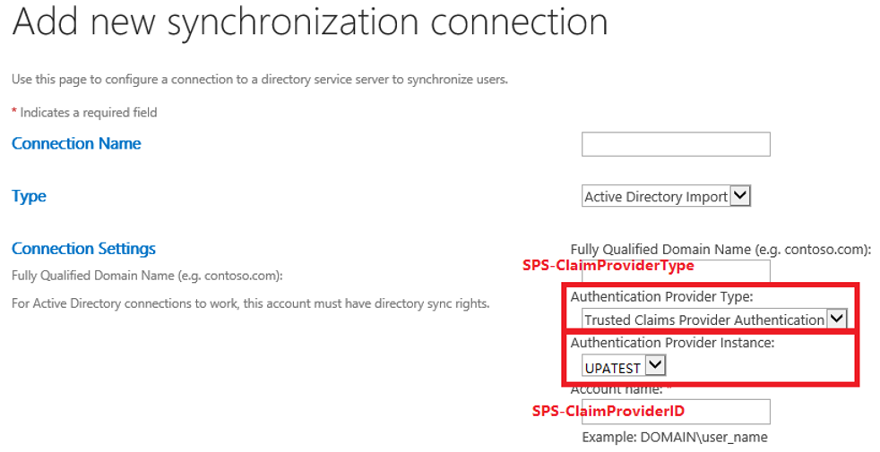
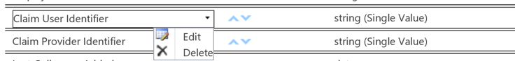
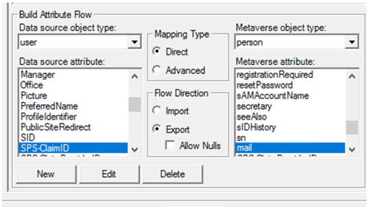

# Enhanced People Picker for modern authentication

[!INCLUDE[appliesto-xxx-xxx-xxx-SUB-xxx-md](../includes/appliesto-xxx-xxx-xxx-SUB-xxx-md.md)]

When modern ("trusted identity provider") authentication such as Security Assertion Markup Language (SAML) 1.1 or OpenID Connect (OIDC) 1.0 is used, the People Picker control can't search, resolve, and validate users and groups.  Instead, the default behavior is to resolve any value that is entered, even if it's not a valid claim.  In previous versions of SharePoint Server, the only solution was to use a Custom Claims Provider.

In SharePoint Server Subscription Edition (SPSE), the People Picker has been enhanced to allow resolving users and groups based on their profiles in the User Profile Application (UPA, aka: UPSA).  The UPA must be configured to synchronize users and groups from the trusted identity provider membership store. This allows the People Picker to resolve valid users and groups without requiring a Custom Claims Provider.

> [!NOTE] 
> Using a Custom Claims Provider in SharePoint Server Subscription Edition is still a valid solution to the People Picker problem.  If the limitations of the UPA-backed claims provider discussed in this article are too limiting for your organization, see [Create a claims provider in SharePoint](/sharepoint/dev/general-development/how-to-create-a-claims-provider-in-sharepoint)

> [!IMPORTANT] 
> The default user profile import engine included with SharePoint Server, called "Active Directory Import" (AD Import), can only be used to import user profiles from on-premises Active Directory domains and forests.  It cannot be configured to import user profiles from Microsoft Entra ID.  If you are using OIDC authentication backed by Entra ID, you may consider using a Custom Claims Provider to provide People Picker functionality.  

Following are the configuration steps to make the UPA-backed People Picker work.

## Step 1: Add a UPA-Backed claim provider to your SPTrustedIdentityTokenIssuer

> [!NOTE] 
> For SAML 1.1 trusted identity token issuers, you can add a UPA-backed claim provider when you create the token issuer, or you can assign one later.  
> For OIDC 1.0 trusted identity token issuers, the token issuer must be created first, then you can assign the claim provider.  See [Add a UPA backed claim provider to an existing SPTrustedIdentityTokenIssuer](#add-a-upa-backed-claim-provider-to-an-existing-sptrustedidentitytokenissuer)

### Create a new SPTrustedIdentityTokenIssuer and assign a UPA backed claim provider at the same time

> [!NOTE] 
> This is only available for SAML 1.1 trusted identity token issuers.

Create a new token issuer using the [New-SPTrustedIdentityTokenIssuer](/powershell/module/sharepoint-server/new-sptrustedidentitytokenissuer) PowerShell cmdlet and assign a claim provider by adding the UseUPABackedClaimProvider switch.

```powershell
New-SPTrustedIdentityTokenIssuer
    -ClaimsMappings <SPClaimMappingPipeBind[]> 
    -Description <String> 
    -IdentifierClaim <String> 
    -Name <String>
    -Realm <String> 
    -SignInUrl <String> 
    [-AssignmentCollection <SPAssignmentCollection>]
    -ImportTrustCertificate <X509Certificate2>
    [-UseWReply]
    [-Confirm] [-RegisteredIssuerName <String>]
    [-SignOutUrl <String>] 
    [-WhatIf] [<CommonParameters>]
    [-UseUPABackedClaimProvider]
```

Following three parameters need special attention:<br/>

- **ClaimsMappings**<br/>
`ClaimsMappings` specifies the mapping of claims from the original token to a SharePoint token. By using this parameter, SharePoint understands how to generate a SharePoint token when given a specific token from a user profile service application property.<br/>
It accepts a list of `ClaimTypeMapping` objects, which are created by the [New-SPClaimTypeMapping](/powershell/module/sharepoint-server/new-spclaimtypemapping) cmdlet. Following are examples of `ClaimTypeMapping` objects of different types of tokens and these objects can be provided to the `ClaimsMappings` parameter:


```powershell
$emailClaimMap = New-SPClaimTypeMapping -IncomingClaimType "http://schemas.xmlsoap.org/ws/2005/05/identity/claims/emailaddress" -IncomingClaimTypeDisplayName "EmailAddress" -SameAsIncoming
$upnClaimMap = New-SPClaimTypeMapping -IncomingClaimType "http://schemas.xmlsoap.org/ws/2005/05/identity/claims/upn" -IncomingClaimTypeDisplayName "UPN" -SameAsIncoming
$roleClaimMap = New-SPClaimTypeMapping -IncomingClaimType "http://schemas.microsoft.com/ws/2008/06/identity/claims/role" -IncomingClaimTypeDisplayName "Role" -SameAsIncoming
$sidClaimMap = New-SPClaimTypeMapping -IncomingClaimType "http://schemas.microsoft.com/ws/2008/06/identity/claims/groupsid" -IncomingClaimTypeDisplayName "SID" -SameAsIncoming
```

- **IdentifierClaim** <br/>
The `IdentifierClaim` parameter specifies which claim type will be used as the identifier claim (typically email or UPN). It can be set to the `InputClaimType` of the `ClaimTypeMapping` object created from the [New-SPClaimTypeMapping](/powershell/module/sharepoint-server/new-spclaimtypemapping) cmdlet.


```powershell
-IdentifierClaim $emailClaimMap.InputClaimType
```
- **UseUPABackedClaimProvider** <br/>
This switch parameter enables the People Picker to search and select users and groups from the User Profile Application service. It also creates a `SPClaimProvider`, which has the same name as the `SPTrustedIdentityTokenIssuer`.

> [!NOTE]
> The "UseUPABackedClaimProvider" parameter can't be used to create an OIDC SPTrustedIdentityTokenIssuer. It can only be used to create a SAML SPTrustedIdentityTokenIssuer.
  
**Example:**

```powershell
# Create a new trusted identity token issuer, and assign a UPA-backed claim provider at the same time
New-SPTrustedIdentityTokenIssuer -Name "UPATest" -Description "Contoso.local" -ClaimsMappings $emailClaimMap -IdentifierClaim $emailClaimMap.InputClaimType -UseUPABackedClaimProvider
```

### Add a UPA backed claim provider to an existing SPTrustedIdentityTokenIssuer
The above example shows how to assign a UPA-backed claim provider at the time of trusted identity token issuer creation (for SAML providers only).  If you have an existing trusted identity token issuer (either SAML or OIDC) and would like to add a UPA-backed claim provider to it, use the following example.

> [!NOTE] 
> The following PowerShell script samples vary slightly between SAML 1.1 and OIDC 1.0 authentication providers.  Please choose the correct sample.

**Example for SAML**  

```powershell
# Get the existing trusted identity token issuer named "SAML"
$stsidp = Get-SPTrustedIdentityTokenIssuer "SAML"

# Create the new UPA-backed claim provider 
$claimprovider = New-SPClaimProvider -AssemblyName "Microsoft.SharePoint, Version=16.0.0.0, Culture=neutral, publicKeyToken=71e9bce111e9429c"  -Description "UPA-Backed" -DisplayName "UPA-Backed Claim Provider" -Type "Microsoft.SharePoint.Administration.Claims.SPTrustedBackedByUPAClaimProvider" -TrustedTokenIssuer $stsidp

# Set the trusted identity token issuer to use the new claim provider
Set-SPTrustedIdentityTokenIssuer $stsidp -ClaimProvider $claimprovider
```

**Example for OIDC**  

```powershell
# Get the existing trusted identity token issuer named "OIDC"
$stsidp = Get-SPTrustedIdentityTokenIssuer "OIDC"

# Create the new UPA-backed claim provider 
$claimprovider = New-SPClaimProvider -AssemblyName "Microsoft.SharePoint, Version=16.0.0.0, Culture=neutral, publicKeyToken=71e9bce111e9429c"  -Description "UPA-Backed" -DisplayName "UPA-Backed Claim Provider" -Type "Microsoft.SharePoint.Administration.Claims.SPTrustedBackedByUPAClaimProvider" -TrustedTokenIssuer $stsidp

# Set the trusted identity token issuer to use the new claim provider
Set-SPTrustedIdentityTokenIssuer $stsidp -ClaimProvider $claimprovider -IsOpenIDConnect
```

## Step 2: Synchronize profiles to UPSA

You can now start synchronizing user profiles into the SharePoint User Profile Service Application (UPSA) from the identity provider that is used in the organization so that the newly created claim provider can work on the correct data set.

Following are the two ways to synchronize user profiles into the SharePoint User Profile Service Application:

- Use SharePoint Active Directory Import (AD Import) with **Trusted Claims Provider Authentication** as the **Authentication Provider Type** in the synchronization connection setting. To use AD Import, see [Manage user profile synchronization in SharePoint Server](/sharepoint/administration/manage-profile-synchronization).

    

    > [!IMPORTANT] 
    > AD Import can only be used to import user profiles from on-premises Active Directory domains and forests.  It cannot be configured to import profiles from Entra ID.  If you are using OIDC authentication backed by Entra ID, you may instead consider using a Custom Claims Provider to provide People Picker functionality.  

- Use Microsoft Identity Manager (MIM). To use MIM, see [Microsoft Identity Manager in SharePoint Servers 2016 and 2019](/sharepoint/administration/microsoft-identity-manager-in-sharepoint-server-2016).
- There should be two agents inside the MIM synchronization Manager UX after MIM is set up. One agent is used to import user profiles from the source IDP to the MIM database. And another agent is used to export user profiles from the MIM database to the SharePoint User Profile service application.

During the synchronization, provide the following properties to the User Profile service application:

### a. SPS-ClaimID

- Choose unique identity property in the source that will map to the **SPS-ClaimID** property in the User Profile service application (preferred **Email** or **User Principal Name**).
- This should be the value for the corresponding **IdentifierClaim** parameter when the trusted identity token issuer was created using the [New-SPTrustedIdentityTokenIssuer](/powershell/module/sharepoint-server/new-sptrustedidentitytokenissuer) cmdlet.

For AD Import synchronization, the **Central Administration -> Application Management -> Manage service applications -> User Profile Service Application -> Manage User Properties** UX will allow administrators to edit the **SPS-ClaimID** property to indicate which attribute in the source identity provider should be synchronized to **SPS-ClaimID**. This should be the property used as the identifier claim in the trusted identity token issuer. For example, if the identifier claim is email, and users email addresses are stored in the "mail" attribute in Active Directory, set **Claim User Identifier** as **"mail"** in this UX.

> [!NOTE]
> The display name of **SPS-ClaimID** is **Claim User Identifier** in the UX and administrator can customize the display names.
>
> If you are unsure about your identifier claim, you can check by running this PowerShell:
> `$trust = Get-SPTrustedIdentityTokenIssuer`
> `$trust.IdentityClaimTypeInformation` 




For MIM synchronization, map your identifier claim (usually **Email** or **User Principal Name**) to **SPS-ClaimID** in the MIM database to the SharePoint User Profile service application agent:

- In the MIM synchronization Service Manager, select the agent and open the **Configure Attribute Flow** UX. You can map **mail** to **SPS-ClaimID**.

   

### b. SPS-ClaimProviderID and SPS-ClaimProviderType

> [!NOTE] 
> For AD Import synchronization, you only need to update the "Claim User Identifier" (SPS-ClaimID) property mapping. Unlike MIM synchronization, you do NOT need to map "Claim Provider Identifier" (SPS-ClaimProviderID) and "Claim Provider Type" (SPS-ClaimProviderType).

For MIM synchronization, set these two properties in the **Configure Attribute Flow** UX for the MIM database to SharePoint User Profile service application agent:

- Set **SPS-ClaimProviderType** to **Trusted** as Constant type.
- Set **SPS-ClaimProviderID** to the provider name using the [New-SPTrustedIdentityTokenIssuer](/powershell/module/sharepoint-server/new-sptrustedidentitytokenissuer) cmdlet.

  

## Step 3: Make groups searchable

> [!IMPORTANT] 
>  Using the UPA-backed claims provider to resolve security groups only works if the groups Security Identifier (SID) is used, and the groups are imported into the User Profile Service Application.  
> If you are using OIDC authentication backed by Entra ID, be advised that cloud-only groups do not have a SID, nor can AD Import synchronize with Entra ID.  
> If you need to use cloud-only users or groups within your SharePoint site permissions, a Custom Claims Provider may be the only solution.  

To enable the People Picker control to work with security groups, complete the following steps:

1. Ensure that the Group object has a property named **SID** of type **groupsid** in the identity provider. <br/>If you don't already have a claim mapping for "groupSID", you can create a `ClaimTypeMapping` object using [New-SPClaimTypeMapping](/powershell/module/sharepoint-server/new-spclaimtypemapping) and then provide this object to [New-SPTrustedIdentityTokenIssuer](/powershell/module/sharepoint-server/new-sptrustedidentitytokenissuer) cmdlet with `-ClaimsMappings` parameter.

**Example:**

```powershell
# Add Group SID as a claim type to an existing trusted provider named "SAML"
$Trust = Get-SPTrustedIdentityTokenIssuer -Identity "SAML"
$Trust.ClaimTypes.Add("http://schemas.microsoft.com/ws/2008/06/identity/claims/groupsid")
$Trust.Update()

# Add a claim mapping for Group SID
$GroupSidClaimMap = New-SPClaimTypeMapping -IncomingClaimType "http://schemas.microsoft.com/ws/2008/06/identity/claims/groupsid" -IncomingClaimTypeDisplayName "Group SID" -SameAsIncoming
$Trust = Get-SPTrustedIdentityTokenIssuer "SAML"
Add-SPClaimTypeMapping –TrustedIdentityTokenIssuer $Trust -Identity $GroupSidClaimMaps
```

2. Synchronize **SID** property of groups from the identity provider to the **SID** property in User Profile Service Application.

    - For AD Import synchronization, the SID property will synchronize automatically from the source identity provider to the SharePoint User Profile Service Application.
    - For MIM synchronization, take the property mapping from the identity provider to MIM and then from MIM to the SharePoint User Profile service application so that MIM can synchronize the group **SID** from the identity provider to the SharePoint User Profile service application. The steps are similar to how the **SPS-ClaimID** property was mapped for user profiles, only in this case, the mappings for the "group" object type are updated.

        > [!Note]
        > For MIM synchronization, also map **sAMAccountName** to **accountName** for the Group object from MIM to the SharePoint User Profile service application.

## Step 4: Set properties as searchable in the UPSA

To make people picker work, the final step is to enable which properties will be searchable in User Profile Service Application.

Administrators can set which properties are searched by the People Picker by following this sample PowerShell script.

```powershell
# Get the UPA property list
$site = $(Get-SPWebApplication $WebApplicationName).Sites[0]
$context = Get-SPServiceContext $site
$psm = [Microsoft.Office.Server.UserProfiles.ProfileSubTypeManager]::Get($context)
$ps = $psm.GetProfileSubtype([Microsoft.Office.Server.UserProfiles.ProfileSubtypeManager]::GetDefaultProfileName([Microsoft.Office.Server.UserProfiles.ProfileType]::User))
$properties = $ps.Properties

# Set the proerties defined in $PropertyNames as searchable. 
# In this example, we set First Name, Last Name, claim ID, email address, and PreferredName as searchable for the People Picker.
$PropertyNames = 'FirstName', 'LastName', 'SPS-ClaimID', 'WorkEmail', 'PreferredName'
foreach ($p in $PropertyNames) {
    $property = $properties.GetPropertyByName($p)
    if ($property) {
        $property.CoreProperty.IsPeoplePickerSearchable = $true
        $property.CoreProperty.Commit()
        $property.Commit()
    }
}
```

To check which UPSA properties have been enabled for People Picker search, you can use the following PowerShell sample:
```powershell
# Get the UPA property list
$site = $(Get-SPWebApplication $WebApplicationName).Sites[0]
$context = Get-SPServiceContext $site
$psm = [Microsoft.Office.Server.UserProfiles.ProfileSubTypeManager]::Get($context)
$ps = $psm.GetProfileSubtype([Microsoft.Office.Server.UserProfiles.ProfileSubtypeManager]::GetDefaultProfileName([Microsoft.Office.Server.UserProfiles.ProfileType]::User))
$properties = $ps.Properties

# Set the proerties defined in $PropertyNames as searchable. 
# In this example, we set First Name, Last Name, claim ID, email address, and PreferredName as searchable for the People Picker.
$PropertyNames = 'FirstName', 'LastName', 'SPS-ClaimID', 'WorkEmail', 'PreferredName'
foreach ($p in $PropertyNames) {
    $property = $properties.GetPropertyByName($p)
    if ($property) {
        $property.CoreProperty.IsPeoplePickerSearchable = $true
        $property.CoreProperty.Commit()
        $property.Commit()
    }
}
```
