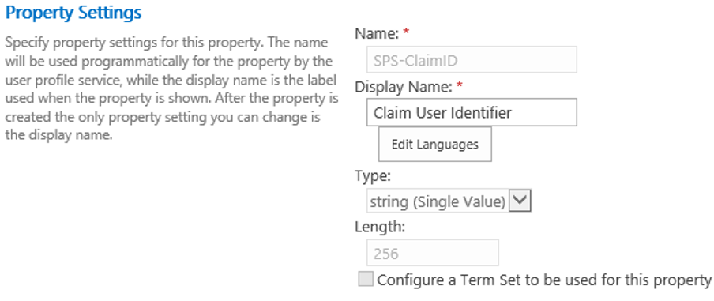
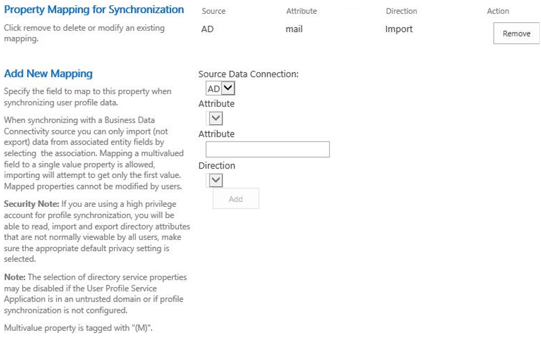

# Enhanced People Picker for modern authentication

[!INCLUDE[appliesto-xxx-xxx-xxx-SUB-xxx-md](../includes/appliesto-xxx-xxx-xxx-SUB-xxx-md.md)]

When modern authentication (a trusted identity provider) such as SAML 1.1 or OIDC 1.0 is used, the People Picker control can't search, resolve, and validate users and groups without writing a custom claim provider through C#.

In SharePoint Server Subscription Edition, the People Picker has been enhanced to allow resolving users and groups based on their profiles in the User Profile Application (UPA). UPA must be configured to synchronize users and groups from the trusted identity provider membership store. This allows the People Picker to only resolve valid users and groups without requiring a custom claims provider.

> [!IMPORTANT]
> This article describes how to setup UPA-backed people picker for SAML. For setting UPA-backed people picker for OIDC, see [**OIDC ADFS guide**](/SharePoint/security-for-sharepoint-server/oidc-1-0-authentication#step-7-set-up-people-picker) and [**OIDC AAD guide**](/SharePoint/security-for-sharepoint-server/oidc-1-0-authentication#step-7-set-up-people-picker-1).

Following are the configuration steps to make People Picker work.

## Step 1. Create a UPABacked SPTrustedIdentityTokenIssuer

Create a new token issuer using the [New-SPTrustedIdentityTokenIssuer](/powershell/module/sharepoint-server/new-sptrustedidentitytokenissuer) PowerShell cmdlet.

```powershell
New-SPTrustedIdentityTokenIssuer
    -ClaimsMappings <SPClaimMappingPipeBind[]> 
    -Description <String> 
    -IdentifierClaim <String> 
    -Name <String>
    -Realm <String> 
    -SignInUrl <String> 
    [-AssignmentCollection <SPAssignmentCollection>]
    -ImportTrustCertificate <X509Certificate2>
    [-UseWReply]
    [-Confirm] [-RegisteredIssuerName <String>]
    [-SignOutUrl <String>] 
    [-WhatIf] [<CommonParameters>]
    [-UseUPABackedClaimProvider]
```

Following three parameters need special attention:<br/>

- **ClaimsMappings**<br/>
`ClaimsMappings` specifies the mapping of claims from the original token to a SharePoint token. By using this parameter, SharePoint understands how to generate a SharePoint token when given a specific token from a user profile service application property.<br/>
It accepts a list of `ClaimTypeMapping` objects, which are created by the [New-SPClaimTypeMapping](/powershell/module/sharepoint-server/new-spclaimtypemapping) cmdlet. Following are examples of `ClaimTypeMapping` objects of different types of tokens and these objects can be provided to the `ClaimsMappings` parameter:

    ```powershell
    $emailClaimMap = New-SPClaimTypeMapping -IncomingClaimType "http://schemas.xmlsoap.org/ws/2005/05/identity/claims/emailaddress" -IncomingClaimTypeDisplayName "EmailAddress" -SameAsIncoming
    $upnClaimMap = New-SPClaimTypeMapping -IncomingClaimType "http://schemas.xmlsoap.org/ws/2005/05/identity/claims/upn" -IncomingClaimTypeDisplayName "UPN" -SameAsIncoming
    $roleClaimMap = New-SPClaimTypeMapping -IncomingClaimType "http://schemas.microsoft.com/ws/2008/06/identity/claims/role" -IncomingClaimTypeDisplayName "Role" -SameAsIncoming
    $sidClaimMap = New-SPClaimTypeMapping -IncomingClaimType "http://schemas.microsoft.com/ws/2008/06/identity/claims/groupsid" -IncomingClaimTypeDisplayName "SID" -SameAsIncoming
    ```

- **IdentifierClaim** <br/>
The `IdentifierClaim` parameter specifies which claim type from the trusted STS will be used for the new identity provider. It can be set to the `InputClaimType` of the `ClaimTypeMapping` object created from the [New-SPClaimTypeMapping](/powershell/module/sharepoint-server/new-spclaimtypemapping) cmdlet.

    ```powershell
    -IdentifierClaim $emailClaimMap.InputClaimType
    ```

- **UseUPABackedClaimProvider** <br/>
This switch parameter enables the People Picker to search and select users and groups from the User Profile Application service. And it creates a `SPClaimProvider`, which has the same name as `SPTrustedIdentityTokenIssuer`.
    > [!NOTE]
    > This parameter can't be used to create an OIDC SPTrustedTokenIssuer.

### Example

```powershell
New-SPTrustedIdentityTokenIssuer -Name "UPATest" -Description "Contoso.local" -ClaimsMappings $emailClaimMap -IdentifierClaim $emailClaimMap.InputClaimType
```

## Step 2. Synchronize profiles to UPSA

You can now start synchronizing profiles into the SharePoint User Profile service application from the identity provider that are used in the organization, so that the newly created claim provider can work on the correct data set.

Following are the two ways to synchronize user profiles into the SharePoint User Profile service application:

- Use SharePoint Active Directory Import (AD Import) with **Trusted Claims Provider Authentication** as the **Authentication Provider Type** in the synchronization connection setting. To use AD Import, see [Manage user profile synchronization in SharePoint Server](/sharepoint/administration/manage-profile-synchronization).

    

- Use Microsoft Identity Manager (MIM). To use MIM, see [Microsoft Identity Manager in SharePoint Servers 2016 and 2019](/sharepoint/administration/microsoft-identity-manager-in-sharepoint-server-2016).
- There should be two agents inside the MIM synchronization Manager UX after MIM is set up. One agent is used to import user profiles from the source IDP to the MIM database. And another agent is used to export user profiles from the MIM database to the SharePoint User Profile service application.

During the synchronization, provide the following properties to the User Profile service application:

### a. SPS-ClaimID

- Choose unique identity property in the source that will map to the **SPS-ClaimID** property in the User Profile service application (preferred **Email** or **User Principal Name**).
- Set the corresponding **IdentifierClaim** value while creating a token issuer from the [New-SPTrustedIdentityTokenIssuer](/powershell/module/sharepoint-server/new-sptrustedidentitytokenissuer) cmdlet.

For AD Import synchronization, the **Central Administration -> Application Management -> Manage service applications -> User Profile Service Application -> Manage User Properties** UX will allow administrators to edit the **SPS-ClaimID** to indicate which property in the source identity provider should be synchronized to **SPS-ClaimID**. For example, if the **SPS-ClaimID** is email, set **Claim User Identifier** as **Email** in this UX.

> [!NOTE]
> The display name of **SPS-ClaimID** is **Claim User Identifier** in the UX and administrator can customize the display names.






For MIM synchronization, map **Email** or **User Principal Name** to **SPS-ClaimID** in the MIM database to the SharePoint User Profile service application agent:

- In the MIM synchronization Service Manager, select the agent and open the **Configure Attribute Flow** UX. You can map **mail** to **SPS-ClaimID**.

   

### b. SPS-ClaimProviderID and SPS-ClaimProviderType

For AD Import synchronization, modify the following two properties in the **User Profile Service Application -> Configure Synchronization Connections -> Create New Connection** UX while creating a new AD Import synchronization connection.

- Set **SPS-ClaimProviderID** to the provider name using the [New-SPTrustedIdentityTokenIssuer](/powershell/module/sharepoint-server/new-sptrustedidentitytokenissuer) cmdlet.
- Set **SPS-ClaimProviderType** to **SPTrustedBackedByUPAClaimProvider**.

For MIM synchronization, set these two properties in the **Configure Attribute Flow** UX for the MIM database to SharePoint User Profile service application agent:

- Set **SPS-ClaimProviderType** to **Trusted** as Constant type.
- Set **SPS-ClaimProviderID** to the provider name using the [New-SPTrustedIdentityTokenIssuer](/powershell/module/sharepoint-server/new-sptrustedidentitytokenissuer) cmdlet.

  

## Step 3. Make groups searchable

To enable the People Picker control to work with groups, run the following steps:

1. Ensure that the Group object has a property named **SID** of type **groupsid** in the identity provider. <br/>You can create a `ClaimTypeMapping` object using [New-SPClaimTypeMapping](/powershell/module/sharepoint-server/new-spclaimtypemapping) and then provide this object to [New-SPTrustedIdentityTokenIssuer](/powershell/module/sharepoint-server/new-sptrustedidentitytokenissuer) cmdlet with `-ClaimsMappings` parameter.

    ```powershell
    $sidClaimMap = New-SPClaimTypeMapping -IncomingClaimType "http://schemas.microsoft.com/ws/2008/06/identity/claims/groupsid" -IncomingClaimTypeDisplayName "SID" -SameAsIncoming
    $tokenissuer = New-SPTrustedIdentityTokenIssuer -ClaimsMappings $sidClaimMap, $emailClaimMap ...
    ```

    This sample cmdlets creates a `claimmap` object of type `groupsid` and indicates that it works with the **SID** property of the group. Then it creates a new identity issuer, which can understand this mapping.

2. Synchronize **SID** property of groups from the identity provider to the **SID** property in User Profile service application.

    - For AD Import synchronization, SID will synchronize automatically from the source identity provider to the SharePoint User Profile service application.
    - For MIM synchronization, take the property mapping from the identity provider to MIM and then from MIM to the SharePoint User Profile service application so that MIM can synchronize the group **SID** from the identity provider to the SharePoint User Profile service application. It's like how we do user profile synchronization for the **SPS-ClaimID** property for user profiles.

        > [!Note]
        > For MIM synchronization, map **sAMAccountName** to **accountName** from MIM to the SharePoint User Profile service application.

## Step 4. Enable fields being searchable in UPSA

To make people picker work, the final step is to enable fields to be searchable in User Profile service application.

Users can set which properties are searched by the People Picker by following this sample PowerShell script.

- Get the property list of the User Profile service application, which is connected with a given web application.

    ```powershell
    $site = $(Get-SPWebApplication $WebApplicationName).Sites[0]
    $context= Get-SPServiceContext $site
    $psm = [Microsoft.Office.Server.UserProfiles.ProfileSubTypeManager]::Get($context)
    $ps = $psm.GetProfileSubtype([Microsoft.Office.Server.UserProfiles.ProfileSubtypeManager]::GetDefaultProfileName([Microsoft.Office.Server.UserProfiles.ProfileType]::User))
    $properties = $ps.Properties
    ```

- Enable people picker search for property name **FirstName**, **LastName**, and **SPS-ClaimID**

    ```powershell
    $PropertyNames = 'FirstName', 'LastName', 'SPS-ClaimID'
    foreach ($p in $PropertyNames) {
        $property = $properties.GetPropertyByName($p)
        if ($property) {
            $property.CoreProperty.IsPeoplePickerSearchable = $true
            $property.CoreProperty.Commit()
            $property.Commit()
        }
    }
    ```
