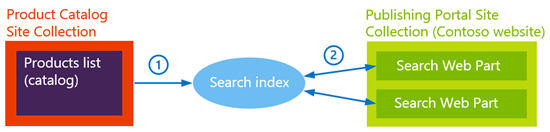
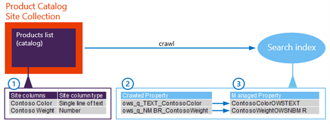

# From site column to managed property - What's up with that?

[!INCLUDE[appliesto-xxx-2016-xxx-xxx-md](../includes/appliesto-xxx-2016-xxx-xxx-md.md)] 
  
## Quick overview

In [Stage 4: Set up search and enable the crawling of your catalog content in SharePoint Server](stage-4-set-up-search-and-enable-the-crawling-of-your-catalog-content.md) we showed you how to set up search and enable crawling of your catalog content. In this article, we'll explain what happens to site columns during crawl. 
  
When a catalog is crawled, the catalog content is added to the **search index**, where the site columns are represented as **crawled** and **managed properties**. Let's take a closer look at what we mean by **search index**, and **crawled** and **managed properties**. 
  
## About the search index

Let's start by going back to our overview diagram.
  

  
1. When a content source is crawled, its contents and metadata are added to the search index. In our scenario, that means the content from the **Products** catalog is added to the search index. 
    
2. To display content on the publishing portal (the Contoso website), Search Web Parts are used. Search Web Parts contain a query, for example, "show all MP3 players that have the color red" (the query is not made in such common language, but for now, let's just keep it simple). So when users browse to a page that contains a Search Web Part, the query for  *red MP3 players*  is automatically sent to the search index. The query result is returned from the search index, and all red MP3 players are shown in the Search Web Part on the page. 
    
What is important to understand is that the content that we add to the search index determines which search results can be returned when queries are issued from Search Web Parts. Simply put, if the content from our **Products** catalog isn't added to the search index, we can't display any catalog content on the Contoso website. 
  
## About crawled and managed properties

During a crawl, the contents and metadata of the items are represented as **crawled properties**. In our scenario, items are the site columns and the values that are stored in the **Products** catalog. The reason that you have to know about crawled properties, is because we'll later use crawled properties to configure refiners. 
  
Even though crawled properties contain values, they are "useless" without a partner. This partner is a managed property. By creating a mapping between a crawled property and a **managed property**, we'll be able to display content on our Contoso website. 
  
The reason that you have to know about managed properties is because we'll later use managed properties when we configure queries in Search Web Parts, and when we define how search results should be displayed on a web page.
  
The use of crawled and managed properties will be explained in more detail, together with examples, later. For now, it's important to understand that we'll use crawled and managed properties, and  *not*  the site columns from the **Products** catalog when querying for and displaying content on our Contoso website. 
  
### About automatically created crawled and managed properties

SharePoint has several default managed properties that are mapped to default crawled properties, for example, "Title".
  
In earlier versions of SharePoint, when a new item was discovered during a crawl, users would have to create a new managed property manually and map it to the corresponding crawled property.
  
In SharePoint Server 2016, you can use the **automatically created crawled and managed properties**. They make the lives of catalog owners a lot easier. 
  
When new content is added to a catalog (what we did in [Stage 2: Import list content into the Product Catalog Site Collection in SharePoint Server](stage-2-import-list-content-into-the-product-catalog-site-collection.md)), many new items will be discovered during a crawl (what we did in [Stage 4: Set up search and enable the crawling of your catalog content in SharePoint Server](stage-4-set-up-search-and-enable-the-crawling-of-your-catalog-content.md)). To avoid having to create a new managed property, and map this to the corresponding crawled property, SharePoint Server 2016 does this for you. When a catalog is crawled, SharePoint Server 2016 automatically creates a crawled property for each site column in the catalog. SharePoint Server 2016 also automatically creates a managed property for the site column, and adds a mapping between the two.
  
> [!IMPORTANT]
> Only **site columns** that contain values automatically become managed properties when they are crawled. Regular columns do not! 
  
So, that is a sweet deal!
  
But, remember that you'll use crawled and managed properties in later stages, when you configure refiners and queries in Search Web Parts. Well, to do that, it's important that you understand how the names of these automatically created crawled and managed properties are constructed.
  
## About the naming convention for automatically created crawled and managed properties

The name of an automatically created property is a combination of the site column name, and the site column type. This naming convention is a bit tricky to understand. So let's start with a simple example with two site columns, and then move to an explanation of the rules that apply to all site column types.
  
### Naming convention for two site column types

  
1. In the **Products** list, we have: 
    
  - A site column named "Contoso Color" of type "Single line of text"
    
  - A site column named "Contoso Weight" of type "Number"
    
2. During a crawl, a crawled property is automatically created for the site column. The name of this property is generated by removing spaces from the site column name, and adding a prefix. The prefix that is added varies, depending on the site column type.
    
    In this example, we get the following crawled properties:
    
  - ows_q_TEXT_ContosoColor
    
  - ows_q_NMBR_ContosoWeight
    
3. A managed property is then automatically created and mapped to the corresponding crawled property. The name of this property is generated by removing spaces from the site column name, and adding a suffix. The suffix that is added varies, depending on the site column type.
    
    In this example, we get the following managed properties:
    
  - ContosoColorOWSTEXT
    
  - ContosoWeightOWSNMBR
    
That was simple, right? But, the naming convention does vary depending on the site column type.
  
### Naming convention for all site column types

For creating an automatically created **crawled property** name, the following conventions apply: 
  
- Spaces are removed from the site column name.
    
- For site columns of type **Publishing HTML** and **Multiple line of text**, the following prefix is added to the site column name: **ows_r_\<four letter code\>_**
    
- For site columns of type **Managed Metadata**, the following prefix is added to the site column name: **ows_taxId_**
    
- For all other site column types, the following prefix is added to the site column name: **ows_q_\<four letter code\>_**
    
For creating an automatically **managed property** name, the following conventions apply: 
  
- Spaces are removed from the site column name
    
- For site columns of type **Managed Metadata**, the following prefix is added to the site column name: **ows_taxId**
    
- For all other site column types, the following suffix is added to the site column name: **OWS \<four letter code\>**
    
If you want more information, there is an overview table with examples for all site column types in [Automatically created managed properties in SharePoint Server](../technical-reference/automatically-created-managed-properties-in-sharepoint.md).
  
That might not have been as straightforward as our simple example, and there is one exception to the rule…
  
### Naming convention for the default site columns in the Products list

This exception applies to the six site columns that by default are associated with the **Products** list in the Product Catalog Site Collection, as shown in the following table: 
  
|**Site column name**|**Craweld property name**|**Managed property name**|
|:-----|:-----|:-----|
|Item Number    |ows_q_TEXT_ProductCatalogItemNumber    |ProductCatalogItemNumberOWSTEXT    |
|Group Number    |ows_q_TEXT_ProductCatalogGroupNumber    |ProductCatalogGroupNumberOWSTEXT    |
|Language Tag    |ows_q_CHCS_ProductCatalogLanguageTag    |ProductCatalogLanguageTagOWSCHCS    |
|Item Category    |ows_taxId_ProductCatalogItemCategory    |owstaxIdProductCatalogItemCategory    |
|Rollup Image    |ows_r_IMGE_PublishingRollupImage    |PublishingImage    |
   
Now, after all that theory, let's move on to some concrete work.
  
### Next article in this series

[Stage 5: Connect your publishing site to a catalog in SharePoint Server](stage-5-connect-your-publishing-site-to-a-catalog.md)
  
## See also

#### Concepts

[Overview of the search schema in SharePoint Server](../search/search-schema-overview.md)

