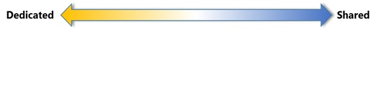
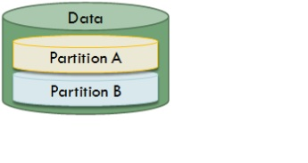
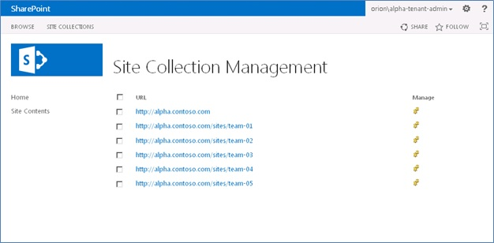

# General guidance for hosters in SharePoint Server 2013

[!INCLUDE[appliesto-2013-xxx-xxx-xxx-md](../includes/appliesto-2013-xxx-xxx-xxx-md.md)]
  
This article describes general guidance and concepts related to multi-tenancy in SharePoint Server 2013. 
  
For information about architectural, security, operational, and management guidance to help service providers in gaining an understanding of multi-tenancy in SharePoint Server 2013, see [Understanding Multi-Tenancy in Microsoft SharePoint Server 2013](understanding-multi-tenancy.md).
  
## Main Characteristics of Multi-Tenancy and Considerations

When considering multi-tenancy, there are two extremes for the implementation model of a multi-tenant hosting platform:
  
- **Dedicated**
    
- **Shared**
    
These extremes lie at opposite ends of a spectrum as shown in the following diagram.
  
****

  
The decision to implement a multi-tenant hosting platform comes down to selecting between these two implementation models. The decision is typically based on the required functional components, and the following service-level related attributes that ordinarily influence the choice of an appropriate implementation model for a multi-tenant hosting platform.
  
- Cost Saving
    
- Simplified Operation and Management
    
- Complexity of Customization
    
- Resource Isolation
    
- Quality of Service
    
These key attributes are important to consider when you make the decisions for selecting the appropriate architecture, implementation, and deployment of a multi-tenant SharePoint Server 2013 hosting platform. The following diagram shows how these key attributes vary from one implementation model to the other.
  

  
## How Does Multi-Tenancy Work in SharePoint Server 2013?

Native multi-tenancy was introduced in SharePoint Server 2010 to establish SharePoint as a valid platform for multi-tenancy. SharePoint Server 2013 inherits the same multi-tenancy related features and design and the addition of some new capabilities for supporting multi-tenancy deployments.
  
In SharePoint Server 2010, a new shared service model was implemented. This new model is known as Service Applications. The service application architecture allows a set of services to be associated with a group of web applications and a different set of services to be associated with a different group of web applications. Also, the same service application can be configured differently for different groups of web applications and a website can be configured to use only the services that are needed, instead of the complete bank of services.
  
In SharePoint, multi-tenancy refers to the ability to partition the data of otherwise shared services to accommodate multiple tenants. This contrasts with setting up separate dedicated hardware or even running multiple dedicated instances of a given service.
  
Services can be configured to share data across all tenants or to partition data for each tenant, for example, provide data isolation. Each service can be set up differently. Services can be created in partitioned mode by using Microsoft PowerShell or in un-partitioned mode by using Microsoft PowerShell or Central Administration. Once created, the mode of the Service cannot be changed. To achieve partitioning, both the service and the service connection must be deployed in partitioned mode. The service connection is called a proxy in Microsoft PowerShell.
  
Not all services can be partitioned. Services that do not store tenant data, such as PowerPoint Automation Services, do not have to be partitioned. These services can be shared across multiple tenants without risk of exposing tenant-specific data.
  
The following diagram shows how service data is partitioned:
  

  
In SharePoint, multi-tenancy is tied to site subscriptions. A site subscription is a logical group of site collections that can share settings, features, and service data. Site collections for each tenant are brought together with a subscription ID. The subscription ID is used to map features, services, and sites to tenants and also to partition service data according to tenant. The Subscription Settings service keeps track of multi-tenant services and subscription IDs.
  
Here is how it works:
  
1. Farm administrators deploy services to the farm. This includes the Subscription Settings service. Service applications can be either deployed as partitioned where data is isolated for each tenant, or un-partitioned where data is shared across all tenants. Some services do not store tenant data and are shared across all tenants without a partition.
    
2. Farm administrators deploy a Tenant Administration site for each tenant by using Microsoft PowerShell. The Tenant Administration site is associated with a subscription ID. Administrators can deploy additional site collections for each tenant. Each site collection is tied to the subscription ID of the tenant.
    
3. All service applications that are connected at the web application level are available for use by site collections within the web application. Administrators choose the services to offer and become active for each tenant. The subscription ID for a tenant is used to map services to the site collections.
    
4. Tenant administrators manage their site collections using their assigned Tenant Administration site.
    
5. Site collections for multiple site subscriptions can be hosted in a single web application.
    
6. Multiple site subscriptions can share a content database, or a site subscription can include content across multiple content databases.
    
7. All site collections for a single site subscription must reside on the same farm, but can be spread across web applications.
    
Farm administrators can host multiple tenants on the same farm and centrally manage the deployment of services and features. Tenant administrators can manage the configuration of administrator-delegated features and control the functionality of their sites.
  
SharePoint aligns its administrative functionality with common hosting roles, as summarized in the following table.
  
||||
|:-----|:-----|:-----|
|**Role**   |Type of administrator    |**Description**   |
|Service Provider administrator    |**Farm Administrator**   | Manages the farm-level settings and hardware.     Controls database configurations.     Installs all new approved features and solutions.     Can brand the Tenant Administration pages.    |
|Hosted company administrator    |**Tenant administrator**   | Purchases space, features, and bandwidth from service provider.     Controls the architecture of customer sites but not the content.     Configure settings for tenant.     Reviews usage statistics.    |
|Hosted company    |**Site administrator**   | Owns site collections.     Configures site settings that are exposed by features and services.     Reviews usage statistics.    |
   
Tenant administration is provided through the Tenant Administration site, which is based on a site template titled "Tenant Administration." A Farm Administrator can use Microsoft PowerShell cmdlets to create a Tenant Administration site and grant access to a Tenant Administrator. The following diagram shows the **Home** page of the Tenant Administration site. 
  

  
A Tenant Administrator can use the Tenant Administration site to manage many aspects of the subscription. For example, the Tenant Administrator can manage all site collections of the subscription from one location. The following diagram shows the **Site Collection Management** page of the Tenant Administration site. 
  

  
### Shared Content Database vs. Isolated Content Database

To make future upgrades easier to manage, use the following guidelines for managing tenants in content databases:
  
- If any tenant must span more than one content database, that tenant must be the ONLY tenant in those content databases The content database is a dedicated database.
    
- If any tenant shares a content database that has another tenant, the tenants should not span content databases.
    
By following these guidelines, future SharePoint upgrades can be scoped to either a single tenant, if there is one tenant per content database, or a small group of tenants. Versus having to upgrade all tenants at the same time.
  
#### Physical vs. Logical Data Partitioning

Data partitioning plays a big role in deciding which approach to take for a SharePoint deployment then a physical partition is required. The solution is to have a farm and even a single Identity Provider per tenant. But if some data can be shared we can then move towards sharing elements of the infrastructure across multiple tenants, database servers, some SharePoint services, and the farm.
  
#### What Identity and Authentication model do I want?

Depending upon authentication requirements, custom code may be required. When using Windows Authentication, code is not required and the SharePoint people picker is fully functional. Security Assertion Markup Language (SAML) or Forms Based authentication (FBA) require a custom claims provider that implements search and validates procedures.
  
> [!NOTE]
> The previous considerations are valid for both single-tenant per farm and multi-tenant per farm. 
  
For additional information about SAML authentication and FBA authentication in SharePoint Server 2013, see [Configure SAML-based claims authentication with AD FS in SharePoint Server](/sharepoint/security-for-sharepoint-server/security-for-sharepoint-server) and [Configure forms-based authentication for a claims-based web application in SharePoint Server](/sharepoint/security-for-sharepoint-server/security-for-sharepoint-server).
  
#### The Tenant Administrator Experience

Depending on the topology, the administrator experience can be significantly different: 
  
- In a one tenant per farm approach there are no in-product possibilities to separate the Service administration experience from the tenant administration experience. In other words, there's no way to delegate specific functionalities of the the SharePoint Central Administration website to the tenant administrator to provision new site collections. You also can't configure a default Search Center for the tenant without permitting any Farm Topology change or Service configuration change. 
    
- In a multiple tenants per farm approach, the product provides an in-product tenant administration console. In this approach, the Tenant Administration Site Collection lets tenant administrators perform specific functionalities. In the previous configuration, there are specific functionalities in the Central Administration that cannot be performed without causing potential unexpected results. For example, don't create site collections in Central Administration. 
    
## Different Type of Topologies

This section describes the different type of topologies that can be deployed for a SharePoint Server 2016 hosting environment.
  
### 

There three topologies available for hosting in SharePoint Server 2016 in an on-premises environment appear in the following table.
  
****

|****Topology****|****Description****|
|:-----|:-----|
|**Full isolation**   |This topology contains one SharePoint farm, a SQL Server instance and a forest that is configured per tenant or per Identity Provider.    This topology configuration is the most expensive, but offers the highest possible segregation of data and services.    |
|**Shared infrastructure, isolated farms**   |In this configuration, SQL Server, Active Directory Domain Services, and identity provider infrastructure are shared. However there's still one SharePoint farm per tenant.    |
|**Full shared**   |This topology is a shared infrastructure for SQL Server, Active Directory Domain Services, and the identity provider infrastructure, and is shared for SharePoint Server 2016 where a single SharePoint farm can host multiple tenants.    |
   
#### Services and Functionalities

The collection of features and services that enable multi-tenancy with SharePoint Server 2013 comprise a base platform that is typically extended to provide the end-to-end service offering by hosting organizations. A number of key operational service management aspects of SharePoint Server 2013 behave differently when they use multi-tenancy, and therefore require careful consideration. These aspects vary between different organizations based on service levels and operational capabilities. Hosting partners should guarantee that satisfactory planning for the required additional customization, either with custom solutions or Microsoft PowerShell is in place as soon as possible, to meet customer expectations. Examples in this space include: 
  
- Initial tenant provisioning
    
- Customizing the tenant administration site template
    
- Extending site collection quotas
    
- Provisioning logic, and billing
    
The service applications in SharePoint Server 2013 behave differently when you configure them for use in multi-tenancy solutions, and some of them have unique considerations from functional and operational service perspectives.
  
The service applications available in a SharePoint Server 2013 on-premises environment appear in the following table.
  
|||||
|:-----|:-----|:-----|:-----|
|**Service application**   |**Stores tenant data**   |**Supports partitioning**   |**Supported for Multi-Tenancy**   |
|Managed Metadata    |Yes    |Yes    |Yes    |
|User Profiles    |Yes    |Yes    |Yes    |
|Business Data Connectivity    |Yes    |Yes    |Yes    |
|SharePoint Search    |Yes    |Yes    |Yes    |
|Secure Store    |Yes    |Yes    |Yes    |
|Word Automation    |Yes    |Yes    |Yes    |
|Machine Translation    |Yes    |Yes    |Yes    |
|Work Management    |No    |No    |Yes    |
|PowerPoint Automation    |No    |No    |Yes    |
|Usage and Health Data Collection    |Yes    |No    |Yes (required for search)    |
|Subscription Settings    |Yes    |No    |Yes (required)    |
|App Management    |No    |No    |Yes    |
|Access Services    |No    |No    |Yes    |
|Access Services 2010    |No    |No    |Yes    |
|PowerPoint    |No    |No    |Yes    |
|Visio Graphics    |No    |No    |Yes    |
|Excel Calculation    |No    |No    |No    |
|Performance Point    |Yes    |No    |No    |
|Yammer    |No    |No    |No    |
|SharePoint Online Integration for OneDrive for Business    |No    |No    |No    |
   
> [!NOTE]
> The column, **Supported for Multi-Tenancy**, means you can't configure it in multi-tenancy. You will get an error message. 
  
Along with the previous considerations, tenant provisioning and de-provisioning processes and scripts have to account for each service application that stores tenant data. For some service applications, all the management of tenant data is moved to elements of the tenant administration site, whereas with some, a combination of farm-level and tenant-level administration is required.
  

