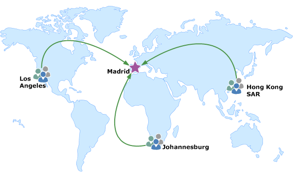
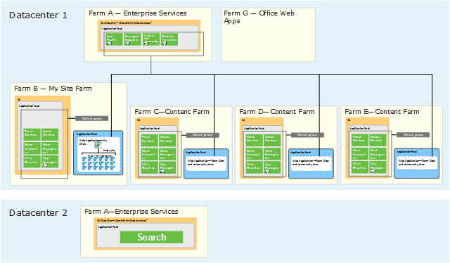

# Global architectures for SharePoint Server

[!INCLUDE[appliesto-2013-2016-2019-xxx-md](../includes/appliesto-2013-2016-2019-xxx-md.md)]
  
SharePoint Server is optimized to perform well over wide-area network (WAN) connections. For most customers, a centralized environment is the recommended architecture for serving a world-wide user base. Customers who have sites that are not well connected might benefit from deploying one or more regional farms. This article describes supported architectures, strategies to optimize SharePoint Server for WAN connections, and recommendations for service applications.
    
## Key concepts

This article uses the following terms:
  
- Central site—The location that hosts most of the company data and employee computers. A centralized SharePoint Server environment can consist of a single farm or multiple farms located in the same datacenter.
    
- Regional site—A location that hosts a subset of corporate data and employee computers that are connected by using a combination of local-area network (LAN) and WAN links.
    
- Distributed environment—An environment in which employees and company data are dispersed across the globe.
    
- In-country farm — A farm that is deployed inside a political boundary to satisfy government regulations.
    
## Evaluate your WAN connections

The most important factor that drives architectures for WAN environments is the performance of SharePoint Server across the WAN connections. Before you consider architecture options for your WAN environment, first evaluate the performance that users will experience for the most common actions they will perform. This can be done by using systematic benchmark testing across multiple WAN connections, or with simple user testing against a test environment. You can also create an evaluation site in Office 365 within the same region as the main company location, and test the user experience from multiple geographic locations.
  
If your organization currently deploys more than one farm geographically by using an earlier version of the product, you might be able to succeed with either a single, central-farm environment or with fewer farms. Do not assume that your organization will require the same number of farms as you deployed with an earlier version.
  
## Optimize a central farm or central datacenter deployment

The first and best option to serve a world-wide user base is to deploy SharePoint Server to a central environment.
  

  
Due to the performance improvements in SharePoint Server global customers who are well connected with WAN connections can expect to succeed with a centralized deployment of SharePoint Server. For enterprise-scale customers, this might include more than one farm that is deployed to a single datacenter. Most customers can deploy a single farm to meet the needs of an organization (for example, United Airlines). Organizations can also use Office 365 as a central environment to serve a world-wide user base.
  
If you deploy SharePoint Server on premises, several strategies can help optimize a centralized environment across WAN connections.
  
### Optimize web pages for faster downloads

The default pages in SharePoint Server are optimized for performance. If you customize pages or add many images or other types of content, make sure that you optimize these pages so they perform well over WAN connections.
  
### Windows Server features

Several features in Windows Server can improve performance for users who connect to a central environment through a regional site or branch office.
  
- BranchCache-- BranchCache, a feature of the Windows 7, Windows Server 2008 R2, and Windows Server 2012 operating systems, caches content from file and web servers on a WAN on computers at a local branch office. In a geographically distributed SharePoint Server environment, BranchCache can optimize WAN performance by caching large files that users download from SharePoint Server. 
    
- Quality of Service (QoS)— Windows 2000 introduced QoS features that Windows Server 2012 has enhanced. QoS enables you to meet the service requirements of a workload or an application by measuring network bandwidth, detecting changing network conditions (such as congestion or availability of bandwidth), and prioritizing - or throttling - network traffic. For example, you can use QoS to prioritize traffic for latency-sensitive applications and to control the effect of latency-insensitive traffic (such as bulk data transfers). You can use QoS to prioritize requests for applications that are critical for users. In addition, you can deprioritize applications or processes that adversely affect performance, such as backup processes or large downloads. For more information about QoS features in Windows Server 2012, see [Quality of Service (QoS) Overview](https://go.microsoft.com/fwlink/p/?LinkId=248576).
    
### WAN accelerators

WAN accelerators benefit intranet deployments. Some global companies position WAN accelerators across the highest latency connections to improve performance at these sites to an acceptable range. These solutions typically optimize traffic at several levels. 
  
- WAN acceleration solutions compress network-level packets and optimize the underlying protocol to reduce the raw traffic.
    
- WAN accelerators optimize content by comparing content blocks against a history of recently sent blocks, which enables only differences to be sent instead of all the content.
    
- Application-aware devices optimize the application-level protocol which reduces the application chatter.
    
Different solutions use different combinations of optimization techniques and algorithms.
  
WAN accelerators work in pairs. One device is in the data center next to the servers that are running SharePoint Server, and another device is in the branch office or on a client device outside an office. Vendors claim 90% or more reduction in response time for second and successive requests over high-latency networks.
  
Many WAN accelerator devices are available. Each device optimizes WAN traffic in different ways. Because SharePoint Server also optimizes and compresses data, it is important to test the performance of SharePoint Server both with and without WAN acceleration devices. In some cases, the compression of multiple technologies (SharePoint Server, IIS, and a WAN accelerator) might adversely affect performance compared to the benefit achieved.
  
### Optimize the network

Many customers can make a centralized environment work by working with bandwidth providers to optimize the network connections between users and a central site. Also, some telecommunications companies provide more efficient routing patterns, especially in emerging markets. Compared to the complexity of managing SharePoint farms and content at multiple locations, it might be more practical to optimize the WAN connections instead.
  
## Client tools for WAN environments

Several client tools can greatly improve the user experience over WAN connections without deploying multiple farms across the globe. You can also use these tools in environments that have multiple farms that are deployed geographically.
  
### Office Online Server

Office Online Server is an Office server product that delivers browser-based versions of Word, PowerPoint, Excel, and OneNote. Office Online Server greatly improves performance in WAN environments because users don't upload or download files. A single Office Online Server farm can support users who access Office files through SharePoint Server 2016, Skype for Business Server 2015, and Exchange Server 2013. Office Online Server works well in environments that have high-latency connections, or low bandwidth connections, or both. It might not work well in environments that have intermittent connections. 
  
A Office Online Server farm is typically located in the same datacenter as the SharePoint Server 2016 farm, although this is not a requirement. Locating a Office Online Server farm in a remote datacenter where SharePoint sites are not located will not improve performance. For more information, see [Office Web Apps Server overview](/webappsserver/office-web-apps-server-overview).
  
### OneDrive for Business

OneDrive for Business lets users sync their My Site library or other SharePoint libraries on team sites to their computers. They can then work with files in these libraries directly in Windows Explorer. Users can access these files even when they are offline. Updates to files sync with SharePoint when a user is online.
  
OneDrive for Business works well in environments that have intermittent connections or in environments that have high latency or low bandwidth connections. It is not intended to be used by many users who are editing the same file offline at the same time. For more information see [Sync your OneDrive or other SharePoint libraries to your computer with OneDrive for Business](https://go.microsoft.com/fwlink/p/?LinkId=279879).
  
> [!NOTE]
> At this time, the OneDrive for Business next generation sync client is not available in SharePoint Server. 
  
## Design a central site with multiple farms

Some enterprises might choose to deploy more than one farm at a central site to meet scale and capacity requirements. However, if the architecture includes more than one content farm, social features may be limited. To optimize a multi-farm environment the following design principles apply:
  
- The User Profile Service application must reside in the same datacenter as the content that it supports. 
    
- One My Site farm is recommended. Social features are limited across multiple My Site farms. For example, users will see social activities in their My Site newsfeed from that farm alone. Multiple My Site farms also require multiple User Profile service applications which increase complexity.
    
- For social features to work across content farms, you must create a My Site Host on each content farm in the datacenter. In this design, the My Site Host on the designated My Site farm, where the User Profile Service application exists, is the primary My Site Host. The other My Site Hosts support site feeds on team sites that are located in the content farms.
    
- SharePoint Server supports stretched farm architectures in which servers are located in different datacenters. For a stretched farm to work, there must be less than 1 millisecond latency between the computer that is running SQL Server and the front-end web servers in one direction, and at least 1 gigabit per second bandwidth.
    
- Search farms can reside in a different datacenter. The Search service application works well over WAN connections. If you have to spread farms across datacenters, a dedicated search farm does not have to be located in the same datacenter as other types of SharePoint farms.
    
The following illustration represents a multi-farm architecture designed for a global manufacturing company that is fictionally named Fabrikam and has more than 300,000 users.
  

  
## Share service applications across farms connected by WAN links

You can share some service applications across farms. Most of these can be shared across farms separated by WAN links. The following table summarizes the support for sharing service applications across WAN links. The Search service application requires greater consideration and recommendation for this service are provided after the table.
  
**Cross-farm services support for WAN environments**

|**Service application**|**Supported over WAN connections?**|**Notes**|
|:-----|:-----|:-----|
|Search    |Yes    |Content can be crawled over WAN connections. Or, you can configure search to retrieve results from remote result sources (indexes at remote farms).    |
|Managed Metadata    |Yes    |User entry fields that the Managed Metadata service application provides might not be available if a WAN connection is not online (such as an intermittent satellite link).    |
|Business Data Connectivity    |Yes    |After the data model is cached on the web server of the remote farm (the farm that consumes the Business Data Connectivity service from a central farm), the remote farm connects directly to the data source over the WAN to query the data (instead of reconnecting to the farm that is hosting the Business Data Connectivity service). Therefore, the remote farm requires permission to access the data source. Also, performance between the remote farm and the data source depends on the performance of the WAN connection.    |
|User Profile    |Not supported    |Using the User Profile service application across WAN links is not supported. This service requires direct database access.    |
|Secure Store Service    |Yes    |Although the Secure Store Service works across WAN links, we do not recommend this use because it might adversely affect the performance of other services over a WAN link.    |
|Machine Translation Service    |Yes    ||
   
### Search

You can share the Search service application across WAN connections. However, if a WAN connection is robust enough to support crawling content over the WAN, the connection is likely robust enough to support user actions over the WAN to a central farm. Instead of sharing the Search service application over WAN connections, we recommend that you take advantage of WAN performance improvements by eliminating the regional farm and having users use a central farm environment instead.
  
The following WAN conditions may be reasons for creating regional farms: 
  
- Highest latency connections
    
- Intermittent connections
    
- Unreliable connections caused by network congestion
    
- Inefficient routing patterns
    
- Packet loss
    
We do not recommend sharing the Search service application across these types of WAN connections. Instead, we recommend that you configure Search on the regional farm and use Remote SharePoint result sources to bring together search results from the regional farm(s) and the central farm.
  
In-country farms represent a different challenge. If the purpose of an in-country farm is to prevent documents and files from residing in locations outside a political boundary, we do not recommend crawling content over the WAN. A search index contains at least fragments of the crawled content. Furthermore, a temporary copy of each document is downloaded to the search farm for processing. Therefore, a central farm that crawls an in-country farm includes a copy of the data in that in-country farm. If this is against company policy, we recommend that you use Remote SharePoint result sources instead. With this configuration, search results can include content from an in-country farm and content continues to reside only on the local farm, unless a user downloads a copy to their local computer.
  
The one scenario in which crawling content over WAN connections is allowed is with a hybrid deployment in which an on-premises SharePoint Server farm is used to crawl content in an Office 365 Dedicated farm (O365-D) and provide search services to that farm. With the Office 365 Dedicated subscription plan each customer environment is placed on a dedicated server farm. Crawling the Office 365 dedicated farm provides a single relevancy-ranked set of results for the two environments. The dedicated Office 365 environment differs from the multi-tenant Office 365 environment. For hybrid environments that include the Office 365 multi-tenant environment, crawling the multi-tenant environment is not possible and the recommendation is to provide centralized search by using remote result sources.
  
Despite the recommendations, sharing the Search service application over WAN connections is supported and can be implemented in the following ways:
  
- A regional farm can consume the Search service application from a central farm and use it to crawl content locally. You have to set up a cross-farm service sharing relationship and complete additional configuration. In this case, the search components on the central farm crawl content on the regional farm. Communication that is necessary to crawl content occurs over the WAN connection. This configuration is not recommended. Instead, deploy and configure the Search service application directly on the regional farm.
    
- A Search service application at a central farm can crawl content at a regional farm. This configuration does not require you to set up cross-farm service sharing. Instead, crawl rules are added at the central farm to crawl content at a remote farm. However, this configuration crawls content over the WAN connection, which is not ideal.
    
The following table summarizes the differences between crawling over the WAN and using remote result sources to include content in search results.
  
**Options for including global content in search results**

||**Crawl over the WAN**|**Configure a result source for remote farms**|
|:-----|:-----|:-----|
|Description    |Content at regional sites is crawled from the central site over the WAN.    |Search is configured to return results from one or more remote farms (result source), in addition to the local farm.    In this scenario, remote farms are crawled locally. You configure search at the central farm to include results from the remote indexes.    You can also configure the remote farms to include results from the central farm and other regional farms. This allows users to search from the local farm.    |
|User experience    |Users are presented with a single list of results.    |Results are presented in in a single list. However, the results are grouped in blocks by result source. You can configure the number of results within each group.    |
|Advantages    |Search results are contained in a single search-ranked list.    Search is managed centrally.    |WAN crawling is not used.    Search results are potentially fresher, based on the crawl schedule.    If you also configure remote farms to include result sources for other farms, enterprise-wide search is available from remote farms in addition to the central farm.    |
|Disadvantages    |Crawling over the WAN takes time and uses bandwidth.    Search results might not be as fresh as if the content were crawled locally.    Enterprise-wide search is available only from the central farm.    |Users see multiple groupings of results.    Search results are not ranked across the organization.    Search must be managed at multiple locations.    |
   

