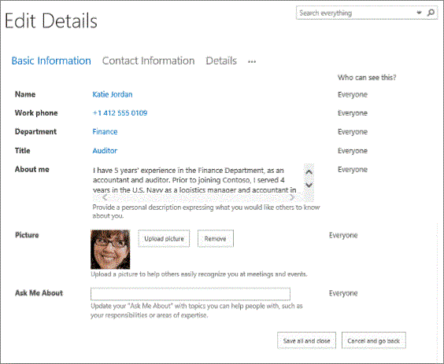
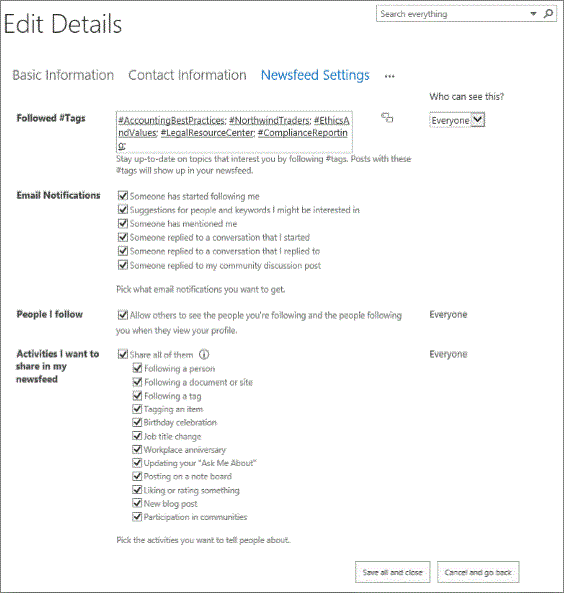
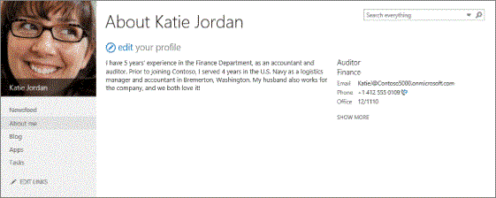

# Hide SharePoint Server social features

[!INCLUDE[appliesto-2013-2016-2019-xxx-md](../includes/appliesto-2013-2016-2019-xxx-md.md)]
  
The Yammer Embed widget for SharePoint lets you embed Yammer feeds into on-premises SharePoint Server sites to make them more social and engaging. Before you can do that, you have to do the following steps:
  
- Remove the Newsfeed Web Parts from My Sites and Team Sites.
    
- Hide the user interface controls that provide social features.
    
- Install the Yammer Embed widget for SharePoint.
    
- Add the Yammer feeds to your sites.
    
This article takes you through the steps required to do the first two steps: removing the Newsfeed Web Parts and hiding the user interface controls.
  
For information about how to add a Yammer feed on your sites, see [Add the Yammer Embed widget to a SharePoint page](add-the-yammer-embed-widget-to-a-sharepoint-page.md).
  
  
## Which SharePoint Server enterprise social features are removed?

When you follow the steps in this article, the following enterprise social features are removed:
  
- Viewing or posting to conversations in newsfeeds on My Sites and team sites.
    
- Viewing activities in the Newsfeed.
    
- Viewing activities on profile pages.
    
- Viewing the **I'm Following** Web Part on My Sites. 
    
- Mentioning users from their profile page.
    
    > [!NOTE]
    > This is shown on users' profile page when they fill in the **Ask Me About** field on their profile. 
  
- Following people.
    
- Following tags.
    
- Viewing **Trending #tags** on users' **Newsfeed** page. 
    
> [!NOTE]
> None of the procedures in this article remove the SharePoint Server enterprise social features and functionality permanently. The features are kept to let future upgrades of SharePoint Server finish successfully. 
  
## Which SharePoint Server enterprise social features stay the same?

When you follow the steps in this article, the following enterprise social features do not change:
  
- Following documents. Users can follow documents to bookmark the ones they are interested in. Users can follow documents from the hover panel in OneDrive for Business, the hover panel in the library list view, the ribbon in a document library, and so on. Users can see their followed documents by choosing **OneDrive**, then choosing **Followed Documents**.
    
- Following sites. Users can follow sites to bookmark the ones they are interested in. Users can follow sites by choosing **Sites** on the top navigation bar. 
    
- Updating information on the **Edit Details** page, as shown in the following screenshot. 
    
     
  
- Posting on a note board.
    
- Liking or rating documents in a document library, and a video from the asset library.
    
- Using community sites.
    
- Changing activity settings on the **Newsfeed Settings** page. The following screenshot shows the **Newsfeed Settings** page. 
    
     
  
    > [!IMPORTANT]
    > When the changes in this article are deployed, users can continue to use and fill in fields in the **Newsfeed Settings** page. But the information is no longer shown on My Site. However, information in the **Basic Information** and **Contact Information** pages are still shown on My Site. 
  
##SharePoint Server 2016
Remove Newsfeed Web Parts in team sites and My Sites.

###Remove Newsfeed Web Parts from Team Sites in SharePoint Server 2016
Each site admin must apply the following steps to their site.

1. From any site in SharePoint Server 2016 that has a Newsfeed web part, select **Edit**. 

2. Move the pointer over the **Site Feed** Web Part, and select the box that appears on the right side of the Web Part.

3.  On the ribbon, chose the **Web Part** tab, and then choose **Delete**.
 
4. Choose **OK**.

5. On the ribbon, choose the **Page** tab, and then choose **Stop Editing** and then **Save** to save your changes. 
    
6. Check that the Team Site does not show the removed Web Parts.

###Remove Newsfeed Web Parts from My Sites in SharePoint Server 2016

If you have configured My Site for SharePoint Server 2016, you need to remove the Newseed web part from each My Site. A My Site host admin has to apply the following steps to each server in the server farm.
1. Move the pointer over the **Newsfeed** Web Part, and select the box that appears on the right side of the Web Part. 
    
2. On the ribbon, choose the **Web Part** tab, and then choose **Delete**.
    
3. Choose **OK**.
    
4. Repeat steps 2-4 for the **Followed Counts** and **Trending Hashtags** Web Parts. 

## SharePoint Server 2013
Remove Newsfeed Web Parts in team sites and My Sites, and hide user interface controls that provide social features.

### Remove Newsfeed Web Parts from Team Sites in SharePoint Server 2013
<a name="proc2"> </a>

As the site collection admin, you have to follow these steps on each team site that you want to remove the site feed from.
  
1. Browse to the team site from which you want to remove the site feed, choose **Settings**, and then choose **Edit Page**.
    
2. Hover over the **Site Feed** Web Part, and select the box that appears to the right of the Web Part. 
    
3. On the ribbon, choose the **Web Part** tab, and then choose **Delete**.
    
4. Choose **OK**.
    
5. On the ribbon, choose **Save**.
    
6. Check that the team site no longer shows the **Site Feed** Web Part. 
    
     

### Remove Newsfeed Web Parts from My Sites in SharePoint Server 2013
<a name="proc1"> </a>

A My Site host admin has to apply the following steps to each web server in the server farm.
  
1. From any site in SharePoint Server 2013, choose **Newsfeed** to browse to a user's My Site. 
    
2. On the **Newsfeed** page, choose **Settings**, and then choose **Edit Page**.
    
3. Move the pointer over the **Newsfeed** Web Part, and select the box that appears on the right side of the Web Part. 
    
4. On the ribbon, choose the **Web Part** tab, and then choose **Delete**.
    
5. Choose **OK**.
    
6. Repeat steps 3-5 for the **Followed Counts** and **Trending Hashtags** Web Parts. 
    
    > [!NOTE]
    > It's a good idea to remove all social Web Parts, hidden or not hidden, to improve performance. 
  
7. On the ribbon, choose **Stop Editing** to save your changes. 
    
8. Check that the My Site does not show the removed Web Parts.
    
     
  
9. Choose **About me** to open the user's profile page. 
    
10. Choose **Settings**, and then choose **Edit Page**.
    
11. Move the pointer over the **Activity Feed** Web Part, and select the box that appears on the right side of the Web Part. 
    
12. On the ribbon, choose the **Web Part** tab, and then choose **Delete**.
    
13. Choose **OK**.
    
14. On the ribbon, choose **Stop Editing** to save your changes. 
    
15. Check that the user's profile page no longer shows the **Activity Feed** Web Part. 
    
     
  

  
### Hide user interface controls that provide social features in SharePoint Server 2013
<a name="proc3"> </a>

To hide the user interface controls that provide the SharePoint Server 2013 social features, you'll create a custom cascading style sheet (CSS) file and add it to a Master Page. This removes SharePoint Server 2013 social features and replaces them with equivalent Yammer features. First, you create a custom CSS file and upload it to the Style Library for your My Site. Then, based on the type of Master Page your site uses, you reference the CSS file in your Master Page by using one of the following methods described in this article:
  
- Register the CSS file for a custom Master Page
    
- Register the CSS file for an out-of-box Master Page
    
> [!NOTE]
> To register the CSS file for a custom Master Page, you have to have Contribute permission on the My Site host site. To register the CSS file for an out-of-box Master Page, you have to be a farm admin to install the required custom delegate control, and you also need Site Owner permissions on the My Site to enable the control for that site. 
  
After you complete these steps, the following changes are applied to the SharePoint Server 2013 social features:
  
- Removal of the **follow this person** link on another user's **About Me** page. 
    
- Mentioning a user from the profile page ( **About Me**) after the user has filled in the **Ask Me About** field on the user's profile page. 
    
- Following tags from the **#tags I'm Following** page. 
    
- Removal of the **follow multiple people** link from the **People I'm Following page** (mypeople.aspx). 
    
 **Create the HideNewsfeed.css file**
  
1. On your computer, open Notepad.
    
2. Choose **File** > **Save As**.
    
3. In the **File name** box, enter HideNewsfeed.css.
    
4. Copy and paste the following code into HideNewsfeed.css:
    
  ```
  /* Hide the following SP Social features */
  /* Hide the microfeed div in MySite and team sites */
  #ms-microfeeddiv,
  /* Hide the Followed counts div in MySite */
  .ms-profile-followedCountDiv,
  /* Hide the trending tags div in MySite */
  .ms-mysite-contentBox .ms-mpSearchBox+.ms-webpart-zone,
  /* Hide the follow button on others' About Me page */
  /* Hide the ask me about option on the About Me page */
  #ms-profile-followLinkDiv, .ms-askMeAbout-valuesMoreThanFive, .ms-askMeAbout-valuesFooter, 
  .ms-askMeAbout-bulletImage, .ms-askMeAbout-valuesFiveOrLess,
  /* Hide the follow tag option from the landing page */
  .ms-followedTags-followTag,
  /* Hide the follow people option from the landing page */
  .ms-people-followMultiplePeople{
  display:none!important; 
  }
  ```

5. Save and close the file.
    
6. Browse to your My Site Host, then choose **Settings** > **Site Contents**.
    
7. Choose **Style Library**.
    
8. On the ribbon, choose the **Files** tab, and then choose **Upload Document**.
    
9. Choose **Browse**, locate the HideNewsfeed.css file, and then choose **Open**.
    
10. Choose **OK**.
    
If your My Site uses a custom Master Page, follow the steps in _Register the CSS file for a custom Master Page_. If your My Site uses an out-of-box Master Page, follow the steps in _Register the CSS file for an out-of-box Master Page_.
  
 **Register the CSS file for a custom Master Page**
  
1. Using a text editor, open the custom Master Page.
    
2. Copy and paste the following code into the Master Page immediately before the  `</head>` tag: 
    
  ```
  <SharePoint:CssRegistration ID="HideNewsfeedCssRegistration" Name="<% $SPUrl:~SiteCollection/Style Library/HideNewsfeed.css %>" runat="server" After="corev15.css" />
  ```

3. Save and close the Master Page.
    
4. Refresh your site to see the changes.
    
 **Register the CSS file for an out-of-box Master Page**
  
1. Start Visual Studio 2013 with Office Developers Tools for Visual Studio.
    
2. Choose **File** > **New** > **Project**.
    
3. In the **Installed** pane, expand **Visual C#** > **Office/SharePoint**, then choose **SharePoint Solutions**.
    
4. Choose **SharePoint 2013 - Empty Project**.
    
5. In the **Name** box, enter HideNewsfeed.
    
6. Choose **OK**.
    
7. In the **SharePoint Customization Wizard**, select the My Site Host site collection to use for debugging.
    
8. Choose **Deploy as a farm solution**, then choose **Finish**.
    
9. Choose **Project** > **Add New Item**.
    
10. In the **Add New Item - HideNewsfeed** dialog box, choose **User Control**.
    
11. In the **Name** box, enter HideNewsfeed.ascx, then choose **Add**.
    
12. Copy and paste the following line at the end of HideNewsfeed.ascx
    
  ```
  <SharePoint:CssRegistration ID="HideNewsfeedCssRegistration" Name="<% $SPUrl:~SiteCollection/Style Library/HideNewsfeed.css %>" runat="server" After="corev15.css" />
  ```

13. Save the HideNewsfeed.ascx file.
    
14. Choose **Project** > **Add New Item**.
    
15. In the **Add New Item - HideNewsfeed** dialog box, choose **Empty Element**.
    
16. In the **Name** box, enter HideNewsfeed, then choose **Add**.
    
17. In the Elements.xml file, press Ctrl+A, then press Delete.
    
18. Copy and paste the following XML in the Elements.xml file:
    
  ```
  <?xml version="1.0" encoding="utf-8"?> 
  <Elements xmlns="http://schemas.microsoft.com/sharepoint/"> 
  <Control Id="AdditionalPageHead" ControlSrc="~/_CONTROLTEMPLATES/15/HideNewsfeed/HideNewsfeed.ascx" /> 
  </Elements>
  ```

19. Save the Elements.xml file.
    
20. Choose **Build** > **Deploy Solution**.
    
    The control has to be deployed on each web server in the farm. For information about how to deploy and install a solution to the farm, see [Add-SPSolution](/powershell/module/sharepoint-server/Add-SPSolution?view=sharepoint-ps) and [Install-SPSolution](/powershell/module/sharepoint-server/Install-SPSolution?view=sharepoint-ps).
    
    The result is a SharePoint solution package that can be deployed and activated on the My Site Host site. 
    
21. To activate the feature, browse to your My Site Host site, choose **Settings** > **Site Settings**.
    
22. On the **Site Settings** page, in the **Site Actions** section, choose **Manage site features**.
    
23. Locate the **HideNewsfeed Feature1**, and choose **Activate**.
    
    > [!NOTE]
    > Instead of uploading the HideNewsfeed.css to the Style Library, you can create the CSS file in the SharePoint Solution package so that it is deployed together with the solution. 
  
24. Browse to the **Newsfeed** page to check that the controls are no longer shown on the page. 
    
## Additional steps
<a name="more"> </a>

To finish the integration of Yammer into your on-premises SharePoint Server environment, you have to install the Yammer Embed widget for SharePoint. For more information, see [Add the Yammer Embed widget to a SharePoint page](add-the-yammer-embed-widget-to-a-sharepoint-page.md).
  
## Acknowledgements
<a name="more"> </a>

The SharePoint Server 2013 Content Publishing team thanks Vidya Srinivasan and Ben Rinaca from the Microsoft SharePoint Server Product team for their contribution to this article.
  
## See also
<a name="more"> </a>

#### Concepts

[Integrate Yammer with on-premises SharePoint Server environments](integrate-yammer-with-on-premises-sharepoint-server-environments.md)

