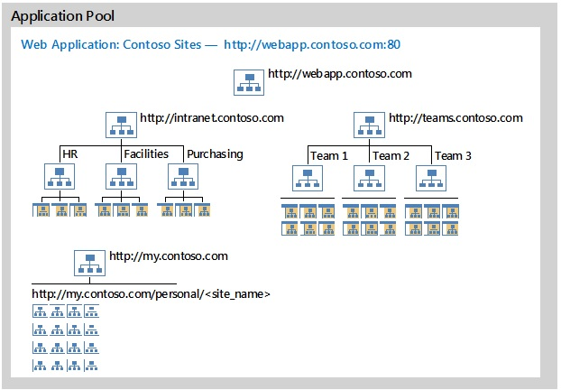
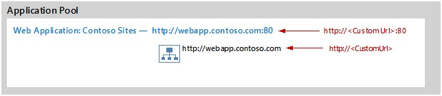
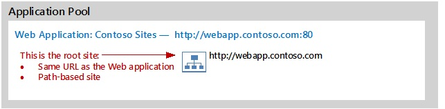

# Host-named site collection architecture and deployment in SharePoint Server

[!INCLUDE[appliesto-2013-2016-2019-xxx-md](../includes/appliesto-2013-2016-2019-xxx-md.md)]
  
Host-named site collections are the preferred method to deploy sites in SharePoint Server. Because the Office 365 environment uses host-named site collections, new features are optimized for these site collections and they are expected to be more reliable. Learn how to plan for and implement host-named site collections, design URLs, and manage URLs.
    
## Architecture and design for host-named site collections
<a name="section1"> </a>

Host-named site collections enable you to assign a unique DNS name to site collections. For example, you can address them as http://TeamA.contoso.com and http://TeamB.contoso.com. This enables you to deploy many sites with unique DNS names in the same web application. It also enables hosters to scale an environment to many customers. If you do not use host-named site collections, your SharePoint web application will contain many path-based site collections that share the same host name (DNS name). For example, Team A has a site collection at http://contoso.com/sites/teamA, and Team B has a site collection at http://contoso.com/sites/teamB.
  
We recommend host-named site collections unless requirements dictate that path-based sites with alternate access mapping are necessary (described later in this article). This article describes how to implement host-named site collections in a recommended configuration with SharePoint Server. Information about advanced configurations is included at the end of this article: [Use multiple web applications with host-named site collections](host-named-site-collection-architecture-and-deployment.md#section4).
  
### Recommended architecture for host-named site collections
<a name="section1a"> </a>

The recommended configuration for deploying sites is using host-named site collections with all sites located within a single web application, as illustrated in the following diagram.
  
**Recommended configuration for host-named site collections**


  
This recommended configuration in the diagram includes the following elements:
  
- One application pool for site collections.
    
- One web application for site collections that is hosted inside the one application pool.
    
- A root site collection (http://webapp.contoso.com).
    
- Multiple host-named site collections to host content with example sites:
    
  - Published intranet content (http://intranet.contoso.com) with subsites for HR, Facilities, and Purchasing.
    
  - Team sites (http://teams.contoso.com) with subsites for Team 1, Team 2, and Team 3.
    
  - My Sites with site URLs in the following format: http://my.contoso.com/personal/\<site_name\>.
    
The number of sites within the web application and the URLs for sites are not important for this example.
  
When creating a Web application for host-named site collections, the URL of the Web application and the root site collection will be http://<  _webapp.contoso.com_>/.
  

  
This architecture is recommended to deploy sites because it is the same architecture that the Office 365 environment uses. Consequently this is the most heavily tested configuration. New features, including the App model and Request Management, are optimized for this configuration, and it is the most reliable configuration going forward.
  
The recommended configuration does not include the following elements:
  
- Enabling apps in environments with multiple zones.
    
- Mixing host-named site collections and path-based site collections (except the root site collection).
    
- Multiple web applications with host-named site collections.
    
### Host-named site collections versus path-based site collections
<a name="section1b"> </a>

When you use host-named site collections, each site collection in a web application is assigned a unique DNS name. When you deploy many host-named site collections to a single web application, you increase scalability of the farm because resources are not used to support multiple application pools and web applications.
  
SharePoint Server supports both host-named and path-based site collections. The following table details the differences between the two options and provides more information about host-named site collections.
  
**Table: Comparison of host-named site collections and path-based site collections**

||**Host-named site collections**|**Path-based site collections**|
|:-----|:-----|:-----|
|Creating sites  <br/> | You can use Microsoft PowerShell to create host-named site collections. You cannot use Central Administration to create host-named site collections.  <br/> |You can use Central Administration or PowerShell to create path-based site collections.  <br/> |
|URLs  <br/> |Each host-named site collection in a web application is assigned a unique DNS name.  <br/> You can use zones to assign up to five URLs to host-named sites, including vanity URLs.  <br/> |All path-based site collections in a web application share the same host name (DNS name) as the web application. You can extend a web application to implement up to five zones and create different host names for each zone. However, the host name for a zone applies to all site collections within the web application.  <br/> |
|Root site collection and search  <br/> |A root site collection is required to crawl content in a web application. A root site collection can be a site collection that users cannot access.  <br/> |Typically, a single path-based site collection serves as the root site collection within a web application. You can use managed paths to create additional site collections within the web application.  <br/> |
|URL mapping  <br/> |Use PowerShell commands to manage URLs (Set-SPSiteURL, Remove-SPSiteURL, Get-SPSiteURL).  <br/> |Use Alternate Access Mappings to manage URLs.  <br/> |
|Self-service site creation  <br/> |You need to use a custom solution for self-service site creation with host-named site collections.  <br/> The Self Service Site Creation feature that is part of the default installation of SharePoint Server does not work with host-named site collections.  <br/> |When you use the Self Service Site Creation feature that is part of the default installation of SharePoint Server, you create path-based sites.  <br/> |
|Managed paths  <br/> |Managed paths for host-named site collections apply at the farm level and are available for all web applications.  <br/> You have to use PowerShell to create managed paths for host-named site collections.  <br/> |Managed paths for path-based sites apply at the web application level.  <br/> You can use Central Administration or Microsoft PowerShell to create managed paths for path-based site collections.  <br/> |
   
### Design and manage URLs for host-named site collections
<a name="section1c"> </a>

PowerShell cmdlets manage URL mappings for host-named site collections and enable you to map URLs to a single site collection:
  
- Set-SPSiteUrl — Add or change a URL mapping for a site.
    
- Remove-SPSiteUrl — Remove a URL mapping from a site.
    
- Get-SPSiteUrl — See all URLs and associated zones for a site collection.
    
These cmdlets provide URL mapping functionality for host-named site collections that is similar to alternate access mapping.
  
#### Zones and host-named site collections

Host-named site collections are available through any zone. Host-named site collections are not limited to the default zone. If needed, you can implement multiple zones and use zones and host-named site collections to configure different authentication settings or policies.
  
> [!NOTE]
> To use different zones you need to extend existing web application. 
  
You can assign up to five URLs to a single site collection by assigning one URL per zone. Even if you follow the recommended architecture by implementing only one zone, you can still assign up to five URLs to host-named site collections. This is because if a zone is not implemented by extending the web application, SharePoint Server uses the default zone.
  
For example, the following URLs could provide access to the same Internet site:
  
- www.Contoso.com
    
- www.Contoso.uk
    
- www.Contoso.ca
    
- www.Contoso.au
    
- www.Contoso.ie
    
The search crawl account requires access to content through the Default zone by using Integrated Windows authentication (NTLM or Kerberos). Because claims authentication allows multiple types of authentication in one zone, this requirement should not affect other authentication requirements.
  
#### Managed paths and host-named site collections

URLs that are configured for the same site collection may have different schemes and domains, but they must have the same managed paths, namely everything after the '/' that follows the domain must be the same. For example, http://www.Contoso.com/sites/Site1 and http://www.Fabrikam.com/sites/Site1 can both point to the same site collection but http://www.Contoso.com/sites/Site1 and http://www.bar.com/sites/Project1 cannot.
  
The cmdlets that manage URLs only operate on the root site collection for a host name, for example http://www.Contoso.com. These cmdlets do not operate on a managed path site collection that is underneath the root, such as http://www.Contoso.com/sites/Project1. Sites below the root of a host-named site collection will inherit the URL settings of that root host-named site collection.
  
#### Off-box termination of SSL with host-named site collections

Off-box termination of SSL occurs when a proxy server terminates an SSL request and uses HTTP to forward the request to a web server. To achieve off-box SSL termination with host-named site collections, the device that terminates the SSL connection, such as a reverse proxy server, must be capable of generating a custom HTTP header: **Front-End-Https: On**. For more information, see [Use host-named site collections with off-box SSL termination](host-named-site-collection-architecture-and-deployment.md#section2g), later in this article.
  
The protocol used for a host-named site collection depends on the value of the Url parameter that you specified when you used the Set-SPSiteURL cmdlet to map the URL to a particular zone: http or https. Ensure that the IIS bindings for the web application, SSL certificates, reverse proxy configuration, and any other configuration necessary is complete.
  
### When to use path-based site collections
<a name="section1d"> </a>

Although we recommend host-named site collections for most architectures, you should use the traditional path-based site collections and alternate access mapping if any of the following conditions apply:
  
- You need to use the Self Service Site Creation feature that is part of the default installation of SharePoint Server.
    
    This does not apply to custom self-service site creation solutions.
    
- SSL termination is required but your SSL termination device cannot be configured to produce the necessary custom HTTP header.
    
    You can still use SSL bridging with host-named site collections with these devices if SSL termination is not a requirement.
    
- You plan to use different application pools for the additional security that these provide or you need to use multiple proxy groups. 
    
    In these cases, you can use host-named site collections. However, the additional configuration that is required to map URLs for host-named site collections across multiple web applications greatly outweigh the benefits of using host-named site collections. For more information, see [Use multiple web applications with host-named site collections](host-named-site-collection-architecture-and-deployment.md#section4). For more information about creating path-based site collections, see [Create a site collection in SharePoint Server](/SharePoint/sites/create-a-site-collection).
    
### Use host headers and host-named site collections
<a name="section1e"> </a>

Host headers allow the web server to host multiple web sites on the same IP Address and Port combination. If the incoming HTTP request includes a host header name, and a matching host header is configured in IIS, IIS will respond with the content from the appropriate web site.
  
Host headers are configured at the Web Application (IIS web site) level, they are one of the website bindings properties.
  
It is important to understand the distinction between Host headers in IIS and Host Named Site Collections. Host headers at the IIS web site level are only intended for path-based site collections.
  
When using Host named site collections, SharePoint is responsible for resolving the correct site for the address based upon the incoming request passed through IIS. In most cases, applying a host header binding at the IIS web site level makes it impossible to access host-named site collections through the IIS web site. This is because IIS will not respond to requests for host names that differ from the host header binding. 
  
> [!IMPORTANT]
> If an existing web application has a host header binding set, IIS will not return pages from the host-named site collection until you remove the binding from IIS. For more information, see [Update a web application URL and IIS bindings for SharePoint 2013](update-a-web-application-url-and-iis-bindings.md). 
  
### Mix host-named site collections and path-based site collections in the same web application
<a name="section1f"> </a>

You can use host-named and path based site collections in the same web application. To ensure that both types of site collections are accessible to users, do not put host header bindings on the IIS website of your web application, including IIS websites for zones that are extended from the web application. If an existing web application has a host header binding set, IIS will not return pages from the host-named site collection until you remove the binding from IIS.
  
#### My Sites

When you use both types of site collections with My Sites, consider implementing your own provisioning process to create My Sites as host-named sites instead of path based sites.
  
## Deployment and configuration for host-named site collections
<a name="section2"> </a>

### Create a web application for host-named site collections
<a name="section2a"> </a>

If you do not intend to configure two or more IIS websites that share the same port number on the same server, create a web application in the Default zone. Do not apply a host header binding at the IIS website level.
  
 **To create a web application for host-named site collections**
  
1. Verify that you have the following memberships:
    
  - The **securityadmin** fixed server role on the SQL Server instance. 
    
  - The **db_owner** fixed database role on all databases that are to be updated. 
    
  - The Administrators group on the server on which you are running the Microsoft PowerShell cmdlet.
    
    An administrator can use the **Add-SPShellAdmin** cmdlet to grant permissions to use SharePoint Server cmdlets. 
    
    > [!NOTE]
    > If you do not have permissions, contact your Setup administrator or SQL Server administrator to request permissions. For additional information about PowerShell permissions, see [Add-SPShellAdmin](/powershell/module/sharepoint-server/Add-SPShellAdmin?view=sharepoint-ps). 
  
2. Open the **SharePoint Management Shell**.
    
3. At the PowerShell command prompt (that is, PS C:\\>), type the following syntax:
    
  ```
  New-SPWebApplication -Name 'Contoso Sites' -port 80 -ApplicationPool ContosoAppPool -ApplicationPoolAccount (Get-SPManagedAccount 'Contoso\JDoe') -AuthenticationProvider (New-SPAuthenticationProvider -UseWindowsIntegratedAuthentication)
  ```

### Create a root site collection
<a name="section2b"> </a>

A root site collection is a requirement for any Web application. It is also necessary for crawling content. This site collection must have the same URL as the Web application. Currently, SharePoint prevents the creation of a host-named site collection with the same URL as a Web application. Therefore, the root site collection is created as a path-based site collection.
  

  
The following example creates an empty site collection that is the root site collection:
  
```
New-SPSite 'http://<servername>' -Name 'Portal' -Description 'Portal on root' -OwnerAlias 'contoso\administrator' -language 1033 -Template 'STS#0'

```

Only the root site collection of the web application appears in the content source. Even though all other host-named site collections in the web application do not appear in the content source, by default search automatically crawls the other host-named site collections.
  
### Create host-named site collections
<a name="section2c"> </a>

You must use Microsoft PowerShell to create a host-named site collection. You cannot use the SharePoint ServerCentral Administration web application to create a host-named site collection, but you can use Central Administration to manage the site collection after you have created it.
  
You can create a host-named site collection by using the Microsoft PowerShell New-SPSite cmdlet with the -HostHeaderWebApplication parameter, as shown in the following example:
  
 **To create host-named site collections**
  
1. Verify that you have the following memberships:
    
  - The **securityadmin** fixed server role on the SQL Server instance. 
    
  - The **db_owner** fixed database role on all databases that are to be updated. 
    
  - The Administrators group on the server on which you are running the Microsoft PowerShell cmdlet.
    
    An administrator can use the **Add-SPShellAdmin** cmdlet to grant permissions to use SharePoint Server cmdlets. 
    
    > [!NOTE]
    > If you do not have permissions, contact your Setup administrator or SQL Server administrator to request permissions. For additional information about PowerShell permissions, see [Add-SPShellAdmin](/powershell/module/sharepoint-server/Add-SPShellAdmin?view=sharepoint-ps). 
  
2. Open the **SharePoint Management Shell**.
    
3. At the PowerShell command prompt (that is, PS C:\\>), type the following syntax:
    
  ```
  New-SPSite 'http://portal.contoso.com' -HostHeaderWebApplication (Get-SPWebApplication 'Contoso Sites') -Name 'Portal' -Description 'Customer root' -OwnerAlias 'contoso\administrator' -language 1033 -Template 'STS#0'
  
  ```

This creates a host-named site collection that has the URL, http://portal.contoso.com, in the SharePoint Server web application that has the URL, http://portal.contoso.com.
  
### Use managed paths with host-named site collections
<a name="section2d"> </a>

You can implement managed paths with host-named site collections. Hosters can provide multiple site collections to the same customer with each site collection sharing the customer's unique host name but differentiated by the URL path after the host name. Managed paths for host-named site collections are limited to 20 per farm. For more information, see [Software boundaries and limits for SharePoint Server 2016](/SharePoint/install/software-boundaries-and-limits#WebApplication).
  
Managed paths for host-named site collections behave differently from managed paths for path-based site collections. Managed paths for host-named site collections are available to all host-named site collections within the farm regardless of the web application that the host-named site collection is in. In contrast, managed paths for path-based site collections only apply to sites within the same web application. Managed paths for path-based site collections do not apply to path-based site collections in other web applications. Managed paths for one type of site collection do not apply to the other type of site collection.
  
To create a managed path, you must first create a site collection with the desired base URL. For example, to create http://teams.contoso.com/ _finance_ you must first create the site collection for http://teams.contoso.com. 
  
To create a managed path for use with host-named site collections, use the PowerShell **New-SPManagedPath** cmdlet with the **HostHeader** parameter, as shown in the following example: 
  
```
New-SPManagedPath 'departments' -HostHeader
```

You can also use the **Explicit** parameter to create explicit managed paths. 
  
The following example shows a host-named site collection created at a managed path:
  
```
New-SPSite 'http://portal.contoso.com/departments/marketing' -HostHeaderWebApplication (Get-SPWebApplication 'Contoso Sites') -Name 'Marketing' -Description 'Portal Marketing' -OwnerAlias 'contoso\administrator' -language 1033 -Template 'STS#0'
```

To remove an existing managed path, use the PowerShell **Remove -SPManagedPath** cmdlet, as shown in the following example: 
  
```
Remove-SPManagedPath 'departments' -HostHeader
```

You can use PowerShell to remove a managed path even if a site collection exists. If you remove a managed path, the site collection can no longer be accessed. To access the existing site collection, use PowerShell to recreate the managed path.
  
### Map URLs to host-named site collections
<a name="section2e"> </a>

When you create a new hostname site collection, the default alternate access mappings will still exist but cannot be used. Use PowerShell commands to manage URL mappings for host-named site collections.
  
Add a mapping to an existing site:
  
```
Set-SPSiteUrl (Get-SPSite 'http://teams.contoso.com') -Url 'http://teamsites.contoso.com' -Zone Intranet
```

Each URL mapping is applied to a single zone. Use one of the following zone names when you map URLs:
  
- Default
    
- Intranet
    
- Internet
    
- Custom
    
- Extranet
    
If you do not specify the **Zone** parameter and the URL mapping entry is new, the default zone is used. You still have a limitation to 5 URLs for a unique Site Collection. 
  
Remove a mapping for a site:
  
```
Remove-SPSiteUrl 'http://teamsites.contoso.com'
```

Display all URL mappings for a site:
  
```
Get-SPSiteUrl -Identity (Get-SPSite 'http://teams.contoso.com')
```

### Configure SSL certificates for host-named site collections
<a name="section2f"> </a>

You can configure a single web application that uses SSL and then create multiple host-named site collections within that web application. To browse to a site over SSL, you have to install and assign a server certificate to the IIS website. Each host-named site collection in a web application will share the single server certificate that you assigned to the IIS website.
  
You need to acquire a wildcard certificate or subject alternate name (SAN) certificate and then use a host-named site collection URL format that matches that certificate. For example, if you acquire a \*.contoso.com wildcard certificate, you must generate host-named site collection URLs such as https://site1.contoso.com, https://site2.contoso.com, and so on, to enable these sites to pass browser SSL validation. However, if you require unique second-level domain names for sites, you must create multiple web applications rather than multiple host-named site collections.
  
To configure SSL for host-named site collections, enable SSL when you create the web application. This will create an IIS website with an SSL binding instead of an HTTP binding. After you create the web application, open IIS Manager and assign a certificate to that SSL binding. You can then create site collections in that web application.
  
If you are implementing multiple zones with host-named site collections, ensure that the configuration of certificates and bindings (SSL or HTTP) is appropriate for each zone and corresponding IIS site.
  
### Use host-named site collections with off-box SSL termination
<a name="section2g"> </a>

You can use host-named site collections with off-box SSL termination. There are several requirements to use SSL termination with host-named site collections:
  
- At least one IIS site should have a binding on port 80 (or whatever port the terminator forwards the request to). Microsoft recommends that you use the IIS site of a web application (or the IIS site of a zone for a web application) with HTTP/80.
    
- The SSL terminator or reverse proxy must preserve the original HTTP host header from the client.
    
- If the client SSL request is sent to the default SSL port (443), then the SSL terminator or reverse proxy must forward the decrypted HTTP request to the front-end web server on the default HTTP port (80). If the client SSL request is sent to a non-default SSL port, then the SSL terminator or reverse proxy must forward the decrypted HTTP request to the front-end web server on the same non-default port.
    
- The device that terminates the SSL connection, such as a reverse proxy server, must be capable of generating a custom HTTP header: **Front-End-Https: On**. This is the same custom header that Outlook Web Access (OWA) uses: **Front-End-Https: On/Off**. More information about this custom header is included later in this section.
    
To use host-named site collections with off-box SSL termination, configure your web application as you normally would for SSL termination and ensure that it meets the requirements described above. In this scenario, SharePoint Server will use HTTPS instead HTTP to render links of its host-named site collections in that web application.
  
Reverse proxy servers can publish SharePoint Server host-named site collections and perform off-box SSL termination. In this scenario, the reverse proxy server changes the connection type between the end user and the SharePoint web front-end server from SSL/TLS to HTTP or vice versa. Reverse proxy servers in this scenario must insert an additional HTTP header in the user's request when it forwards the request to the SharePoint web front-end server. This additional HTTP header indicates to SharePoint Server the type of connection the end user initiated so that SharePoint Server renders URLs appropriately in its response. The HTTP header name is "Front-End-Https" and its acceptable values are as follows.
  
**Table: Front-End-Https header values**

|**Value**|**Description**|
|:-----|:-----|
|On  <br/> |The reverse proxy server received the end user's request over an encrypted (SSL or TLS) HTTPS connection. For example, **Front-End-Https: On**.  <br/> |
|Off  <br/> |The reverse proxy server received the end user's request over an unencrypted HTTP connection.  <br/> |
   
The values are not case-sensitive. For example, on, ON, On, and oN are acceptable.
  
This custom header works only with host-named site collections. It does not work with path-based site collections.
  
The following example shows a host-named site collection created at https:
  
```
New-SPSite 'https://portal.contoso.com' -HostHeaderWebApplication  (Get-SPWebApplication 'Contoso Sites') -Name 'Portal' -OwnerAlias 'contoso\administrator' -language 1033 -Template 'STS#0'

```

This example creates a host-named site collection that has the URL, https://portal.contoso.com, in the SharePoint Server web application that has the URL http://webapp.contoso.com.
  
### Enable apps in environments with multiple zones
<a name="section2h"> </a>

> [!NOTE]
> This section applies only to SharePoint Server 2013 
  
The March 2013 Public Update enables you to configure an app domain for each web application zone and use alternate access mapping and host-header web application configuration. Before the release of this update, you could only host one app domain and it had to be in the Default zone. You could not use the app domain on alternate access mappings or host-header web application configurations. 
  
To resolve this issue, apply the SharePoint Server Cumulative Update Server Hotfix Package: March 12, 2013, see [Updates for SharePoint 2013](/sharepoint/).
  
## Migrate path-based site collections to host-named site collections
<a name="section3"> </a>

### Determine host-named site collections in existing web applications
<a name="section3a"> </a>

When you migrate from SharePoint Server 2010 to SharePoint Server, we recommend that you determine how SharePoint Server 2010 sites were created. If sites were created as path-based sites, consider migrating these sites to host-named site collections. If host-named and path-based sites were implemented together, identify the sites that were created as path-based sites and consider migrating these sites to host-named site collections. To accomplish this, look for the 'HostHeaderIsSiteName' flag.
  
The following example determines if a site within a given web application is created as host-named or path based:
  
```
$webApp = Get-SPWebapplication 'http://webapp.contoso.com'
foreach($spSite in $webApp.Sites)
{
if ($spSite.HostHeaderIsSiteName) 
{ Write-Host $spSite.Url 'is host-named' }
else
{ Write-Host $spSite.Url 'is path based' }
}
```

### Convert path-based site collections to host-named site collections
<a name="section3b"> </a>

You can convert path-based site collections to host-named site collections and host-named site collections to path-based site collections by using the PowerShell cmdlet Set-SPSite. After the site rename, an app pool recycle is recommended to force refreshing the cache. You cannot use the SharePoint Central Administration website or Windows PowerShell cmdlets that attach and detach, or mount and dismount content databases to convert site collections.
  
The following example converts a standard site collection to a host-named site collection:
  
```
Get-SPSite https://SP2013content.contoso.com/sites/PathBasedSiteCollection | Set-SPSite -url https://HostNamedSiteCollection.contoso.com 
```

## Use multiple web applications with host-named site collections
<a name="section4"> </a>

If you use more than one web application, you add more operational overhead and complexity to the system. We recommend that you use one web application for site collections. However, the following reasons might influence you to implement site collections across multiple web applications:
  
- An organization's security policies require separate web applications or application pools.
    
- Web applications need to be configured differently.
    
- An organization requires the use of multiple proxy groups.
    
It is more complex to implement host-named site collections with multiple web applications in a farm because you must complete more configuration steps. For example, URLs with host-named sites might be spread across multiple web applications that share the same port in a single farm. This scenario requires more configuration steps to ensure that requests are mapped to the correct web applications. You have to manually configure the mappings on each web server in the farm by configuring a separate IP address to represent each web application. You also have to create and manage host-header bindings to assign unique IP addresses for each site. Scripts can manage and replicate this configuration across servers; however, this adds complexity to the solution. Each unique URL also requires a mapping in DNS. Generally speaking, if multiple web applications are a requirement, we recommend path-based site collections with alternate access mapping.
  
The following two tables contrast three different design choices to implement site collections. These tables are intended to help you understand the consequences of each approach and how configuration varies depending on the architecture.
  
**Table: Results of different design choices to provision site collections**

||**Host-named site collections with all sites in a farm consolidated in one web application**|**Path-based site collections with alternate access mapping and multiple web applications**|**Host-named site collections with multiple web applications in a farm**|
|:-----|:-----|:-----|:-----|
|Site collection provisioning  <br/> |Use Microsoft PowerShell or a custom site collection provisioning solution to provision sites.  <br/> |Use Central Administration or Microsoft PowerShell to deploy sites.  <br/> |Use Microsoft PowerShell or a custom site collection provisioning solution to provision sites.  <br/> |
|URL management  <br/> |You can map all site collections in DNS to point to a single IP address which represents the web application.  <br/> |If you implemented more than one zone, you configure alternate access mapping for each site URL. Each zone also requires a mapping in DNS.  <br/> |Additional configuration is required to ensure that requests for sites that share the same port are mapped to the correct web application. Each unique host name also requires a mapping in DNS. This configuration is manual and you must complete it on each web server in a farm for each site.  <br/> |
|Additional URLs  <br/> |You can assign up to five URLs to a host-named site collection, one per zone. It is not necessary to extend the web application to multiple zones. If a zone is not implemented the default zone is used.  <br/> |The number of URLs for a site collection is limited to five because this is the number of zones that is allowed.  <br/> |You can assign up to five URLs to a host-named site collection, one per zone. It is not necessary to extend the web application to multiple zones. If a zone is not implemented the default zone is used.  <br/> |
|Service applications  <br/> |All sites in the farm use a single service application group.  <br/> |You can implement custom service application groups for different web applications.  <br/> |You can implement custom service application groups for different web applications.  <br/> |
|Zones  <br/> |You do not have to implement multiple zones to implement different URLs for the same site collection. If a zone is not implemented the default zone is used.  <br/> |Zones are necessary to implement different URLs for the same site collection.  <br/> |You do not have to implement multiple zones to implement different URLs for the same site collection. If a zone is not implemented the default zone is used.  <br/> |
|Authentication  <br/> |With one web application, authentication options are limited to five zones. However, you can implement many authentication methods on one zone.  <br/> |You can implement different authentication and zone designs for each web application.  <br/> |You can implement different authentication and zone designs for each web application.  <br/> |
|Authentication  <br/> |Provides client scripting isolation between domain URLs.  <br/> |You can isolate web applications into dedicated application pools, if desired, to achieve process isolation.  <br/> Provides isolation between domain URLs.  <br/> |You can isolate web applications into dedicated application pools, if desired, to achieve process isolation.  <br/> Provides isolation between domain URLs.  <br/> |
|Policy  <br/> |You can use zones to assign different policies to host-named sites.  <br/> |You can use policies at the web application level to enforce permissions, regardless of permissions that are configured on individual sites or documents. Additionally, you can implement different policies for different zones.  <br/> |You can implement different policies for different web applications to enforce permissions, regardless of permissions that are configured on individual sites or documents.  <br/> Additionally, you can implement different policies for different zones.  <br/> |
   
Scalability numbers that might also affect design decisions include the recommended maximums for site collections, content databases, and managed paths.
  
The following table summarizes the configuration that is necessary to manage URLs based on each of the three design options presented in this article.
  
**Table: Configuration required for different site collection designs**

||**Host-named site collections with all sites in a farm consolidated into one web application**|**Path-based site collections with alternate access mapping and multiple web applications**|**Host-named site collections with multiple web applications in a farm**|
|:-----|:-----|:-----|:-----|
|Within SharePoint Server  <br/> | Create the web application.  <br/>  Create a root-site collection that is not accessible to users (for example, https://HNSC01.fabrikam.com).  <br/>  Create the host-named site collections with the host header (for example, https://intranet.fabrikam.com).  <br/>  Optionally add more URLs for each site collection and configure zones by using **Set-SPSiteUrl**. (In corporate portal design samples there's no need because there's only one zone.)  <br/> | Create the web application with the host header (for example, https://intranet.fabrikam.com).  <br/>  Optionally configure alternate access mapping. In the design sample there's no need because there's only one zone).  <br/>  Create the root path-based site collection.  <br/> | Create the web application.  <br/>  Create a root-site collection that is not accessible to users (for example, https://HNSC01.fabrikam.com).  <br/>  Create the host-named site collections with the host header (for example, https://intranet.fabrikam.com).  <br/>  Optionally add more URLs for each site collection and configure zones by using **Set-SPSiteUrl**. (In corporate portal design samples there's no need because there's only one zone.)  <br/> |
|Within IIS  <br/> |Associate an SSL certificate (wildcard certificate or SAN certificate) for all host-named site (domain) in the web application.  <br/> |Associate an SSL certificate in IIS for each zone (each zone is a separate web application in IIS).  <br/> | Associate an SSL certificate (wildcard certificate or SAN certificate) for a host-named site (domain) in the web applications.  <br/>  On each web server in the farm and for each web application that shares a port:  <br/>  Configure a separate IP address to represent each web application.  <br/>  Edit the IIS web site binding manually to remove the host header binding that was created when the web application was created and replace this with an IP address binding.  <br/> |
   
If you use multiple web applications on different IP addresses, you might need to complete additional configuration for the NIC, DNS, and the load balancer for each server.
  
### Create multiple web applications with host-named site collections
<a name="section4a"> </a>

To run multiple web applications on the same server and port in combination with host-named site collections, you have to assign different IP addresses to the web applications. This type of architecture requires that you add IP addresses to the web servers and configure the network router to point host names to the IP address of its web application.
  
> [!NOTE]
> You can create a web application that does not have a host header. If you create a web application that does not have a host header, you cannot create multiple web applications with host-named site collections on the same web server. 
  
The process that creates multiple web applications for a host-named site collections includes the following tasks:
  
- Create the multiple web applications.
    
- Add a new virtual IP address in IIS on each web server in the farm.
    
### Create multiple web applications for host-named site collections
<a name="section4b"> </a>

The following example creates a web application:
  
```
New-SPWebApplication -Name 'webapp' 'webapp.contoso.com' -port 80 -ApplicationPool ContosoAppPool -ApplicationPoolAccount (Get-SPManagedAccount 'Contoso\JDoe') -AuthenticationProvider (New-SPAuthenticationProvider -UseWindowsIntegratedAuthentication)
```

Repeat this task for each web application.
  
### Add virtual IP addresses in IIS
<a name="section4c"> </a>

The IP bindings must be applied on all servers that will host the web application. Set the sleep command to 60 seconds to make sure that the IP bindings are set to all servers in the farm before the existing host header on the web application is removed. Remote scripting can be used for this job.
  
Use the following commands to add unique IP bindings to each of the web applications that you created and then remove the host header binding from these web applications. 
  
```
Import-Module WebAdministration
# add empty binding to webapp on IP 192.168.10.20
New-WebBinding -Name 'webapp' -IPAddress '192.168.10.20' -HostHeader '' 
Sleep 60
# remove existing binding webapp.contoso.com from existing web application
Get-WebBinding -Name 'webapp' -HostHeader 'webapp.contoso.com' | Remove-WebBinding
```

## See also
<a name="section4"> </a>

#### Other Resources

[Get-SPSiteUrl](/powershell/module/sharepoint-server/Get-SPSiteUrl?view=sharepoint-ps)
  
[Set-SPSiteUrl](/powershell/module/sharepoint-server/Set-SPSiteUrl?view=sharepoint-ps)
  
[Remove-SPSiteUrl](/powershell/module/sharepoint-server/Remove-SPSiteUrl?view=sharepoint-ps)
  
[Plan logical architectures for SharePoint Server](/SharePoint/administration/administration)

