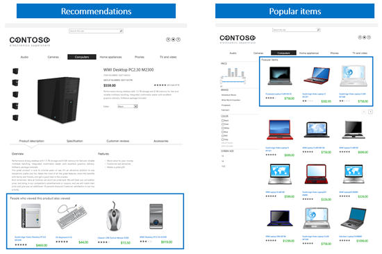

# How to display recommendations and popular items in SharePoint Server

[!INCLUDE[appliesto-2013-2016-2019-xxx-md](../includes/appliesto-2013-2016-2019-xxx-md.md)]
  
This series of articles explains how to use the Usage analytics feature that was introduced in SharePoint Server to display "smart content" on your website. By "smart content" we mean content such as recommendations and popular items.
  
-  *Recommendations*  are based on how other visitors have interacted with your website. For example, on a product page, you can display "People who viewed this product also viewed  *\<other products\>*  ." 
    
-  *Popular items*  are the most frequently viewed items on the whole site, or in a specific category. For example, the most viewed laptops on a site that sells technology products. 
    
To help explain, we'll use examples from a fictitious company called Contoso. Here's what the website will look like when it is finished.
  

  
> [!NOTE]
> The examples in this series are based on an on-premises SharePoint Server deployment. 
  
## Articles in this series

- [An introduction to recommendations and popular items in SharePoint Server](an-introduction-to-recommendations-and-popular-items.md)
    
- [Change the Content Search Web Part display template and use Windows PowerShell to start Usage analytics in SharePoint Server](change-the-content-search-web-part-display-template-and-use-windows-powershell-t.md)
    
- [Add and configure the Recommended Items and Popular Items Web Part in SharePoint Server](add-and-configure-the-recommended-items-and-popular-items-web-part.md)
    
- [Use recommendations and popular items on websites with anonymous users in SharePoint Server](use-recommendations-and-popular-items-on-websites-with-anonymous-users.md)
    
- [View and configure usage analytics reports in SharePoint Server](view-and-configure-usage-analytics-reports.md)
    
The scenario in this set of topics draws heavily upon the concepts, feature descriptions, and procedures introduced in the [How to set up a product-centric website in SharePoint Server](how-to-set-up-a-product-centric-website.md) series. We recommend reading it first, as it will makes things much easier to understand. 
  

