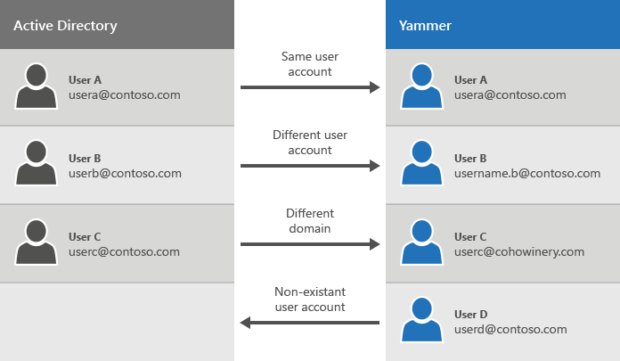

# Integrate a single Viva Engage network into SharePoint Server

[!INCLUDE[appliesto-2013-2016-2019-SUB-xxx-md](../includes/appliesto-2013-2016-2019-SUB-xxx-md.md)]
  
This scenario describes the prerequisites and recommended steps to integrate a single, active Viva Engage network together with your SharePoint Server environment.
  
## Scenario prerequisites

For this scenario, we assume that:
  
- You have SharePoint Server 2019, SharePoint Server 2016, or SharePoint Server 2013 SP1 or later installed.
    
- You don't use the SharePoint Server Newsfeed social feature.
    
- You use Active Directory Domain Services (AD DS) as your identity provider and Active Directory Federation Services (AD FS) 2.0 for identity federation.
    
- You have one single, established Viva Engage Basic or Enterprise network that has active users.
    
    For information about how users are managed in Viva Engage, see [Manage Viva Engage users across their life cycle from Microsoft 365](/viva/engage/manage-viva-engage-users/manage-users-across-their-lifecycle).
    
## Scenario challenges

If you are using Viva Engage Basic, one of the top issues in this scenario is the inconsistency of users and their logon credentials between the user profile stores in Viva Engage and SharePoint Server. The following diagram shows the possible credentials mismatch situations between your AD DS user repository and the Viva Engage network user repository.
  
**Viva Engage user credential mismatch cases**

  
**Table: Scenario 2 challenges: SharePoint Server and an active single Viva Engage network**

|**Challenge**|**Description**|
|:-----|:-----|
|Same user and email address in AD DS and Viva Engage    |The same user exists in both AD DS and Viva Engage with the same user name and email address. For this user, there is no change in the user name after you set up directory synchronization and Viva Engage .    |
|Different user account    |User B used a different email address when they signed up for Viva Engage. For this user, there is a change after you set up Viva Engage . For this scenario, you should let the affected users know about the changes to their logon credentials. The reason for the different logon credentials might be because the user joined the Basic network by using an alias, not their primary email address. It can also occur because the user changed their name. You can manage and make these email address changes by using the [Bulk Update Users](/viva/engage/manage-viva-engage-users/add-block-or-remove-users) page.    |
|Different domain    |In a scenario where you have multiple Viva Engage networks, you have disconnected users. This scenario is no longer supported after October 26, 2018. By merging networks, everyone in your organization can use a single Viva Engage network. This scenario is covered in more detail in [Integrate multiple Viva Engage networks into SharePoint Server](integrate-multiple-viva-engage-networks-into-sharepoint-server.md).    |
|Non-existent users    |When a user is removed or disabled in Microsoft 365, if you have set up Viva Engage to [Enforce Microsoft 365 identity for Viva Engage users](/viva/engage/configure-your-viva-engage-network/enforce-office-365-identity), the user is removed from Viva Engage .    |
   
## Step 1: Set up directory synchronization

Microsoft 365 uses Azure Active Directory for identity management, and Viva Engage  can be set up to [Enforce Microsoft 365 identity for Viva Engage users](/viva/engage/configure-your-viva-engage-network/enforce-office-365-identity). If you're using an on-premises directory, in order to manage users in one place, you need to sync your on-premises directory with Azure Active Directory by using Azure Active Directory Connect. 
  
For more information, see [Plan for directory synchronization for Microsoft 365](/microsoft-365/enterprise/plan-for-directory-synchronization) and [Integrate your on-premises directories with Azure Active Directory](/azure/active-directory/hybrid/whatis-hybrid-identity).
  
## Step 2: Disable default SharePoint Server social features

After you set up directory synchronization, [disable the default SharePoint Server social features](hide-sharepoint-server-social-features.md).
  
## Step 3: Use Viva Engage Embed

After you disable the default SharePoint Server social features, you should [use the Viva Engage embed widget](add-the-viva-engage-embed-widget-to-a-sharepoint-page.md) to include Viva Engage feeds on SharePoint pages. 
  
## See also

#### Concepts

[Integrate Viva Engage with on-premises SharePoint Server environments](integrate-viva-engage-with-on-premises-sharepoint-server-environments.md)
  
[Social scenarios with Viva Engage and SharePoint Server](social-scenarios-with-viva-engage-and-sharepoint-server.md)
#### Other Resources

[Manage Viva Engage users across their life cycle from Microsoft 365](/viva/engage/manage-viva-engage-users/manage-users-across-their-lifecycle)

[Viva Engage - Admin Help](/viva/engage/)