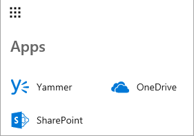
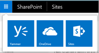
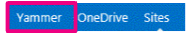
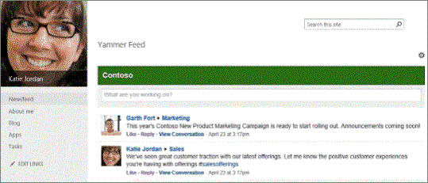

# Integrate Viva Engage with on-premises SharePoint Server environments

[!INCLUDE[appliesto-2013-2016-2019-SUB-xxx-md](../includes/appliesto-2013-2016-2019-SUB-xxx-md.md)]
 
Although SharePoint Server provides basic enterprise social features, Viva Engage Enterprise provides a richer enterprise social experience to drive increased collaboration and innovation across your organization. You can add Viva Engage functionality to SharePoint sites by adding it to the navigation bar, replacing SharePoint Server social features with Viva Engage, and embedding a Viva Engage feed into SharePoint pages. 

Before you integrate Viva Engage into your SharePoint Server  environment, you should learn about:
- Viva Engage networks, groups, and users, and how they combine to create a foundation for providing you with a rich Viva Engage experience within SharePoint. For more information, see [Viva Engage networks, groups, and users overview](viva-engage-networks-groups-and-users-overview.md).
- Directory synchronization and enforcing Microsoft 365 identity in Viva Engage. By using directory synchronization, your organization can use existing on-premises user accounts. Your organization can also significantly reduce operational costs and give its employees safer and easier access to Viva Engage. 
  
    Microsoft 365 uses Azure Active Directory for identity management, and Viva Engage Enterprise can be set up to enforce Microsoft 365 identity so that users only have to sign on once to access both SharePoint and Viva Engage content. If you're using an on-premises directory, in order to manage users in one place, you need to sync your on-premises directory with Azure Active Directory by using Azure Active Directory Connect. 
  
    For more info, see [Plan for directory synchronization for Microsoft 365](/microsoft-365/enterprise/plan-for-directory-synchronization), [Integrate your on-premises directories with Azure Active Directory](/azure/active-directory/hybrid/whatis-hybrid-identity), and [Enforce Microsoft 365 identity for Viva Engage users](/viva/engage/configure-your-viva-engage-network/enforce-office-365-identity)
    
## Add Viva Engage to the navigation for SharePoint 

In SharePoint Server 2019 and SharePoint Server 2016, you can add a Viva Engage tile to the navigation. For instructions, see [Add Viva Engage to the navigation bar for SharePoint Server](add-viva-engage-to-the-navigation-bar-for-sharepoint-Server.md).

Here's what it looks like in SharePoint Server 2019:

Here's what it looks like in SharePoint Server 2016: 

 
In SharePoint 2013 Service Pack 1 (SP1) for SharePoint Server 2013, you can replace the Newsfeed link with a Viva Engage link on the top navigation bar.

  
  
## Use Viva Engage instead of SharePoint Newsfeed features

To take advantage of the features that are provided by Viva Engage, it's a good idea to replace the default SharePoint Server enterprise social features with equivalent Viva Engage features. You can remove the SharePoint Server social web parts from My Sites and team sites, and you can hide the user interface controls that provide social functionality.
  

  
For more information, see [Hide SharePoint Server social features](hide-sharepoint-server-social-features.md).
  
## Use Viva Engage Embed to add feeds to SharePoint pages

You can use Viva Engage Embed to embed Viva Engage feeds into on-premises sites. Viva Engage Embed is a JavaScript widget that you can add to a SharePoint page to display different kinds of Viva Engage feeds.
  
For more information, see [Add the Viva Engage Embed widget to a SharePoint page](add-the-viva-engage-embed-widget-to-a-sharepoint-page.md).
  
## Social scenarios

Take a look at the most common social scenarios, and learn the steps required to integrate Viva Engage with your on-premises SharePoint Server environment. The steps for each scenario depend on the state of your existing environment and your current Viva Engage deployment.
  
For more information, see [Social scenarios with Viva Engage and SharePoint Server](social-scenarios-with-viva-engage-and-sharepoint-server.md).
  
## See also

#### Other Resources

[Viva Engage Adoption](https://adoption.microsoft.com/viva/engage/)

[Viva Engage Admin Guide](/viva/engage/get-started-with-viva-engage/admin-key-concepts)

[Viva Engage Help Center](https://support.microsoft.com/office/viva-engage-help-center-8663922d-8f76-47c2-827a-ee86e8cac00f)
