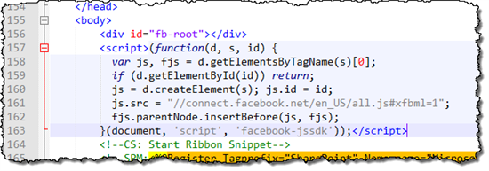
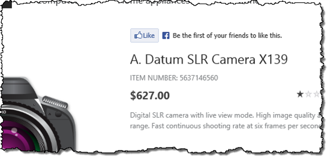
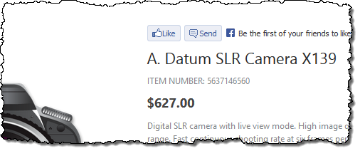
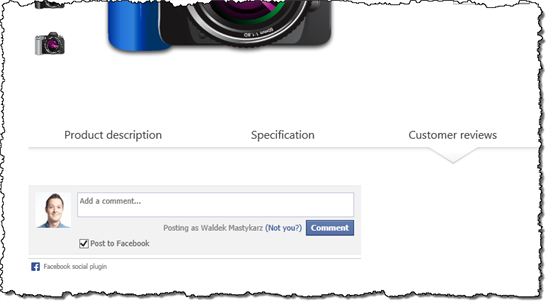
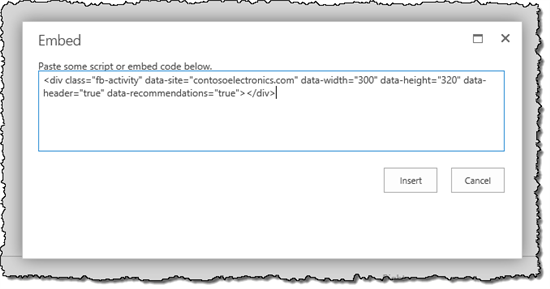
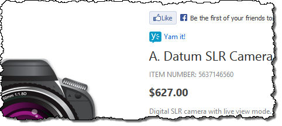

# Integrating social media with public-facing websites in SharePoint

[!INCLUDE[appliesto-xxx-2016-2019-xxx-md](../includes/appliesto-xxx-2016-2019-xxx-md.md)] 
  
Integrating social media within your organization can help you reach your organization's goals. The integration can be done on your organization's intranet to increase transparency, but you can also make social networks a part of your public-facing website to expand reach and increase conversion of your website.
  
## Social media integration

Integration with social media has become hype in the last several years. Many organizations want social networks to be integrated with their public-facing website without a good understanding of what such integration means, and how it should support the organization's goals. This article is not about helping you form a vision for using social networks within your organization. Instead it presents several different integration scenarios, and shows how you can benefit from them. Eventually you must make an educated choice about which of these integration techniques will work for your scenario, and how the integration should look.
  
From the communication perspective you can integrate with social media in two ways:
  
- Publish information from your website to social networks, which can be as easy as adding a Facebook Like button. This will allow you to expand the reach of the content on your website beyond its boundaries and reach your visitors' friends and colleagues.
    
- Leverage the information about the current visitor from his social networks to control which content on your website would be the most relevant to her. By using this approach you can help your visitors discover new content on your website that they are not aware of. Once again this can help you expand your reach and increase conversion on your website.
    
This article describes the first option.
  
## The basics of social media integration in SharePoint 2013

Integrating with social media is all about reaching as many people as possible. Information about the content on your website, whether it is articles, blog posts or products, when discovered and found valuable, it can be shared by your visitors with their friends, who again might share it with their friends. Before you know it, your content will reach people who otherwise might not have even known about your website. But, for this to occur, you have to to make sure that that when your content is shared on social networks, it looks exactly the way that you want it to look.
  
Just as you can optimize your web content for Internet search engines, you can provide some meta information about your content to social networks. Many social networks such as Facebook or Yammer use [the Open Graph protocol](https://go.microsoft.com/fwlink/p/?LinkId=400785) to retrieve information about your content. To control how your content is displayed when it is shared on social networks, you have to integrate Open Graph metadata into your website. The metadata should describe the essence of your content so that anyone who sees your content on a social network will want to click on it. 
  
## Integrating Open Graph into a public-facing website built with SharePoint 2013

Publishing Open Graph metadata for a website that is built with SharePoint Server 2016 isn't complex. But there are several things that you should consider. First of all Open Graph defines different types of web content - similar to what you can achieve with Content Types in SharePoint. Before you start integrating Open Graph into your website, you should have a good understanding of what types of content that you have on your website, and how it can be described most effectively by using Open Graph.
  
Next to the different types of content that you can publish on your website, there are also differences in how that content is published. SharePoint Server 2016 offers two content publishing models:
  
- The classic content publishing model, that you might have known from SharePoint 2007 and 2010 and where the physical location of pages determined their location in the hierarchy and navigation of the website
    
- The new search-driven publishing model that uses SharePoint Server 2016 Search to publish content from one or more sources
    
These publishing models have two ways of publishing content and, depending on which one that you are using on your website, you should plan for publishing the information according to your content publishing model.
  
Open Graph information is published using HTML meta tags. Those tags must be located in the head section of your website. To support publishing different Open Graph information for different types of pages and content publishing models, you should define a Content Place Holder in your Master Page. This will allow you to fill that placeholder with the appropriate metadata from the different Page Layouts.. The following code example shows a Content Place Holder added to the standard seattle.master Master Page to support publishing Open Graph information:
  
```
<head>
…
<!--MS:<asp:ContentPlaceHolder
id="OpenGraphPlaceHolder" runat="server">-->
<!--ME:</asp:ContentPlaceHolder>-->
…
</head>
```

According to the Open Graph protocol there are four properties that are required for every web page:  *title*  ,  *type*  ,  *image*  , and  *URL*  . Although Open Graph defines several content types, if you are not publishing information about video or audio, the odds are high that you'll be using the  *article*  type for most your web pages. Because not every page is an article, you might want to use the website type. The website type is the default type if no type is specified. To simplify working with Open Graph we could expand the code example above by adding the information about the title, URL and type. This would prevent us from repeating the same code example within each Page Layout. 
  
Although the basic Open Graph information is a part of the SEO information published by SharePoint Server 2016, standard SharePoint Server 2016 SEO controls cannot be used directly to display this information on Master Pages and Page Layouts as Open Graph meta tags. To use those controls for publishing Open Graph metadata, we have built a set of wrapper controls and them published together with this article to explain how you can build similar wrapper controls.
  
By using Search Engine Optimization capabilities of SharePoint Server 2016 we can retrieve the information about the page as follows:
  
```
<head>
…
<!--SPM:<%@Register Tagprefix="Contoso"
Namespace="Contoso.SharePoint.Seo.Controls"
Assembly="Contoso.SharePoint.Seo, Version=1.0.0.0, Culture=neutral,
PublicKeyToken=a285ef6967f781d3"%>-->
<!--MS:<Contoso:TemplatedControlWrapper
runat="server">-->
<Control>
   <control
type="Microsoft.SharePoint.Publishing.WebControls.SeoBrowserTitle"
assembly="Microsoft.SharePoint.Publishing, Version=15.0.0.0,
Culture=neutral, PublicKeyToken=71e9bce111e9429c" />
</Control>
<ContentTemplate><meta
property="og:title" content="$Value$"/></ContentTemplate>
<!--ME:</Contoso:TemplatedControlWrapper>-->
<!--MS:<Contoso:HyperlinkControlWrapper
runat="server">-->
<Control>
   <control
type="Microsoft.SharePoint.Publishing.WebControls.SeoCanonicalLink"
assembly="Microsoft.SharePoint.Publishing, Version=15.0.0.0,
Culture=neutral, PublicKeyToken=71e9bce111e9429c" />
</Control>
<ContentTemplate><meta
property="og:url"
content="$Url$"/></ContentTemplate>
<!--ME:</Contoso:HyperlinkControlWrapper>-->
<meta property="og:type content="article"
/>
<!--MS:<asp:ContentPlaceHolder
id="OpenGraphPlaceHolder" runat="server">-->
<!--ME:</asp:ContentPlaceHolder>-->
…
</head>

```

This approach assumes that you want the title of your page to be published on social networks exactly like it is displayed in the title bar of a web browser. Should your scenario differ, you can replace the contents of the title property with a suitable alternative, or remove it, and then have it filled from the  *OpenGraphPlaceHolder*  content placeholder. 
  
The great benefit of using the standard SharePoint Server 2016 Search Engine Optimization controls, as shown above, is that they work for both classic in addition to search-driven content publishing model and will automatically retrieve the necessary content by using the necessary approach.
  
The next step is to provide the page-type specific information according to the Open Graph protocol. For pages using the classic publishing model, you can use Publishing controls to retrieve the content, for example:
  
```
<!--MS:<asp:ContentPlaceHolder
id="OpenGraphPlaceHolder" runat="server">-->
   <!--SPM:<%@Register
Tagprefix="Contoso"
Namespace="Contoso.SharePoint.Seo.Controls"
Assembly="Contoso.SharePoint.Seo, Version=1.0.0.0, Culture=neutral,
PublicKeyToken=a285ef6967f781d3"%>-->
   <!--MS:<Contoso:TemplatedControlWrapper
runat="server">-->
   <Control>
     <control
type="Microsoft.SharePoint.WebControls.FieldValue"
assembly="Microsoft.SharePoint, Version=15.0.0.0, Culture=neutral,
PublicKeyToken=71e9bce111e9429c" FieldName="PublishingContactProfileUrl"
/>
   </Control>
   <ContentTemplate><meta
property="article:author"
content="$Value$"/></ContentTemplate>
   <!--ME:</Contoso:TemplatedControlWrapper>-->
<!--ME:</asp:ContentPlaceHolder>-->

```

When using search-driven publishing you would use Catalog Item Reuse Web Parts instead:
  
```
<!--MS:<asp:ContentPlaceHolder
id="OpenGraphPlaceHolder" runat="server">-->
   <!--SPM:<%@Register
Tagprefix="Contoso "
Namespace="Contoso.SharePoint.Seo.Controls"
Assembly="Contoso.SharePoint.Seo, Version=1.0.0.0, Culture=neutral,
PublicKeyToken=a285ef6967f781d3"%>-->
   <!--MS:<Contoso:TemplatedControlWrapper
runat="server">-->
   <Control>
     <control
type="Microsoft.Office.Server.Search.WebControls.CatalogItemReuseWebPart"
assembly="Microsoft.Office.Server.Search, Version=15.0.0.0,
Culture=neutral, PublicKeyToken=71e9bce111e9429c"
UseSharedDataProvider="True"
SelectedPropertiesJson="[&amp;quot;PublishingContactProfileUrlOWSTEXT&amp;quot;]"
/>
   </Control>
   <ContentTemplate><meta
property="article:author" content="$Value$"/></ContentTemplate>
   <!--ME:</Contoso:TemplatedControlWrapper>-->
<!--ME:</asp:ContentPlaceHolder>-->

```

When using cross-site publishing, in most scenarios the content of the detail pages, which is named catalog item page, is surfaced from the search index and can be retrieved as shown above.The content of overview pages, which are named category pages, is determined by the information coming from the Managed Metadata Service. Should you have to retrieve information from your taxonomy to display it as part of your Open Graph manifest, you can do so by using the  *TermProperty*  control: 
  
```
<!--MS:<asp:ContentPlaceHolder
id="OpenGraphPlaceHolder" runat="server">-->
   <!--SPM:<%@Register
Tagprefix="Contoso"
Namespace="Contoso.SharePoint.Seo.Controls"
Assembly="Contoso.SharePoint.Seo, Version=1.0.0.0, Culture=neutral,
PublicKeyToken=a285ef6967f781d3"%>-->
   <!--SPM:<%@Register
TagPrefix="Taxonomy"
Namespace="Microsoft.SharePoint.Taxonomy"
Assembly="Microsoft.SharePoint.Taxonomy, Version=15.0.0.0,
Culture=neutral, PublicKeyToken=71e9bce111e9429c"%>-->
   <!--MS:<Contoso:TemplatedControlWrapper
runat="server">-->
   <Control>
     <control
type="Microsoft.SharePoint.Taxonomy.TermProperty" assembly=" Microsoft.SharePoint.Taxonomy,
Version=15.0.0.0, Culture=neutral, PublicKeyToken=71e9bce111e9429c"
PropertyName="Title" />
   </Control>
   <ContentTemplate><meta
property="article:section"
content="$Value$"/></ContentTemplate>
   <!--ME:</Contoso:TemplatedControlWrapper>-->
<!--ME:</asp:ContentPlaceHolder>-->

```

Different social networks support different metadata. Depending on which social network that you want to integrate with your website, you should verify the relevant API. By using the techniques showed above, you can provide relevant information about your web pages, and to make sure that good presentation of your content on social networks.
  
Having configured the basic information about our web pages, let's explore the different integration capabilities offered by social networks. For brevity we'll focus on Facebook, but presented mechanisms could apply to other social networks also.
  
## Overview of Facebook social plugins and how they can help you integrate social in your SharePoint 2013 website

Facebook offers several standard plugins that you can use to integrate with Facebook on your website. The overview of all available plugins is published at [Facebook Social Plugins](https://go.microsoft.com/fwlink/p/?LinkId=400786). The following is an overview of some plugins and how you can integrate them with your website.
  
### Before you start: Insights

When integrating with Facebook, you can add one or more widgets to your website. Although this will allow your visitors to interact with your website using Facebook plugins, it will give you very little feedback about how your visitors use the social media capabilities that you have provided them with. The great news is that if you want to learn more information about the usage of Facebook social plugins on your website, you can benefit from the Insights capability that Facebook offers you. After registering your website as a Facebook application and including the application ID in your website, you'll be able to access analytics information about the usage of Facebook on your website from all the widgets.
  
More information, see [Facebook Insights](https://www.facebook.com/business/news/audience-insights).
  
## Like Button

The Facebook Like button is probably the most popular Facebook social plugin. By using a single mouse click your visitors can let their friends know that they like a page on your website. As a result your page and even your whole website might get some additional attention.
  
Although you might want to include the Like Button on every page on your web page, it might be most effective on detail pages that contain the important content your visitors are looking for. Integrating the Facebook Like Button on your website is easy and comes down to including two HTML snippets in your websites.
  
First there is the Facebook SDK call that should be included one time per page directly after the  *body*  tag: 
  
```
<div id="fb-root"></div>
<script>(function(d, s, id) {
  var js, fjs = d.getElementsByTagName(s)[0];
  if (d.getElementById(id)) return;
  js = d.createElement(s); js.id = id;
  js.src = "//connect.facebook.net/en_US/all.js#xfbml=1";
  fjs.parentNode.insertBefore(js, fjs);
}(document, 'script', 'facebook-jssdk'));</script>
```

If you have registered your website as a Facebook application, you should include your application ID (underlined) in this snippit:
  
```
<div id="fb-root"></div>
<script>(function(d, s, id) {
  var js, fjs = d.getElementsByTagName(s)[0];
  if (d.getElementById(id)) return;
  js = d.createElement(s); js.id = id;
  js.src = "//connect.facebook.net/en_US/all.js#xfbml=1&amp;appId=0123456789";
  fjs.parentNode.insertBefore(js, fjs);
}(document, 'script', 'facebook-jssdk'));</script>
```

Because this HTML snippet is shared between all pages on your website, the way to include it in your SharePoint website is to make it a part of your Master Page, as shown in the following figure.
  

  
The second code example that you have to include is the Like Button itself:
  
```
<div class="fb-like" data-href="http://www.contoso.com" data-send="true" data-width="450" data-show-faces="true"></div>
```

Because the placement of the Like Button might vary per page, the best way to integrate it on your website is to include it in the Page Layout.
  
According to the Like Button guidelines, the Like Button has to contain the absolute URL of the page on which it is integrated. In the code sample that was mentioned earlier the absolute URL is included in the  *data-href*  attribute. Because we want to place the code on the Page Layout we don't want to include a fixed URL. Instead we want to insert the URL of the current page rendered using the Page Layout. Considering that SharePoint Server 2016 offers support for physical and Friendly URLs, the best way to get the URL of the current page is to use the SharePoint Server 2016 Canonical URL control. Combined with the Like Button HTML code example, it would look as follows: 
  
```
<!--SPM:<%@Register Tagprefix="Contoso" Namespace="Contoso.SharePoint.Seo.Controls" Assembly="Contoso.SharePoint.Seo, Version=1.0.0.0, Culture=neutral, PublicKeyToken=a285ef6967f781d3"%>-->
<!--MS:<Contoso:HyperlinkControlWrapper runat="server">-->
<Control>
 <control type="Microsoft.SharePoint.Publishing.WebControls.SeoCanonicalLink" assembly="Microsoft.SharePoint.Publishing, Version=15.0.0.0, Culture=neutral, PublicKeyToken=71e9bce111e9429c" />
</Control>
<ContentTemplate>
 <div class="fb-like" data-href="$Url$" data-send="true" data-width="450" data-show-faces="true"></div>
</ContentTemplate>
<!--ME:</Contoso:HyperlinkControlWrapper>-->
```


  
When building the Like Button social plugin an interesting option worth considering is including the Send option.
  
Although designed by using a very simple idea, integrating the Like Button on your website can help you expand the reach of your content. An additional benefit that you get from using the Like Button on your website is that combined with the SharePoint Server 2016 Search Analytics capabilities, you can use the event of someone liking a web page on your website. By using this information, you can for example present content that was liked on a prominent place on your website, which again increasing your chances for conversion.
  
## Send Button

When building the Like Button social plugin an interesting option worth considering is including the Send option. While clicking the Like option gives your visitors to share your web page with everyone, they can use the Send button to choose with whom they want to share your web page. This offers them more flexibility and additionally reduces the bar for sharing the contents of your website.
  

  
## Comments

Publishing original content is a great way for gaining popularity and improving the ranking of your website in search engines. Furthermore, allowing your visitors to give you feedback, can help you improve your website to be even more user-friendly and become better tailored to your audience's interests. Facebook offers the Comments plugin that you can integrate with your website to allow your visitors to comment on your website.
  

  
Giving your visitors the ability to use Facebook to comment on your content, can be of great benefit both to you and your visitors. Although it might depend on the audience of your website, many people have a Facebook account nowadays. It is easier for them to use their existing Facebook profile to leave a comment on your website instead of in following another registration process.
  
Another benefit of using Facebook for comments is that when someone comments on your content, that comment will be shared with their friends. Theoretically this allows you to expand your reach even more. But, remember that if the comment isn't flattering everyone will know it as well.
  
The process for integrating the Facebook Comments plugin resembles integrating the Facebook Like Button. In most scenarios, you want the Facebook Comment plugin to appear underneath the content of every page. To do this, you can include it in the content of each Page Layout used within your website.
  
Similarly to the Facebook Like button, the Comments plugins consists of two code examples. The first one is identical to for the Facebook Like button. Therefore, if you plan to integrate both plugins, you only have to include it one time.
  
The second snippet is the Comments plugin itself. It should be positioned where you want it to be displayed in your Page Layout:
  
```
<div class="fb-comments" data-href="http://www.contoso.com" data-width="470" data-num-posts="10"></div>
```

Similarly to the Facebook Like button, the  *data-href*  attribute should contain the absolute URL of the page for which you want to provide the commenting capability. As this is very likely to be the current page, you could again benefit of the  *SeoCanonicalLink*  control to retrieve the URL of the current page: 
  
```
<!--SPM:<%@Register Tagprefix="Contoso" Namespace="Contoso.SharePoint.Seo.Controls" Assembly="Contoso.SharePoint.Seo, Version=1.0.0.0, Culture=neutral, PublicKeyToken=a285ef6967f781d3"%>-->
<!--MS:<Contoso:HyperlinkControlWrapper runat="server">-->
<Control>
 <control type="Microsoft.SharePoint.Publishing.WebControls.SeoCanonicalLink" assembly="Microsoft.SharePoint.Publishing, Version=15.0.0.0, Culture=neutral, PublicKeyToken=71e9bce111e9429c" />
</Control>
<ContentTemplate>
 <div class="fb-comments" data-href="$Url$" data-width="470" data-num-posts="10"></div>
</ContentTemplate>
<!--ME:</Contoso:HyperlinkControlWrapper>-->
```

## Activity Feed

Another interesting plugin that Facebook offers for integrating its capabilities on public-facing websites is the Activity Feed plugin.
  
The Activity Feed plugin shows the recent activity on your website. Whenever someone likes a page within your website, the Activity Feed plugin is used to display the Like in the Activity Feed. Other custom actions custom can also be recorded, stored and presented in the Activity Feed.
  
Using the Activity Plugin can help your visitors discover new content and with that help you expand the reach of your website. When your visitors are logged in with Facebook, the Activity Feed will show activities that your visitors' friends have made. As most of the time those are all people who your visitors know and trust. Therefore, the odds are high that they will follow their recommendations and discover new content on your website. If they are not logged in on the other hand, the Activity Feed plugin will show recommendations from across your site and of course suggest logging in to Facebook to show more relevant content.
  
As with other Facebook plugins, the Activity Feed plugin consists of two HTML code examples required to integrate it with the website. The first one is the Facebook JavaScript SDK snippet that we have seen previously. The second one is the Activity Feed itself:
  
```
<div class="fb-activity" data-site="contoso.com" data-width="300" data-height="300" data-header="true" data-recommendations="false"></div>
```

The configuration of the Activity Feed is straight-forward. By using the data-site attribute, you have to specify the domain of your website, and which activity information should be displayed. By using other data attributes, you can control the user experience of the Activity Feed on your website, and whether you want to explicitly include recommendations or not.
  
Although you could place the Activity Feed on every page on your website, there is a chance that this would work against you and distract your visitors from your content. Because the Activity Feed allows you to expand the reach of your website, it might be a better idea to analyze your web analytics data and place the Activity Feed somewhat more strategically, for example on the frequent exit pages and landing pages such as the home page. 
  
Because in most scenarios, you will embed the Activity Feed on specific pages, the best way to integrate it with your website is not to include it in the Master Page or Page Layouts, but to add it to the specific pages. The best way to do this is to embed the Activity Feed code example in the page using the Script Editor Web Part.
  

  
## Recommendations Bar

A slightly different, nevertheless very interesting, plugin is the Recommendations Bar. This plugin can also help you expand the reach of your website by displaying recommended content. What's different about the Recommendations Bar is its usage scenario. 
  
The Recommendations Bar is located at the bottom of the browser window. Depending on its configuration it might become visible after some time, for example after users have scrolled past a certain point of the page. This plugin can be very useful because it provides your visitors with suggestions of additional content they might find interesting.
  
When integrating the Recommendations Bar on your website, you should consider integrating it with the detail pages. That way, when your visitors have finish using the current content, they are offered a next step. Once again this plugin requires the reference to the Facebook JavaScript SDK to work. The plugin itself is represented by the following markup:
  
```
<div class="fb-recommendations-bar" data-href="http://contoso.com/articles/my-article/"></div>
```

Because you want recommendations to be visible on every page, you should add it to the Page Layouts used by your detail pages. The following is the markup that you should add to your Page Layouts to to make sure that that the Recommendations Bar will work for every page. Notice how the contents of the  *data-href*  attribute are being set dynamically by using the SeoCanonicalLink control we discussed previously: 
  
```
<!--SPM:<%@Register Tagprefix="Contoso" Namespace="Contoso.SharePoint.Seo.Controls" Assembly="Contoso.SharePoint.Seo, Version=1.0.0.0, Culture=neutral, PublicKeyToken=a285ef6967f781d3"%>-->
<!--MS:<Contoso:HyperlinkControlWrapper runat="server">-->
<Control>
 <control type="Microsoft.SharePoint.Publishing.WebControls.SeoCanonicalLink" assembly="Microsoft.SharePoint.Publishing, Version=15.0.0.0, Culture=neutral, PublicKeyToken=71e9bce111e9429c" />
</Control>
<ContentTemplate>
 <div class="fb-recommendations-bar" data-href="$Url$"></div>
</ContentTemplate>
<!--ME:</Contoso:HyperlinkControlWrapper>-->
```

Like all other content, the recommendations that are displayed by the Recommendations Bar are controlled by the activity on your website, and recorded by Facebook. Although the Recommendations Bar will display personalized content suggestions, it doesn't offer you any control about what content will be displayed where. Although the differences in which items are suggested as recommendations might be subtle, they could decide whether your visitors will remain on your website.
  
An alternative to integrating the Facebook Recommendations Bar that is worth considering is using the content recommendations capability that was provided with SharePoint Server 2016. Although it would require some customizations to achieve similar user experience as the one that Facebook Recommendations Bar has, the great advantage is that you can control which content is displayed as recommendations. Because content recommendations are based on SharePoint Server 2016 Search, you can use all its capabilities to to make sure that that the most relevant recommendations are displayed to your visitors.
  
## Bonus:Yamming it!

If your organization offers products or services to consumers, integrating with Facebook might be a wise choice. If your business is more based on knowledge and is targeted at other businesses, it might be worth the effort to integrate with Yammer also. To put it simple: Yammer is Facebook for enterprises. It helps organizations share their knowledge by allowing them to communicate within the boundaries of their organization. Making it easier for your visitors to share the content from your website with their Yammer networks might help you reach more of your business customers.
  
Although Yammer doesn't offer as many plugins as Facebook does, one thing that you could easily include in your website is a  *Yam it*  button. The Yam it button gives your visitors to share the page that they are currently visiting with their Yammer network with a single mouse click. The following is sample code of a  *Yam it*  button: 
  
```
<a href="javascript:var d=document,w=window,e=w.getSelection,k=d.getSelection,x=d.selection,s=(e?e():(k)?k():(x?x.createRange().text:0)),f= 'https://www.yammer.com/home/bookmarklet',l=d.location,e=encodeURIComponent,p='?bookmarklet_pop=1&amp;amp;v=1&amp;amp;u='+e(l.href)%20+'&amp;amp;t='+e(d.title.replace(/^ *| *$/g,''))%20+'&amp;amp;s='+e(s),u=f+p;a=function()%20{if%20(!window.open(u,'sharer','toolbar=0,status=0,resizeable=1,width=650,height=550'))l.href=f+p};if%20(/Firefox/.test(navigator.userAgent))setTimeout(a,0);else{a()}void(0);">Yam it!</a>
```

The  *Yam it*  button is completely based on JavaScript so you can include the previous snippet directly in SharePoint without changing it. From the integration perspective the  *Yam it*  button can be best compared with the Facebook Like button. So wherever you feel it is right to include the Facebook Like button, it is probably a good place to include the  *Yam it*  button also. 
  

  
## Summary

Integrating social networks together with your website can help you expand the reach of your website and help your visitors discover new content. Most social networks offer standard plugins that can be easily integrated within your content management system. SharePoint is no exception here. No matter if you want to integrate social media only on some specific pages or all pages of a particular type, SharePoint offers you the flexibility to do this effortlessly.
  

