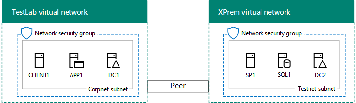
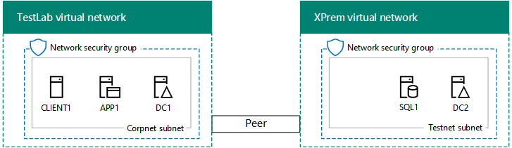

# Intranet SharePoint Server 2016 in Azure dev/test environment

[!INCLUDE[appliesto-xxx-2016-xxx-xxx-md](../includes/appliesto-xxx-2016-xxx-xxx-md.md)]
  
This topic steps you through creating a simulated intranet SharePoint farm hosted in Azure. Here is the resulting configuration:
  
**Figure 1: The SharePoint Server 2016 intranet in Azure dev/test environment**


  
This configuration consists of:
  
- A simulated and simplified on-premises network (the TestLab virtual network hosted in Azure). 
    
- A cross-premises virtual network hosted in Azure (the XPrem virtual network hosted in Azure). 
    
- VNet peering to connect the two virtual networks. 
    
- A single-server SharePoint farm (SP1 and SQL1) and secondary domain controller (DC2) in the XPrem virtual network. 
    
This configuration provides a basis and common starting point from which you can:
  
- Perform testing of administration and the client experience before deploying a production version of this configuration 
    
- Develop and test applications on aa simulated SharePoint intranet farm running in Azure. 
    
There are three major phases to setting up this dev/test environment:
  
1. Set up the simulated cross-premises environment. 
    
2. Configure the SQL server computer (SQL1). 
    
3. Configure the SharePoint server (SP1). 
    
> [!NOTE]
> This configuration requires a paid Azure subscription. You cannot build this with an Azure Free Trial. 
  
## Phase 1: Set up the simulated cross-premises environment

Use the instructions in [Simulated cross-premises virtual network in Azure](/office365/enterprise/simulated-cross-premises-virtual-network-in-azure) to create the following configuration: 
  
**Figure 2: The simulated cross-premises environment**


  
Figure 2 shows the CorpNet and XPrem VNets with a DC2 virtual machine in the XPrem VNet.
  
Because the intranet SharePoint dev/test environment does not require the presence of the APP1 server on the Corpnet subnet, feel free to shut it down for now.
  
## Phase 2: Configure the SQL Server computer (SQL1)

To create the SQL Server 2016 virtual machine with Azure PowerShell, supply the values for the variables. Then, run the resulting command block at the Azure PowerShell prompt or in the PowerShell Integrated Script Environment (ISE) on your local computer.
  
  
```
# Log in to Azure
Connect-AzAccount
# Set up key variables
$subscrName="<name of your Azure subscription>"
$rgName="<your resource group name>"
# Set the Azure subscription
Select-AzSubscription -SubscriptionName $subscrName
# Get the Azure location
$sa=Get-AzStorageaccount | where {$_.ResourceGroupName -eq $rgName}
# Create an availability set for SQL Server virtual machines
New-AzAvailabilitySet -ResourceGroupName $rgName -Name sqlAvailabilitySet -Location $locName -Sku Aligned  -PlatformUpdateDomainCount 5 -PlatformFaultDomainCount 2
# Create the SQL Server virtual machine
$vmName="SQL1"
$vmSize="Standard_D3_V2"
$vnet=Get-AzVirtualNetwork -Name "XPrem" -ResourceGroupName $rgName
$nicName=$vmName + "-NIC"
$pipName=$vmName + "-PIP"
$pip=New-AzPublicIpAddress -Name $pipName -ResourceGroupName $rgName -Location $locName -AllocationMethod Dynamic
$nic=New-AzNetworkInterface -Name $nicName -ResourceGroupName $rgName -Location $locName -SubnetId $vnet.Subnets[0].Id -PublicIpAddressId $pip.Id -PrivateIpAddress "192.168.0.10"
$avSet=Get-AzAvailabilitySet -Name sqlAvailabilitySet -ResourceGroupName $rgName 
$vm=New-AzVMConfig -VMName $vmName -VMSize $vmSize -AvailabilitySetId $avSet.Id
$vm=Set-AzVMOSDisk -VM $vm -Name ($vmName +"-OS") -DiskSizeInGB 128 -CreateOption FromImage -StorageAccountType "StandardLRS"
$diskSize=100
$diskConfig=New-AzDiskConfig -AccountType "StandardLRS" -Location $locName -CreateOption Empty -DiskSizeGB $diskSize
$dataDisk1=New-AzDisk -DiskName ($vmName + "-SQLData") -Disk $diskConfig -ResourceGroupName $rgName
$vm=Add-AzVMDataDisk -VM $vm -Name ($vmName + "-SQLData") -CreateOption Attach -ManagedDiskId $dataDisk1.Id -Lun 1
$cred=Get-Credential -Message "Type the name and password of the local administrator account of the SQL Server computer." 
$vm=Set-AzVMOperatingSystem -VM $vm -Windows -ComputerName $vmName -Credential $cred -ProvisionVMAgent -EnableAutoUpdate
$vm=Set-AzVMSourceImage -VM $vm -PublisherName MicrosoftSQLServer -Offer SQL2016-WS2016 -Skus Standard -Version "latest"
$vm=Add-AzVMNetworkInterface -VM $vm -Id $nic.Id
New-AzVM -ResourceGroupName $rgName -Location $locName -VM $vm

```

Record the name and password of the local administrator account in a secure location.
  
> [!NOTE]
> This Azure PowerShell command block creates an Azure availability set for the SQL1 virtual machine. This is done in case you want to add more SQL Server virtual machines to this basic configuration. 
  
From the [Azure portal](http://portal.azure.com) on your local computer, connect to the SQL Server virtual machine (SQL1) using the credentials of the local administrator account. 
  
Next, join the SQL Server to the Windows Server AD domain with these commands at a Windows PowerShell prompt on SQL1.
  
```
Add-Computer -DomainName "corp.contoso.com"
Restart-Computer
```

Note that you must supply domain account credentials after entering the **Add-Computer** command. Use the CORP\User1 account and password. 
  
After the SQL Server virtual machine restarts, reconnect to it using the local administrator account.
  
From a Windows PowerShell command prompt on SQL1, run the following commands to prepare the extra data disk:
  
```
Get-Disk | Where PartitionStyle -eq "RAW" | Initialize-Disk -PartitionStyle MBR -PassThru | New-Partition -AssignDriveLetter -UseMaximumSize | Format-Volume -FileSystem NTFS -NewFileSystemLabel "SQL Data"
md f:\Data
md f:\Log
md f:\Backup
```

SQL Server requires a port that SQL clients use to access the database server. It also needs ports to connect with the SQL Server Management Studio. Run the following command at the Windows PowerShell command prompt on SQL1:
  
```
New-NetFirewallRule -DisplayName "SQL Server ports 1433, 1434, and 5022" -Direction Inbound -Protocol TCP -LocalPort 1433,1434,5022 -Action Allow
```

Next, configure SQL1 to use the F: drive for new databases and for accounts and permissions.
  
1. On the Start screen, type **studio**, and then click **Microsoft SQL Server Management Studio**. It might take a few minutes to load user settings.
    
2. In **Connect to Server**, click **Connect**.
    
3. In the left pane, right-click the top node—the default instance named after the machine—and then click **Properties**.
    
4. In **Server Properties**, click **Database Settings**.
    
5. In **Database default locations**, set the following values:
    
  - For **Data**, set the path to **f:\Data**.
    
  - For **Log**, set the path to **f:\Log**.
    
  - For **Backup**, set the path to **f:\Backup**.
    
6. Click **OK** to close the window. 
    
7. In the left pane, expand the **Security** folder. 
    
8. Right-click **Logins**, and then click **New login**.
    
9. In **Login name**, type **CORP\User1**.
    
10. Under **Select a page**, click **Server Roles**, click **sysadmin**, and then click **OK**.
    
11. Close SQL Server Management Studio.
    
Sign out as the local administrator.
  
Here is the result of Phase 2:
  
**Figure 3: The addition of SQL1**


  
Figure 3 shows the CorpNet and XPrem VNets with the additional SQL1 virtual machine in the XPrem VNet.
  
## Phase 3: Configure the SharePoint server (SP1)

In this phase, you create a SharePoint Server 2016 virtual machine in your virtual network, make it a member of the Windows Server AD domain, and then create a new single-server SharePoint farm.
  
First, you must create a new Windows Server AD account for the SharePoint farm. From the [Azure portal](http://portal.azure.com) on your local computer, connect to DC2. Then, run the following command from an administrator-level Windows PowerShell command prompt on DC2: 
  
```
New-ADUser -SamAccountName sp_farm_db -AccountPassword (read-host "Set user password" -assecurestring) -name "sp_farm_db" -enabled $true -PasswordNeverExpires $true -ChangePasswordAtLogon $false
```

You will be prompted to supply the password for the sp_farm_db account. Record the password in a secure location.
  
Next, to create the SharePoint Server 2016 virtual machine with Azure PowerShell, supply the values of the variables. Then, run the resulting block at the Azure PowerShell prompt on your local computer:
  
```
# Set up key variables
$subscrName="<name of your Azure subscription>"
$rgName="<your resource group name>"
# Set the Azure subscription
Select-AzSubscription -SubscriptionName $subscrName
# Get the Azure location and storage account name
$locName=(Get-AzResourceGroup -Name $rgName).Location
$saName=(Get-AzStorageaccount | Where {$_.ResourceGroupName -eq $rgName}).StorageAccountName
# Create an availability set for SharePoint virtual machines
New-AzAvailabilitySet -ResourceGroupName $rgName -Name spAvailabilitySet -Location $locName -Sku Aligned  -PlatformUpdateDomainCount 5 -PlatformFaultDomainCount 2
# Create the SharePoint virtual machine
$vmName="SP1"
$vmSize="Standard_D3_V2"
$vm=New-AzVMConfig -VMName $vmName -VMSize $vmSize
$nicName=$vmName + "-NIC"
$pipName=$vmName + "-PIP"
$pip=New-AzPublicIpAddress -Name $pipName -ResourceGroupName $rgName -Location $locName -AllocationMethod Dynamic
$vnet=Get-AzVirtualNetwork -Name "XPrem" -ResourceGroupName $rgName
$nic=New-AzNetworkInterface -Name $nicName -ResourceGroupName $rgName -Location $locName -SubnetId $vnet.Subnets[0].Id -PublicIpAddressId $pip.Id -PrivateIpAddress "192.168.0.11"
$avSet=Get-AzAvailabilitySet -Name spAvailabilitySet -ResourceGroupName $rgName 
$vm=New-AzVMConfig -VMName $vmName -VMSize $vmSize -AvailabilitySetId $avSet.Id
$pubName="MicrosoftSharePoint"
$offerName="MicrosoftSharePointServer"
$skuName="2016"
$cred=Get-Credential -Message "Type the name and password of the local administrator account of the SharePoint server."
$vm=Set-AzVMOperatingSystem -VM $vm -Windows -ComputerName $vmName -Credential $cred -ProvisionVMAgent -EnableAutoUpdate
$vm=Set-AzVMSourceImage -VM $vm -PublisherName $pubName -Offer $offerName -Skus $skuName -Version "latest"
$vm=Add-AzVMNetworkInterface -VM $vm -Id $nic.Id
$vm=Set-AzVMOSDisk -VM $vm -Name "DC1-OS" -DiskSizeInGB 128 -CreateOption FromImage -StorageAccountType "StandardLRS"
New-AzVM -ResourceGroupName $rgName -Location $locName -VM $vm

```

Record the name and password of the local administrator account in a secure location.
  
> [!NOTE]
> This Azure PowerShell command block creates an Azure availability set for the SP1 virtual machine. This is done in case you want to add more SharePoint Server 2016 virtual machines to this basic configuration. 
  
### Configure the SharePoint Server 2016 virtual machine

From the [Azure portal](http://portal.azure.com) on your local computer, connect to the SharePoint virtual machine (SP1) using the credentials of its local administrator account. 
  
Join the SharePoint virtual machine to the Windows Server AD domain with these commands at the Windows PowerShell prompt on SP1:
  
```
Add-Computer -DomainName "corp.contoso.com"
Restart-Computer
```

Note that you must supply domain account credentials after entering the **Add-Computer** command. Use the CORP\User1 account name and password. 
  
After the SharePoint virtual machine restarts, reconnect to it using the CORP\User1 account name and password.
  
Next, create a new, single-server SharePoint farm on SP1.
  
1. From the Start screen, type **SharePoint**, and then click **SharePoint 2016 Products Configuration Wizard**.
    
2. On the **Welcome to SharePoint Products** page, click **Next**.
    
3. A **SharePoint Products Configuration Wizard** dialog appears, warning that services (such as IIS) will be restarted or reset. Click **Yes**.
    
4. On the **Connect to a server farm** page, select **Create a new server farm**, and then click **Next**.
    
5. On the **Specify Configuration Database Settings** page: 
    
  - In **Database server**, type **SQL1**.
    
  - In **Username**, type **CORP\sp_farm_db**. 
    
  - In **Password**, type the sp_farm_db account password.
    
6. Click **Next**.
    
    If the SQL1 server cannot be found, ensure that you ran this command from an administrator-level Windows PowerShell command prompt on SQL1:
    
  ```
  New-NetFirewallRule -DisplayName "SQL Server ports 1433, 1434, and 5022" -Direction Inbound -Protocol TCP -LocalPort 1433,1434,5022 -Action Allow
  ```

7. On the **Specify Farm Security Settings** page, type a passphrase twice. Record the passphrase and store it in a secure location for future reference. Click **Next**.
    
8. On the **Specify Server Role** page, in **Single-Server Farm**, click **Single-Server Farm**, and then click **Next**.
    
9. On the **Configure SharePoint Central Administration Web Application** page, click **Next**.
    
10. The **Completing the SharePoint Products Configuration Wizard** page appears. Click **Next**.
    
11. The **Configuring SharePoint Products** page appears. Wait until the configuration process completes. 
    
12. On the **Configuration Successful** page, click **Finish**. The new administration website starts.
    
13. On the **Help Make SharePoint Better** page, click your choice to participate in the Customer Experience Improvement Program, and then click **OK**.
    
14. On the **Welcome** page, click **Start the Wizard**.
    
15. On the **Service Applications and Services** page, in **Service Account**, click **Use existing managed account**, and then click **Next**. It can take a few minutes to display the next page.
    
16. On the **Create Site Collection** page, type **Contoso** in **Title**, and then click **OK**.
    
17. On the **This completes the Farm Configuration Wizard** page, click **Finish**. The SharePoint Central Administration web page displays.
    
18. From the [Azure portal](http://portal.azure.com) on your local computer, connect to the CLIENT1 VM. 
    
19. From CLIENT1, open a new tab in Internet Explorer, type **http://sp1/** in the Address bar, and then press Enter. You should see the default Contoso team site. 
    
Here is the result of Phase 3:
  
**Figure 4: The addition of SP1**


  
Figure 4 shows the CorpNet and XPrem VNets with the SP1 and SQL1 virtual machines in the XPrem VNet.
  
Your emulated intranet SharePoint Server 2016 farm running in Azure is now ready for testing.
  
## Next steps

When you are ready to design a production SharePoint Server 2016 farm in Azure, see [Designing a SharePoint Server 2016 farm in Azure](designing-a-sharepoint-server-2016-farm-in-azure.md).
  
When you are ready to deploy a production-ready, high availability SharePoint Server 2016 farm in Azure, see [Deploying SharePoint Server 2016 with SQL Server AlwaysOn Availability Groups in Azure](deploying-sharepoint-server-2016-with-sql-server-alwayson-availability-groups-in.md).
  
## See also

- [SharePoint Server 2016 dev/test environment in Azure](sharepoint-server-2016-dev-test-environment-in-azure.md)
- [SharePoint Server 2016 in Microsoft Azure](sharepoint-server-2016-in-microsoft-azure.md)
- [Designing a SharePoint Server 2016 farm in Azure](designing-a-sharepoint-server-2016-farm-in-azure.md)
