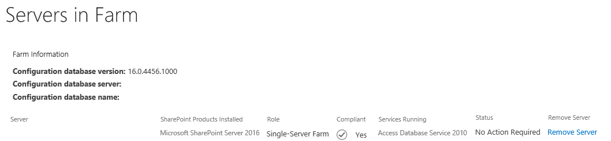
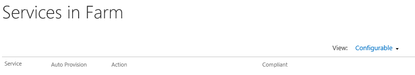
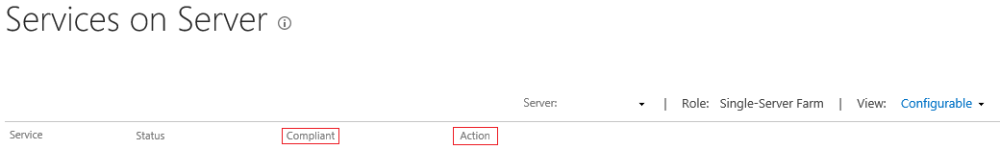
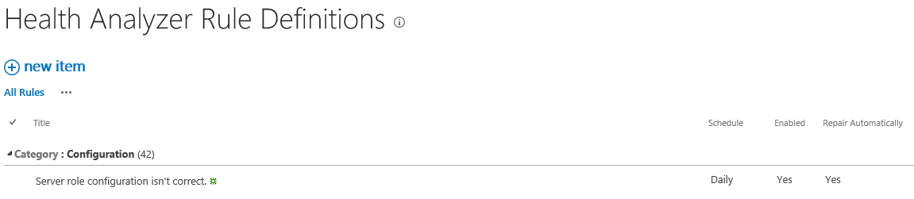

# Managing a MinRole Server Farm in SharePoint Servers 2016 and 2019

[!INCLUDE[appliesto-xxx-2016-2019-xxx-md](../includes/appliesto-xxx-2016-2019-xxx-md.md)]

Learn how to manage your MinRole farm deployment in SharePoint Servers 2016 and 2019.
  
 **MinRole** is a new farm topology based on a set of predefined server roles introduced in SharePoint Server 2016. When configuring your SharePoint farm, you now select the role of a server when you create a new farm or join a server to an existing farm. SharePoint will automatically configure the services on each server based on the server's role. SharePoint Servers 2016 and 2019 has been optimized for the MinRole farm topology. 
  
## MinRole administration

### Central Administration changes for MinRole

With the addition of the MinRole feature, there are several changes to the Central Administration website.
  
#### Manage servers in this farm

This page shows the servers that are joined to the farm. Two columns have been added to this page: **Role** and **Compliant**. 
  

  
The **Role** column displays the role that is assigned to the server in the farm. 
  
> [!NOTE]
> In the "Servers in Farm" page, the SQL server and SMTP server will be listed as belonging to the "External" role, while in Microsoft PowerShell, their server roles are displayed as "Invalid". These two role names are equivalent. 
  
The **Compliant** column displays whether the server configuration is in compliance with its server role. If the server is not in compliance, a **Fix** link will be provided to automatically reconfigure the server to match the expected configuration of its server role. 
  
> [!NOTE]
> Only members of the local Administrators group on the server that hosts Central Administration have access to the **Fix** link. 
  
#### Manage services in this farm

This is a new page in the System Settings category of Central Administration. It displays the state of each service in the farm. This page has three column of interest: **Auto Provision**, **Action**, and **Compliant**. 
  

  
The **Auto Provision** column displays whether the service is enabled in the farm. If the value **Yes** is displayed, service instances for this service will be started on the appropriate MinRole-managed servers in the farm. If the value **No** is displayed, service instances for this service will be stopped on the appropriate MinRole-managed servers in the farm. 
  
The **Action** column displays one of three values depending on the type of service it is and whether it is enabled in the farm: **Manage Service application**, **Disable Auto Provision**, and **Enable Auto Provision**. 
  
The **Manage Service Application** value indicates that the service is associated with a service application. This service will be enabled or disabled in the farm by its service application, typically when you create or delete the service application. Click the link to access the Service Application Management page. 
  
> [!NOTE]
> The Manage Service Application link will only appear for services that support service applications. 
  
The **Disable Auto Provision** link disables the service in the farm. When you click this link, all services instances associated with this service will be stopped on the appropriate MinRole-managed servers in the farm. 
  
The **Enable Auto Provision** link enables the service in the farm. When you click this link, service instances for this service will be started on the appropriate MinRole-managed servers in the farm. 
  
The **Compliant** column displays whether the service is in compliance on every server in the farm. If this service is not in compliance on one or more servers, a **Fix** link will be provided. Click this link to automatically reconfigure the service instances of this service to match the expected configuration. 
  
> [!NOTE]
> Only members of the local Administrators group on the server that hosts Central Administration have access to the **Fix** link. 
  
#### Manage services on server

This page displays all of the service instances on a server. Some things have changed as highlighted in red in the following diagram.
  

  
In previous releases of SharePoint, this page was accessible only to members of the local Administrators group on the Central Administration server. In SharePoint Server 2016, all members of the SharePoint Farm Administrators group have access to this page.
  
The role of the server is now displayed next to the name of the server.
  
The **Compliant** column has been added to the page. It displays whether the service instance is in compliance on this server. If this service instance is not in compliance on this server, a Fix link will be provided. Click this link to automatically reconfigure the service instance on this server to match the expected configuration. 
  
> [!NOTE]
> Only members of the local Administrators group on the server that hosts the Central Administration have access to the Fix link. 
  
The **Action** column has changed. The link to start or stop a service has been removed for servers that are managed by MinRole. The only actionable item is **Restart** for service instances that are already started on this server. To start or stop a service click the **Enable Auto Provision** or **Disable Auto Provision** link in **Manage services in this farm** page. 
  
> [!NOTE]
> Servers that are assigned to the Custom role will still display the **Start** and **Stop** links in the **Action** column. 
  
> [!NOTE]
> Only members of the local Administrators group on the server that hosts the Central Administration have access to the **Restart**, **Start**, and **Stop** links. 
  
### Manage the services in the farm by using Windows PowerShell

New PowerShell cmdlets have been introduced to manage the services in the farm.
  
||||
|:-----|:-----|:-----|
|**Cmdlet name**   |**Description**   |**Syntax example**   |
|Get-SPService    |The [Get-SPService](/powershell/module/sharepoint-server/Get-SPService?view=sharepoint-ps) cmdlet gets a service in the farm.    | *Get-SPService -Identity "Microsoft SharePoint Foundation Sandboxed Code Service"*    |
|Start-SPService    |The [Start-SPService](/powershell/module/sharepoint-server/Start-SPService?view=sharepoint-ps) cmdlet enables a service in the farm. Service instances for this service will be started on the appropriate MinRole-managed servers in the farm.    | *Start-SPService -Identity "Microsoft SharePoint Foundation Sandboxed Code Service"*    |
|Stop-SPService    |The [Stop-SPService](/powershell/module/sharepoint-server/Stop-SPService?view=sharepoint-ps) cmdlet disables a service in the farm. Service instances for this service will be stopped on the appropriate MinRole-managed servers in the farm.    | *Stop-SPService -Identity "Microsoft SharePoint Foundation Sandboxed Code Service"*    |
   
> [!NOTE]
> An optional **IncludeCustomServerRole** parameter has been added to the **Start-SPService** and **Stop-SPService** Windows PowerShell cmdlets in the November 2016 Public Update for SharePoint Server 2016 (Feature Pack 1). If specified, it will also create a timer job that starts or stops service instances on servers that are assigned to the Custom server role. This is a one-time timer job. MinRole will make no further attempts to manage the service instances on servers assigned to the Custom server role. > Services that have associated service applications cannot be started or stopped by using the [Start-SPService](/powershell/module/sharepoint-server/Stop-SPService?view=sharepoint-ps) and [Stop-SPService](/powershell/module/sharepoint-server/Stop-SPService?view=sharepoint-ps) cmdlets. These services can be started or stopped by creating or deleting their associated service applications. If you use the [Start-SPService](/powershell/module/sharepoint-server/Start-SPService?view=sharepoint-ps) or [Stop-SPService](/powershell/module/sharepoint-server/Stop-SPService?view=sharepoint-ps) cmdlets with services that have associated service applications, an error message will be shown indicating that the associated service applications should be created or deleted instead. 
  
### Health monitoring

A new health analyzer rule has been created to ensure that your servers are operating in their optimal MinRole configuration. The **Server role configuration isn't correct** rule runs every night at midnight on each server in your farm. It scans all service instances on the server to detect if any are not in compliance. If any service instance is not in compliance, the health rule will automatically reconfigure it to match the expected configuration. No manual intervention by the SharePoint farm administrator is required. 
  

  
The automatic repair functionality of the health rule can be disabled by the SharePoint farm administrator while still allowing the health rule to run. If the health rule detects that a server is not in compliance and the automatic repair functionality is disabled, it will generate a health report in Central Administration. The health report will identify which servers are not in compliance, offer the ability to automatically repair the servers, and provide instructions on how to manually repair the servers.
  
The SharePoint farm administrator can control the health rule schedule, changing it to run more frequently or less frequently or disabling it so that it is never scheduled. It can also run on demand.
  
> [!NOTE]
> This health rule will not scan or repair servers that are assigned to the Custom role. A server assigned to the Custom role will not be managed by MinRole. 
  
## Developers: How to assign services to server roles

If you are a SharePoint developer intending to create an application with services, it is recommended that you assign each type of service instance to one or more server roles supported by MinRole:
  
 **Assign services to server roles**
  
1. Implement your service by inheriting from the **SPService** class. 
    
2. Set the AutoProvision property value in the constructors of the new service class if you want to enable or disable this service by default.
    
3. Implement the service instance class of the service by inheriting from the **SPServiceInstance** class. 
    
4. Override the **ShouldProvision(SPServerRole serverRole)** method to assign this service to specific server roles if necessary. 
    
For more information about how to subscribe a service to a specific role, see [SPService class](https://msdn.microsoft.com/en-us/library/office/microsoft.sharepoint.administration.spservice.aspx) and [SPServiceInstance class](https://msdn.microsoft.com/en-us/library/office/microsoft.sharepoint.administration.spserviceinstance.aspx).
  
 **Integrate with role conversion pre-validation**
  
1. Implement the service instance class of the service by inheriting from the **SPServiceInstance** class. 
    
2. Override the **IsReadyForRoleConversion(SPServerRole newRole, out IEnumerable\<string\> errorMessages)** method to detect if your service instance is ready for role conversion to the server role specified by the newRole parameter. Return **true** if it's ready or **false** if it isn't ready. If you return **false**, provide a list of messages to explain why the service instance isn't ready for role conversion and instructions for resolving the issue via the errorMessages parameter.
    

