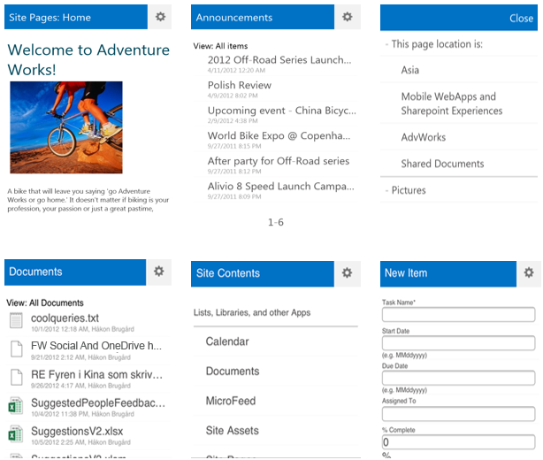
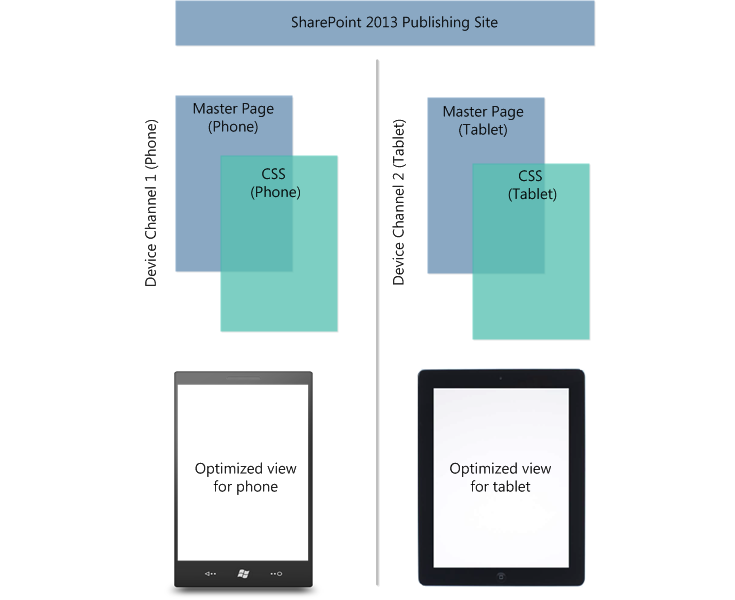

# Overview of mobile devices and SharePoint Server 2013

[!INCLUDE[appliesto-2013-xxx-xxx-xxx-md](../includes/appliesto-2013-xxx-xxx-xxx-md.md)] 
  
SharePoint Server 2013 offers new, optimized viewing experiences across different mobile platforms. Additionally, there are several features that are available to help improve both worker productivity and usability on the device. This article is intended for IT professionals to help understand the SharePoint Server 2013 mobile features that are available to your organization.
  
    
> [!IMPORTANT]
> For more information about supported mobile browsers with SharePoint Server 2013, see [Mobile device browsers supported in SharePoint 2013](supported-mobile-device-browsers.md). 
  
For an end-to-end look and understanding of the SharePoint Server 2013 mobile landscape, see the poster [Overview of mobile devices and SharePoint 2013](https://docs.microsoft.com/sharepoint/administration/mobile-devices-overview). For more information about how to administer your mobile environment, see [Mobile administration (SharePoint Server 2010)](https://docs.microsoft.com/previous-versions/office/sharepoint-server-2010/ff393820(v=office.14)).
  
## Mobile browser experience

SharePoint Server 2013 offers improvements to the mobile browser experience with the introduction of a new contemporary view. Depending on the mobile browser, users have one of the following browsing options:
  
- **Contemporary view** This view offers an optimized mobile browser experience to users and renders in HTML5. This view is available to Mobile Internet Explorer version 9.0 or later versions for Windows Phone 7.5, Safari version 4.0 or later versions for iPhone iOS 5.0, and the Android browser for Android 4.0 or later versions. 
    
- **Classic view** This view renders in HTML format, or similar markup languages (CHTML, WML, and so on), and provides backward compatibility for mobile browsers that cannot render in the new contemporary view. The classic experience in SharePoint Server 2013 is identical to the mobile browser experience of SharePoint Server 2010. 
    
- **Full-screen UI** There is also the ability to have a full desktop view of a SharePoint site on a smartphone device. 
    
The following figure shows the contemporary view for a smartphone browser.
  
**Figure: Contemporary view on a smartphone browser**

  
> [!NOTE]
> For the above figure the top row shows the contemporary view rendering on a Windows Phone, and the iPhone for the bottom row. The classic and contemporary views are only rendered for smartphone mobile browsers. For more information about which mobile browsers are supported in SharePoint Server 2013, see [Mobile device browsers supported in SharePoint 2013](supported-mobile-device-browsers.md). 
  
The contemporary view of a SharePoint site offers users some of the following enhanced features:
  
- **Menu button** The menu button is located on the right side of the title area of the contemporary view. It presents a user with several commands. This includes the following: 
    
  - **Site contents** allows the user to view all of the site content on the SharePoint site including lists and document libraries. 
    
  - **Sign Out** allows the user to log off from SharePoint. SharePoint information is now unavailable to the mobile device. 
    
  - **Close** closes the Command button menu and returns to the SharePoint site. 
    
- **Switch to PC View** This changes the display from mobile browser view to a full desktop view of a site. This command is available in both contemporary and classic views in SharePoint Server 2013. You can switch back to the mobile browser view in **Site Settings**. Under the **Site Information** section, click the URL under the **Mobile Site URL** heading. 
    
- **Navigation window** This is accessed by tapping the left side of the title area of the contemporary view. The navigation window presents a single menu with breadcrumbs, top navigation, and quick launch navigation from the full desktop view of the site. Also included is a link to **All Site Content**. 
    
- **Tap-to-open links** All hyperlinks are replaced with the new tap-to-open link feature. This feature displays text or icons on a wide strip that is easier for a user to tap. 
    
- **Pagination** Lists with more than 20 items are automatically paginated. 
    
- **New and edit functionality** You can create new list items and edit them in the contemporary view. For example, you can create a new task in a task list on your mobile device by tapping **New**. Alternatively, you could also edit the task in the list by tapping **Edit**.
    
For more information about mobile views and planning a mobile browser-based experience, see [Plan for mobile views in SharePoint Server 2013](plan-for-mobile-views.md).
  
### Mobile browser redirection

To access a site by using the optimized mobile browser experience, a new feature named Mobile Browser View must be activated on the site. When activated and a mobile browser is accessing the site, this feature checks the mobile browser to determine whether it can handle HTML5. If the mobile browser supports HTML5, the contemporary view is rendered. Otherwise, the classic view is rendered.
  
By default, this feature is activated when any of the following site templates are used:
  
- Team Site
    
- Blank Site
    
- Document Workspace
    
- Document Center
    
- Project Site
    
You must explicitly activate the feature on sites created with other templates. You can activate or deactivate the Mobile Browser View feature at the site level.
  
### Mobile views and the browser definition file

A mobile view is a version of the SharePoint site that was optimized for mobile devices. The browser definition file lists the mobile browsers and devices that are supported by SharePoint Server 2013 and is used to redirect mobile browsers to the mobile views. You can modify the browser definition file to change the redirect behavior of a mobile browser, or to add or delete entries from the list of supported mobile devices.
  
The browser definition file lists the mobile browsers and devices that can access mobile views in SharePoint Server 2013. When a user browses a SharePoint site from a mobile device, the mobile browser submits to the site an HTTP GET request that includes a user agent string. If the mobile browser and device model in the user agent string are listed in the browser definition file and the  `isMobileDevice` setting for the mobile browser is set to  `true`, SharePoint Server 2013 redirects the mobile browser to the mobile view of the site. Otherwise, a standard view of the site is shown in the mobile browser. You can modify the file to change the redirect behavior of a mobile browser.
  
The browser definition file lists the mobile browsers and devices that are supported by SharePoint Server 2013. The file can be updated when product updates to SharePoint Server 2013 are released. You can also modify the file to add a mobile browser or device to the list. For more information about how to modify the browser definition file, see [Configure the browser definition file in SharePoint Server](/previous-versions/office/sharepoint-server-2010/ff393836(v=office.14)). Also, for more information about mobile views and planning a mobile browser-based experience, see [Plan for mobile views in SharePoint Server 2013](plan-for-mobile-views.md).
  
## Device channels

Browsing the web on a mobile device is now so common that a SharePoint site must be optimized for readability and ease of use on smartphones and other mobile devices such as tablets. Previous versions of SharePoint Server included a single default mobile view that was auto-generated based on the existing site, and that default mobile view was not easily customizable. Now, with device channels in SharePoint Server 2013, you can render a single publishing site in multiple ways by using different designs that target different devices based on their user agent string. You create a single site and author the content in it a single time. Then, that site and content can be mapped to use different master pages and style sheets for a specific device or group of devices. Also, you can easily show different content to different device channels using same page and page layout.
  

  
For more information on using device channels, and understanding the larger custom design and site branding experience for SharePoint 2013, see [Plan device channels](https://msdn.microsoft.com/library/jj862343) and [Overview of Design Manager](https://msdn.microsoft.com/library/jj822363.aspx).
  
## Office Web Apps

In SharePoint Server 2010, Office Web Apps Server provides browser-based companions for Word, Excel, and PowerPoint. When Office Web Apps Server is installed on SharePoint Server 2010, Office Mobile Web Apps is also installed on the server. Office Mobile Web Apps enables users to open documents in the mobile web application by using a mobile browser. With SharePoint Server 2013, Office Web Apps Server is no longer a companion product installed on a computer that is running SharePoint Server. Instead, Office Web Apps Server is a new stand-alone server product that still provides mobile browser-based viewers for these applications. These viewers called Word Mobile Viewer, Excel Mobile Viewer, and PowerPoint Mobile Viewer are optimized to render documents for phones. When integrated with SharePoint Server 2013, a user can enjoy enhanced viewing experiences when interacting with documents on the phone. 
  
Together, SharePoint Server 2013 and Office Web Apps Server offer a better user experience when interacting with documents on a mobile device. For example, when both products are used together, a user opens a server-based version of the document in the mobile browser. Without Office Web Apps Server, the user would first have to download the file and then open it in Office Mobile or in an Office document viewer. 
  
## Location

SharePoint Server 2013 introduces a new geolocation field type that can be used in a list. For example, you can now make lists "location-aware" and display latitude and longitude coordinates through Bing Maps. An entry is typically seen as a pushpin on the map view. Although there are several ways to use this geolocation field, one key scenario is for mobile application development. Users can track or log location-specific data while they work remotely from the corporate office. Alternatively, the application can help them locate points of interest when they perform offsite functions. To display map views in the list, you must use the Bing Maps service. For information about the procedures and Microsoft PowerShell for SharePoint Server 2013 cmdlets necessary to display map views, see [Use the location field type in mobile applications for SharePoint Server](/sharepoint/administration/mobile-devices-overview).
  
> [!NOTE]
> The geolocation field is not available when you create a list through the user interface (UI). Therefore, you cannot make a custom list and add it as a column through traditional UI methods. Instead, this field must be inserted programmatically. For more information about how to render and work with this data type programmatically, see [Integrating location and map functionality in SharePoint 2013](https://go.microsoft.com/fwlink/?LinkId=253673). 
  
## Push notifications

SharePoint Server 2013 supports applications on mobile devices that should receive notifications from a SharePoint site. Notifications can include events that occur in the site, such as when a user adds an item to a list or updates an item. For mobile devices to receive such notifications, device applications must register with a SharePoint site. Once registered, you can write event handler code to interact with Microsoft Push Notification Service or notification services of other mobile device platforms. Notifications are sent from the server where the application is hosted to the registered mobile device application.
  
When the push notification feature is activated, a subscription store is created at the website level to store information from devices that have registered with the SharePoint site to receive notifications. This subscription store is created as a hidden list that cannot be viewed directly by a user or an administrator. There is a limit of 2,000 device registrations for push notifications in SharePoint Server 2013. Once this limit is reached, no further registrations can be performed unless entries are cleared from the subscription store. To perform this procedure on your SharePoint site, see [Clear push notification registrations from the subscription store in SharePoint Server](/sharepoint/administration/administration).
  
## Business intelligence content

SharePoint Server 2013 enables a user to view certain kinds of dashboard content. This includes PerformancePoint reports and scorecards, and Excel Services reports in iOS 5.0 Safari browsers on iPad devices. For more information about how to use this feature, see [Viewing reports and scorecards on Apple iPad devices](https://go.microsoft.com/fwlink/?LinkId=253668) in the SharePoint Server 2010 Library. 
  
## Subscribe to mobile alerts

You can configure and manage a mobile account in SharePoint Server 2013 to enable users to subscribe to alerts that are sent by using Short Message Service (SMS). The alerts are sent to the mobile device when changes are made to a SharePoint list or item. Because a SharePoint site is usually located on an intranet, access to the SharePoint site can be difficult when users are away from the office. For example, when they are traveling or attending a business dinner. The mobile alert feature enables users to react quickly when they receive an SMS alert that an item in a SharePoint list has changed. For more information about how to subscribe to mobile alerts in SharePoint, see [Configure mobile accounts in SharePoint 2013](/previous-versions/office/sharepoint-server-2010/ee428323(v=office.14)).
  
## See also

#### Concepts

[Mobile device browsers supported in SharePoint 2013](supported-mobile-device-browsers.md)
#### Other Resources

[Administer mobile devices in SharePoint Server](/previous-versions/office/sharepoint-server-2010/ff393820(v=office.14))
  
[Configure mobile accounts in SharePoint 2013](/previous-versions/office/sharepoint-server-2010/ee428323(v=office.14))

