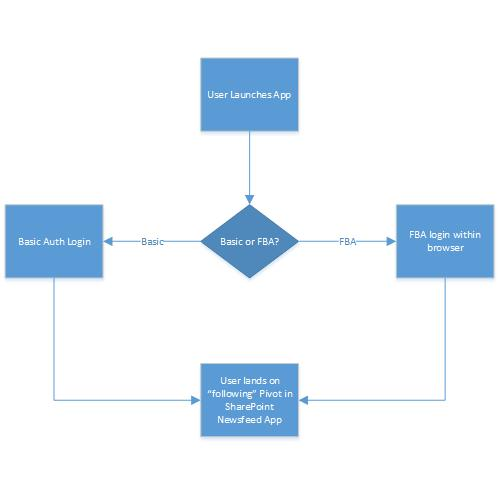
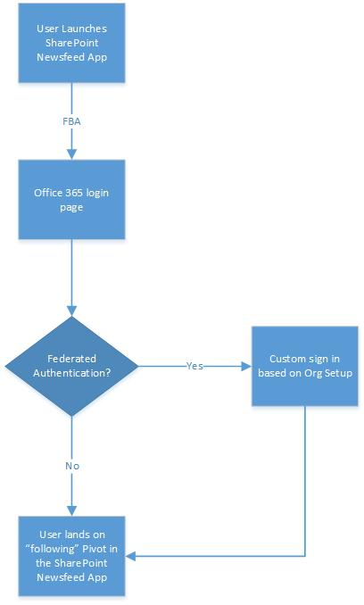

# Mobile security and authentication in SharePoint 2013

[!INCLUDE[appliesto-2013-xxx-xxx-xxx-md](../includes/appliesto-2013-xxx-xxx-xxx-md.md)]
  
This article provides security guidance and recommendations to help ensure that access to SharePoint Server 2013 and specific data in SharePoint is not compromised on a mobile device. This article also details the supported authentication types for select devices, and authentication specifics for the SharePoint Newsfeed App. 
  
    
## Security for mobile devices

This section provides security recommendations for using devices that are external to your corporate network. A lost or stolen device could be devastating to an organization on many levels. Therefore, necessary measures must be put in place if one were to be compromised.
  
General security considerations include the following:
  
- Mobile devices can contain sensitive data or documents. Because mobile devices can be lost or stolen, we recommend that you set policies around mobile devices to help protect sensitive data and documents. This can include securing the mobile device by using a PIN or lock, and ensuring that you can remotely wipe the data on the mobile device. Available programs and features vary by mobile device. For more information about a possible method to implement these policies in your organization, see [Exchange ActiveSync](mobile-security-and-authentication.md#activesync) later in this article. 
    
- You can educate users about how they can help protect their user credentials. This can include signing out of sites when they have finished, not enabling any option that keeps them signed in or remembers their password, and frequently deleting cookies in the mobile browser. This can help prevent others from using their user credentials to log on to a SharePoint site if their mobile device is lost or stolen.
    
- We recommend that you enable SSL to help secure communication between mobile browsers and the computer that is running SharePoint Server 2013. For more information about how to use a reverse proxy server, such as Forefront Unified Access Gateway (UAG), to help secure communication, see [Forefront Unified Access Gateway (UAG)](https://go.microsoft.com/fwlink/p/?LinkID=196384) in the Forefront Technical Library. 
    
### Exchange ActiveSync

Microsoft Exchange ActiveSync is a communications protocol that enables mobile access, over the air, to e-mail messages, scheduling data, contacts, and tasks. Exchange ActiveSync is available on Windows Phone and third-party phones and slates that are enabled for Exchange ActiveSync such as the Apple iPhone. One of the benefits of implementing Exchange ActiveSync in your organization is device-side security, and administration through policy enforcement. If SharePoint Server 2013 is deployed in an extranet topology, mobile devices access the computer that is running SharePoint Server 2013 via a public-facing URL. If the mobile device were to become lost or stolen, it is necessary to ensure that SharePoint data is not compromised. For example, by using Exchange ActiveSync you can wipe data contents from the device remotely, such as SharePoint configurations, or enforce a complex password at the lock screen to help prevent unauthorized access.
  
The following table lists a selection of Exchange ActiveSync features and policies that you can apply to some devices.
  
**Table: Exchange ActiveSync policies for mobile devices**

|**Exchange ActiveSync policy**|**Description**|
|:-----|:-----|
|Remote wipe (this is a feature and not an Exchange ActiveSync policy)    |If a mobile phone is lost, stolen, or otherwise compromised, you can issue a remote wipe command from the Exchange computer or from any web browser by using Outlook Web App. This command restores the device to factory defaults.    > [!IMPORTANT]> After a remote device wipe has occurred, data recovery is very difficult. However, no data removal process leaves a device as free from residual data as when it is new. Recovery of data from a device may still be possible using sophisticated tools.           |
|Enforce password on device (DevicePasswordEnabled)    |This setting enables the mobile phone password.    |
|Minimum password length (MinDevicePasswordLength)    |This option specifies the length of the password for the mobile phone. The default length is 4 characters, but as many as 18 can be included.    |
|Require alphanumeric password (AlphanumericDevicePasswordRequired)    |This setting requires that a password contains numeric and non-numeric characters.    |
|Allow simple password (AllowSimpleDevicePassword)    |This setting enables or disables the ability to use a simple password such as 1234.    |
|Maximum inactivity time lock (MaxInactivityTimeDeviceLock)    |This option determines how long the mobile phone must be inactive before the user is prompted for a password to unlock the mobile phone.    |
   
> [!IMPORTANT]
> The selection of Exchange ActiveSync policies that can be used might differ on a device-by-device basis. For more information about which policies are supported on a specific device platform, such as Windows Phone and Apple iPhone, see [Understanding Exchange ActiveSync Mailbox Policies](http://go.microsoft.com/fwlink/?LinkId=253672). 
  
### Finding a lost device

When a device is lost or stolen it may be useful to find the location of that device, and be able to wipe all data contents if it is necessary. There are various third-party services and solutions that can provide this functionality. An example is the Windows Phone Find My Phone service that can make it easier to recover your mobile device by locating it, or prevent someone from using it without your consent.
  
The functionality this service can provide includes the following:
  
- Map your mobile device location.
    
- Make your mobile device ring.
    
- Lock your mobile device and show a message.
    
- Wipe your mobile device data.
    
> [!NOTE]
> To learn more about the Find My Phone service for Windows Phone, see [Find a lost phone](https://go.microsoft.com/fwlink/?LinkId=253669). 
  
## Authentication for mobile devices

SharePoint Server 2013 supports multiple authentication methods and authentication modes. Not all mobile browsers and devices work with all the available authentication methods. When you plan for mobile device access, you must do the following:
  
- Determine the mobile devices that you must support. Then, learn the authentication methods that are supported by the mobile devices. This information varies by manufacturer.
    
- Determine the sites that you want to make available to your mobile device users.
    
- Determine whether you want to make SharePoint sites available for mobile devices when the devices are used outside the corporate firewall. If you do, the method that you use to enable external access can also affect mobile device authentication.
    
The following tables detail the authentication types supported for browsers, OneDrive for Business, and the Office Hub Windows Phone experience in SharePoint Server 2013. For the below, OrgID refers to Microsoft Online Services ID, the identity provider for Office 365. Also, MSOFBA refers to Microsoft Office Forms Based Authentication. 
  
**Table: Mobile authentication support for SharePoint browsers**

|**SharePoint Infrastructure**|**Mobile Devices**|
|:-----|:-----|
|**Authentication Type**   |**Authentication Protocol**   |**ID Provider**   |**SharePoint deployment**   |**Windows Phone 7.5 (Internet Explorer Mobile)**   |**Windows Phone 8 (Internet Explorer Mobile)**   |**Windows 8 (Internet Explorer)**   |**iOS 5.x or later versions (Safari Browser)**   |**Android 4.x or later versions (Android Browser** )    |
|**Windows Authentication**   |NTLM    |Active Directory    |On-premises    |Yes    |Yes    |Yes    |Yes    |Yes    |
|Basic Authentication    |Active Directory    |On-premises, extranet    |Yes    |Yes    |Yes    |Yes    |Yes    |
|**Forms-Based Authentication (FBA)**   |FBA    |Active Directory, LDAP, SQL    |On-premises, extranet    |Yes    |Yes    |Yes    |Yes    |Yes    |
|FBA    |OrgID    |SharePoint Online, hybrid -based scenarios    |Yes    |Yes    |Yes    |Yes    |Yes    |
|**SAML (Token-based)**   |SAML    |WS-Federation 1.1 compatible Identity Provider    |On-Premises, SharePoint Online, hybrid-based scenarios    |Yes    |Yes    |Yes    |Yes    |Yes    |
   
**Table: Supported authentication types for the OneDrive for Business app**

|**Authentication type**|**Description**|**Supported**|**Administrator type required for configuration**|
|:-----|:-----|:-----|:-----|
|**Org-ID**   |Organizations with an Office 365 or SharePoint Online tenant without any federation.    |Yes    |Global admin    |
|**ADFS and Org-ID federation**   |Organizations with a hybrid Office 365 or SharePoint Online tenant with users federated from an on-premises directory.    |Yes    |Global admin plus the on-premises network administrator plus the SharePoint administrator    |
|**Windows authentication (NTLM)**   |Organizations with a SharePoint environment configured to allow NTLM claims-based Windows authentication.    |Yes    |SharePoint administrator    |
|**Forms-based authentication (FBA)**   |Organizations with a SharePoint environment configured to allow Forms-based authentication or other compatible claims-based authentication via a standard web control.    |Yes    |SharePoint administrator    |
|**Qualified non-ADFS identity providers**   |Organizations with an Office 365 or SharePoint Online environment configured to allow user sign-in that is federated with an identity provider qualified for rich clients in the [Works with Office 365 - Identity program](https://go.microsoft.com/fwlink/p/?LinkId=511982).    |Yes    |SharePoint administrator plus the on-premises Network administrator or Global admin (in some organizations the Global admin is a requirement, not an option.)    |
|**All other non-ADFS identity providers**   |Organizations with a SharePoint environment configured to allow a non-ADFS identity provider.    |No    |SharePoint administrator plus the on-premises network administrator    |
|**Kerberos authentication**   |Organizations with a SharePoint environment configured to support Kerberos authentication.    |No    |SharePoint administrator plus the on-premises network administrator    |
|**Basic authentication**   |Organizations with a SharePoint environment configured to support Basic authentication.    |No    |SharePoint administrator plus the on-premises network administrator    |
   
> [!NOTE]
> If you're an Office 365 multi-tenant user you can connect from the OneDrive for Business app in any network environment including Wi-Fi and cellular data. If you're not using multi-tenant Office 365, you can connect only when using your organization's on-site Wi-Fi network. Contact your SharePoint administrator if you're unsure which user you are. 
  
**Table: Mobile authentication support matrix for Office Hub**

|**SharePoint Infrastructure**|**Client side**|**Mobile devices**|
|:-----|:-----|:-----|
|**Authentication Type**   |**Authentication Protocol**   |**ID Provider**   |**SharePoint deployment**   |**Handled through:**   |**Windows Phone 7.5 (Internet Explorer Mobile)**   |**Windows Phone 8 (Internet Explorer Mobile)**   |
|**Windows Authentication**   |NTLM    |Active Directory    |On-premises    |NTLM    |Yes    |Yes    |
|Basic Authentication    |Active Directory    |On-premises, extranet    |Basic Authentication    |No    |Yes (https)    |
|**Forms-Based Authentication (FBA)**   |FBA    |Active Directory, LDAP, SQL    |On-premises, extranet    |MSOFBA    |Yes    |Yes    |
|FBA    |OrgID    |SharePoint Online, hybrid -based scenarios    |MSOFBA    |Yes    |Yes    |
|FBA    |OrgID    |SharePoint Online, hybrid -based scenarios    |Active Authentication(IDCRL)    |No    |Yes    |
|**SAML (token-based)**   |SAML    |WS-Federation 1.1 compatible Identity Provider    |On-premises, SharePoint Online, hybrid -based scenarios    |MSOFBA    |Yes    |Yes    |
|SAML    |WS-Federation 1.1 compatible Identity Provider    |On-premises, SharePoint Online, hybrid -based scenarios    |Active Authentication(IDCRL)    |No    |Yes    |
   
> [!NOTE]
> In order for mobile devices to communicate with SharePoint servers, Internet Protocol Security (IPSec) must be disabled on the servers. The reason this must be done is that mobile devices are not domain-joined. 
  
### Authentication for the SharePoint Newsfeed App

This section provides authentication guidance and considerations for the SharePoint Newsfeed app. This includes information for on-premises based deployments, and using SharePoint Online. 
  
 **Authentication support for the SharePoint Newsfeed App**
  
The following table details the authentication types supported for the SharePoint Newsfeed App in SharePoint Server 2013. For the below, OrgID refers to Microsoft Online Services ID, the identity provider for Office 365. Also, MSOFBA refers to Microsoft Office Forms Based Authentication.
  
**Table: Mobile authentication support matrix for the SharePoint Newsfeed App**

|**SharePoint Infrastructure**|**Client side**|**Mobile devices**|
|:-----|:-----|:-----|
|**Authentication Type**   |**Authentication Protocol**   |**ID Provider**   |**SharePoint deployment**   |**Handled through:**   |**Windows Phone 7.5 Apps**   |**Windows Phone 8 Apps**   |**Windows 8 Apps**   |**iOS 6.x or later versions Apps**   |
|**Windows Authentication**   |NTLM    |Active Directory    |On-premises    |NTLM    |No    |No    |Yes    |Yes    |
|Basic Authentication    |Active Directory    |On-premises, extranet    |Basic Authentication    |Yes    |Yes    |No    |Yes (https)    |
|**Forms-Based Authentication (FBA)**   |FBA    |Active Directory, LDAP, SQL    |On-premises, extranet    |MSOFBA    |Yes    |Yes    |No    |Yes    |
|FBA    |OrgID    |SharePoint Online, hybrid -based scenarios    |MSOFBA    |Yes    |Yes    |No    |Yes    |
|FBA    |OrgID    |SharePoint Online, hybrid -based scenarios    |Active Authentication(IDCRL)    |No    |No    |Yes    |Yes    |
|**SAML (token-based)**   |SAML    |WS-Federation 1.1 compatible Identity Provider    |On-premises, SharePoint Online, hybrid -based scenarios    |MSOFBA    |Yes    |Yes    |No    |Yes    |
|SAML    |WS-Federation 1.1 compatible Identity Provider    |On-premises, SharePoint Online, hybrid -based scenarios    |Active Authentication(IDCRL)    |No    |No    |Yes    |Yes    |
   
> [!IMPORTANT]
> For federated scenarios in SharePoint Online, only Active Directory Federation Services (ADFS) 2.0 is supported. During the setup process it is necessary to support a passive federation authentication URI of:  *"urn:oasis:names:tc:SAML:2.0:ac:classes:Password"*  . 
  
 **Authentication Workflows**
  
The SharePoint Newsfeed App is supported for both on-premises and SharePoint Online use. Each option can present differences with end user authentication workflow. For example, this table provides sample authentication experiences for each type of implementation. 
  
|**Deployment**|**Workflow**|**Details**|
|:-----|:-----|:-----|
|**On-premises**   || Supported Authentication Types     Windows Authentication     Forms Based Authentication     SAML    |
|**SharePoint Online**   || Supported Authentication Types     Forms Based Authentication     SAML    |
   
For more information on how to deploy the SharePoint Newsfeed App in your network, including configuring cross-firewall access, see [Configure external access for mobile devices in SharePoint Server](/previous-versions/office/sharepoint-server-2010/ff393835(v=office.14)).
  
## See also

#### Concepts

[Overview of mobile devices and SharePoint Server 2013](mobile-devices-overview.md)

