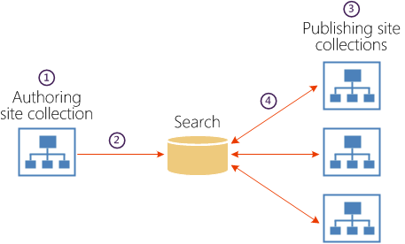

# Overview of cross-site publishing in SharePoint Server

[!INCLUDE[appliesto-2013-2016-2019-xxx-md](../includes/appliesto-2013-2016-2019-xxx-md.md)]
  
The Cross-Site Collection Publishing feature in SharePoint Server works in the following way: you use one or more authoring site collections to author and store content, and one or more publishing site collections to control the design of the site and to show the content. The functionality provided by this feature is referred to as cross-site publishing. The authoring site collection contains catalogs, such as Pages libraries and lists, which contain content that is tagged with metadata. These catalogs are indexed by the search system and made available to the publishing site collection. The publishing site collection issues queries for data that has been indexed and shows it on web pages by using Web Parts that use search technology (referred to in this article as Search Web Parts). You brand content on the publishing site by using master pages, page layouts, and display templates.
  
The following illustration shows how content is stored in an authoring site collection, indexed by the search system, and then reused across three separate publishing site collections (1 : n).
  

  
1. Content is created in libraries and lists that are shared as catalogs in the authoring site collection.
    
2. The search system crawls the content and builds the search index.
    
3. A user views a page on a publishing site, which triggers queries from Search Web Parts.
    
4. Results are returned from the search index, and shown in Search Web Parts on the page.
    
This article describes the use and benefits of cross-site publishing, describes the authoring and publishing site collections, and describes how the search system crawls and indexes content and metadata. Finally, this article discusses important limitations of cross-site publishing. After you read this article, make sure that you read the next article, [Plan the logical architecture for cross-site publishing in SharePoint Server](plan-the-logical-architecture-for-cross-site-publishing.md). For information about other publishing methods, and how to decide whether to use cross-site publishing, see [Overview of publishing to Internet, intranet, and extranet sites in SharePoint Server](overview-of-publishing-to-internet-intranet-and-extranet-sites.md) and [Plan for Internet, intranet, and extranet publishing sites in SharePoint Server](plan-for-internet-intranet-and-extranet-publishing-sites.md).
  
    
## Use and benefits of SharePoint cross-site publishing

You can use cross-site publishing to reuse content in several different ways. You can use it to make content from a single authoring site collection available to a single publishing site collection (1:1), to make content from a single authoring site collection available to one or more publishing site collections (1: n), to make content from more than one authoring site collection available to a single publishing site collection (n: 1), or to make content from more than one authoring site collection available to more than one publishing site collection (n:n). How you use cross-site publishing is determined by the type of publishing solution that you want to create. The following table describes possible scenarios in which you might use cross-site publishing.
  
**SharePoint cross-site publishing scenarios**

|**Scenario**|**Description**|
|:-----|:-----|
|Internet site    |You can use cross-site publishing to create an Internet business site that contains a catalog that shows products to customers, based on metadata. Users view pages that are created dynamically based on navigation, and filter results based on additional refinements. The site may also show content such as a company contact page, shipping and handling rates, and job openings. Content is authored internally, and is made available to anonymous users outside the firewall.    |
|Intranet site    |You can use cross-site publishing to create an internal Human Resources (HR) website that uses a tightly managed navigation structure to show authored content. Content is authored by a small group of people, and consumed by a large group of people with the Read permission level.    |
|Extranet site    |You can use cross-site publishing to create a knowledge base that is available to internal and external users in an extranet site. Content authors tag pages with metadata to categorize articles so that users can search or browse for specific information, such as troubleshooting articles, support issues, and service packs.    |
|Multilingual sites    |You can use cross-site publishing together with the variations and translation features to create multiple sites that show translated content for specific languages or locales. For example, you can have English, French, and German content that is shown on sites that have .com, .fr, and .de addresses. Internet, intranet, and extranet sites can all be multilingual sites.    |
   
In SharePoint Server, cross-site publishing provides the following benefits:
  
- Provides a broad range of possible site architectures.
    
- Separates content authoring from branding and rendering.
    
- Allows content to be shared anonymously with users on the publishing site.
    
- Can be used across site collections, web applications, and also across farms.
    
- Allows for a mix of authored pages and list content.
    
## Authoring site collections for SharePoint cross-site publishing

When you use cross-site publishing, you create and store content in a different site collection than the site collections where users view the content. The authoring site collection contains Pages libraries and lists, which have been shared as catalogs. This section explains the features that are involved when you set up the authoring site collection for the content that will be reused across publishing site collections.
  
### Types of content

You can store different types of content in libraries and lists in the authoring site collection. By sharing these libraries and lists as catalogs, the data that they contain can be reused in one or more publishing site collections. By default, only HTML content is indexed and returned by the search system. Non-HTML content, such as Word documents and PDFs, is not stored in the index, and must be referenced directly. The following list describes the different types of content that you can use in an authoring site collection.
  
- **Pages library.** You can use a Pages library to create any HTML content that you plan to reuse across site collections. By using a Pages library, you can take advantage of the Approval workflow and content scheduling features that are part of the SharePoint Server publishing feature set. For more information about the Approval workflow and content scheduling, see [Plan content approval and scheduling (SharePoint Server 2010)](https://go.microsoft.com/fwlink/p/?LinkID=95836).
    
    > [!NOTE]
    > You can have only one Pages library per site. However, you can have multiple sites within a site collection, and thereby put Pages library content into separate catalogs. 
  
- **List.** You can use one or more lists to store any type of data that is better stored in a list than in Pages library content. For information about when to use a Pages library and when to use a list, and how to plan Pages libraries and list content, see [Plan for cross-site publishing in SharePoint Server](plan-for-cross-site-publishing.md).
    
- **Asset library.** You can use one or more Asset libraries to store binary large object files (BLOBs) such as pictures, audio, or video files, if those files contain the primary content that you want to show on the publishing site. Asset libraries that are used to contain BLOBs that are referenced by Pages or lists, such as PDFs or product images, represent a different type of content, and are handled differently for cross-site publishing. For more information about referencing images and other BLOBs in catalogs, see "Plan asset library content" in the "Plan catalog content for authoring sites" section in [Plan authoring sites for cross-site publishing in SharePoint Server](plan-sharepoint-authoring-sites-for-cross-site-publishing.md).
    
- **Document library.** You can use one or more standard SharePoint Server document libraries to store files such as Word and Excel documents. However, because these types of files are also considered BLOBs, you treat Document libraries in the same manner that you treat Asset libraries. For more information about referencing images and other BLOBs in catalogs, see "Plan asset library content" in the "Plan catalog content for authoring sites" section in [Plan authoring sites for cross-site publishing in SharePoint Server](plan-sharepoint-authoring-sites-for-cross-site-publishing.md).
    
### Tagging term sets

In authoring sites, you use term sets to tag content. When you tag content with one or more terms, the terms become part of the metadata that is associated with the content. When the search system adds content to the index, it also adds the associated metadata. That metadata is later used in the publishing site collections when content is shown on pages, and when used for managed navigation.
  
### Catalog configuration

Before the content in the libraries and lists can be reused across publishing site collections, you have to share libraries and lists for use as catalogs. When you share a library or list as a catalog, you specify that you want to share it with other sites and site collections. You can also choose to enable anonymous access to the content in the catalog. You also select up to five fields that are used to uniquely identify items in the catalog. Finally, you specify a single managed metadata field that is used as a navigation term set in the publishing site collections. After a library or list is shared as a catalog, and the content has been crawled and indexed, you can connect to it from a publishing site collection. For more information about how to connect publishing site collections to catalogs, see "Plan catalog connections for publishing sites" in [Plan publishing sites for cross-site publishing in SharePoint Server](plan-sharepoint-publishing-sites-for-cross-site-publishing.md).
  
> [!NOTE]
> Before you share a library or list as a catalog, you must add at least one piece of content, and you must tag it with a term from the tagging term set. In addition, when the managed metadata site column that is associated with the tagging term set is created, it must be a single value field. 
  
## Publishing site collections for SharePoint cross-site publishing

When you use cross-site publishing, search technology is used to determine what content is shown to users. This section describes the features that are involved when you build a publishing site that obtains data from libraries or lists that are shared as catalogs. It also describes how you can use search features to influence what, and in which order, content is shown to users.
  
### Master pages and page layouts

Because content from one or more authoring site collections is shown on one or more publishing site collections, you have to configure the publishing site collections to support the branding needs of your solution. This includes designing the master pages, page layouts, and cascading style sheets that you use to show content. You can also configure image renditions that are used to control how images are shown on the site. For more information about how to design for SharePoint Server publishing sites, see [SharePoint page model overview](https://go.microsoft.com/fwlink/p/?LinkId=261548).
  
### Navigation term sets

You use term sets to create the site navigation in publishing site collections. Term sets that were used for tagging content on the authoring site collection can be pinned to the navigation term set that is used by the publishing site collection. By configuring individual terms in the Term Store Management Tool, you can customize the navigation for the whole site. You can also add new terms, or use terms from other term sets, to additionally customize the site navigation. If you are creating multilingual sites, you can copy the navigation term set and translate it into the same languages that are used for variation labels.
  
### Catalog connections

Before you can show content from an authoring site collection, you have to configure the catalog connections in the publishing site collection that will consume those catalogs. When you configure catalog connections, you specify which catalogs the publishing site collection will use to show content. When you configure a catalog connection, you specify information such as whether to integrate catalog content into the site, where to put the categories to use for navigation, the term set that was used for tagging, and how category item URLs should be constructed. For more information about how to connect publishing site collections to catalogs, see "Plan catalog connections for publishing sites" in [Plan publishing sites for cross-site publishing in SharePoint Server](plan-sharepoint-publishing-sites-for-cross-site-publishing.md).
  
### Category pages and catalog item pages

Category pages and catalog item pages are page layouts that you can use to show structured catalog content consistently across a site. By default, SharePoint Server can automatically create one category page layout and one catalog item page layout per catalog connection. Pages based on these layouts are created in the Pages library of a publishing site when you connect the site to a catalog. These pages have the following considerations:
  
- They are not published for you.
    
- You should edit the HTML of the page layouts. The category page layout and the catalog item page layout are meant to be used to get you started.
    
- When you edit the HTML page layouts, they are synced back to the corresponding ASPX pages. If you prefer to edit the ASPX pages directly, you should first delete the HTML version.
    
By using category pages and catalog item pages, you do not have to create many individual pages for content that you want to show in the same manner across your site. Category pages and catalog item pages are often used in combination with managed navigation and Search Web Parts. You can associate a category page or catalog item page with a specific term within the term set that is used for managed navigation. For example, in an intranet scenario, all company events are maintained as items in a list that is shared as a catalog. In the list, each event is tagged with a term from a term set that defines the different departments within the company — for example, Marketing, or Human Resources. You want the information about the events to be shown in the same manner across your site — for example, an overview page showing all events for each department, and one page per individual event. To avoid having to create an overview page for each department, you can create one category page that you can use to show the overview of events for all departments in the same manner. You can also create a catalog item page that you can use for each event. Then you configure Search Web Parts on the category pages or catalog item pages to make sure that the content that is shown to users varies depending on the event information that is maintained in the list that you shared as a catalog.
  
By default, a page based on the category page layout is added to the Pages library with the name Category- _\<catalog name\>_. The page is applied to all levels, except the last (catalog item), within the catalog navigation structure. For example, in an Internet business scenario where you connect to a list of electronic products, the default category page is applied to all terms within the term set that is used for catalog navigation, such as Computers, Audio, Laptops, and MP3 players. The association between a category page and a term is shown in the Term Store Management Tool, on the **TERM-DRIVEN PAGES** tab. The category page layout has the following features: 
  
- The category page layout has four Web Part zones: Body, Left, Bottom Center, and Right.
    
- A Content Search Web Part is added to the Body Web Part zone.
    
- The query in the Content Search Web Part is pre-configured to use the result source that is automatically created during catalog connection. The result source limits search results to the current and sub-page navigation terms.
    
- The item display template that is used is Picture on top, 3 lines on bottom (known as Item_Picture3Lines in the Master Page Gallery).
    
By default, a page based on the catalog item page is added to the Pages library with the name CatalogItem- _\<catalog name\>_. The page is applied to the last level (catalog item), within the catalog navigation structure — for example, to show the individual product Contoso Digital Camera M200. The association between a catalog item page and items within the catalog appears in the Term Store Management Tool, on the **TERM-DRIVEN PAGES** tab. The catalog item page layout has the following features: 
  
- The catalog item page has one Web Part zone, Body.
    
- A Catalog-Item Reuse Web Part is added to the Body Web Part zone.
    
- The query in the Catalog-Item Reuse Web Part is pre-configured to use the result source that was automatically created during catalog connection, and to limit search results based on an additional query filter.
    
- In addition to the Catalog-Item Reuse Web Part in the Body Web Part zone, one server-side Catalog-Item Reuse Web Part is added to the catalog item page layout for each indexed field in the catalog. By default, all Catalog-Item Reuse Web Parts on a page use the same query as the first Catalog-Item Reuse Web Part. These fields render server-side in the page layout, and can only be changed by editing the catalog item page layout directly. Because these are server-side Web Parts, you should edit the HTML source page to specify the HTML that is rendered together with the catalog content.
    
For more information about category pages and catalog item pages, see "Plan category pages and item detail pages" in [Plan publishing sites for cross-site publishing in SharePoint Server](plan-sharepoint-publishing-sites-for-cross-site-publishing.md).
  
### Search Web Parts

Search Web Parts use search technology to show content that was crawled and added to the index. In Search Web Parts, queries are configured so that a subset of content from the search index is shown in a particular ranking order. When users browse to a page that contains a Search Web Part, the Web Part automatically issues the query. The result is then shown in the Web Part.
  
Search Web Parts are often used in combination with managed navigation and category pages and catalog item pages. For example, in an Internet business scenario where a product catalog is shown, a term within the term set specified for managed navigation is associated with a specific category page. A Content Search Web Part on a category page can have the current navigation category (term) as part of the query. When users browse to a category, such as Computers, the Web Part issues a query that returns and shows all items in the search index that are categorized as Computers. Similarly, when users browse to the category Audio, the same Web Part on the same category page will show items in the search index that are categorized as Audio.
  
To influence how the query is written, or to increase the relevance of search results, you can use result sources and query rules. For more information, see "Plan result sources and query rules" in [Plan search for cross-site publishing sites in SharePoint Server 2016](plan-search-for-sharepoint-cross-site-publishing-sites.md).
  
For more information about Search Web Parts, see "Plan to add Search Web Parts to pages" in [Plan publishing sites for cross-site publishing in SharePoint Server](plan-sharepoint-publishing-sites-for-cross-site-publishing.md).
  
## Search for SharePoint cross-site publishing

When you use cross-site publishing, you use search technology to retrieve and show content. The search index is the center of search. The queries that are specified in the different Search Web Parts on the publishing site are sent to the search index to retrieve relevant content and show it in the Web Part.
  
This section explains how content is added to and managed in the search index.
  
### Understanding how content is added to and managed in the search index

To get content into the search index from catalogs, you must first create a content source and start a full crawl. After the content is crawled, you have to manage the content metadata in the search index.
  
#### Content sources and crawling

To build the search index, you must first start a full crawl of content that is specified in one or more content sources. A content source is a set of options that you can use to specify what type of content is crawled, what URLs to crawl, and how frequently the content should be crawled. Content sources are set up and maintained in Central Administration by a Search service application administrator. For more information, see "Plan content sources and crawling" in [Plan search for cross-site publishing sites in SharePoint Server 2016](plan-search-for-sharepoint-cross-site-publishing-sites.md).
  
#### Content metadata in the search index

When content is crawled, the metadata of the items that are crawled are represented as crawled properties. To include crawled properties in the search index, crawled properties are mapped to managed properties. This is because only managed properties are included in search results.
  
To avoid having to manually map crawled properties to managed properties for a catalog, SharePoint Server automatically creates managed properties for all site columns. In a catalog, managed properties are the specifications of the items in the library or list, such as Author, Date, Article Type, Color, or Product Category. For more information, see [Automatically created managed properties in SharePoint Server](../technical-reference/automatically-created-managed-properties-in-sharepoint.md).
  
You can specify settings for managed properties to affect how content is shown in Search Web Parts and in search results. The settings are maintained in the search schema. For more information about managed property settings, see "Plan to manage managed properties in the search index" in [Plan search for cross-site publishing sites in SharePoint Server 2016](plan-search-for-sharepoint-cross-site-publishing-sites.md).
  
### Result sources and query rules

Result sources are used in Search Web Parts to narrow the scope of search results that are shown in the Web Part. In SharePoint Server 2010, this kind of restricted query was called a search scope. One way to quickly understand the concept of a result source is to think of it as a reusable query. You can create result sources to specify a location from which search results can be retrieved — for example, the URL for a catalog, or to specify that search results can only be retrieved for a particular item type — for example, pictures. 
  
A query rule is a set of conditions that cause the query to be changed in a specific way. An easy way to think of a query rule is to think, "if X happens, then do Y." Query rules are used to limit the type of content that can appear in search results, and to influence the order in which search results should appear. When you configure a query rule, you specify query conditions that cause the query rule to be triggered. For example, a query condition could specify that a query matches a specific term in a term set, or that a query matches a particular search term. Additionally, you specify the actions that should happen to the search results when the query rule is triggered. For example, an action could be to show a specific item at the top of the search results. Say you have an intranet site where all company events are maintained in a list that you have shared as a catalog, and you want to promote a first-aid seminar. To do this, you create a query rule that raises the first-aid seminar to the top of the search results when someone searches for "seminar" or "event." 
  
You can configure query rules for one or more result sources, and you can specify the time period during which the query rule is triggered.
  
For more information about result sources and query rules, see "Plan result sources and query rules" in [Plan search for cross-site publishing sites in SharePoint Server 2016](plan-search-for-sharepoint-cross-site-publishing-sites.md).
  
### Refiners and faceted navigation

You can add refiners to a page to help users quickly browse to specific content. Refiners are based on managed properties from the search index. To show refiners on a page, you must first enable the managed property that you want to use as a refiner, and then add a Refinement Panel Web Part to the page where you want the refiners to appear. For example, in an intranet scenario in which you have a catalog of knowledge base articles, you might add the managed property Author as a refiner. The Refinement Panel Web Part will list all authors of the knowledge base articles. When users click a specific author name, only knowledge base articles written by that author are listed. 
  
SharePoint Server has faceted navigation to help users browse for content more easily by filtering on refiners that are tied to terms in a term set. By using faceted navigation, you can configure different refiners for different terms in a term set without having to create additional pages. For example, in an Internet business scenario in which a catalog of electronic products is shown, a term set might be used to categorize different products, such as computers or cameras. The same category page is used for both terms. After you enable the managed properties Screen size and Megapixels as refiners, you can configure faceted navigation so that Screen size is shown as a refiner for computers, and Megapixels is shown as a refiner for cameras. This means that you don't have to create additional pages to guide users to content that is relevant for a specific category. 
  
For more information, see "Plan refiners and faceted navigation" in [Plan search for cross-site publishing sites in SharePoint Server 2016](plan-search-for-sharepoint-cross-site-publishing-sites.md).
  
### Usage analytics and recommendations

Usage analytics in SharePoint Server automatically tracks how different items are viewed by users. Items can be documents, pages, or list items that are shown on a site. Every time that a user views an item, the system issues a usage event and adds the event to the total and recent view counts for that item. 
  
You can use the usage analytics information to configure recommendations on your site. The recommendations that are shown are based on how users previously interacted with a site, tracked by the usage events. The recommendations feature can guide the users to other content that may be relevant for them, related to what they are viewing. For example, you can guide users to popular items in a category or let them know that users who viewed this item also viewed these other items. You add recommendations to a page by adding the Recommended Items Web Part or the Popular Items Web Part. 
  
You can also view data about usage events in usage reports.
  
For more information, see [Overview of analytics processing in SharePoint Server](../search/overview-of-analytics-processing.md).
  
For more information about recommendations, see "Plan usage analytics, usage events and recommendations" in [Plan search for cross-site publishing sites in SharePoint Server 2016](plan-search-for-sharepoint-cross-site-publishing-sites.md).
  
## Limitations of SharePoint cross-site publishing

The following list contains information about the limitations of the cross-site publishing feature in SharePoint Server.
  
- **Content is not shown in publishing site collections until it is indexed.**
    
    Content stored in authoring site collections must be indexed before it will be made available to publishing site collections. The search system only indexes items that are major versions. This means that if you create Pages content and use the Approval workflow or content scheduling, the search system will not index Pages content that has not been approved for publishing, or that has not yet reached its scheduled publication date because it is not yet marked as a major version. In addition, the term associated with that content will not appear in the navigation on the publishing site. When the content is published, the term will be immediately available in the navigation on the publishing site. However, content does not appear in results on the publishing site until the content is crawled and indexed.
    
- **The term store does not support versioning.**
    
    If you add terms to the term store too early in the process, you can expose navigation terms on the publishing site collection before any related content is ready. Changes to terms are immediate, and there is no history for term sets. Therefore, if you change a term, you cannot revert it back to a previous value. 
    
- **There is no Approval workflow for lists.**
    
    Only the Pages library has an Approval workflow. If you add an item to a list that is shared as a catalog, it will automatically get added to the search index the next time that the catalog is crawled. We recommend that you either use versioning, or do not add items to a list that is shared as a catalog until you are ready to tag content and have it appear on the publishing site collection.
    
- **Using variations for multilingual sites requires adjustments to the site architecture.**
    
    How you use variations in your publishing solution will depend on whether you have Pages or list content, and whether you intend to show the content on one or more publishing site collections. Either case will require changes to the site architecture for your solution. For more information, see [Plan for variations in SharePoint 2016](plan-for-variations.md).
    
## See also

#### Concepts

[Overview of publishing to Internet, intranet, and extranet sites in SharePoint Server](overview-of-publishing-to-internet-intranet-and-extranet-sites.md)
  
[Plan for Internet, intranet, and extranet publishing sites in SharePoint Server](plan-for-internet-intranet-and-extranet-publishing-sites.md)
  
[Plan for cross-site publishing in SharePoint Server](plan-for-cross-site-publishing.md)
  
[Plan the logical architecture for cross-site publishing in SharePoint Server](plan-the-logical-architecture-for-cross-site-publishing.md)
  
[Plan authoring sites for cross-site publishing in SharePoint Server](plan-sharepoint-authoring-sites-for-cross-site-publishing.md)
  
[Plan publishing sites for cross-site publishing in SharePoint Server](plan-sharepoint-publishing-sites-for-cross-site-publishing.md)
  
[Plan search for cross-site publishing sites in SharePoint Server 2016](plan-search-for-sharepoint-cross-site-publishing-sites.md)
  
[Configure cross-site publishing in SharePoint Server](configure-cross-site-publishing.md)
  
[Estimate capacity and performance for Web Content Management (SharePoint Server 2013)](web-content-management-capacity-and-performance.md)

