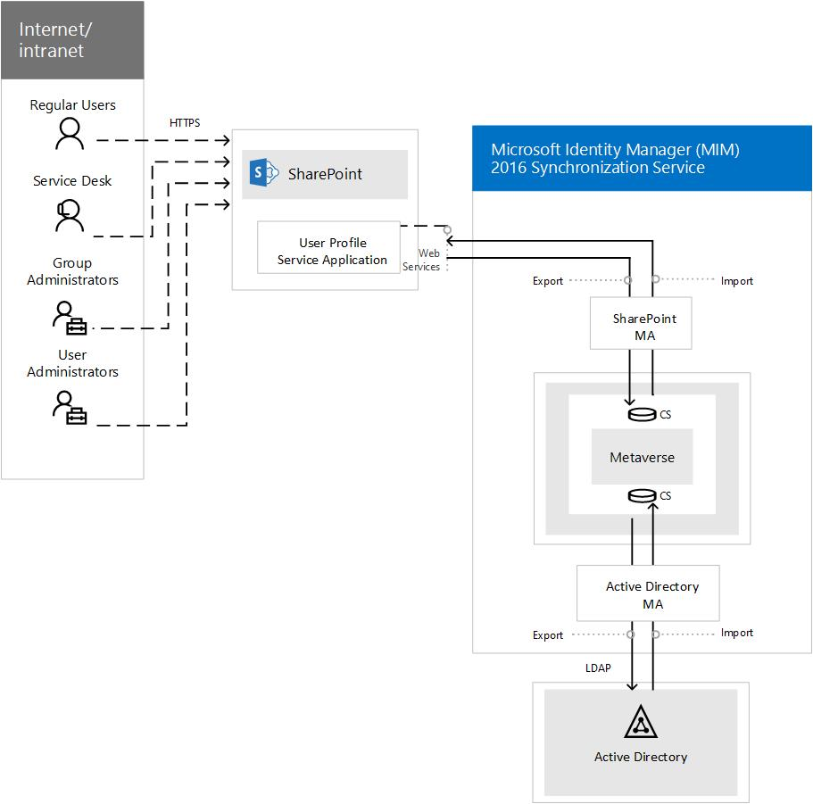

# Overview of Microsoft Identity Manager Synchronization Service in SharePoint Servers 2016 and 2019

[!INCLUDE[appliesto-xxx-2016-2019-xxx-md](../includes/appliesto-xxx-2016-2019-xxx-md.md)] 
  
> [!IMPORTANT]
> This article is only intended to introduce basic concepts and value of the Microsoft Identity Manager (MIM) Synchronization Service. > If you are planning to fully deploy and maintain a MIM Server, it is strongly recommended that you work with a consultant or a MIM specialist. 
  
## New to SharePoint Server 2016: MIM Synchronization service

Previous versions of SharePoint Server had a built-in copy of ForeFront Identity Manager (FIM) that ran inside SharePoint Server that allow user profile synchronization to occur. That version of FIM powered the User Profile Synchronization for products like SharePoint Server 2010 and SharePoint Server 2013. But in SharePoint Server 2016, FIM has been removed in favor of Microsoft Identity Manager, which is the successor to the FIM technology. Even though FIM has been removed, the basic architecture for MIM uses some of the same FIM technology. For addtional information on FIM technology, see [FIM 2010 Technical Overview](https://go.microsoft.com/fwlink/?linkid=841840)
  
MIM is a separate server technology (not built-in to SharePoint Server). That means, if you have MIM, specifically the MIM Synchronization Service, running in your company, more than one SharePoint Server 2016 farm can rely upon it.
  
MIM consists of several logical components which are responsible for various functions. It has various components which provide functionalities in the areas of policy modeling, workflow, group management, password management, end-user self-service, reporting and RBAC.
  
It's also important to note here, that Active Directory Import (sometimes called Active Directory Direct Import) is also included with SharePoint Server 2016, and is a User Profile Synchronization alternative that will not need a separate server installation. This means that SharePoint Server 2016 offers two options for User Profile Sync.
  
Which option is right for you?
  
||||
|:-----|:-----|:-----|
||**Microsoft Identity Management server**   |**Active Directory Import**   |
|Pros    | Flexibility allows for customized import.     Can be customized for bidirectional flow.     Imports user profile photos automatically.     Supports non-Active Directory LDAP sources.     Multi-forest scenarios are supported.    | Very fast performance.     Known to be reliable (used by Office 365).     Configurable inside of Central Administration. (Less complex).    |
|Cons    | A separate MIM server is recommended for use with your SharePoint farm.     The more customized the more complex the architecture, deployment, and management.    | Import is unidirectional (changes go from Active Directory to SharePoint Server Profile).     Import from a single Active Directory forest only.     Does not import user photos.     Supports Active Directory LDAP only.     Multi-forest scenarios are supported.    |
   
> [!TIP]
> If you need details, or you need to set up Active Directory Import for your SharePoint Server installation? Try [these steps](https://technet.microsoft.com/en-us/library/jj219646.aspx). 
  
## What is the MIM Synchronization Service?

The MIM Synchronization service imports and aggregates data in a central identity repository known as the metaverse, and implements a staging area referred to as the Connector Space (CS). The synchronization service is responsible for managing the connection with all managed identity systems by using Management Agents (MAs). This service also fulfills the provisioning and de-provisioning requests in the connected systems.
  
> [!NOTE]
> The MIM Synchronization Service is just one of several components that are offered by Microsoft Identity Manager 2016 . With SharePoint Server 2016, the only component that is free to use is the MIM Synchronization service. All other components of Microsoft® Identity Manager 2016 require a license to use, but the use of the MIM Synchronization service in SharePoint Server 2016 is free. For additional information about Microsoft Identity Manager 2016, see [Microsoft Identity Manager](https://go.microsoft.com/fwlink/?linkid=838921)
  
The description of the various components of the MIM Synchronization Service are listed here:
  
- **Management Agents** (MAs) are responsible for flowing data between a specific connected data source and the metaverse. They contain rules that govern how MIM connects to a data source and how objects and their attributes are synchronized with that data source. MAs can connect to identity stores through Connectors. MIM provides connector for the most common identity stores used in enterprises. 
    
    The MIM Synchronization Service establishes connectivity with the MIM Service and associated database by the creation of a MIM Service MA. This MA imports data from the MIM Service via direct connectivity to the underlying SQL database. However, all exports to the MIM Service are made by using Web services to ensure all applicable policies and workflows are applied to changes initiated from the Synchronization Service. A single MIM Service MA will be established within the MIM Synchronization Service and given a name of MIM Service Management Agent. This MA will be responsible for mapping MIM Service objects to metaverse objects.
    
- **Connector Space** (CS) is a storage area or staging area that is used by the MAs to move data into and out of a connected identity store. Each connected identity store has its own connector space which contains the set of objects and attributes from that data source that are of interest to the synchronization engine. Connector Spaces are used to determine the changes that need to be synchronized between the connected identity store and the metaverse. 
    
- **Metaverse** is the principal repository for MIM composed of a set of tables that contain the integrated ("joined") identity information imported from multiple data sources. User information from various systems is imported and aggregated in the metaverse to form a single identity for each user. The default installation of MIM implements a base schema which includes objects and attributes that are commonly leveraged as part of an identity management solution. To ensure full extensibility, MIM allows for the expansion of the schema by the creation of new objects types and attributes. 
    
The MIM Synchronization Service uses a SQL Server back-end database to store the data that it manages as well as its own configuration. The metaverse and the connector spaces are located within this database.
  
## So what does a typical topology look like?

A typical SharePoint Server 2016 topology of a MIM implementation may look like the following diagram.
  
The data is synchronized between Active Directory and the metaverse by using the Active Directory connector space (CS) by an Active Directory management agent (MA). Data is also synchronized between SharePoint and the metaverse by using the SharePoint connector space by a SharePoint management agent. Commonly as part of that synchronization, data is exported to the SharePoint User profile store.
  

  
## How do I use these concepts ?

Now that you have a basic understanding of the general terms of what is an identity manager and how the MIM Synchronization Service works in SharePoint Server. The next thing you probably want to know is how do I install it and how do I get a MIM solution working in SharePoint Server. [Installing Microsoft Identity Manager (MIM)](install-microsoft-identity-manager-for-user-profiles-in-sharepoint-server-2016.md#BKMK_InstallMIM) describes how to install MIM, and [Use a sample MIM solution in SharePoint Server 2016](use-a-sample-mim-solution-in-sharepoint-server-2016.md) shows how to use a sample MIM solution. 
  
## See also

#### Other Resources

[Deployment considerations for implementing Microsoft Identity Manager with SharePoint Server 2016](deployment-considerations-for-implementing-microsoft-identity-manager-with-share.md)

