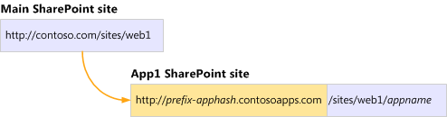

# Plan for apps for SharePoint Server

[!INCLUDE[appliesto-2013-2016-2019-xxx-md](../includes/appliesto-2013-2016-2019-xxx-md.md)] 
  
If you want to use apps for SharePoint in your environment, there are several prerequisites and other planning considerations to keep in mind. This article covers what you need to plan for before you get started with the actual configuration.
  
## Prerequisites

Configuring apps for SharePoint requires the following:
  
- If you want to monitor apps, then Search must be configured.
    
- You'll need SSL Certificates If you are using SSL to help secure traffic. You must create a wildcard certificate to use for all app URLs.
    
- Each app for SharePoint that is installed creates a subweb under the site on which it is installed with its own URL. This means that environments that contain many apps for SharePoint will have many additional subwebs. Be sure to consider this when planning for capacity for your farm.
    
Additionally, using apps for SharePoint requires a separate DNS domain configuration (discussed below), as well as the Subscription Settings and App Management service applications. We cover how to configure the separate app domain and the service applications in the [apps for SharePoint configuration article](configure-an-environment-for-apps-for-sharepoint.md)/
  
## Plan app configuration settings

With apps for SharePoint, apps are deployed to their own web site in a special, isolated domain name, instead of in the same domain name as your farm. Processes run under that domain name and do not affect the SharePoint sites. This difference in domain names provides a layer of isolation for the apps.
  
You must set up a Domain Name Services (DNS) domain name to provide a host name for the installed apps. By using a separate domain name, apps for SharePoint are separated from SharePoint sites to prevent unauthorized access to user data and to reduce the possibility of cross-site scripting attacks.
  
You need a DNS record so that the domain name can get correctly resolved. You can create one of two of the following types of DNS records for app for SharePoint URLs:
  
- A wildcard Canonical Name (CNAME) record that points to the host domain assigned to the SharePoint Server farm.
    
- A wildcard A record that points to the IP address for the SharePoint Server farm.
    
Choose the type of record to use to point from the app domain to the SharePoint Server farm domain.
  
The details of how to configure the app domain are covered in [Configure an environment for apps for SharePoint Server](configure-an-environment-for-apps-for-sharepoint.md).
  
### How SharePoint uses the domain

Each app for SharePoint has a unique URL, which is made up of the app domain plus a prefix and an Apphash. The format is as follows: prefix-Apphash.domain.com. The Apphash is an arbitrarily-assigned unique identifier for each app for SharePoint. These URLs are generated automatically depending on the settings that you specify. You do not have to create or manage these URLs separately; instead you configure a wildcard entry in DNS to provide the URLs for all apps.
  
When you install an app to a site, a subweb of that site is created to host the app content. The subweb for the app is hierarchically below the site collection, but has an isolated unique host header instead of being under the site's URL. The following diagram shows the relationship between the site's URL and the app's URL:
  
**Illustration of URL for an app for SharePoint**

  
In this diagram, the Main SharePoint Site is the site on which the user installed the app. The App1 SharePoint Site is a subweb of the Main site that contains the app and its components. The URL for the App1 SharePoint site is based on that of the Main SharePoint site. However, it is in a different domain, has a prefix-apphash at the beginning, and has an app name at the end for the subweb name.
  
### Determine the domain name to use

When you choose the domain name and prefixes to use for your environment, consider the following:
  
- **Use a unique domain name, not a subdomain**
    
    For security reasons, we highly recommend that you not use a subdomain of the root domain name that hosts SharePoint Server or other applications. For example, if the SharePoint sites are at Contoso.com, do not use Apps.Contoso.com. Instead use a unique name such as Contoso-Apps.com. This is because other applications that run under that host name might contain sensitive information that is stored in cookies that might not be protected.
    
- **The app domain should be in the Internet or Restricted sites security zone in Internet Explorer**
    
    For security reasons, we recommend that you configure the app domain to be in either the Internet or Restricted sites security zone in Internet Explorer options, and not in the Intranet zone or Trusted sites zone. Internet Explorer security settings for the Intranet zone or Trusted sites zone do not provide a sufficient level of isolation of apps from user data in SharePoint sites.
    
- **For multi-tenancy environments, use unique prefixes for each tenant's apps**
    
    If your environment has multiple tenants (in other words, you host SharePoint sites for multiple clients), you must be able to identify the URLs that each tenant or client in your environment uses. We suggest that you set the URL prefix to indicate the client's name or the client's site's name.
    
- **Keep prefixes short and simple**
    
    Prefixes must be less than 48 characters and cannot contain special characters or dashes. 
    
## Recommended logical architecture

As a best practice, we recommend that you use a single web application that uses host-named site collections (host headers) instead of multiple web applications that use path-named site collections in your environment. When you use multiple web applications and path-named site collections you might have to complete additional configuration steps to guarantee that requests for apps for SharePoint are routed to the correct web application.
  
## Plan App Catalog

If you decide to provide approved apps for SharePoint for site owners to install, you must configure an App Catalog site to contain those apps for SharePoint. You need an App Catalog site for each web application where you want to host apps for SharePoint. 
  
See [Manage the App Catalog in SharePoint Server](manage-the-app-catalog.md) to get started. 
  
## Plan to monitor apps

Farm administrators can monitor apps for SharePoint to track the usage data and results, and any errors that occur. The Farm administrator must add apps to the Monitor Apps page in Central Administration in order for the apps to appear in the list. The maximum number of apps that can be monitored on the Monitor Apps page is limited to 100.
  
See [Monitor apps for SharePoint for SharePoint Server](monitor-apps-for-sharepoint.md) to get started. 
  
## Plan for app licenses

SharePoint Server does not enforce app licenses. Developers who build apps must add code that retrieves license information and then addresses users. SharePoint Server provides the storage and together with SharePoint Store web services the app license renewal. SharePoint Store handles payments for the licenses, issues the correct licenses, and provides the process to verify license integrity. Note that licensing only works for apps that are distributed through the SharePoint Store. Apps that you purchase from another source and apps that you develop internally must implement their own licensing mechanisms. SharePoint Server supports the following app licenses formats:
  
|**License Type**|**Duration**|**User Limit**|
|:-----|:-----|:-----|
|Free    |Perpetual    |Unlimited    |
|Trial    |30, 60, 120 Days, or Unlimited    |Number per user or Unlimited    |
|Paid per user    |Perpetual    |Number per user    |
|Paid unlimited users (site license)    |Perpetual    |Unlimited    |
   
See [Monitor and manage app licenses in SharePoint Server](monitor-and-manage-app-licenses.md) to get started. 
  
## See also

#### Concepts

[Install and manage apps for SharePoint Server](install-and-manage-apps-for-sharepoint-server.md)
  
[Configure an environment for apps for SharePoint Server](configure-an-environment-for-apps-for-sharepoint.md)

