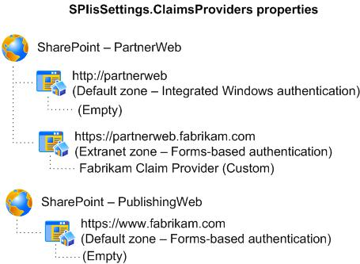

# Plan for custom claims providers for People Picker in SharePoint

[!INCLUDE[appliesto-2013-2016-2019-xxx-md](../includes/appliesto-2013-2016-2019-xxx-md.md)] 
  
You can use the claims providers that are included with SharePoint Server, or you can create your own custom claims providers to connect to additional sources of claims and provide additional claims in the security token for a user. For example, if you have a customer relationship management (CRM) application that contains roles that are not found in the user repository in Active Directory Domain Services (AD DS), you can create a custom claims provider to connect to the CRM database and add CRM role data to a user's original security token. For more information about claims provider usage scenarios, see [Claims Provider](/sharepoint/dev/general-development/claims-provider-in-sharepoint).
  
A claims provider in SharePoint Server is used to augment claims and to provide name resolution. In the claims augmentation role, a claims provider augments a user security token with additional claims during sign-in. For more information about claims augmentation, see [Claims Provider](/sharepoint/dev/general-development/claims-provider-in-sharepoint). In the name resolution role, a claims provider lists, resolves, searches, and determines the "friendly" display of users, groups, and claims in the People Picker. Claims picking enables an application to surface claims in the People Picker, for example when you configure the security of a SharePoint site or SharePoint service. For more information about People Picker, see [Plan for People Picker in SharePoint](plan-for-people-picker.md).
  
By default, the information that is resolved in People Picker when a query is performed depends on the information supplied by the claims provider. You can't change what information is supplied and how it is displayed when you use an out-of-box claims provider. To do this, you must create a custom claims provider that will meet the needs of your solution for finding and selecting users, groups, and claims when a user assigns permissions to items such as a site, list, or library.
  
When you create a custom claims provider, you can control what information is displayed and what results are returned in response to a query from the People Picker control. By default, you configure the web application to use claims authentication, and then register the claims provider on the server.
  
Before reading this article, you should understand the concepts described in [Plan for user authentication methods in SharePoint Server](../security-for-sharepoint-server/plan-user-authentication.md) and [The Role of Claims](/previous-versions/windows/it-pro/windows-server-2012-R2-and-2012/ee913589(v=ws.11)). For additional information about claims-based authentication, see [SharePoint Claims-Based Identity](/sharepoint/dev/general-development/claims-based-identity-in-sharepoint)and [A Guide to Claims-based Identity and Access Control](/previous-versions/msp-n-p/ff423674(v=pandp.10)).
  
    
## Architecture

When a web application is configured to use claims-based authentication, SharePoint Server automatically uses two default claims providers:
  
- The [SPSystemClaimProvider](https://msdn.microsoft.com/library/Microsoft.SharePoint.Administration.Claims.SPSystemClaimProvider.aspx) class provides claims information related to the server farm where SharePoint Server is installed. 
    
- The [SPAllUserClaimProvider](https://msdn.microsoft.com/library/Microsoft.SharePoint.Administration.Claims.SPAllUserClaimProvider.aspx) class provides an All Users claim. 
    
Depending on the authentication method selected for a zone of a web application, SharePoint Server also uses one or more of the default claims providers that are listed in Table 1.
  
**Table 1. Authentication methods and default claims providers**

|**Authentication method**|**Claims provider**|
|:-----|:-----|
|Windows authentication    |[SPActiveDirectoryClaimProvider](https://msdn.microsoft.com/library/Microsoft.SharePoint.Administration.Claims.SPActiveDirectoryClaimProvider.aspx)   |
|Forms-based authentication    |[SPFormsClaimProvider](https://msdn.microsoft.com/library/Microsoft.SharePoint.Administration.Claims.SPFormsClaimProvider.aspx)   |
|Security Assertion Markup Language (SAML) token-based authentication    |[SPTrustedClaimProvider](https://msdn.microsoft.com/library/Microsoft.SharePoint.Administration.Claims.SPTrustedClaimProvider.aspx)   |
   
You can see a list of claims providers for a farm by using the [Get-SPClaimProvider](/powershell/module/sharepoint-server/Get-SPClaimProvider?view=sharepoint-ps) Microsoft PowerShell cmdlet. 
  
> [!NOTE]
> When a web application is configured to use SAML token-based authentication, the SPTrustedClaimProvider class does not provide search functionality to the People Picker web control. Any text entered in the People Picker control will automatically be displayed as if it was resolved, regardless of whether it is a valid user, group, or claim. If your SharePoint Server solution will use SAML token-based authentication, you should plan to create a custom claims provider to implement custom search and name resolution. 
  
Claims providers are registered on a server farm as features that are deployed to the farm. They are scoped at the farm level. Each claims provider object uses the SPClaimProviderDefinition class to include information about the claims provider, such as display name, description, assembly, and type. Two important properties of the SPClaimProviderDefinition class are IsEnabled and IsUsedByDefault. These properties determine whether a registered claims provider is enabled for use in the farm, and whether the claims provider is used by default in a particular zone. By default, all claims providers are enabled when they are deployed to a server farm. For information about the SPClaimProviderDefinition class, see [SPClaimProviderDefinition](https://msdn.microsoft.com/library/Microsoft.SharePoint.Administration.Claims.SPClaimProviderDefinition.aspx) . 
  
For more information about zones and authentication, see [Plan for user authentication methods in SharePoint Server](../security-for-sharepoint-server/plan-user-authentication.md).
  
## Example custom claims provider configuration

By default, when you register a custom claims provider on the farm, the IsEnabled and IsUsedByDefault properties are both set to True. Depending on the number of zones needed for your SharePoint Server solution, the authentication methods that are used by each zone, and the users for each zone, you may want to limit the zones in which your custom claims provider is displayed in People Picker.
  
Because claims providers are scoped at the farm level and enabled at the zone level, you must carefully plan the zones in which you want the custom claims provider to be displayed. In general, you should ensure that the IsUsedByDefault property is set to False, and then configure the [SPIisSettings](https://msdn.microsoft.com/library/Microsoft.SharePoint.Administration.SPIisSettings.aspx) class for each zone in which you want to use the custom claims provider. To configure a custom claims provider for select zones, you can create a PowerShell script that sets the claims provider for a zone by using the [ClaimsProviders()](https://msdn.microsoft.com/library/Microsoft.SharePoint.Administration.SPIisSettings.ClaimsProviders.aspx) property, or you can create a custom application to allow you to enable a custom claims provider for select zones. 
  
For example, consider a scenario in which there are two web applications: 
  
- The first web application, PartnerWeb, has two zones — one intranet that uses Windows claims-based authentication and one extranet that uses forms-based authentication — and is used for collaboration among employees and partners.
    
- The second web application, PublishingWeb, has only one zone that uses forms-based authentication and is an Internet publishing site for employees, business partners, and customer partners.
    
 Now, suppose that for the extranet zone on PartnerWeb, you want employees to be able to collaborate with business partners but not customer partners. To do this, you write a custom claims provider that determines whether the current user is a business partner or customer partner, based on the user's identity. In this example, users from fabrikam.com are business partners, but users from contoso.com are customer partners. When a user who is a business partner is authenticated in the PartnerWeb web application, a claim for a role called BusinessPartner is added to the claim token. When a customer partner is authenticated, a claim for a role called CustomerPartner is added to the claim token. 
  
To make sure that customer partners are never added to the extranet collaboration site, you add a web application policy on the PartnerWeb web application for the extranet zone that explicitly denies access to any user who has a claim for a role called CustomerPartner. The custom claims provider would also have to implement search and type-in support for the web application policy to resolve the CustomerPartner role claim so that it can be added to the web application policy. Finally, to enable this functionality on the extranet zone, you configure the [SPIisSettings](https://msdn.microsoft.com/library/Microsoft.SharePoint.Administration.SPIisSettings.aspx) class for that zone to use the custom claims provider. The following diagram shows the authentication methods and claims provider settings for each web application and zone. 
  
**Figure 1. Example of the authentication methods and claims provider settings for Web applications and zones**

  
You can set the IsUsedByDefault property by configuring it in a feature receiver that you create for your custom claims provider. 
  
You can also override the settings of the IsEnabled and IsUsedByDefault properties by using the [Set-SPClaimProvider](/powershell/module/sharepoint-server/Set-SPClaimProvider?view=sharepoint-ps) PowerShell cmdlet. 
  
> [!IMPORTANT]
> Changing the IsEnabled property to False will disable the claims provider for the server farm. This can be useful if you have to troubleshoot issues that might be caused by a custom claims provider. In general, the IsEnabled property should be set to True. 
  
## Using custom claims on more than one farm

Claim values are a combination of the claim itself, the claims provider name, and the order in which the claims provider was installed on the server. Therefore, if you want to use a claim across multiple farms or environments, you must install the claims providers in the same order on each farm in which you want to use the claim. Use the following steps when you have installed a custom claims provider on a farm and you want to use the same claim on additional farms:
  
1. Register the claims providers on the additional farms in the same order that they were registered on the first farm.
    
2. Perform a backup of the first farm. For information about how to back up a farm, see [Back up farms in SharePoint Server](back-up-a-farm.md).
    
3. Use the back up from the first farm to restore the other farms. For information about how to restore a farm, see [Restore farms in SharePoint Server](restore-a-farm.md).
    
## Planning considerations for custom claims providers

As you plan custom claims providers for use with People Picker in your SharePoint solution, consider the following questions:
  
- What zones does your web application have, and what authentication methods are used in each zone?
    
- Are there any custom claims that should be added to users to enable more advanced permissions or security scenarios?
    
- Will you be using SAML authentication with a trusted identity provider?
    
- What will be the source of the values for the users and roles that will be displayed in People Picker query results?
    
The SharePoint Server Content Publishing team wants to thank Steve Peschka for contributing to this article. Take a look at Steve Peschka's [Share-n-dipity TechNet blog](https://go.microsoft.com/fwlink/p/?LinkId=210274).
  
## See also

#### Concepts

[People Picker and claims providers overview](people-picker-and-claims-providers-overview.md)
  
[Plan for user authentication methods in SharePoint Server](../security-for-sharepoint-server/plan-user-authentication.md)

