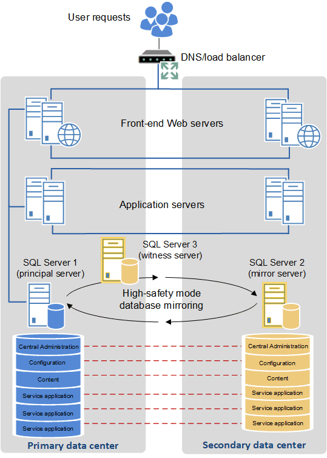

# Create a high availability architecture and strategy for SharePoint Server

[!INCLUDE[appliesto-2013-2016-2019-xxx-md](../includes/appliesto-2013-2016-2019-xxx-md.md)]
  
A high-availability strategy is an important requirement for a production SharePoint Server environment. An end-to-end strategy includes operational processes, platform governance, architecture, and technical solutions. This article focuses on the architectural and technical aspects of high availability. The guidance explains specific SharePoint design elements and the technical options that will determine your strategy for high availability.
  
> [!NOTE]
> High availability and disaster recovery are not the same things. Although there is overlap in planning and solutions, they are subsets of business continuity. The purpose of high availability is to provide resiliency within the primary data center and planned downtime. The purpose of disaster recovery is to enable an organization to resume computer operations in a secondary data center when a disaster at the primary data center makes the infrastructure unusable. For information about disaster recovery for SharePoint Server, see [Choose a disaster recovery strategy for SharePoint Server](plan-for-disaster-recovery.md). 
  
    
High availability is generally used to describe the ability of a system to continue operating and provide resources to its users when a failure occurs in one or more of the following categories in a fault domain: hardware, software, or application. The level of availability is expressed as a measure of the percentage of time that a system is continuously operational to support business functions. The required level of availability varies among organizations. Although this requirement may also vary among business units, a service level agreement is for the organization as a whole. From the perspective of users, a Sharepoint farm is available when users can access the farm and use the features and services that they must have to do their work.
  
A highly available SharePoint farm has the following goals and characteristics:
  
- The farm design reduces potential points of failure. Because it is improbable that you can eliminate all failure points, the overall strategy must address how to respond to a failure event.
    
- Failover events are seamless and have minimal effect on user activities.
    
- The farm continues to operate at reduced capacity instead of failing completely.
    
- The farm is resilient. Incidents affecting service occur infrequently, and timely and effective action is taken when they do occur.
    
## Introduction

Before you can create a realistic and economical high-availability architecture and strategy for your SharePoint environment, you have to define and quantify your availability goals. These goals reflect the extent to which your organization depends on SharePoint Server and how a loss of service might affect the organization's operations. The effect of the loss of service depends on the nature of the loss (full or partial) and the duration of the loss.
  
A successful high-availability strategy must reflect the specific needs of your organization. Additionally, it must provide an optimal balance between business requirements, IT service level agreements (SLAs), and the availability of technical solutions, IT support capabilities, and infrastructure costs.
  
After identifying availability requirements for your organization, you can begin to create a high-availability design and a strategy that reduces the risk of downtime and reduced operations. IT professionals who design and deploy highly available systems use the following guiding principles to meet their goals:
  
- Eliminate single points of failure for each fault domain and the entire system at every possible layer (the operating system, software and the SharePoint application).
    
- Implement very rapid fault detection, isolation, and resolution.
    
High availability solutions are broad in scope and provide a set of system-wide, shared resources that are integrated to provide predefined required services. The solution uses different combinations of hardware and software to minimize downtime and restore services when the system or part of the system fails.
  
A fault-tolerant solution is hardware-centric and uses specialized hardware to detect faults and instantly switch to a redundant hardware component. This component can be a processor, memory board, power supply, I/O subsystem, or storage subsystem. The switch to a redundant component provides a high level of service.
  
A cost-benefits analysis of fault-tolerant solutions and high availability solutions enables organizations to create an effective strategy to meet the availability goals for their SharePoint farm. Typically there are cost tradeoffs between the two solutions.
  
A process that implements high availability is one of the more expensive investments for a SharePoint farm. As the level of availability and the number of systems that you want to make highly available increases, complexity and cost of an availability solution also increases.
  
Advances in virtualization technology enable organizations to use virtual computers as hot, warm, or cold spares. Virtual computers may be suitable to provide the same functionality. Virtualization can provide flexibility and cost efficiency. However, you must verify that a virtual machine has the capacity to handle the load of the physical computer that it will replace.
  
## Create a farm architecture that supports high availability

The following illustration shows how you can distribute and configure different parts of a SharePoint environment to increase availability across a farm. This example also shows how redundancy can address fault domains.
  
> [!NOTE]
> Our example is not comprehensive. For example it does not show all the fault domains and fault-tolerant hardware. 
  
**Examples of redundancy in a farm topology to address points of failure**

  
Referring to the topology in the previous illustration, note the following:
  
- The farm servers in this example can be physical computers or virtual machines that are deployed on Hyper-V host servers. The principle of identifying and responding to points of failure applies to both types of environment.
    
- Four servers (W1-W4) are dedicated to serving content and this redundancy increases availability if a failure occurs in one or more servers. This level of redundancy also enables the farm to continue operations when software updates are applied.
    
- Four application servers (A1-A4) increase availability for farm services and specific application components such as search. Search roles and components are redundant.
    
- The farm database servers are redundant and database high availability can be achieved by using database mirroring or clustering.
    
- In a virtual environment the virtual machines are put on separate Hyper-V host servers to eliminate a single point of failure. This approach to virtual machine placement follows best practice guidelines for availability and performance.
    
- The primary database server (labeled 1) and Rack 2 (labeled 2), that contains two of the virtualization host computers, are identified as fault domains to show how your farm and infrastructure can be viewed as a collection of fault domains. This shows how you can do an in-depth analysis of your environment to develop an overall strategy and cost benefit analysis.
    
**Other farm roles and services**
  
Our example does not include all the roles, services, and service applications that might be running in a specific SharePoint farm. You cannot use a generic approach to high availability for everything in a SharePoint farm. Some important exclusions to using a standard approach to high availability are as follows: 
  
- Distributed Cache requires special considerations during failover. For more information, see [Plan for the Distributed Cache service](plan-for-feeds-and-the-distributed-cache-service.md#plandc) and [Manage the Distributed Cache service in SharePoint Server](manage-the-distributed-cache-service.md).
    
- SharePoint Workflow requires Workflow Manager 1.0 Cumulative Update 3. Configure workflow for SharePoint Server 2016 is the same as for SharePoint Server 2013. For more information, see [Description of the Cumulative Update 3 for Workflow Manager 1.0](http://go.microsoft.com/fwlink/?LinkID=798163&amp;clcid=0x409) and [Configuring a Highly Available Workflow in Workflow Manager 1.0](https://go.microsoft.com/fwlink/p/?LinkId=285353).
    
    > [!NOTE]
    > The configuration of Workflow for SharePoint Server 2016 has not changed from SharePoint Server 2013. You must install the Workflow Manager 1.0 Cumulative Update 3. 
  
- Although service applications can run on multiple computers, which we recommend, some have unique installation and configuration requirements for high availability. The User Profile application is a well-known example.
    
## Use fault tolerance in your high availability solution

After you design an architecture that supports highly available roles and workloads, you can use fault-tolerant components to increase availability. Fault tolerant solutions are available across the infrastructure, which includes the databases.
  
### A fault-tolerant infrastructure

Fault tolerance is readily available for almost every hardware component in the infrastructure of a SharePoint farm. As part of your high availability design, determine the parts of the infrastructure that should be fault-tolerant from an operational and cost perspective. Just because you can make every part of the infrastructure fault-tolerant doesn't mean that you should.
  
### Fault tolerant database servers and databases

Because the SharePoint platform and its application workloads depend on the availability and reliability of all the SharePoint databases, highly available databases are an extremely important aspect of your high availability strategy. You can use the following features as fault-tolerant solutions for SharePoint database servers and databases:
  
- SQL Server failover clustering (AlwaysOn Failover Cluster Instances (FCI) in SQL Server 2014 with Service Pack 1 (SP1)) and SQL Server 2012
    
- AlwaysOn Availability Groups
    
- SQL Server high-availability database mirroring
    
**About AlwaysOn Failover Cluster Instances and AlwaysOn Availability Groups**
  
A failover cluster requires shared disk storage between two computers. In a two node configuration, the computers are configured as active/passive which provides a fully redundant instance of the primary node. The passive node is only brought online when the primary node fails. The shared disk is only presented to one computer at a time. This configuration typically requires the most additional hardware. In SQL Server 2014 (SP1) and SQL Server 2012, this type of cluster configuration is an AlwaysOn Failover Cluster Instance, and it is a specific way to install SQL Server. Because of the configuration requirements, you cannot take a standard SQL Server installation and easily change it to a Failover Cluster Instance.
  
An AlwaysOn Availability Group is a different technology in SQL Server 2014 (SP1) and SQL Server 2012 (think of it as a descendant of Database Mirroring) that uses some features exposed by Windows Clustering. However, it does not require shared disk storage, and the computers in an availability group do not have to have a specialized configuration of SQL Server installed on them. After a database server is added to a Windows Cluster, it is fairly easy to enable AlwaysOn Availability Groups and then configure the availability group that you want.
  
In summary, any server that runs SQL Server 2014 (SP1) and SQL Server 2012 Enterprise Edition can use AlwaysOn Availability Groups by joining a cluster and configuring the availability group. AlwaysOn failover clusters require special hardware and configuration steps to set up Failover Cluster Instances. Each of these technologies has its use for specific environments, and both are complimentary competitors. For more information about these features, see [High Availability Solutions (SQL Server)](http://go.microsoft.com/fwlink/?LinkID=718030&amp;clcid=0x409). For help deciding which SQL Server availability technology to use, see [Choosing a SQL Server Availability Technology](http://go.microsoft.com/fwlink/?LinkID=799828&amp;clcid=0x409).
  
> [!IMPORTANT]
> Because each SQL Server high availability option has its own features, strengths, and weaknesses, one option is not necessarily better than another. For example, in a given scenario that uses AlwaysOn Availability Groups, minimizing data lose might be better than any performance gain that AlwaysOn Failover Cluster Instances achieves. You must choose a high-availability solution that is based on your business requirements and IT infrastructure requirements. 
  
A determining factor in selecting a SQL Server option to use is the SharePoint databases. You must understand the characteristics of the SharePoint Server databases. Each database may have specific requirements or constraints that will determine the SQL Server fault-tolerant solution that is appropriate and fully supported in your production environment. We recommend that you review the following articles:
  
- [Database types and descriptions in SharePoint Server](../technical-reference/database-types-and-descriptions.md)
    
- [Supported high availability and disaster recovery options for SharePoint databases](supported-high-availability-and-disaster-recovery-options-for-sharepoint-databas.md)
    
#### SQL Server failover clustering

Failover clustering provides availability support for an instance of SQL Server on SQL Server 2014 (SP1) or SQL Server 2012. 
  
A failover cluster is a combination of one or more nodes or servers, and two or more shared disks. Although an instance of a failover cluster appears as a single computer, the instance provides failover from one node to another if the current node becomes unavailable. SharePoint Server can run on any combination of active and passive nodes in a cluster that SQL Server supports.
  
SharePoint Server references the cluster as a whole. Therefore, failover is automatic and seamless from the perspective of SharePoint Server.
  
> [!NOTE]
> When either a planned or unplanned failover happens, connections are dropped and must be established again when transitioning from one cluster node to another cluster node. 
  
For detailed information about SQL Server failover clustering, see [AlwaysOn Failover Cluster Instances (SQL Server)](http://go.microsoft.com/fwlink/?LinkID=786327&amp;clcid=0x409).
  
#### SQL Server AlwaysOn Availability Groups and SQL Server Database Mirroring

The key benefit of SQL Server AlwaysOn Availability Groups and SQL Server Database Mirroring is that both provide complete or almost complete data redundancy depending on how you configure them for transaction processing. In addition to minimizing data loss, automatic failover minimizes downtime for production databases.
  
> [!IMPORTANT]
> Although SQL Server 2016, SQL Server 2014 (SP1), and SQL Server 2012 support database mirroring, this feature is planned to be deprecated. We recommend that you avoid using this feature in new development work. Plan to change applications that currently use this feature. Use AlwaysOn Availability Groups instead. 
  
 **AlwaysOn Availability Groups**
  
The SQL Server AlwaysOn Availability Groups feature is both a high-availability and disaster-recovery solution that provides an enterprise-level alternative to database mirroring. AlwaysOn Availability Groups supports a failover environment for one or more user databases contained in a user-defined collection. This collection, an availability group, consists of the following components:
  
- Replicas, which are a discrete set of user databases called availability databases that are handled as a single unit. An availability group supports one primary replica and up to four secondary replicas.
    
- A specific instance of SQL Server to host each replica and to maintain a local copy of each database that belongs to the availability group.
    
When an availability group fails over to a target instance or target server, all databases in the group also fail over. Because SQL Server 2014 (SP1) and SQL Server 2012 can host multiple availability groups on a single server, you can configure AlwaysOn to fail over to SQL Server instances on different servers. This reduces the need for idle, high-performance standby servers to handle the full load of the primary server, which is one of the many benefits of availability groups.
  
> [!NOTE]
> Database issues, such as a database becoming suspect due to a loss of a data file, deletion of a database, or corruption of a transaction log do not cause a failover. 
  
For more information about the benefits of AlwaysOn Availability Groups and an overview of AlwaysOn Availability Groups terminology, see [AlwaysOn Availability Groups (SQL Server)](http://go.microsoft.com/fwlink/?LinkID=718032&amp;clcid=0x409
).
  
 **Database mirroring**
  
> [!NOTE]
> Although SQL Server 2016, SQL Server 2014 (SP1), and SQL Server 2012 support database mirroring, this feature is planned to be deprecated. We recommend that you avoid using this feature in new development work. Plan to change applications that currently use this feature. Use AlwaysOn Availability Groups instead. 
  
Database mirroring provides database redundancy by keeping a mirrored copy of databases on the primary database server. Mirroring is implemented on a per-database basis and only works with databases that use the full recovery model.
  
> [!NOTE]
> There are two mirroring operating modes. One of them, high-safety mode, supports synchronous operation. In high-safety mode, when a session starts, the mirror server synchronizes the mirror database and the principal database as quickly as possible. As soon as the databases are synchronized, a transaction is written to the log on the secondary server and then replayed. (Control returns to the principal server as soon as the transaction is hardened.) The other mirroring mode is high-performance, which uses asynchronous operation to reduce transaction latency, at the cost of increased data loss. 
  
For high-availability mirroring in a SharePoint farm, you must use high-safety mode with automatic failover. High-safety database mirroring requires three server instances: a principal, a mirror, and a witness. The witness server enables SQL Server to automatically fail over from the principal server to the mirror server. Failover from the principal database to the mirror database typically takes several seconds.
  
For general information about database mirroring, see [Database Mirroring](http://go.microsoft.com/fwlink/?LinkID=786331&amp;clcid=0x409).
  
> [!IMPORTANT]
> Databases that are configured to use the SQL Server FILESTREAM remote BLOB store provider cannot be mirrored. 
  
#### Comparison of database availability and recovery strategies for a single farm

The choice of a SQL Server technology for high availability and disaster recovery should be based on your organization's business goals for Recovery Point Objective (RPO) and Recovery Time Objective (RTO). Although RPO and RTO are typically associated with disaster recovery, some failure events are outside the scope of a disaster but require recovery from local backup media in the primary datacenter.
  
> [!IMPORTANT]
> Depending on the specific database, the various SharePoint Server databases only support specific SQL Server high availability options. For more information, see [Supported high availability and disaster recovery options for SharePoint databases](supported-high-availability-and-disaster-recovery-options-for-sharepoint-databas.md). 
  
The following table provides a general comparison of the RPO and RTO results that available SQL Server solutions achieve.
  
> [!NOTE]
> Times in the following table are for comparing database options. In practice, all times depend on the workload, data volume, and failover procedures. 
  
**RPO and RTO comparison based on database technology**

|**SQL Server solution**|**Potential data loss (RPO)**|**Potential recovery time (RTO)**|**Automatic failover**|**Readable secondaries    **Note:** SharePoint Server supports readable secondary replicas for runtime usage. For more information, see [Office 2013 cumulative update for April 2014](https://support.microsoft.com/kb/2953733) and [Run a farm that uses read-only databases in SharePoint Server](run-a-farm-that-uses-read-only-databases.md).**|
|:-----|:-----|:-----|:-----|:-----|
|AlwaysOn Availability Group (synchronous-commit)    |Zero    |Seconds    |Yes    |0 - 2    |
|AlwaysOn Availability Group (asynchronous-commit)    |Seconds    |Minutes    |No    |0 - 4    |
|AlwaysOn Failover Cluster Instance    |Does not apply    An FCI itself does not provide data protection. The amount of data loss depends on the storage system implementation.    |Seconds to minutes    |Yes    |Does not apply    |
|Database mirroring - High-safety (synchronous mode + witness server)    |Zero    |Seconds    |Yes    |Does not apply    |
|Database mirroring - High-performance (asynchronous mode)    |Seconds    |Minutes    |No    |Does not apply    |
|Backup, copy, restore    |Hours or zero if the tail of the log can be accessed after the failure.    |Hours to days    |No    |Not during a restore    |
   
**Comparison of SQL Server Cluster, AlwaysOn Availability Group and Database mirror**

|**Process**|**SQL Server failover cluster**|**SQL Server 2014 (SP1) and SQL Server 2012 AlwaysOn Availability Group**|**SQL Server high-availability mirror**|
|:-----|:-----|:-----|:-----|
|Time to fail over    |Cluster member takes over almost immediately after failure. A lag occurs while the cluster node spins up.    |Replica takes over almost immediately after failure. A lag occurs while the secondary replica spins up.    |Mirror takes over as soon as the redo queue is processed.    |
|Transactional consistency    |Yes    |Yes    |Yes    |
|Transactional concurrency    |Yes    |Yes    |Yes    |
|Time to recovery    |Shorter time to recover than an availability group.    |Longer time to recover than a failover cluster, but faster recovery time than a mirrored solution.    |Slightly longer time to recover than cluster or availability group.    |
|Steps required for failover    |Database nodes automatically detect a failure.    SharePoint Server references the cluster so that failover is seamless and automatic.    |The Availability Group listener automatically detects a failure and failover is seamless and automatic.    |The database automatically detects failure.    SharePoint Server is aware of the mirror location, if it was configured correctly so that failover is automatic.    |
|Protection against failed storage    |The failover cluster itself does not provide data protection. The amount of data loss depends on the storage system implementation. For example, a SAN environment has redundant components such as multiple file paths, RAID, and hot spares.    |Protects against failed storage because the primary replica writes to the local disks on the secondary replicas.    |Protects against failed storage because both the principal and mirror database servers write to local disks.    |
|Storage types supported    |Requires shared storage which is more expensive than dedicated storage.    |Can use less expensive directly attached storage solutions.    |Can use less expensive directly attached storage.    |
|Location requirements    |Members of the cluster must be on the same subnet.    **Note:** This is not the case with SQL Server 2014 (SP1) and SQL Server 2012.    |Replicas can be on different subnets as long as latency does not cause performance issues.    |Principal, mirror, and witness servers must be on the same LAN (up to 1 millisecond latency round-trip).    |
|Recovery model    |SQL Server full recovery model recommended. You can use the SQL Server simple recovery model. However, the only available recovery point if the cluster is lost will be the last full backup.    |Requires SQL Server 2014 (SP1) and SQL Server 2012 full recovery model.    |Requires SQL Server full recovery model.    |
|Performance overhead    |Some decrease in performance may occur while a failover is occurring. The server will be unavailable during failover and connections are dropped and then established again on the new active node.    |AlwaysOn Availability Groups introduce transactional latency because of synchronous commit on the secondary replicas. The amount of latency depends on the number of secondary replicas that have to be synchronized.    Memory and processor overhead is greater than clustering, but less than mirroring.    |High-availability mirroring introduces transactional latency because it is synchronous. It also requires additional memory and processor overhead.    |
|Operations overhead    |Set up and maintained at the server level.    |The operational overhead is greater than clustering and mirroring. AlwaysOn requires overhead at the level of the SQL Server database server in addition to the Windows Server level.    **Note:** Server-level objects such as logons and agent jobs must be maintained manually.    If you add content databases, you have to add them to an availability group and then synchronize the primary replica to the secondary replicas.    A SharePoint farm environment requires multiple configuration steps to make sure that the SharePoint Server connection string is correctly associated with the availability group listener name.    | The operations overhead is more than clustering. Must be set up and maintained for all databases. Reconfiguring after failover is manual.    **Note:** Server-level objects such as logons and agent jobs must be maintained manually.    If you add content databases, you have to add them to the principal and then synchronize the principal to the mirror.    |
   
## Configure two data centers as a single farm ("stretched" farm) to provide high availability

Some enterprises have data centers that are located in close proximity to one another, connected by high-bandwidth fiber optic links. When this environment is available it is possible to configure the two data centers as a single farm. This distributed farm topology is called a "stretched" farm. 
  
For stretched farm architecture to work as a supported high availability solution the follow prerequisites must be met:
  
- There is a highly consistent intra-farm latency of \<1ms (one way), 99.9% of the time over a period of ten minutes. (Intra-farm latency is commonly defined as the latency between the front-end web servers and the database servers.) 
    
- The bandwidth speed must be at least 1 gigabit per second.
    
To provide fault tolerance in a stretched farm, use the standard best practice guidance to configure redundant service applications and databases.
  
The following illustration shows a stretched farm.
  
**Stretched farm**

  
## Incorporate backup and restore operations in a high availability strategy

Your high availability strategy must include the appropriate backup and restore operations to make sure that the SharePoint farm is resilient. When an incident, such as a media failure or user error occurs, you must be able to restore the affected part of the farm environment or farm data in a timely manner. An effective backup and restore solution should enable you to meet the Recovery Time Objectives (RTO) and Recovery Point Objectives (RPO) that you define.
   
## See also

#### Concepts

[High availability and disaster recovery concepts in SharePoint Server](high-availability-and-disaster-recovery-concepts.md)
  
[Choose a disaster recovery strategy for SharePoint Server](plan-for-disaster-recovery.md)

