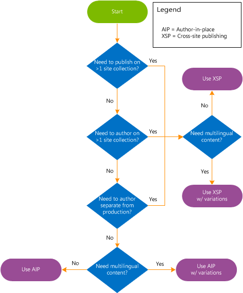

# Plan for Internet, intranet, and extranet publishing sites in SharePoint Server

[!INCLUDE[appliesto-2013-2016-2019-xxx-md](../includes/appliesto-2013-2016-2019-xxx-md.md)]
  
You can use the publishing features in SharePoint Server to create branded Internet, intranet, and extranet sites. However, some publishing features are available only in SharePoint Server.
  
There are several planning steps you have to do before you begin building publishing sites. First, decide what SharePoint Server architecture you want to have. Then determine the type of content that will be published. Next, decide whether you need multilingual support for your sites. Finally, decide which publishing method is best suited for your solution.
  
This article builds on the information in [Overview of publishing to Internet, intranet, and extranet sites in SharePoint Server](overview-of-publishing-to-internet-intranet-and-extranet-sites.md).
  
## Determine the SharePoint architecture

If you are planning to build a publishing site based on SharePoint Server, you have probably already made some decisions about what kind of sites are needed, and how you want them distributed. For example, if you are building an Internet business site, you probably already know how many public-facing sites you require for each region or brand. If you are building an intranet site for your company, you have probably already determined how many internal sites you require for each division or group. It is not necessary to have a detailed plan of the physical architecture at this stage in the project. However, when you plan to set up a publishing site, it's important to consider if you have to plan for sites to be inside or outside a firewall, and if some sites will allow anonymous users. For more information about how to plan for sites, see [Plan sites and site collections in SharePoint Server](../sites/plan-sites-and-site-collections.md).
  
## Determine what type of content you will have on each site

What type of content do you plan to publish on the site? Is the site an intranet knowledge base that will have only Pages library content? Or is the site an Internet business site that will display lists of products and descriptions, together with Pages library content? If you plan to use cross-site publishing, how many catalogs do you have? Are any catalogs in external data sources? Will you import catalogs into the site, or will you create content directly in SharePoint Server? Knowing what type of content you have will help you determine what publishing method you will use later in this article.
  
## Decide on multilingual support

Does your site require that content be provided in more than one language, or to more than one locale? Even if you currently plan to only create and publish content in a single language, you should carefully consider whether that business requirement might change in the future. If there is a chance you might eventually want to use variations on the site, you should plan for using variations now. By setting up your site structure now in preparation for using variations, you will save yourself and your organization time and resources in the future. If you have to change the site structure when you switch to using variations later, it is often more difficult and can affect the URLs that you planned for your sites. For more information about variations, see [Variations overview in SharePoint Server](variations-overview.md). For information about how to plan variations, see [Plan for variations in SharePoint Server](plan-for-variations.md).
  
## Decide which publishing method to use

SharePoint Server has two ways that you can make published content available to users: author-in-place and cross-site publishing. Deciding which publishing method to use is an important step in planning publishing sites. The publishing method that you select will lead to additional planning steps, and some steps are unique to each method.
  
- **Author-in-place** Uses a single site collection to author content and make it available to readers of your site. If you plan to publish only Pages library content, and you do not have to author on more than one site, or publish to more than one site, and you do not have a business need to author separately from your production environment, you should use author-in-place. If you must publish multilingual content, you can still use variations to make content available to sites in multiple languages or regions. Author-in-place is available in both SharePoint Server and SharePoint. 
    
- **Cross-site publishing** Uses one or more site collections to author content, and one or more site collections to control the design of the site and the display of the content. If you want to separate your authoring and publishing environments, you should use cross-site publishing. If you plan to publish only Pages library content, but you want to author in more than one site, or publish to more than one site, you should also use cross-site publishing. Cross-site publishing is available only in SharePoint Server. For more information about cross-site publishing, see [Overview of cross-site publishing in SharePoint Server](overview-of-cross-site-publishing.md). For information about how to plan for cross-site publishing, see [Plan for cross-site publishing in SharePoint Server](plan-for-cross-site-publishing.md).
    
Consider cross-site publishing if you answer yes to any of the following questions:
  
- Is it okay for the authoring site to look different from the publishing site?
    
- Do you want to keep the authoring environment separate from the publishing environment?
    
- Do you have multiple site collections represented, on either the authoring or publishing side — for example, n:1 or 1:n?
    
- Do you want to have multiple sites for different brands?
    
- If you plan to use variations or if you plan to translate content for multiple sites, do you want to have different URLs for different locale-specific variants of your site?
    
Although cross-site publishing is the recommended method to use for making content available to multiple sites, it might not be the right method for your publishing solution. You should not use cross-site publishing if you do not plan to use variations with unique URLs, or publish to multiple sites, and you want to author content on the same site collection in which it is published. Use author-in-place instead.
  
Use the following flowchart to help you determine which publishing method to use:
  
**Publishing method decision flowchart**

  
## Additional planning tasks

After you have determined the publishing method to use, there are additional planning tasks to perform. The following resources will help you make additional planning decisions about your publishing solution.
  
- [Plan information architecture for Web content management (SharePoint Server 2010)](/previous-versions/office/sharepoint-server-2010/cc262873(v=office.14)) provides general recommendations for planning the information architecture for a Web content management solution. 
    
- [Plan Web page authoring (SharePoint Server 2010)](/previous-versions/office/sharepoint-server-2010/cc263367(v=office.14)) describes the steps that are involved in planning how Web pages are authored. 
    
- [Plan content approval and scheduling (SharePoint Server 2010)](/previous-versions/office/sharepoint-server-2010/cc263156(v=office.14)) contains general guidance about how to plan content approval and scheduling for use with SharePoint Server publishing sites. 
    
- [Plan for caching and performance in SharePoint Server](caching-and-performance-planning.md) provides information about how and when to use the BLOB cache, and it lists key considerations for planning to use it. This article also describes performance considerations for when to use Bit Rate Throttling, and it describes the limitations of upload file size restrictions. 
    
- [Plan for large Pages libraries (SharePoint Server 2010)](/previous-versions/office/sharepoint-server-2010/ee721053(v=office.14)) describes the use of large Pages libraries in SharePoint Server publishing sites. Also, this article contains information to help you determine whether to use large Pages libraries with your publishing solution and information about how to plan for them. 
    
- [Plan for variations in SharePoint Server](plan-for-variations.md) provides information about important items that you should consider when you are using variations in publishing sites, and it describes the tasks that are involved in planning a solution that uses variations in SharePoint Server. 
    
- [Plan navigation term sets in SharePoint Server](plan-navigation-term-sets.md) provides information about how to create the navigation term set to provide site navigation for SharePoint Server publishing sites. 
    
## See also

#### Concepts

[Overview of publishing to Internet, intranet, and extranet sites in SharePoint Server](overview-of-publishing-to-internet-intranet-and-extranet-sites.md)
  
[Overview of cross-site publishing in SharePoint Server](overview-of-cross-site-publishing.md)
  
[Plan for cross-site publishing in SharePoint Server](plan-for-cross-site-publishing.md)
  
[Estimate capacity and performance for Web Content Management (SharePoint Server 2013)](web-content-management-capacity-and-performance.md)

