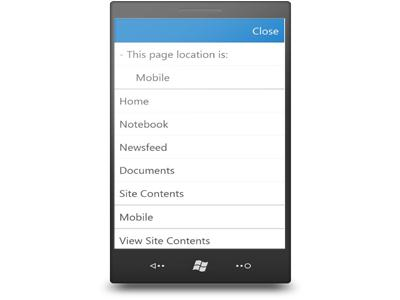
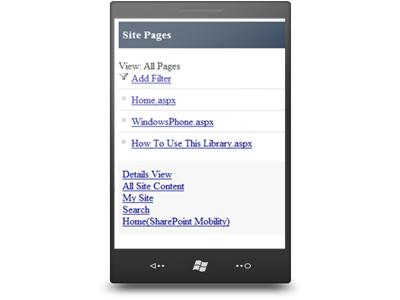
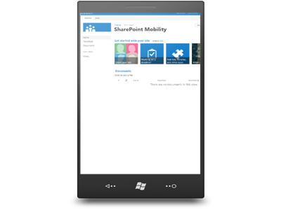

# Plan for mobile views in SharePoint Server 2013

[!INCLUDE[appliesto-2013-xxx-xxx-xxx-md](../includes/appliesto-2013-xxx-xxx-xxx-md.md)]
 
> [!IMPORTANT]
> In 2016, the SharePoint mobile app was introduced with support for SharePoint Server 2013. Please see [Supporting the SharePoint mobile apps online and on-premises](supporting-the-sharepoint-mobile-apps-online-and-on-premises.md) for more details.

In SharePoint Server 2013, there are new, optimized mobile browser experiences available for viewing a SharePoint site. For example, you have the flexibility to use a modern out-of-the-box solution, such as the HTML5-based contemporary view, or you can design a mobile view based on your organization's unique usability requirements. There are four browser-based experiences that are available in SharePoint Server 2013. Your ability to choose these experiences depends on several factors, including which devices you have and the type of site that you are trying to enable for mobile views. This article will help you plan for using mobile browser experiences in SharePoint Server 2013 by identifying device and site requirements for a particular view, and providing inventory for your mobile device base. Upon completion, you will understand the mobile views that are available to you, and you will be provided with next steps and guidance if these views are unacceptable.
  
Before proceeding, we recommend that you read [Overview of mobile devices and SharePoint Server 2013](mobile-devices-overview.md). It provides additional details on understanding mobile views, including the browser redirection process and the compat.browser file that is associated with mobile view redirection. For information about which mobile browsers are supported in SharePoint Server 2013, see [Mobile device browsers supported in SharePoint 2013](supported-mobile-device-browsers.md).
  
    
## Mobile browser experiences

This section will help you understand which mobile views are available in SharePoint Server 2013, and identify which views are available to you based on device and site requirements. In summary, there are three distinct mobile browser experiences that are available by default, and a feature known as device channels that will allow you create a customized mobile browser view for a SharePoint publishing site. The following table describes these views and the device channels feature.
  
**Table: Mobile browser views and device channel feature**

|**Mobile view**|**Device rendering**|**Description**|
|:-----|:-----|:-----|
|Contemporary view    ||**For smartphone devices only. Activated by default on select site templates (Team Site, Blank Site, Document Workspace, Document Center, and Project Site).**    It is available by default in SharePoint Server 2013.     The contemporary mobile browser view renders in HTML5. This view is available to Mobile Internet Explorer version 9.0 or later versions for Windows Phone 7.5, Safari version 4.0 or later versions for iPhone iOS 5.0, and the Android browser for Android 4.0 or later versions.     The contemporary view has a modern UI that is optimized for touch.     It provides an intuitive navigation experience that allows you to move to different pages and parts of site with ease.     Supports full screen UI view.    > [!IMPORTANT]>  The contemporary view is intended for smartphone devices. However, certain slates might also receive this view if they use similar user agent strings as smartphones. For more information about user agent strings and configuring mobile view redirection, see [Configure the browser definition file in SharePoint Server](/previous-versions/office/sharepoint-server-2010/ff393836(v=office.14)). For more information about the new contemporary view functionality, see [Overview of mobile devices and SharePoint Server 2013](mobile-devices-overview.md).           |
|Classic view    ||**For smartphone devices only. This view renders in HTML format, or similar markup languages (CHTML, WML, and so on), and provides backward compatibility for mobile browsers that cannot render in the new contemporary view.**    It is offered by default in SharePoint Server 2013.     Lightweight mobile view for interacting with lists and libraries on your SharePoint site.     Hyperlink navigation model.    |
|Full screen UI    ||**For smartphone and slate devices.**    This view resembles the desktop SharePoint rendering experience.     Same navigation experience as the desktop experience.     The contemporary view has a menu option to switch to the full screen UI view.    |
|Device channels (custom)    |Not applicable - depends on design    |**For smartphone and slate devices. Can only be used with a publishing site.**    With device channels, you can render a single publishing site in multiple ways by using different designs that target different devices based on their user agent string.     The site and content can be mapped to use different master pages and style sheets for a specific device or group of devices.     You can easily show different content to different device channels by using same page and page layout.    |
   
## Device inventory and site planning for mobile devices

The first important planning step is to inventory which mobile devices will be connecting to the SharePoint Server 2013 site. Next, you will have to determine which sites will offer mobile views for SharePoint Server 2013.
  
### Device inventory

Some key preliminary questions should be **Which devices do I have, and are they supported for SharePoint Server 2013?** It is important to inventory all devices including brand and operating system information. Also, some of the views are unavailable to certain phones and slates as stated in the previous table. For example, if you do not have an HTML5-enabled browser on a device, the contemporary view will not be shown. Or, the device might not be supported in SharePoint Server 2013. To help with this stage of planning, you can do the following: 
  
- Perform a full device inventory by brand and operating system version in your network, or on the mobile devices that will be connecting to the SharePoint Server 2013 site. 
    
- Refer to the previous browser experiences table to understand which views are available for both smartphones and slates. To see which device browsers are supported by brand and operating system in SharePoint Server 2013, see [Mobile device browsers supported in SharePoint 2013](supported-mobile-device-browsers.md).
    
To help with this process, a worksheet is available to help catalog your inventory by brand and operating system version. Also, it provides columns for identifying whether the device browser is supported or not in SharePoint Server 2013. It is important to capture device inventory and support information because it will help you expose restrictions in choosing a mobile view discussed in later sections of this article. To download this worksheet, see [Mobile Device Inventory and Site Planning Worksheet](https://go.microsoft.com/fwlink/?LinkId=263949) in the Microsoft Download Center. 
  
### Site planning for mobile devices

The browser-based mobile views in SharePoint Server 2013 can be used on a number of different SharePoint site templates. The following table shows where mobile views can be applied.
  
**Table: Browser-based mobile views on SharePoint site templates**

|**Mobile view**|**Team Site**|**Blank Site**|**Document Workspace**|**Document Center**|**Project Site**|**Publishing Site**|
|:-----|:-----|:-----|:-----|:-----|:-----|:-----|
|Contemporary view    |Yes    |Yes    |Yes    |Yes    |Yes    |n/a    |
|Full screen UI    |Yes    |Yes    |Yes    |Yes    |Yes    |Yes    |
|Device channels    |Not applicable    |Not applicable    |Not applicable    |Not applicable    |Not applicable    |Yes    |
|Classic view    |Yes    |Yes    |Yes    |Yes    |Yes    |Not applicable    |
   
> [!NOTE]
> The full screen UI view is actually available for all SharePoint site templates and not for just the select templates that are listed in this table. 
  
An important question to answer is **Which sites do you plan to have mobile views on for SharePoint Server 2013?** Although choosing a mobile view is discussed in the next section, it is important to identify which sites will require a mobile rendering in your organization. The same worksheet discussed in the previous section will allow you to record this information. To download this worksheet, see [Mobile Device Inventory and Site Planning Worksheet](https://go.microsoft.com/fwlink/?LinkId=263949) in the Microsoft Download Center. 
  
## Choose a mobile browser experience

After you perform a full device inventory and understand the different mobile view restrictions at the device and site levels, you must choose which mobile browser view best fits your organizational needs.
  
- **Which view should I choose?**
    
    This will depend primarily on factors such as what are your mobile usability requirements, what is the level of interaction a user needs with a mobile SharePoint solution, and are there any device or site restrictions. Will an out-of-the-box experience like the contemporary view be sufficient for general interaction, or do you need a more customizable solution that caters to specific business requirements like device channels? It is very important to clearly understand the needs of your mobile SharePoint user base to help with the selection process. 
    
    The following table provides some prime considerations when you evaluate positive or negative user impact with a specific view. It is not a competitive analysis between the different view options because some choices might not be available for you based on device or site template requirements. An example is that device channels can only be used on a publishing site and not on other site templates like the other views. However, it is intended to provide insight and discussion into the advantages and disadvantages each view provides and the usability impact. For example, will the UI be lightweight and not potentially cumbersome to end users, or how will users navigate between mobile pages.
    
- 
   **Table: Considerations for choosing a browser view**

|**Mobile view**|**Lightweight UI experience?**|**Optimized for touch?**|**Navigation method**|**Desktop/ full UI rendering?**|**Customizable?**|
|:-----|:-----|:-----|:-----|:-----|:-----|
|Contemporary view (smartphone)    |Yes    |Yes    |Navigation window    |No    |No    |
|Full screen UI (smartphone and slate)    |No    |No    |Same experience as desktop    |Yes    |No    |
|Device channels (smartphone and slate-publishing site only)    |Defined by view design    |Yes - based on custom design    |Defined by view design    |Yes    |Yes    |
|Classic view (smartphone)    |Yes    |No    |Hyperlink driven    |No    |No    |
   
    > [!IMPORTANT]
    > Although the classic view is presented as an option in the previous table, it is considered to be a legacy mobile browser view for SharePoint Server 2013. If your device browser is supported, and renders in HTML5, the contemporary view will be seen instead of the classic view. We recommend that you evaluate the other browser views, if possible, for your mobile environment. 
  
    It is again important to recognize the key advantages and potential disadvantages of these mobile views for your specific organization. For example, users might prefer to view a SharePoint site in its entirety on a smartphone because the look, feel, and navigation experience is similar to the desktop and is familiar. Or, a full-screen rendering is not preferable on a smartphone because of the reduced screen size and multiple touch gesture movements that are required to perform an operation. We highly recommend that you extensively test the mobile views available to you with users before deployment into a production environment.
    
- **Is there a customizable solution available so I can create my own unique SharePoint mobile view?**
    
    Yes, you can create a custom view by using device channels in SharePoint Server 2013. Device channels make it easy to render certain site content, style your content, and even change images while maintaining the same URL across a pool of different devices. For example, compared to the desktop version of your SharePoint site, the mobile view can be formatted with a smaller width, have better navigation with wider touch targets, and show less information in general. 
    
    > [!IMPORTANT]
    > Device channels can only be used with publishing sites and not with other sites templates. 
  
## Next steps

After reading this article, you should understand which mobile views are available to you based on device and site restrictions. Ultimately, you might have questions about what to do next, especially if a particular mobile view is not available. The following list provides options to deploy the ideal mobile view for your organization, and further clarification on certain mobile view experiences. 
  
- **My devices do not support HTML5, and I want to use the contemporary view experience.** In this case, the option is to purchase devices that do support the contemporary view and are capable of rendering the experience. To see which device browsers are supported by brand and operating system in SharePoint Server 2013, see [Mobile device browsers supported in SharePoint 2013](supported-mobile-device-browsers.md).
    
- **After evaluating my user base I find that users do not want to use a mobile view of our SharePoint sites. Due to familiarity with the full UI experience, they would rather use that option on smartphones.** There are several ways to disable mobile views in SharePoint Server 2013, including turning off the feature Mobile Browser View at the site level. Alternatively, you can modify the browser definition file in Internet Information Services (IIS) to change mobile redirect behavior. This file lists the mobile browsers and devices that can access mobile views in SharePoint Server 2013. When a user browses a SharePoint site by using a mobile device, the mobile browser submits to the site an HTTP GET request that includes a user agent string. If the mobile browser and device model in the user agent string are listed in the browser definition file and the **isMobileDevice** setting for the mobile browser is set to true, SharePoint Server 2013 redirects the mobile browser to the mobile view of the site. Otherwise, a standard view of the site is shown in the mobile browser. For more information, see [Configure the browser definition file in SharePoint Server](/previous-versions/office/sharepoint-server-2010/ff393836(v=office.14)).
    
- **I want to create a customized mobile view on a non-publishing site.** Device channels can only be used in a publishing site. However, you can enable the publishing feature on your non-publishing sites. 
    
## See also

#### Concepts

[Overview of mobile devices and SharePoint Server 2013](mobile-devices-overview.md)
  
[Mobile device browsers supported in SharePoint 2013](supported-mobile-device-browsers.md)

