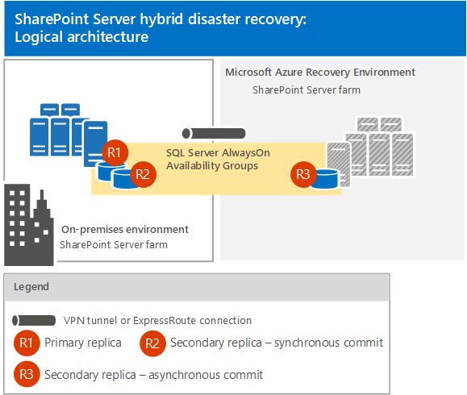
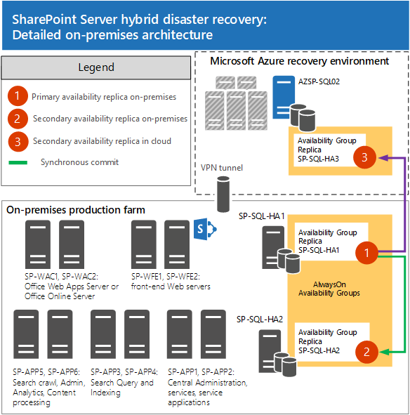
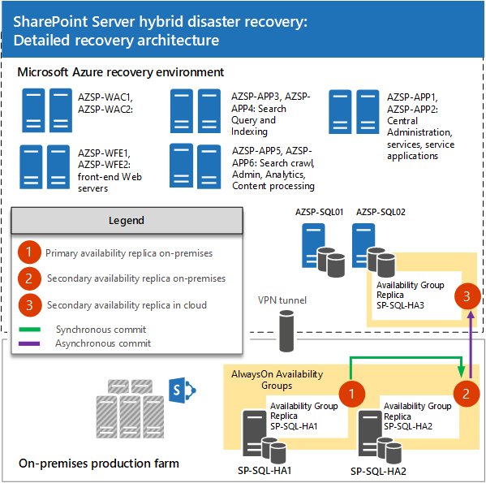
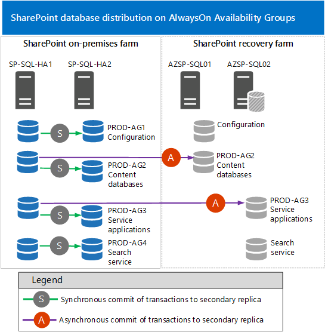
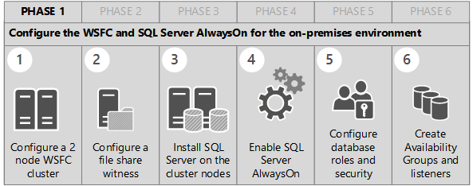
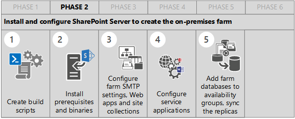
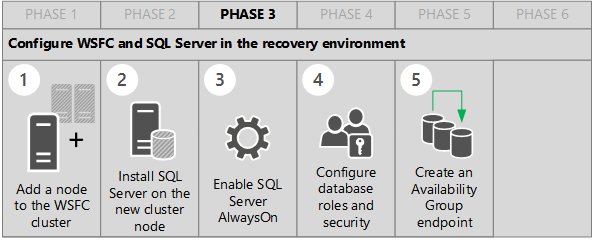
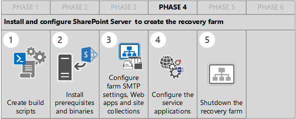
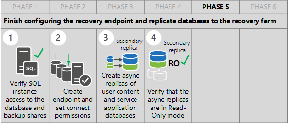
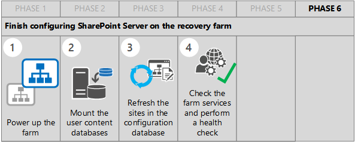

# Plan for SQL Server Always On and Microsoft Azure for SharePoint Server Disaster Recovery

[!INCLUDE[appliesto-2013-2016-2019-xxx-md](../includes/appliesto-2013-2016-2019-xxx-md.md)]

Use SQL Server 2014 and SQL Server 2016 Always On Availability Groups and Microsoft Azure to create a hybrid disaster-recovery environment for your on-premises SharePoint Server farm. This article describes how to design and implement this solution.
  
The solution in this article applies to the following:

- Microsoft Azure

**SharePoint Server 2013**
   
- SQL Server 2014 Enterprise
    
- Windows Server 2012 R2 Datacenter
    
**SharePoint Server 2016 Enterprise**
  
- SQL Server 2014 with Service Pack 1 (SP1)
    
- SQL Server 2016 Enterprise edition
    
- Windows Server 2012 R2
    
- Windows Server 2016 Datacenter edition

**SharePoint Server 2019 Enterprise**
  
- SQL Server 2016
    
- SQL Server 2017
    
- Windows Server 2016
    
- Windows Server 2019
    
**Acknowledgments:** This SharePoint Server disaster recovery solution is the result of the design, testing, and writing done by Tejinder Rai (MCS). This solution combines Microsoft best practices with hands-on, real world customer experiences. David Williams and Matthew Robertshaw also made significant contributions to this article by their work with SQL Server failover automation and recovery testing. 
  
>[!NOTE]
>The references and instructions for SharePoint Server 2016 in this article also apply to SharePoint Server 2019.
    
## Introduction to hybrid disaster recovery for SharePoint Server
<a name="intro"> </a>

Setting up a suitable disaster recovery environment can be an expensive and very complicated process. It requires careful planning to deploy and test a solution that meets your business goals for getting your production environment and applications up and running again.
  
When it comes to disaster recovery, SharePoint Server raises the bar for complexity and the need for careful planning, design, and testing. Some of the constraints that you have to consider are the different types of failover that SQL Server supports for Availability Group replicas, as well as the fact that several SharePoint databases don't support asynchronous commit to a replica, and special handling is required to recover these special cases.
  
### SharePoint Server Search recovery

SharePoint Search is one of the cases that requires a different approach and special techniques for recovery in a disaster scenario. This is because you can't maintain database fidelity for the search index and file system if you use Always On Availability Groups with asynchronous commit to a secondary replica.
  
It is important to understand the four available disaster recovery options for Search in a SharePoint Server farm. Each option has its pros and cons, and the best option is driven by business continuity and recovery requirements. For more information about the supported options, which include a hybrid option for recovering the Search service in a farm hosted in a public cloud, see [Disaster recovery best practices and strategies for SharePoint 2016 search](../search/best-practices-of-disaster-recovery-for-search.md).
  
### Disaster recovery criteria

Before the availability of cloud technologies, organizations had to set up and maintain a secondary data center as a standby environment that could run mission critical systems if there was a disaster. The costs associated with creating and operating a secondary data center prevented many organizations from setting up a disaster recovery environment for SharePoint.
  
The availability and maturity of cloud infrastructure and platform services make Microsoft Azure a viable and cost effective alternative to operating a secondary data center.
  
In addition to the basic costs associated with a secondary datacenter, businesses also need to determine recovery requirements for critical systems and corporate data. Recovery requirements are determined by answering the following two questions:
  
- How long can we be offline before the business suffers significant losses? For example, these losses could be revenue, damaged business relationships, or credibility.
    
- How much data can we lose before the business suffers significant losses? In addition to the offline examples, some sectors are totally data driven and dependent.
    
In the disaster recovery world these criteria are quantified as Recovery Time Objectives (RTOs) and Recovery Point Objectives (RPOs).
  
> [!NOTE]
> A related objective is Recovery Level Objective (RLO). This objective defines the granularity with which you must be able to recover data—whether you must be able to recover the whole farm, web application, site collection, site, list or library, or item. For more information, see [Plan for backup and recovery in SharePoint Server](backup-and-recovery-planning.md). 
  
The cost of a disaster recovery solution is tied to these objectives—the reality is that better RTO and RPO cost more. The objective and cost level also determine the recovery environment you choose. The industry terminology for three basic disaster recovery environments are: Cold Standby, Warm Standby, and Hot Standby. There are variations of course, depending on the business sector.
  
For more information about disaster recovery solutions, see [High availability and disaster recovery concepts in SharePoint Server](high-availability-and-disaster-recovery-concepts.md) and [Choose a disaster recovery strategy for SharePoint Server](plan-for-disaster-recovery.md).
  
This article provides a framework that you can use to deploy a hybrid disaster recovery solution for SharePoint Server.
  
### What's not in this article

The following topics are out of scope for this article:
  
- Creating a business continuity and associated disaster recovery plan.
    
- Service level requirements for RTO and RPO.
    
- Cost assessment based on service level requirements.
    
- Detailed steps for the following:
    
  - Configuring a Windows Server Failover Cluster (WSFC) cluster
    
  - Provisioning an Azure environment (storage accounts, virtual networks, cloud services, availability sets, and virtual machines)
    
  - Configuring a VPN tunnel from on-premises farm to Azure recovery environment
    
## Disaster recovery solution description and architecture
<a name="DRsol"> </a>

Our hybrid solution uses a topology that provides cross-continental redundancy in North America. The following test farms are deployed in two locations:
  
- An on-premises production farm running in a datacenter in Redmond, WA (West coast).
    
- A recovery farm deployed on Microsoft Azure. This farm is hosted in a datacenter in the Eastern part of the United States. This farm is set up as a warm standby recovery environment.
    
The solution we describe uses SQL Server Always On Availability Groups as an end-to-end solution that provides high availability and disaster failover recovery. In addition to providing high availability in a production environment SQL Server Always On improves RTO because the SQL Server instances in the secondary datacenter contain a replica of the databases from the primary datacenter.
  
Our test environment and conditions are designed to represent the type of SharePoint production farm and disaster recovery solution that mainstream customers are building.
  
### Logical architecture

The next illustration (Figure 1) shows the logical architecture for this solution and highlights the use of Availability Group replicas on-premises and in Azure.
  
**Figure 1 Logical architecture for hybrid environment**


  
#### Detailed architecture

The next figure (Figure 2) shows the detailed architecture for the on-premises test farm. The farm is configured as a highly available farm with enterprise search.
  
> [!NOTE]
> All the diagram labels are based on the naming convention we used to build out and test this disaster recovery scenario. They provide reference points for the article. 
  
**Figure 2 On-premises production farm**


  
The next figure (Figure 3) shows the detailed topology of the warm standby farm deployed in Azure.
  
**Figure 3 Warm standby recovery farm**


  
## What you need for this SharePoint Server disaster recovery solution
<a name="need"> </a>

Use the following requirements as a guide to start planning the deployment of this disaster recovery solution.
  
 **Infrastructure and general configuration**
  
The following list is a summary of the infrastructure and general configuration requirements for the on-premises farm and the recovery farm:
  
- Two SharePoint Server farms. A production farm in your primary datacenter and a warm standby farm that uses Azure as the secondary datacenter. An added benefit to using Azure is that you don't have to worry about using identical hardware for both farms.
    
- Each farm is online in both datacenters.
    
- Software versions and patch levels. Both farms use the same software version and patch level for:
    
  - Windows Server 2012 R2 or Windows Server 2016
    
  - SQL Server 2014 or SQL Server 2016
    
  - SharePoint Server 2016 or SharePoint Server 2013 
    
- Both farms are configured to use the same service accounts for administering SharePoint.
    
- Content databases and service application databases are distributed across one or more SQL Server Availability Groups.
    
- Use synchronous commit mode for the replicas in the on-premises environment. This is the typical high availability configuration for a SharePoint farm because it supports automatic failover and minimizes data loss.
    
- Use asynchronous commit mode for the replica in the recovery environment. Although automatic failover isn't supported, data throughput is usually better which can be a very important factor when the distance between the production and recovery farms is significant.
    
    > [!NOTE]
    > There are cases where synchronous commit to a replica in a recovery environment have been tested and implemented because throughput is the same as using asynchronous commit to the recovery replica. However, this is not broadly accepted or recommended. 
  
- Each farm has its own service applications that have synchronized databases between the two environments. Because read-only databases are used for service applications in the disaster recovery farm, service applications do not need to be re-provisioned when the production farm fails over.
    
- Search crawling with Read-Only databases in the disaster recovery instance. If this is required you need to configure a separate Search Service Application for the recovery farm. For more information, see [Supported high availability and disaster recovery options for SharePoint databases](supported-high-availability-and-disaster-recovery-options-for-sharepoint-databas.md).
    
> [!TIP]
> Use automation wherever and whenever possible. Scripted deployment and configuration ensures configuration consistency and reduces errors caused by typing commands or navigating through the user interface to configure the farm. 
  
## Mandatory configuration requirements for both farms
<a name="configreqs"> </a>

The following technologies are needed to deploy the disaster recovery solution described in this article:
  
- Windows Server 2012 R2 or Windows Server 2016
    
- SharePoint Server 2016 or SharePoint Server 2013 with Service Pack 1 and the May 2014 cumulative update 
    
- SQL Server 2014 or SQL Server 2016
    
- A secure connection between the primary data center and the recovery farm in Azure. We used a VPN connection but if ExpressRoute is available in your area consider using it.
    
## Understand database requirements: SQL Server Always On and SharePoint Server
<a name="understand"> </a>

The primary datacenter will utilize availability group synchronous-commit replicas to achieve high availability in the primary farm. The secondary datacenter must utilize asynchronous-commit replicas. This is due to the latency on the network between the primary and secondary datacenters. It is important to monitor the latency of replaying log buffers to the disaster recovery farm during testing.
  
### Dependencies, prerequisites, and best practices

Review the following dependencies, prerequisites, and best practices before building out the test farms.
  
### Windows Server Failover Clustering (WSFC) cluster

The WSFC cluster will span two datacenters. All the nodes in the on-premises datacenter and the recovery environment belong to the same WSFC cluster.
  
### SQL Server configuration for SharePoint

- Create SQL Server volumes to separate the SQL databases, farm databases, database log files, tempdb databases, and tempdb database log files.
    
- Distribute the farm databases over the volumes according to read/write speed. Using fastest to slowest to set priorities, the following distribution is typical:
    
  - Tempdb data and transaction log files
    
  - Database Transaction log files
    
  - Search database files
    
  - Content databases
    
- Set up the accounts for the SQL Server service and the SQL Agent service.
    
Use the configurations in the following table when you deploy SQL Server for the SharePoint farms.
  
|**Component**|**Settings**|
|:-----|:-----|
|Port  <br/> |Block UDP port 1434.  <br/> We recommend that you block TCP port 1433, and assign the port that is used by the default instance to a different port. However, this is not mandatory.  <br/> Make sure that the port number that is to be assigned to the default instance is not in the registered ports. Refer to [Service Name and Transport Protocol Port Number Registry](http://go.microsoft.com/fwlink/?LinkID=626877) to avoid using the registered port.  <br/> Ensure that you follow the security guidance in [Configure SQL Server security for SharePoint Server](../security-for-sharepoint-server/configure-sql-server-security-for-sharepoint-environments.md).  <br/> Firewall Rules: Create new Inbound rules for the non-default port used by the SQL Server instance.  <br/> Hide instance: Hide the SQL Server instance from client computers.  <br/> |
|Lock pages in memory  <br/> |Grant the SQL Server service account permissions to lock pages in memory. For more information, see [Enable the Lock Pages in Memory Option (Windows)](http://go.microsoft.com/fwlink/?LinkID=626878) and [Server Memory Server Configuration Options](/sql/database-engine/configure-windows/server-memory-server-configuration-options?view=sql-server-2017).  <br/> |
|Disable Auto-create statistics  <br/> |**Do not** enable auto-create statistics on SQL Server. This is not supported for SharePoint Server. For more information, see [Best practices for SQL Server in a SharePoint Server farm](best-practices-for-sql-server-in-a-sharepoint-server-farm.md).  <br/> |
|Set Max Degree of Parallelism  <br/> |Set the max degree of parallelism (MAXDOP) to 1 in SQL Server instances that host SharePoint Server databases.  <br/> **Note:** SharePoint Server installation on SQL Server will fail by design unless the installer account has permission to change it.  <br/> For more information, see [Best practices for SQL Server in a SharePoint Server farm](best-practices-for-sql-server-in-a-sharepoint-server-farm.md).  <br/> |
|Trace Flags  <br/> |Add the trace flags 1222 (return resources and types of locks participating in a deadlock) and 3226 (suppress log backup entries in the SQL error log).  <br/> DBCC TRACEON (1222,-1)  <br/> DBCC TRACEON (3226,-1)  <br/> |
|SQLAgent Job History  <br/> |Make sure that SQLAgent has these settings, (Jobhistory_max_rows = 50000 and Jobhistory_max_rows_per_job = 10000).  <br/> |
|Minimum memory  <br/> |Min Memory = 512 Mb. (However, this is based on our test configuration and may not apply to your SQL Server installation so you should calculate your requirement.) For more information, see [Server Memory Server Configuration Options](/sql/database-engine/configure-windows/server-memory-server-configuration-options?view=sql-server-2017) and [Configure the min memory per query Server Configuration Option](/sql/database-engine/configure-windows/server-memory-server-configuration-options?view=sql-server-2017).  <br/> |
|Maximum memory  <br/> |Set the maximum memory limit for SQL Server based on the following formula:  <br/> Total Server RAM (GB) - 4 GB = [max server memory]  <br/> For more information, see [Server Memory Server Configuration Options](/sql/database-engine/configure-windows/server-memory-server-configuration-options?view=sql-server-2017).  <br/> |
|DNS aliases  <br/> |We recommend that you create DNS aliases for all SQL Server instances. This helps to simplify maintenance, such as to make it easier to move databases to another server. For example, the SharePoint farm in the Azure disaster recovery datacenter, connects directly to the SQL Server instance names. You should create a DNS alias rather than configure the farm with the instance names directly.  <br/> **Note:** The client alias and DNS alias should match to ensure clients which don't use SQL client aliases can also contact SQL servers.  <br/> For more information, see [Best practices for SQL Server in a SharePoint Server farm](best-practices-for-sql-server-in-a-sharepoint-server-farm.md).  <br/> |
|Database collation  <br/> |Latin1_General_Cl_AS_KS_WS  <br/> The SQL Server database collation must be configured for case-insensitive, accent-sensitive, kana-sensitive, and width-sensitive. This is to ensure file name uniqueness consistent with the Windows operating system.  <br/> |
   
### Design requirements and considerations

Each SQL Server instance that is part of an Always On Availability Group must also be part of the same WSFC cluster. An Availability Group has a primary replica, which has the most current data, and secondary replicas that receive updates from the primary replica. Each availability replica must reside on a different node of a single Windows Server Failover Clustering (WSFC) cluster. All of the SQL Server nodes, which are part of a single Windows Server Failover Cluster, require their own storage, unlike SQL Server Failover Cluster Instances (FCIs).
  
For more information about prerequisites, restrictions, recommendations, and general usage for availability groups, see:
  
- [Prerequisites, Restrictions, and Recommendations for AlwaysOn Availability Groups (SQL Server)]( /sql/database-engine/availability-groups/windows/prereqs-restrictions-recommendations-always-on-availability?view=sql-server-2017)
    
- [AlwaysOn Availability Groups (SQL Server)](/sql/database-engine/availability-groups/windows/always-on-availability-groups-sql-server?view=sql-server-2017)
    
The next figure (Figure 4) shows the Availability Group replica infrastructure that we used for the SharePoint databases.
    
**Figure 4 Availability Group replica infrastructure**


  
In the infrastructure shown in Figure 4, a common practice is to have the database servers in the recovery environment on a separate subnet, which must be taken into account when configuring WSFC and Availability Group listeners.
  
You also need to plan for and test network latency between the on-premises farm and the recovery environment. The latency between replicas will have an impact on your Recovery Point Objective (RPO).
  
Finally, think about provisioning the database servers in the recovery environment in their own Azure cloud service, which is how the test environment was built. Cloud services lets you group server roles so you can manage Azure VMs as a single entity. For more information, see [Should I choose cloud services or something else?](/azure/cloud-services/cloud-services-choose-me#tell-me-about-cloud-services?amp;clcid=0x409).
  
Like SharePoint Server, it is easier to design the architecture up front, rather than having to redesign Azure's platform services later.
  
### Availability group commit modes and failover types

It is important to understand how commit modes affect the different types of failover for each Availability Group configuration because this will affect farm recovery. The following table is from the SQL Server documentation. This table summarizes which forms of failover are supported under different availability and failover modes. For each pairing, the effective availability mode and failover mode is determined by the intersection of the modes of the primary replica plus the modes of one or more secondary replicas. For more information, see [Failover and Failover Modes (AlwaysOn Availability Groups)](/sql/database-engine/availability-groups/windows/failover-and-failover-modes-always-on-availability-groups?view=sql-server-2017).
  
|**Failover type**|**Synchronous-commit mode with automatic-failover mode**|**Synchronous-commit mode with manual-failover mode**|**Asynchronous-commit mode**|
|:-----|:-----|:-----|:-----|
|**Automatic failover** <br/> |Yes  <br/> |No  <br/> |No  <br/> |
|**Planned manual failover** <br/> |Yes  <br/> |Yes  <br/> |No  <br/> |
|**Forced failover** <br/> |Yes (1)  <br/> |Yes  <br/> |Yes  <br/> |
   
(1) If you issue a forced failover command on a synchronized secondary replica, the secondary replica behaves the same as for a manual failover.
  
The amount of time that the database is unavailable during a failover depends on the type of failover and its cause.
  
### Supported high availability and disaster recovery options for SharePoint databases
<a name="HADR"> </a>

The tables in this section summarize the supported high availability and disaster recovery options for SharePoint Server databases. For more detailed information, see [Supported high availability and disaster recovery options for SharePoint databases](supported-high-availability-and-disaster-recovery-options-for-sharepoint-databas.md).
  
|**Database name**|**High Availability (Synchronous Support)**|**Disaster Recovery (Asynchronous Support)**|
|:-----|:-----|:-----|
|**SharePoint Config** <br/> |Yes  <br/> |No  <br/> |
|**SharePoint Admin Content** <br/> |Yes  <br/> |No  <br/> |
|**State Service** <br/> |Yes  <br/> |No  <br/> |
|**WSS Content X** <br/> |Yes  <br/> |Yes  <br/> |
   
The following table lists the SharePoint service application databases.

|**Database name**|**High Availability (Synchronous Support)**|**Disaster Recovery (Asynchronous Support)**|
|:-----|:-----|:-----|
|**App Management** <br/> |Yes  <br/> |Yes  <br/> |
|**Business Connectivity Services** <br/> |Yes  <br/> |Yes  <br/> |
|**Managed Metadata** <br/> |Yes  <br/> |Yes  <br/> |
|**PerformancePoint** <br/> |Yes  <br/> |Yes  <br/> |
|**PowerPivot** <br/> |Yes  <br/> |Yes  <br/> |
|**Project** (SharePoint Server 2013 only)  <br/> |Yes  <br/> |Yes  <br/> |
|**Secure Store** <br/> |Yes  <br/> |Yes  <br/> |
|**Subscription Settings** <br/> |Yes  <br/> |Yes  <br/> |
|**Machine Translation Services** <br/> |Yes  <br/> |Yes  <br/> |
|**UPS Profile** <br/> |Yes  <br/> |Yes  <br/> |
|**UPS Social** <br/> |Yes  <br/> |Yes  <br/> |
|**UPS Sync** <br/> |Yes  <br/> |No  <br/> |
|**Usage** <br/> |Yes  <br/> |No  <br/> |
|**Word Automation** <br/> |Yes  <br/> |Yes  <br/> |
   
The following table lists the SharePoint Search databases.

|**Database name**|**High Availability (Synchronous Support)**|**Disaster Recovery (Asynchronous Support)**|
|:-----|:-----|:-----|
|**Search Admin** <br/> |Yes  <br/> |No  <br/> |
|**Search Crawl** <br/> |Yes  <br/> |No  <br/> |
|**Search Link Store** <br/> |Yes  <br/> |No  <br/> |
|**Search Analytics Store** <br/> |Yes  <br/> |No  <br/> |
   
## Build out the test farms in six phases
<a name="phases"> </a>

There are several phases to building out a SharePoint environment which provides High-Availability (HA) and Disaster Recovery (DR). We organized the steps for configuring the on-premises and recovery farms into the following phases:
  
1. [Build phase 1](#Bp1): Configure the Windows Server Failover Cluster and SQL Server Always On for the on-premises environment.
    
2. [Build phase 2](#Bp2): Install and configure SharePoint Server to create the on-premises farm.
    
3. [Build phase 3](#Bp3): Configure Windows Server Failover Cluster and SQL Server in the recovery environment.
    
4. [Build phase 4](#Bp4): Install and configure SharePoint Server to create the recovery farm.
    
5. [Build phase 5](#Bp5): Finish configuring the recovery endpoint and replicate databases to the recovery farm.
    
6. [Build phase 6](#Bp6): Finish configuring SharePoint Server on the recovery farm.
    
### Do some preparation before you start

The following table lists the key infrastructure components for this disaster recovery scenario. We've identified prerequisites and provided configuration guidance.
  
|**Infrastructure component**|**Notes**|
|:-----|:-----|
|Domain controller  <br/> |For our on-premises test environment we deployed a domain controller and created the corp.adventureworks.com domain. If you decide to run a proof of concept disaster recovery scenario you can use your organization's domain name.  <br/> **Note:** After we configured the domain, we also provisioned all of the VMs we'd be using for the farm and patched the OS to the same level. This made things more manageable than taking a piecemeal approach.  <br/> |
|Windows Server 2012 R2 and Windows Server 2016 failover clustering  <br/> |Windows Server 2012 R2 or Windows Server 2016 on each farm server configured according to best practices (Windows Server and SharePoint Server). For more information, see [Windows Server Failover Clustering (WSFC) with SQL Server](/sql/sql-server/failover-clusters/windows/windows-server-failover-clustering-wsfc-with-sql-server?view=sql-server-2017).  <br/> Every server that will be a cluster node must have the Failover Cluster feature and the Failover Cluster Management MMC installed.  <br/> A file share for the WSFC Quorum. As a best practice this should be configured in a third site that can be accessed by the on-premises site and the recovery site.  <br/> Document and stick to a consistent naming convention for the cluster.  <br/> |
|SQL Server database configuration and Always On Availability Groups  <br/> |SQL Server 2014 or SQL Server 2016 configured according to SharePoint requirements and the best practices identified in "Dependencies, prerequisites and best practices".  <br/> Databases use full recovery model. For more information, see [Recovery Models (SQL Server)](/sql/relational-databases/backup-restore/recovery-models-sql-server?view=sql-server-2017).  <br/> SQL Server instance names. (We used the Default instance name, which is supported in this design across all the cluster nodes).  <br/> The same file paths for the database and log file locations for each SQL Server instance. We used the following drive layouts, (System (L:\) for SQL databases and SharePoint databases), (User (S:\) for tempdb databases and log files), and (Local disk (T:\) for SharePoint SQL backups).  <br/> Document and stick to a consistent naming convention for the Availability Groups, the replicas, and the listeners.  <br/> |
|Networking  <br/> |Cluster nodes - Three static IP Cluster IP addresses (two for the on-premises farm and one for the recovery farm).  <br/> Availability Group Listeners - A static IP addresses for each listener. (Our test farm used four listeners.)  <br/> |
|Microsoft Azure gateway server  <br/> |A server in Azure that provides the endpoint for the VPN gateway connection from the on-premises farm. It is configured with the Active Directory Domain Services (AD DS) and DNS Services roles and is designated as a global catalog server for the test domain (corp.adventureworks.com).  <br/> When there is a disaster this server can become the primary domain controller.  <br/> |
|VPN gateway  <br/> |A site-to-site VPN or ExpressRoute configured between the primary datacenter and the Windows Azure Subscription where the disaster recovery farm will be configured.  <br/> For more information, see [Create a VNet with a Site-to-Site connection using the classic portal (classic)](/azure/vpn-gateway/vpn-gateway-howto-site-to-site-classic-portal) and [Create and modify an ExpressRoute circuit using PowerShell (classic)](/azure/expressroute/expressroute-howto-circuit-classic).  <br/> |
   
### Microsoft Azure and the recovery environment

The first steps in building out the recovery environment are to deploy a server in Azure and then establish a VPN or ExpressRoute connection between the on-premises farm and the Azure server.
  
Azure Infrastructure as a Service (IaaS) has many similarities to an on-premises private cloud that uses Windows Server Hyper-V virtualization and System Center Virtual Machine Manager (VMM). However, even IT professionals with extensive experience working in a private cloud get tripped up by the differences!
  
The [Appendix](#App) data sheet in the appendix will help you plan, deploy, and operate SharePoint Server 2016 in the Azure environment. It doesn't replace the Azure documentation and hands-on experience, but it will ease you into the Azure world from a SharePoint perspective. For information about Azure disaster recovery solutions, see [Replicate a multi-tier SharePoint application for disaster recovery using Azure Site Recovery](/azure/site-recovery/site-recovery-sharepoint) and [Azure Site Recovery](/azure/site-recovery/site-recovery-overview).
  
### Build phase 1
<a name="Bp1"> </a>


  
The next table provides more information about the steps in Build phase 1.
  
|**Step**|**Notes and guidance**|
|:-----|:-----|
|1. Configure a two-node WSFC cluster  <br/> |Use the Windows Server article, [Create a Failover Cluster](http://go.microsoft.com/fwlink/?LinkID=626897&amp;clcid=0x409) to create a two-node cluster. For Windows Server 2016 information, see [Failover Clustering in Windows Server 2016](/windows-server/failover-clustering/failover-clustering-overview).  <br/> |
|2. Configure a file share witness  <br/> |The preferred configuration for WSFC in a SharePoint environment is to use a file share witness and a node majority. Both cluster nodes in the on-premises farm have a quorum vote. The cluster node in the recovery farm doesn't have a vote.  <br/> For more information, see [Configure and Manage the Quorum in a Windows Server 2012 Failover Cluster](http://go.microsoft.com/fwlink/?LinkID=626898&amp;clcid=0x409). For Windows Server 2016, see [Deploy a Cloud Witness for a Failover Cluster](/windows-server/failover-clustering/failover-clustering-overview).  <br/> Use the following Microsoft PowerShell cmdlet to configure a file share and node majority Quorum:  <br/>  `Set-ClusterQuorum -NodeAndFileShareMajority "\\fileserver\share"` <br/> Use the following PowerShell cmdlet to assign votes:  <br/>  `(Get-ClusterNode {CLUSTERNODENAME}).NodeWeight=1` <br/> Use the following PowerShell syntax to configure a Cloud Witness:  <br/>  `Set-ClusterQuorum -CloudWitness -AccountName <StorageAccountName> -AccessKey <StorageAccountAccessKey>` <br/> |
|3. Install SQL Server on each Windows cluster node  <br/> |Install SQL Server on both Windows Server cluster nodes. Note the following:  <br/> **Do not** run the SQL Server setup program for a failover cluster. These nodes are not part of a SQL Failover Cluster Instance (FCI) Cluster.  <br/> Make sure that the SQL Server data paths are exactly the same for each instance.  <br/> For more information, see [Install SQL Server 2014 from the Installation Wizard (Setup)](http://go.microsoft.com/fwlink/?LinkID=626899&amp;clcid=0x409) or [Install SQL Server 2014 from the Command Prompt](http://go.microsoft.com/fwlink/?LinkID=626900&amp;clcid=0x409). Also, see [Install SQL Server from the Installation Wizard (Setup)](/sql/database-engine/install-windows/install-sql-server-from-the-installation-wizard-setup?view=sql-server-2017).  <br/> |
|4. Enable SQL Server Always On  <br/> |Use the guidance in [Enable and Disable AlwaysOn Availability Groups (SQL Server)](http://go.microsoft.com/fwlink/?LinkID=626901&amp;clcid=0x409) to enable Always On. Use theSQL Server2016 guidance in [Enable and Disable Always On Availability Groups (SQL Server)](/sql/database-engine/availability-groups/windows/enable-and-disable-always-on-availability-groups-sql-server?view=sql-server-2017).  <br/> The database grouping section after this table shows how you can logically group SharePoint databases and map them to different availability groups to meet your disaster recovery requirements as well as your high availability requirements.  <br/> |
|5. Configure farm account security  <br/> |Configure the appropriate permissions in each SQL Server instance for the SharePoint setup user administrator account. This account must be a member of the **db_owner** role and assigned to the **securityadmin** and **dbcreator** SQL Server security roles during setup and configuration.  <br/> For more information, see [Configure SQL Server security for SharePoint Server](../security-for-sharepoint-server/configure-sql-server-security-for-sharepoint-environments.md) and [Account permissions and security settings in SharePoint Server 2016](../install/account-permissions-and-security-settings-in-sharepoint-server-2016.md).  <br/> |
|6. Create availability groups, Always On Endpoints, and Availability Group Listeners  <br/> |Create the availability groups for synchronous-commit mode for high availability. (It is common practice to configure the availability groups logically for the logical failover of databases). After you create the Always On Endpoints, create Availability Group listeners to enable client connectivity to each availability group.  <br/> **Note:** You can create the availability groups with temporary database names so SharePoint can use the listeners when the farm is configured. This is so the database connection strings point to the appropriate DNS entries created by the listeners. This saves you having to reconfigure the listeners later.  <br/> For more information, see [Configure SQL Server AlwaysOn Availability Groups for SharePoint Server](configure-an-alwayson-availability-group.md).  <br/> For information, see [Create a Database Mirroring Endpoint for AlwaysOn Availability Groups (SQL Server PowerShell)](http://go.microsoft.com/fwlink/?LinkID=626902&amp;clcid=0x409). For SQL Server 2016 information, see [Database Mirroring - Always On Availability Groups- PowerShell](/sql/database-engine/availability-groups/windows/database-mirroring-always-on-availability-groups-powershell?view=sql-server-2017).  <br/> For information, see [Availability Group Listeners, Client Connectivity, and Application Failover (SQL Server)](http://go.microsoft.com/fwlink/?LinkID=626903&amp;clcid=0x409). For SQL Server 2016 information, see [Listeners, Client Connectivity, Application Failover](/sql/database-engine/availability-groups/windows/listeners-client-connectivity-application-failover?view=sql-server-2017).  <br/> **Note:** If you create the Availability Group Listeners using SQL Server Management Studio, you have to add an IP address for the disaster recovery subnet for each listener. This is not required if you provision Availability Group Listeners using the SQL Server  `New-SqlAvailabilityGroupListener` PowerShell cmdlet. The recovery farm will reference the SQL instances through DNS host (A) entries and not the Availability Group listeners. For more information, see [New-SqlAvailabilityGroupListener](/powershell/module/sqlps/New-SqlAvailabilityGroupListener?view=sqlserver-ps).  <br/> |
   
#### Database grouping for disaster recovery

We recommend that you group SharePoint databases and assign them to different availability groups based on your disaster recovery requirements.
  
You need to do this because each availability group has a synchronous commit replica on-premises for high availability and an asynchronous commit replica in the disaster recovery environment.
  
As noted in the [Supported high availability and disaster recovery options for SharePoint databases](#HADR) section, databases that support synchronous commit don't necessarily support async replicas. The following table is an example of how databases can be grouped for specific Always On Availability Groups. 
  
|**Availability Group name**|**SharePoint databases**|
|:-----|:-----|
|AG_SPConfig **(1)** <br/> |SharePoint Config, SharePoint Admin Content, State Service, and UPS Sync (AG Synchronous only)  <br/> |
|AG_SPContent  <br/> |WSS Content X  <br/> |
|AG_SPServices  <br/> |App Management, Business Connectivity Services, Managed Metadata, PerformancePoint, PowerPivot, Secure Store Service, Subscription Settings, Machine Translation Services, UPS Profile and UPS Social, Word Automation, and Usage (This database supports only synchronous commit, and because it holds transient data that's used for data mining, we don't recommend replicating this data in a disaster recovery scenario.) **(2)** <br/> |
|AG_SPSearch  <br/> |Search Admin, Search Crawl, Search Link, and Search Analytics Reporting  <br/> |
   
 **(1)** These names are only examples. You can use your own naming convention. 
  
 **(2)** The Usage database can be created independently on each SQL Server instance in the cluster. In addition to storing transient data, it also has very high transactions, which is another reason not to place it in an availability group. You can utilize the  `Set-SPUsageApplication` cmdlet to create the database in the secondary SQL instance. Then use the  `Set-SPUsageApplication` cmdlet with the  `-FailoverDatabaseServer` option to specify the secondary SQL instance in the highly available environment. 
  
The next table describes our test configuration at the end of Build phase 1.
  
|**Server name**|**Description**|
|:-----|:-----|
|DC2  <br/> |Domain controller  <br/> |
|SP-WFE1, SP-WFE2  <br/> |Web content servers  <br/> |
|SP-APP1 to SP-APP6 inclusive  <br/> |Application servers (for example, Central Administration, services, and search)  <br/> |
|SP-SQL-HA1, SP-SQL-HA2  <br/> |These servers are configured as two nodes in our WSFC cluster (SPDRCluster), each with one vote. Host the farm databases, configured with Always On Availability Groups. SP-SQL-HA1 has the primary replica role and SP-SQL-HA2 has the secondary replica role. These availability groups and listeners are configured: **Availability groups** = PROD-AG1, PROD-AG2, PROD-AG3, PROD-AG4; **Listeners** = SQL-PROD-AG1, SQL-PROD-AG2, SQL-PROD-AG3, SQL-PROD-AG4  <br/> |
|FS1  <br/> |This server provides the file share cluster quorum (Hybrid5SPDRClusterQuorum) for the WSFC cluster. It is also used as a shared distribution software point for the test farm.  <br/> |
|OP-FILESERVER (optional)  <br/> |This server provides a Distributed File System Replication (DFSR) service endpoint for the on-premises environment. The other endpoint is in our Azure environment. DFSR serves two purposes. First, we use it to store SQL Server backups (incremental and full) which are written to a server (AZSP-FS1) in Azure. We did this to simulate off-site storage and in a disaster scenario, we can use this backups to restore SharePoint search. The DFSR configuration also lets us move files between the two farms relatively easily.  <br/> |
   
### Build phase 2
<a name="Bp2"> </a>


  
The next table provides more information about the steps in Build phase 2.
  
|**Step**|**Notes and guidance**|
|:-----|:-----|
|1. Create build scripts  <br/> |We recommend that you develop a set of build scripts to install SharePoint Server 2016. These scripts can also be used to build out the recovery farm (and future SharePoint farms). Because the recovery farm will have service applications that are identical to those in the on-premises farm, it's a best practice to use identical service application and database names. Scripting reduces configuration errors and ensures consistency in farm configuration.  <br/> **Note:** Service applications reference their databases by the database name, unlike the Content databases, which also have a database ID that's stored in the SharePoint configuration database.  <br/> There are several examples of scripted SharePoint installations that you might be able to leverage in your environment. For example, [SharePointDsc](https://github.com/PowerShell/SharePointDSC) or [AutoSPInstaller](https://github.com/brianlala/AutoSPInstaller) is an end-to-end open source program available at Codeplex.  <br/> Ensure that the farm configuration database, the content databases, and service application databases point to the DNS alias of the SQL Server instance that you use. The SharePoint Server 2016 databases will be created with a connection string mapped to the SQL Server instance. Later they will be moved to availability groups using SharePoint Server PowerShell cmdlets.  <br/> After you create the farm configuration databases, we recommend scripting the following common tasks:  <br/> Join a SharePoint Server to the farm by using the  `Join-SharePointFarm` cmdlet  <br/> Register Managed Accounts by using the  `New-SPManagedAccount` cmdlet  <br/> Create Web Applications  <br/> Create Site Collections  <br/> Create Service Applications  <br/> Set the SharePoint App domain and Prefix  <br/> |
|2. Install prerequisites and binaries  <br/> |For more information, see [Install prerequisites for SharePoint Server from a network share](../install/install-prerequisites-from-network-share.md).  <br/> |
|3. Configure Farm SMTP Settings, Web Apps, and Site Collections  <br/> |Use the  `New-SPWebApplication` cmdlet to create Web Applications and use the  `New-SPSite` cmdlet to create Site Collections.  <br/> |
|4. Configure Service Applications  <br/> |Use the Service Application cmdlets in [Index of Windows PowerShell cmdlets for SharePoint Server 2016](/powershell/module/sharepoint-server/?view=sharepoint-ps) to configure service applications.  <br/> |
|5. Add the on-premises production farm databases to availability groups and synchronize the replicas  <br/> |When you finish configuring the farm, add the farm databases to the appropriate availability groups. Use these PowerShell cmdlets to add the databases and verify that they've been added to the availability group you specify,  `Add-DatabasetoAvailabilityGroup` and  `Get-AvailabilityGroupStatus` <br/> **Important:** Make sure that you enable the full recovery model on all databases that are to be added to an availability group before you add them.  <br/> After you add the farm configuration database to an availability group you must restart all the servers in the farm to ensure farm stability.  <br/> Synchronize the availability group replicas. For more information, see [Select Initial Data Synchronization Page (AlwaysOn Availability Group Wizards)](/sql/database-engine/availability-groups/windows/select-initial-data-synchronization-page-always-on-availability-group-wizards?view=sql-server-2017).  <br/> |
   
### Build phase 3
<a name="Bp3"> </a>


  
The next table provides more information about the steps in Build phase 3.
  
|**Step**|**Notes and guidance**|
|:-----|:-----|
|1. Add two nodes to the Azure disaster recovery datacenter which will stretch the on-premises WSFC cluster  <br/> |Configure these settings on the server that will be the new cluster node; Install the Windows Failover clustering feature, test the cluster, and then remove the quorum vote from the new node.  <br/> Open the Windows PowerShell command line as an Administrator and run the following cmdlet to install the Windows Failover clustering feature and management tools:  `Install-WindowsFeature -Name Failover-Clustering -IncludeManagementTools` <br/> Test the cluster with the following cmdlet:  `Test-Cluster` <br/> Remove the Quorum vote from the server with the following commands:  `(Get-ClusterNode {CLUSTERNODENAME}).NodeWeight=0` <br/> For more information, see [Configure and Manage the Quorum in a Windows Server 2012 Failover Cluster](http://go.microsoft.com/fwlink/?LinkID=626898&amp;clcid=0x409). For Windows Server 2016 information, see [Deploy a Cloud Witness for a Failover Cluster](/windows-server/failover-clustering/deploy-cloud-witness).  <br/> **Note:** If you use the same architecture as our test environment, you'll have to perform these configuration steps on both the SQL Server instances in the recovery environment.  <br/> |
|2. Install the SQL Server instances  <br/> |Install SQL Server on both nodes. Ensure that the data paths are exactly the same for each SQL instance and that the configurations are identical, for example, port configurations, database collation, and so on. For more information, see [Install SQL Server 2012 from the Installation Wizard (Setup)](http://go.microsoft.com/fwlink/?LinkID=626899&amp;clcid=0x409). Also, see [Install SQL Server from the Installation Wizard (Setup)](/sql/database-engine/install-windows/install-sql-server-from-the-installation-wizard-setup?view=sql-server-2017).  <br/> |
|3. Enable SQL Server Always On Availability Groups  <br/> |Use SQL Server Configuration Manager to enable SQL Server Always On Availability Groups. For more information, see [Enable and Disable AlwaysOn Availability Groups (SQL Server)](http://go.microsoft.com/fwlink/?LinkID=626901&amp;clcid=0x409). For SQL Server 2016 guidance, see [Enable and Disable Always On Availability Groups (SQL Server)](/sql/database-engine/availability-groups/windows/enable-and-disable-always-on-availability-groups-sql-server?view=sql-server-2017).  <br/> Refer to the table in [Build phase 1](#Bp1) for examples of the logical grouping of SharePoint Server 2016 databases to availability groups.  <br/> |
|4. Configure farm account security  <br/> |Configure the appropriate permissions in each SQL Server instance for the SharePoint setup user administrator account. This account must be a member of the **db_owner** role and assigned to the **securityadmin** and **dbcreator** SQL Server security roles during setup and configuration.  <br/> For more information, see [Configure SQL Server security for SharePoint Server](../security-for-sharepoint-server/configure-sql-server-security-for-sharepoint-environments.md), [Account permissions and security settings in SharePoint Server 2016](../install/account-permissions-and-security-settings-in-sharepoint-server-2016.md), and [Account permissions and security settings in SharePoint 2013](../install/account-permissions-and-security-settings-in-sharepoint-2013.md) <br/> |
   
### Build phase 4
<a name="Bp4"> </a>


  
The next table provides more information about the steps in Build phase 4.
  
|**Step**|**Notes and guidance**|
|:-----|:-----|
|1. Create build scripts  <br/> |We recommend that you develop a set of build scripts to install SharePoint Server. These scripts can also be used to build out the recovery farm (and future SharePoint farms). Because the recovery farm will have service applications that are identical to those in the on-premises farm, it's a best practice to use identical service application and database names. Scripting reduces configuration errors and ensures consistency in farm configuration.  <br/> **Note:** Service applications reference their databases by the database name, unlike the Content databases which also have a database ID that's stored in the SharePoint configuration database.  <br/> There are several examples of scripted SharePoint installations that use PowerShell. For example, [SharePointDsc](https://github.com/PowerShell/SharePointDSC) or [AutoSPInstaller](https://github.com/brianlala/AutoSPInstaller) is an end-to-end open source program available at Codeplex.  <br/> Ensure that the farm configuration database, the content databases, and service application databases point to the DNS alias of the SQL Server instance that you use. The SharePoint Server databases will be created with a connection string mapped to the SQL Server instance. Later they will be moved to availability groups using SharePoint PowerShell cmdlets.  <br/> After you create the farm configuration databases, we recommend scripting the following common tasks:  <br/> Join a SharePoint Server to the farm by using the  `Join-SharePointFarm` cmdlet. Register Managed Accounts by using the  `New-SPManagedAccount` cmdlet. Create Web applications, site collections, and service applications. Finally, set the SharePoint App domain and prefix.  <br/> |
|2. Install the prerequisites and binaries  <br/> |For more information, see [Install prerequisites for SharePoint Server from a network share](../install/install-prerequisites-from-network-share.md).  <br/> |
|3. Configure farm SMTP settings, Web Applications, and Site Collections  <br/> |Use the  `New-SPWebApplication` cmdlet to create Web Applications and use the  `New-SPSite` cmdlet to create Site Collections.  <br/> |
|4. Configure Service Applications  <br/> |Use the Service Application cmdlets in [Index of Windows PowerShell cmdlets for SharePoint Server 2016](/powershell/module/sharepoint-server/?view=sharepoint-ps) to configure service applications.  <br/> **Note:** Service Applications are created in the disaster recovery farm, with the exact same name as the primary farm. Ensure the database names are also named exactly the same as the primary farm, as the database will be referenced by the Service Applications in the disaster recovery farm, where the service application databases will eventually be created as replicas. As part of the process, the databases in the disaster recovery farm will be restored from the primary replicas, when the asynchronous replicas are added to the SQL Availability Group.  <br/> The content databases in the disaster recovery farm can be removed from the SharePoint configuration as the primary farm content databases will have a read-only replica available in the disaster recovery SQL Server instance.  <br/> Use the SharePoint 2016 Management Shell to run the following PowerShell cmdlet to dismount any content databases from the disaster recovery farm  `Remove-SPContentDatabase`.  <br/> If any additional content databases exist on the SQL Server instances in the disaster recovery farm, delete all of them. You can use any of these methods, [DROP DATABASE (Transact-SQL)](http://go.microsoft.com/fwlink/?LinkID=626908&amp;clcid=0x409), [Database.Drop Method ()](https://msdn.microsoft.com/en-us/library/microsoft.sqlserver.management.smo.database.drop%28v=sql.160%29.aspx), or [Delete a Database](/sql/relational-databases/databases/delete-a-database?view=sql-server-2017).  <br/> |
|5. Shut down the farm  <br/> |Shut down the farm after you finish configuring SharePoint. Now you can create asynchronous replicas for the databases on the on-premises farm.  <br/> |
   
### Build phase 5
<a name="Bp5"> </a>


  
The next table provides more information about the steps in Build phase 5.
  
|**Step**|**Notes and guidance**|
|:-----|:-----|
|1. Verify that the SQL instance can access the database and backup shares.  <br/> |Each node in an availability group must have access to a common backup location. This is required for the initial database seeding during the process of adding replicas to the availability group.  <br/> The SQL Server account must have access to the common backup location.  <br/> |
|2. Create a SQL Server endpoint and grant connect permissions to the endpoint.  <br/> |You must create a logon on the disaster recovery SQL Server instance in order to create a secondary replica and join the databases to the Availability Groups. For more information, see [Set Up Login Accounts for Database Mirroring or AlwaysOn Availability Groups (SQL Server)](http://go.microsoft.com/fwlink/?LinkID=626911&amp;clcid=0x409) and [Set Up Login Accounts - Database Mirroring Always On Availability](/sql/database-engine/database-mirroring/set-up-login-accounts-database-mirroring-always-on-availability?view=sql-server-2017).  <br/> A SQL Server endpoint is required on the primary replica so the SQL instance can send log buffers to the secondary replicas. Use the process in [Create a Database Mirroring Endpoint for AlwaysOn Availability Groups (SQL Server PowerShell)](http://go.microsoft.com/fwlink/?LinkID=626902&amp;clcid=0x409) and [Database Mirroring - Always On Availability Groups- PowerShell](/sql/database-engine/availability-groups/windows/database-mirroring-always-on-availability-groups-powershell?view=sql-server-2017) to create the endpoint.  <br/> You must give the service account on the primary SQL Server instance access to the endpoint in order to transfer log buffers to the disaster recovery instances. Connect permission is required.  <br/> For more information, see [GRANT Endpoint Permissions (Transact-SQL)](http://go.microsoft.com/fwlink/?LinkID=626912&amp;clcid=0x409).  <br/> |
|3. Create secondary replicas of the user content and service application databases in the recovery farm instance.  <br/> |Each Availability Group requires a secondary replica in the disaster recovery farm. You must be connected to the SQL instance that is hosting the primary replica before you can create the secondary replica.  <br/> For more information, see [Add a Secondary Replica to an Availability Group (SQL Server)](/sql/database-engine/availability-groups/windows/add-a-secondary-replica-to-an-availability-group-sql-server?view=sql-server-2017).  <br/> |
|4. Ensure that the replicas in the recovery farm are configured for Read-Only access.  <br/> |The availability replicas in the DR SL Server instances are configured as readable secondary replicas. The disaster recovery farm will access the service application and content databases in read-only mode. This is because the recovery farm is already referencing the service application database names. This reduces the Recovery Time Objective (RTO) when we failover to the DR environment.  <br/> **Note:** If this is not configured correctly, you may experience errors in the recovery environment.  <br/> For more information, see [Configure Read-Only Routing for an Availability Group (SQL Server)](/sql/database-engine/availability-groups/windows/configure-read-only-routing-for-an-availability-group-sql-server?view=sql-server-2017) and [Configure Read-Only Access on an Availability Replica (SQL Server)](/sql/database-engine/availability-groups/windows/configure-read-only-access-on-an-availability-replica-sql-server?view=sql-server-2017).  <br/> |
|5. Copy logons from the primary SQL Server instance to the secondary SQL Server instances.  <br/> |You have to copy SQL logons and passwords from the primary instance to the secondary instances. SQL Server copies only the content of an availability group database. Logons and passwords are not copied from one instance to another.  <br/> For more information, see [How to transfer logins and passwords between instances of SQL Server](http://go.microsoft.com/fwlink/?LinkID=626917&amp;clcid=0x409) and [Troubleshoot Orphaned Users (SQL Server)](https://docs.microsoft.com/en-us/sql/sql-server/failover-clusters/troubleshoot-orphaned-users-sql-server).  <br/> |
   
### Build phase 6
<a name="Bp6"> </a>


  
The next table provides more information about the steps in Build phase 6.
  
|**Step**|**Notes and guidance**|
|:-----|:-----|
|1. Power up the recovery farm  <br/> |Now that the service application and content databases are available in read-only mode in the recovery farm SQL instances, you can power up the SharePoint farm.  <br/> |
|2. Mount the content databases to the web application(s)  <br/> |For every content database that has a read-only replica in the disaster recovery SQL instance, which holds the most current content in the primary farm, the database needs to be mounted in the appropriate web applications in the disaster recovery farm. You can use the  `Mount-SPContentDatabase` cmdlet to mount the content databases.  <br/> |
|3. Refresh sites in configuration database  <br/> |We recommend that you refresh the sites in the SharePoint configuration database. Use the PowerShell example shown in the **(1)** note after this table, to refresh the sites for each content database.  <br/> |
|4. Check the farm services  <br/> |Verify that all the farm services are running as expected.  <br/> |
|5. Perform a farm health check  <br/> |Perform health checks on the farm to make sure that the farm is stable and working correctly.  <br/> |
   
 **(1)** Use the following PowerShell syntax for step 3 in the Build phase 6 table.
  
```
# Refresh sites in the configuration database
Get-SPContentDatabase -WebApplication http://webapplicationsitename | ForEach {
Write-host "Refreshing sites in configuration database for database: " $_.Name
$_.RefreshSitesInConfigurationDatabase()}
```

## Test farm failover and recovery
<a name="failover"> </a>

The procedures in this section explain how to simulate a farm failover and then a recovery. After the recovery use the procedures to failback to the on-premises farm.
  
Service applications on the DR farm were created as part of the build process. Since the service applications will be recovered from a full site failure, they will be in write mode in the disaster recovery site as the recovery of the SQL Availability Groups in the disaster recovery SQL instances will become the primary replica after the disaster recovery failover is complete. Data movement to the SQL Server instances in the primary data center will no longer continue and will be placed in a paused state until they are manually restarted. When a SQL instance hosts a primary Availability Group Replica, all other replicas are considered secondary replicas in the Availability Group.
  
Use the following steps to recover the SharePoint farm in the failover environment when you start a failover.
  
 **Failover step 1**
  
A disaster recovery decision is typically started based on management decisions by Business Continuity Management (BCM) teams and service owners. The DR decision is usually considered when the primary site is no longer accessible and the following procedures will perform a failover of the primary farm to the disaster recovery farm.
  
 **Failover step 2**
  
 **Start a cluster and availability group failover**
  
Perform a failover of the cluster and the availability groups by using the PowerShell cmdlets shown in the following list.
  
1. Stop the Cluster Service by running `Stop-Service Clussvc`.
    
2. Start the cluster node and fix the Quorum by using the following command:
    
  ```
  Start-ClusterNode -Name <ACTIVE SQL NODE> -FixQuorum
  ```

3. Move the cluster group to an active SQL node in the disaster recovery data center by using the following command.
    
  ```
  Move-ClusterGroup -Cluster <CLIUSTER GROUP> -node <ACTIVE SQL NODE>
  ```

4. Confirm the Cluster Service is started by using the following command.
    
  ```
  Get-ClusterNode -Name "<NodeName>"
  ```

5. Adjust the voting rights for the cluster. All SQL Server nodes in the disaster recovery site must be provided Quorum voting rights. Repeat the following command for each cluster node in the disaster recovery datacenter.
    
  ```
  (Get-ClusterNode -Name "NodeName").NodeWeight=1
  Get-ClusterNode | fl Name, NodeWeight
  ```

6. After the remote node is granted a vote for the Quorum, use the following command to remove the votes of the two nodes in the on-premises farm.
    
  ```
  (Get-ClusterNode -name "Node1").NodeWeight=0
  (Get-ClusterNode -name "Node2").NodeWeight=0
  ```

7. Use the following command to check the node weight settings.
    
  ```
  Get-ClusterNode | fl Name,NodeWeight
  ```

8. When the node weights are applied successfully, the availability groups can be moved to the appropriate SQL Server instances in the disaster recovery farm by using the SQL Server `Switch-SqlAvailabilityGroup` cmdlet. You must use the  `-AllowDataLoss` parameter when you run this cmdlet. For example: 
    
  ```
  Switch-SqlAvailabilityGroup -Path SQLSERVER:\Sql\<SQLNODE>\<MSQLINSTANCE>\AvailabilityGroups\<AGName> -AllowDataLoss
  ```

9. Perform this operation for each Availability Group.
    
For more information, see [Perform a Planned Manual Failover of an Availability Group (SQL Server)](/sql/database-engine/availability-groups/windows/perform-a-planned-manual-failover-of-an-availability-group-sql-server?view=sql-server-2017).
  
 **Failover step 3**
  
 **SharePoint Content Databases**
  
Mount any additional SharePoint content databases that were not part of the original farm configuration. Additional content databases were probably created since the initial deployment and added to an availability group.
  
> [!IMPORTANT]
> It is very important as part of an operational process that any content databases created in the primary farm are added to the availability groups and mounted in the disaster recovery farm. 
  
Use the  `Mount-SPContentDatabase` cmdlet to mount the content databases. 
  
We recommend that you refresh the sites in the SharePoint Configuration database. For each Content database, use the following code to refresh the sites in the Configuration database. This ensures that the site map is up to date.
  
```
# Refresh sites in the configuration database
Get-SPContentDatabase -WebApplication http://webapplicationsitename | ForEach {
Write-host "Refreshing sites in configuration database for database: " $_.Name
$_.RefreshSitesInConfigurationDatabase() }
```

 **Failover step 4**
  
 **Service Applications**
  
Log on as a member of the Farm Administrators SharePoint group and complete the following tasks:
  
1. Verify the service applications are accessible.
    
2. Start the User Profile Synchronization Service on one server in the disaster recovery farm.
    
3. Perform a full import of the user profiles.
    
> [!NOTE]
> The Secure Store Service might require the SharePoint Farm Administrator to refresh the key in order to decrypt the applications that are registered in the Secure Store. The administrator must have full permissions to the Secure Store before refreshing the key. You can also use the `Update-SPSecureStoreApplicationServerKey` cmdlet to update the Secure Store key. 
  
> [!NOTE]
> The User Profile Synchronization timer job must be re-enabled and profile imports should be scheduled. Since the databases are now in write mode after a failover, the imports should be scheduled accordingly. 
  
 **Failover step 5**
  
 **Configure DNS Redirection**
  
Update DNS to provide the following redirections:
  
- To the recovery farm for web applications and site collections.
    
- To the recovery farm for the application domain.
    
**Failover step 6**
  
**Validate the recovery**
  
Run Test Cases in your environment to ensure that the recovery is as expected.
  
After you validate the recovery:
  
- Enable the User Profile Synchronization Service Timer job.
    
- Schedule a full backup of the recovery farm.
    
**Failover step 7**
  
**Send out notifications**
  
Notify the appropriate business stakeholders once the recovery validation is complete.
  
## Conclusion
<a name="end"> </a>

After you failover and validate the recovery, you are in a position to start configuring the farm to meet the current and future operational requirements such as capacity and high availability. These requirements are determined by the duration of the downtime and recovery of the farm in the on-premises datacenter.
  
As a final note, you have to review and validate your plan for falling back to the on-premises farm when it's operational again.
  
## Appendix
<a name="App"> </a>

 **Appendix 1: Getting started in Microsoft Azure**
  
|**Item**|**Notes**|
|:-----|:-----|
|Azure subscriptions and storage accounts  <br/> |At a minimum, you will need one subscription to create the Azure recovery farm. After you have a subscription, you can create up to 100 uniquely named storage accounts. As in the case of other Azure services, there are standard and premium storage accounts. For more information, see [Introduction to Microsoft Azure Storage](http://go.microsoft.com/fwlink/?LinkID=626892&amp;clcid=0x409).  <br/> |
|Cloud services  <br/> |When you create the server for the VPN gateway, a cloud service gets created for the virtual machine. At this point, you have to determine how many cloud services you want to have for the recovery farm. You obviously don't want a cloud service for every server in the farm; but should you use one or several? There are good arguments for both options. By grouping virtual machines into separate cloud services, you can work with several servers as a single unit. In our test farm, we used four cloud services. The first was for the VPN gateway and then one for each of the following tiers: front end web servers, application servers, and the database servers. For more information, see [Should I Choose Cloud Services?](http://go.microsoft.com/fwlink/?LinkID=626893&amp;clcid=0x409).  <br/> |
|Networking  <br/> |Virtual networks are important in this disaster recovery scenario. For more information, see [Virtual Network documentation](http://go.microsoft.com/fwlink/?LinkID=691840&amp;clcid=0x409).  <br/> |
|PowerShell  <br/> |PowerShell Azure cmdlets can help you automate tasks in your virtual environment. For more information, see [Windows Azure PowerShell Cmdlets (v2.2.2)](https://azure.microsoft.com/en-gb/blog/windows-azure-powershell-cmdlets-v2-2-2/).  <br/> |
|Automation  <br/> |Azure supports using runbooks to automate a broad range of provisioning and management tasks. For more information, see [Getting started with Azure automation](/azure/automation/).  <br/> |
|Virtual Machines, Machine sizing  <br/> |Azure VMs are available in multiple series which have different performance and capacity characteristics. You can mix and match machines based on your workloads and farm tiers.  <br/> For more information, see [Sizes for Windows virtual machines in Azure](http://go.microsoft.com/fwlink/?LinkID=626895&amp;clcid=0x409).  <br/> |
|Availability sets  <br/> |Availability sets are an option we recommend because they ensure that the virtual machines in a set (a minimum of two) are hosted on different racks for high availability. They are also required if you want to take advantage of the Azure SLA. In addition to managing the availability of your virtual machines, availability sets work in conjunction with load balancing and support scaling for a group of servers.  <br/> **Note:** SharePoint Server 2016 doesn't support automatic scale up or scale down of farm servers.  <br/> For more information, see [Manage the availability of Windows virtual machines in Azure](http://go.microsoft.com/fwlink/?LinkID=626896&amp;clcid=0x409).  <br/> |
   
## See also
<a name="App"> </a>

#### Other Resources

[SharePoint Server 2016 in Microsoft Azure](sharepoint-server-2016-in-microsoft-azure.md)

[What workloads can you protect with Azure Site Recovery?](/azure/site-recovery/site-recovery-workload)

[Replicate a multi-tier SharePoint application for disaster recovery using Azure Site Recovery](/azure/site-recovery/site-recovery-sharepoint)
