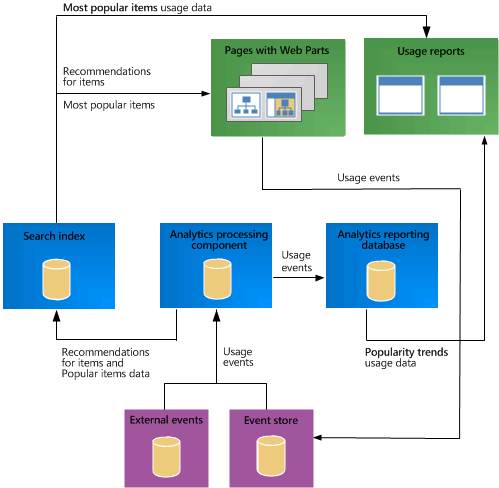

# Plan search for cross-site publishing sites in SharePoint Server 2016

[!INCLUDE[appliesto-xxx-2016-xxx-xxx-md](../includes/appliesto-xxx-2016-xxx-xxx-md.md)] 
  
Search-driven pages are pages that use search technology to dynamically show content. This article describes features that you will use when you set up search-driven pages, such as managed properties, refiners, result sources, and recommendations, and what you must consider when you set up and use these features. 
  
## Plan content sources and crawling

The default content source is Local SharePoint sites. You can use this content source to crawl all content within the web application. However, we recommend that you create separate content sources for libraries or lists that you share as catalogs. When you set up a content source for libraries or lists that are shared as catalogs, we recommend that you select **Enable Continuous Crawl** when specifying the crawl schedules. A continuous crawl starts at set intervals, which enables the search system to crawl the content and quickly add any changed content to the index. The default crawl interval for continuous crawl is 15 minutes, but you can set shorter or longer intervals. Enabling continuous crawl also means that a site administrator will not have to wait for the search service application administrator to manually start a crawl in order to update the search index with the latest changes from a catalog. 
  
For information about how to set up a content source and manage continuous crawling, see "Configure search for cross-site publishing" in [Configure cross-site publishing in SharePoint Server](configure-cross-site-publishing.md).
  
## Plan to manage managed properties in the search index

Managed properties can have many settings, or attributes. These settings, or attributes, are maintained in the search schema, and determine how the contents can be shown in Search Web Parts and search results. Site administrators can read the search schema, such as the mappings between crawled and managed properties on the site collection level. However, they can't edit the search schema. Administrators using Central Administration and site collection administrators can edit the search schema. 
  
When editing the search schema, consider the following:
  
- Which managed properties contain content that I want to search?
    
- Which managed properties contain content that I don't want to be returned in search results? 
    
- Which managed properties do I want to use to sort search results?
    
- Which managed properties do I want to enable as refiners?
    
For more information about the different managed properties settings, see "Managed property settings overview" in [Overview of the search schema in SharePoint Server](../search/search-schema-overview.md).
  
## Plan refiners and faceted navigation

When you plan to use refiners and faceted navigation, consider the questions in the following sections.
  
### What type of refiners do you want to use?

There are two types of refiners: stand-alone and for faceted navigation. You can use just one type on the site, or a combination of both. The structure of the content and what kind of navigation you use on the site will determine the type of refiners that you should choose.
  
- Stand-alone refiners are usually used in scenarios where you have unstructured content. Within this content, you can identify several managed properties that can be used as refiners across all content. However, you do not want the refiners to change depending on a term in a term set. For example, in an intranet scenario, you can add stand-alone refiners to a Search Center page. These stand-alone refiners are typically managed properties that apply to most items in the intranet, such as Author and Date.
    
- Refiners for faceted navigation are used in scenarios where you have structured content, such as catalog content. This content is tied to a term set, and you want to have different refiners for different terms. For example, in an Internet business scenario where a product catalog of electronic products is shown, a term set is used to categorize the different products — for example, Computers or Cameras. After you enable the managed properties Screen Size and Megapixels as refiners, you can configure faceted navigation so that Screen Size appears as a refiner for Computers, and Megapixels appears as a refiner for Cameras. This means that you can guide users to content that is relevant for a specific category. This makes it easier and faster to browse through catalog content.
    
### How do you identify a refiner?

When identifying which managed properties you want to specify as refiners, consider what kind of information users want to differentiate on and browse to.
  
When using refiners for faceted navigation, it is especially important that you identify refiners that represent information that users will find useful when they browse through a catalog. You configure refiners in Term Store Management. You can set refiners for a specific term set, you can configure refiners to apply to all terms in a term set, or you can set specific refiners for a specific term. Consider the following:
  
- Which managed properties represent information that users want to quickly browse to for all my catalog items?
    
- Which managed properties represent information that is unique for only a sub-set of my catalog items?
    
Note that adding many refiners to your page may increase the time to process a query. For more information, see [Estimate capacity and performance for Web Content Management (SharePoint Server 2013)](web-content-management-capacity-and-performance.md)
  
### How should you configure refiners in the Term Store Management Tool?

You configure refiners in the Term Store Management Tool by adding refiners to terms in a term set. When you configure refiners, consider the following:
  
- **Do you want all terms within your term set to have the same refiners, or do you have any term-specific refiners?**
    
    By default, all terms in a term set are set to inherit the refiner configuration from the parent term. The configuration is passed down to all child terms. For any term, you can choose to break inheritance to add term-specific refiners to any child terms.
    
- **How should my refiners be sorted?**
    
    You can specify how the refiner values should be sorted, and if the sort direction should be ascending or descending. The sorting options are as follows:
    
  - Count: sort by the number of items with a specific value
    
  - Name: sort by the name of the value
    
  - Number
    
- **Do I have any refiners where I want the values to be grouped in intervals?**
    
     Refiners of data type Integer, Decimal, or Date and Time can often have many values. When this is the case, the values are automatically placed in intervals. 
    
You can also choose to specify custom intervals.
  
For information about how to add refiners and configure faceted navigation, see [Configure refiners and faceted navigation in SharePoint Server](configure-refiners-and-faceted-navigation.md)
  
## Plan result sources and query rules

Result sources narrow the scope of search results that are retrieved. SharePoint Server 2016 provides many pre-defined result sources. Many of the pre-defined result sources have a corresponding Web Part where the result source is specified as part of the query. For example, the result source Local Video Results is set as part of the query that is used in the Videos Web Part. 
  
You manage result sources in Central Administration and in site collection administration. If you are familiar with Keyword Query Language (KQL), you can create custom result sources.
  
All available result sources appear in a list when you build the query in a Content Search Web Part. Users who configure this Web Part can easily narrow the scope of results that can be shown in the Web Part. For example, for an intranet site, a site collection administrator can create a result source named My PowerPoint Presentations, and configure it to narrow the scope of the search results to PowerPoint presentations created by the user who is logged on to the site. Any user can add a Content Search Web Part to their My Site and configure the Web Part by selecting the result source My PowerPoint Presentations. When users browse to their My Sites, the Web Part only shows PowerPoint presentations that they have created themselves.
  
Another example is an Internet site, where a list that is shared as a catalog is used to maintain product data in many languages. A site collection administrator can create a result source named US English products and configure it to narrow the scope of search results to products with the language tag en-us. A user who has the Contribute permission level can then add a Content Search Web Part, and configure it to show only products that have information in US English, by selecting the US English products result source.
  
In addition to the pre-defined result sources, SharePoint Server 2016 automatically creates a result source when you connect a catalog to a publishing site. The automatically created result source is added to the result sources in your publishing site. This result source limits search results to the URL of the catalog, which means that only content from that catalog will be shown when that result source is selected in a Web Part.
  
> [!NOTE]
> Before you create any result sources, start a full crawl of the catalog content, and connect a catalog to your publishing site. 
  
For information about how to configure result sources, see [Configure result sources for web content management in SharePoint Server](configure-result-sources-for-web-content-management.md).
  
Query rules can be specified for one or more result sources. Result sources are used as part of the query in Web Parts that use search technology, and you can easily influence how search results are shown for all Search Web Parts on your site. By specifying a limited time period for when a query rule is triggered, you can control when certain items are promoted within your website, without having to worry about how to add or remove content at a particular time. Let's say that you are selling electronic products through a product catalog, and you want to promote pink cameras on Valentine's day in the United States. You can create a query rule for a result source that starts on February 14th, and ends on February 15th. The query rule is triggered if a query contains the term Cameras, and pink cameras appear first in the Search Web Part. 
  
For information about how to create query rules, see [Create query rules for web content management in SharePoint Server](create-query-rules-for-web-content-management.md).
  
## Plan usage analytics, usage events and recommendations

The Usage Analytics feature in SharePoint Server 2016 automatically tracks how different items are being viewed by users. Items can be documents, sites, or list items that are shown on a site by using cross-site publishing. Every time that a user views an item, the system issues a usage event and adds this to the total and recent usage event counts for that item. The following usage events are preconfigured: 
  
- Views - number of views for a single item, page, or document.
    
- Recommendations Displayed - number of times a single item, page or document was displayed as a recommendation.
    
- Recommendation Clicks - number of times a single item, page or document was clicked when it was displayed as a recommendation. 
    
You can use the data that is generated by usage events in the following ways:
  
- Show recommendations or popular items on your site. By using recommendations, you can guide users to other content that may be relevant for them, based on how users previously interacted with the site. You can add recommendations to a page by adding one or more Web Parts. The Recommended Items and Popular Items Web Parts are especially designed to show recommendations. For more information about these Web Parts, see "Plan to add Search Web Parts to pages" in [Plan publishing sites for cross-site publishing in SharePoint Server](plan-sharepoint-publishing-sites-for-cross-site-publishing.md).
    
- Sort search results by the number of counts of a usage event. For example, show items that have the most view events at the top of search results.
    
- View the usage event data in the **Most Popular Items** usage report. This report applies to all items in a library, and lists the most popular items for each usage event — for example, a list of the most viewed pages in a library. 
    
- View the usage event data in the **Popularity Trends** report. This report applies to a Site Collection, a Site or an individual item in a library or list. The report shows the daily and monthly counts for each usage event — for example, the total views of a page on a specific day. 
    
The following illustration shows how usage events are sent from Web Parts, through components in the Search service application, and are then used in usage reports and to show recommendations and popular items in Web Parts. 
  
**Overview of data flow for usage analytics, usage events, and recommendations**

  
For more information about the usage analytics framework, see [Overview of analytics processing in SharePoint Server](../search/overview-of-analytics-processing.md).
  
### Plan to add custom usage events

The preconfigured usage events may not be sufficient for your business needs. To track user activities that are important to your site or business, you can register up to twelve custom usage events by using PowerShell. For example, if you want to be able to track how often a catalog item is viewed from a mobile phone, you can add a custom event that tracks this.
  
### Plan to import existing usage events

When you set up a new site, there has not been any user traffic to generate usage events. Therefore, there will be no recommendations and popular items in the system. To be able to show recommendations and popular items from the beginning, you can import existing events from a previous SharePoint system, or import events from a third-party web analytics provider. To correctly import existing data, the data have to be formatted according to specific rules.
  
Whenever a usage event occurs, the event is logged to the item in the library that you shared as a catalog. The default method for logging and sending usage events through the system is to use the URL of the item in the library as ID. However, the usage event data that you import may use a different ID to log usage events, for example InternalNumber. You must change the way that usage events in the library that you shared as a catalog are logged to match how usage events for the imported events are logged. To change this, you must do the following:
  
1. In the library that you shared as a catalog, add a column that represents the ID on which the imported usage events are logged, for example InternalNumber, and add corresponding InternalNumber values to this column for all items in the library.
    
2. Map the crawled property of this column to the managed property UsageEventItemId.
    
3. Change the Web Part used to show individual catalog items to use the managed property UsageEventItemId to log usage events.
    
### Plan to influence how recommendations are calculated

The default recommendations algorithm calculates recommendations between individual catalog items. By default, the crawled property ows_q_TEXT_ProductCatalogItemNumber is mapped to the managed property UsageAnalyticsID, which specifies the property on which recommendations should be calculated. For example, if you show a catalog of electronic products on your site, and a user views AdventureWorks Laptop15.4W M1548 White, only this specific product will get a recommendation count.
  
Depending on how catalog data is structured and how you want to show the products, you might want to change how the recommendations algorithm calculates the recommendations. You can, for example, choose that all color variants of a product get a recommendation count when one color variant is viewed. Let's say that the products in the catalog have the data structure listed in the following table. 
  
|**Product title**|**Item number**|**Group number**|
|:-----|:-----|:-----|
|AdventureWorks Laptop15.4W M1548 White    |1010101    |10101    |
|AdventureWorks Laptop15.4W M1548 Black    |1010102    |10101    |
|AdventureWorks Laptop15.4W M1548 Yellow    |1010103    |10101    |
|AdventureWorks Laptop15.4W M1548 Red    |1010104    |10101    |
   
You may not want to show every color variant in your catalog on a page, but only show one color variant, and then list the other color variants. However, you want all color variants to get a recommendation count when one of the variants is viewed. That is, you want recommendations to be calculated based on Group number and not Item number. To do this, you must map the crawled property Group number to the managed property UsageAnalyticsID. Recommendations will then be calculated between groups and not between individual items. This means that given a group, the system will return a set of recommended groups for a particular group. 
  
> [!NOTE]
> When you map a property to the UsageAnalyticsID managed property, make sure that this property is part of the friendly URL for your item details page. This is because the Recommended Items Web Part uses a token from the URL to show the correct recommendations. 
  
 **Rank usage event types by importance**
  
You can influence how recommendations are calculated by changing the importance of usage event types by using PowerShell. In the recommendations calculations, you can define that a usage event of one type should be considered more important than other usage events. For example, you have two usage events: views from a mobile phone and views from a site. If you want views from a mobile phone to be more important than views from a site in the recommendations algorithm, you can give the usage event views from a mobile a high weight (for example 10), and the usage event views from a site a low weight (for example 1).
  
## See also

#### Concepts

[Plan for cross-site publishing in SharePoint Server](plan-for-cross-site-publishing.md)
  
[Overview of cross-site publishing in SharePoint Server](overview-of-cross-site-publishing.md)
  
[Plan the logical architecture for cross-site publishing in SharePoint Server](plan-the-logical-architecture-for-cross-site-publishing.md)
  
[Plan authoring sites for cross-site publishing in SharePoint Server](plan-sharepoint-authoring-sites-for-cross-site-publishing.md)
  
[Plan publishing sites for cross-site publishing in SharePoint Server](plan-sharepoint-publishing-sites-for-cross-site-publishing.md)
  
[Configure cross-site publishing in SharePoint Server](configure-cross-site-publishing.md)
  
[Estimate capacity and performance for Web Content Management (SharePoint Server 2013)](web-content-management-capacity-and-performance.md)

