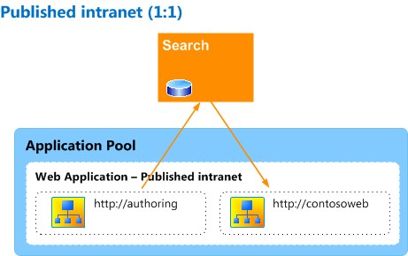
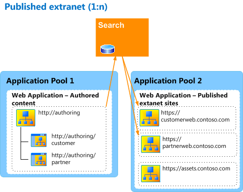
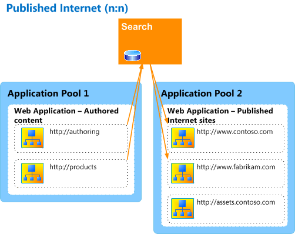

# Plan the logical architecture for cross-site publishing in SharePoint Server

[!INCLUDE[appliesto-2013-2016-2019-xxx-md](../includes/appliesto-2013-2016-2019-xxx-md.md)]
  
Cross-site publishing is a publishing method in SharePoint Server in which you use one or more authoring site collections to author and store content, and one or more publishing site collections to control the design of the site and to show content. The authoring site collection can contain catalogs such as Pages libraries, and lists of items that are tagged with metadata. These catalogs are indexed by the search system and made available to the publishing site collection. The publishing site collection takes the data that has been indexed and shows it on web pages by using Web Parts that use search technology (referred to in this article as Search Web Parts). For more information, see [Overview of cross-site publishing in SharePoint Server](overview-of-cross-site-publishing.md).
  
This article describes the components of a cross-site publishing architecture and illustrates typical cross-site publishing architectures.
  
## Components of a SharePoint cross-site publishing architecture

Most cross-site publishing architectures include two or more site collections, which separate the authoring environment from the publishing environment. The number of authoring and publishing site collections that you create depends on project requirements such as how many catalogs there will be and where they are located, and how many publishing sites will show the content. The number of application pools and web applications that you require depends on the type of site you want to create. For example, an intranet site might use the same application pool and web application for both authoring and publishing site collections. Conversely, an Internet site's authoring site collection would be inside the company firewall, and the publishing site collection might be in a separate application pool and web application that is configured to allow anonymous access for users. Because cross-site publishing works across web applications and server farms, you can create a cross-site publishing solution that fits your SharePoint Server topology.
  
Before you begin to plan the components that go into a cross-site publishing architecture, consider the following questions:
  
- What types of publishing sites are you creating? Are they Internet, intranet, or extranet sites?
    
- What kind of access will users have? Do you want to allow anonymous access, or authenticated users, or both?
    
- Do you need to separate sensitive content for a limited audience from content that will be accessible to a larger audience?
    
The following sections describe the components about which you must make key decisions as you plan the logical architecture for a SharePoint Server solution that uses cross-site publishing.
  
### Authoring site collections

Authoring site collections are where content is authored or stored. You can have one or more authoring site collections. A single site collection can have multiple libraries and lists. However, there can be only one Pages library per site. If you want to separate content into multiple Pages libraries, you must either create multiple site collections, or create multiple sites within a site collection. For more information, see "Plan site collections and site structure for SharePoint authoring sites" in [Plan authoring sites for cross-site publishing in SharePoint Server](plan-sharepoint-authoring-sites-for-cross-site-publishing.md).
  
Library and list content in authoring site collections is tagged by using terms in a managed metadata site column. When the content is indexed by the search system, the column is included as metadata in the index, and is used to categorize content to appear in the publishing site collection.
  
You can create library and list content at the root of the site collection. However, if you think that you might eventually use variations in your site, we recommend that you create a site within the site collection, and create content there. If you later decide that you need to use variations, this will enable you to specify the site as the source variation site, and will simplify the creation of a variations hierarchy within the site collection.
  
As you plan authoring site collections for your cross-site publishing architecture, consider the following questions:
  
- How many authoring site collections do you have to have?
    
- Do any of the authoring site collections have to be in a separate web application?
    
- Will you have separate groups of content authors that belong to separate security groups?
    
### Publishing site collections

Publishing site collections are where content is shown. You can have one or more publishing site collections. However, you do not have to create a site within the site collection, as recommended for authoring site collections. Typically, publishing site collections have URLs that separate sites based on criteria such as location, locale, or brand. This is often helpful when search engine optimization is an important business need. For example, for an extranet site, you might have one publishing site collection named https://partnerweb.contoso.com for external partners, and another publishing site collection named https://customerweb.contoso.com for customers.
  
As you plan publishing site collections for your cross-site publishing architecture, consider the following questions:
  
- How many publishing site collections do you have to have?
    
- Do any of the publishing site collections have to be in a separate web application?
    
- Do you want to use multiple web applications to improve search engine optimization?
    
- Will you have separate groups of site users who will use different types of authentication?
    
### Search

When you use cross-site publishing, you use search technology to retrieve and show content. The queries that are specified in the different Search Web Parts on the publishing site are sent to the search index to retrieve relevant content and show it in the Web Parts. Accordingly, the search crawler must have access to content on authoring site collections. For more information, see "Plan crawler authentication" in [Plan crawling and federation in SharePoint Server](../search/plan-crawling-and-federation.md).
  
Content is shown on the publishing site collection based on search queries. The queries use terms from one or more term sets that were used to tag content on the authoring site. These terms are pinned to the navigation of the publishing site collection, where they are used to build the queries that get and show content from the search index. For more information, see "Plan term sets for tagging content on SharePoint authoring sites" in [Plan authoring sites for cross-site publishing in SharePoint Server](plan-sharepoint-authoring-sites-for-cross-site-publishing.md), "Plan navigation term sets for SharePoint publishing sites" in [Plan publishing sites for cross-site publishing in SharePoint Server](plan-sharepoint-publishing-sites-for-cross-site-publishing.md), and "Plan result sources and query rules" in [Plan search for cross-site publishing sites in SharePoint Server 2016](plan-search-for-sharepoint-cross-site-publishing-sites.md).
  
### Asset libraries

Asset libraries contain binary large objects (BLOBs) such as pictures and video files that are used in content on the authoring site. These assets must be accessible by two separate groups of users: content authors on the authoring site, and readers on the publishing site. If the publishing site is an Internet site available to anonymous users, the asset library must be in a separate site collection from the authoring site, and must be in a web application that is configured to allow anonymous access. This could be in the same web application as the publishing site, or in a separate web application. In either case, designers or content authors must be able to upload files to the asset library, and the library should be added to the list of Suggested Content Browser Locations for the authoring site so that content authors can locate and use assets stored within the library.
  
As you plan asset libraries for your cross-site publishing architecture, consider the following questions:
  
- Where will assets be located?
    
- How will publishing site users be granted access to see assets that are referenced in content that is shown on the publishing site?
    
- How will content authors on the authoring site locate assets and insert them into content?
    
## Typical SharePoint cross-site publishing architectures

This section illustrates typical architectures for cross-site publishing. These architectures are examples of how you might structure your architecture for an intranet, extranet, and Internet site. However, there are many different ways in which you can arrange the architecture for your solution.
  
### Intranet site

The following figure shows a simple one-to-one (1:1) authoring-to-publishing site configuration for a published intranet site.
  

  
Both site collections are located within a single web application that uses claims-based authentication. The authoring site collection (http://authoring) contains a single Pages library, and can also contain one or more lists or libraries that are not Pages libraries. All libraries and lists are shared as catalogs. The catalog content is shown in a single publishing site collection (http://contosoweb).
  
Because the authoring and publishing site collections are in the same web application, asset library files are stored in the authoring site collection, and site users on http://contosoweb have read access to those assets.
  
The search system indexes content from the authoring site. When a user views a page on the publishing site, queries from Search Web Parts on that page are sent to the search index. Results are returned from the search index and shown in the Search Web Parts on the page.
  
### Extranet site

The following figure shows a one-to-many (1:n) authoring-to-publishing site configuration for a published extranet site.
  

  
The authoring and publishing site collections are located in separate web applications. The Authored content web application uses Active Directory Domain Services (AD DS) for authentication of content authors, whereas the web application that contains the Published extranet sites uses forms-based authentication for designers, customers, and partners. The extranet sites are located in a single web application, but are in separate site collections to provide for greater isolation between customers and partners. The authoring site collection (http://authoring/) contains two sites, one for customer content (http://authoring/customer) and one for partner content (http://authoring/partner). Each site contains a single Pages library, and can also contain one or more lists. All libraries and lists are shared as catalogs. The Pages library and list content is shown in two separate publishing site collections, one named https://customerweb.contoso.com for customers, and one named https://partnerweb.contoso.com for partners. For more information about how to plan an extranet site architecture, see [SharePoint Server design samples: Corporate portal and extranet sites](/previous-versions/office/sharepoint-server-2010/cc261995(v=office.14)).
  
Because the publishing site collections are outside the firewall, the asset library is located in a separate site collection in the same web application as the published extranet site collection so that users on the publishing sites have read access to those assets. Internal users such as designers and other content authors have the Contribute permission level to add, update, and delete items in the asset library. The asset library is added to the Suggested Content Browser Locations list for the authoring site collection so that content authors can use those assets in their content.
  
The search system indexes content from the authoring site. When a user views a page on one of the publishing sites, queries from Search Web Parts on that page are sent to the search index. Results are returned from the search index, and shown in the Search Web Parts on the page.
  
### Internet site

The following figure shows a many-to-many (n:n) authoring-to-publishing site configuration for a published Internet site that includes a separate product catalog.
  

  
The authoring and publishing site collections are located in separate web applications. The Authored content web application uses AD DS for authentication of content authors, whereas the Published Internet sites web application uses forms-based authentication for designers and is also configured to allow anonymous access for external users. The authoring site (http://authoring) contains a single Pages library. The product catalog site collection (http://products) contains a list of product data. All libraries and lists are shared as catalogs. The catalog content appears in two separate publishing site collections, one named http://www.contoso.com and one named http://www.fabrikam.com. Different content and products are shown on the publishing sites based on the associated brand.
  
Because the publishing site collections are outside the firewall, the asset library is located in a separate site collection in the same web application as the publishing site collections so that users on the publishing sites have read access to those assets. Internal users such as designers and other content authors have Contribute permission level to add, update, and delete items in the asset library. The asset library is added to the Suggested Content Browser Locations list for the authoring and product catalog site collections so that content authors can use those assets in their content.
  
The search system indexes content from the authoring site and the product catalog site collection. When a user views a page on one of the publishing sites, queries from Search Web Parts on that page are sent to the search index. Results are returned from the search index, and shown in the Search Web Parts on the page.
  
## See also

#### Concepts

[Plan for cross-site publishing in SharePoint Server](plan-for-cross-site-publishing.md)
  
[Overview of cross-site publishing in SharePoint Server](overview-of-cross-site-publishing.md)
  
[Plan authoring sites for cross-site publishing in SharePoint Server](plan-sharepoint-authoring-sites-for-cross-site-publishing.md)
  
[Plan publishing sites for cross-site publishing in SharePoint Server](plan-sharepoint-publishing-sites-for-cross-site-publishing.md)
  
[Plan search for cross-site publishing sites in SharePoint Server 2016](plan-search-for-sharepoint-cross-site-publishing-sites.md)
  
[Configure cross-site publishing in SharePoint Server](configure-cross-site-publishing.md)
  
[Estimate capacity and performance for Web Content Management (SharePoint Server 2013)](web-content-management-capacity-and-performance.md)

