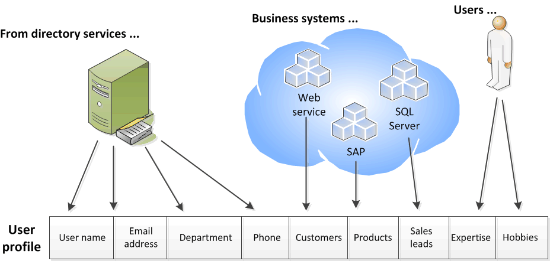

# Plan user profiles in SharePoint Server

 *[!INCLUDE[appliesto-2013-2016-2019-xxx-md](../includes/appliesto-2013-2016-2019-xxx-md.md)]
  
A user profile is a collection of properties that describes a single user, and also the policies and other settings associated with each property. User profiles help identify connections between users in an enterprise, such as their common managers, workgroups, group membership, and common web sites. They can also contain important information about a user, such as the products the user works on, the user's interests or areas of expertise, and the user's place in the organization's structure. By exposing this information in features such as My Sites, user profiles provide the basis for enterprise social networking in SharePoint Server. Some of the enterprise social networking features that user profiles support are as follows:
  
- My Sites
    
- Profile pages
    
- People searching
    
- Organizational charts
    
- Expertise search
    
- Social tagging
    
- Audiences
    
User profiles are also [used in server-to-server authentication](../security-for-sharepoint-server/server-to-server-authentication-and-user-profiles.md) which allows for servers to access and request resources from one another on behalf of users. 
  
    
## Overview of user profiles

As shown in the following illustration, user profiles can be composed of properties that are imported from a directory service, imported from business systems, and supplied by users. In SharePoint Server 2013, you can accomplish this import with the included version of Forefront Identity Manager. In SharePoint Server 2016, you can use an external identity manager such as Microsoft Identity Manager 2016 (MIM).
  

  
For example, a directory service could supply important information that is needed across the organization, such as users' account names, work telephone numbers, titles, and work e-mail addresses. Business systems could supply business-related information, such as the customer accounts or product lines managed by each team member. Users could supply supplemental information about themselves, such as their areas of expertise or hobbies. 
  
User profiles are distinct from SharePoint Server user accounts and exist in their own data store. User accounts help provide security and permissions to objects in SharePoint Server. User profiles are used to organize information about users and about the relationships among users. Updating a user's profile does not affect that user's user account.
  
New user profiles are created in the following ways:
  
- If an authenticated user does not have a user profile, a new one is created by using properties taken from the appropriate directory service the first time that user accesses his or her My Site.
    
- You can create one or more user profiles by using [profile synchronization](profile-synchronization-in-sharepoint-server-2013.md).
    
- A custom solution can be developed to create user profiles.
    
## About user profile properties

A user profile is composed of a set of user properties. Each user property provides an item of information related to a user. User property values can come from directory services, business systems, or user input. You can configure some properties so that they can be exported to a directory service. Many of the decisions that you make in planning user profiles are about which user properties to include and how their values are set.
  
User profiles include a set of default user profile properties. Many of these properties are included because they are used by SharePoint Server social networking or personalization features, and a subset of the properties are mapped automatically to their corresponding directory service attributes after you run profile synchronization.
  
SharePoint Server includes a managed metadata feature. [Managed metadata](../governance/managed-metadata-planning.md) is a hierarchical collection of centrally managed terms that you can define and then use as attributes for items in SharePoint Server. A set of managed terms is a term set. You can associate a term set with an editable user profile property. By doing this, you can govern the values associated with that property and make it easier for users to enter appropriate values for the property. For example, by associating a term set that defines the job titles in an enterprise, you can help promote consistent use of those titles in user profiles.
  
## About property policies

As described above, user profiles are used in many SharePoint Server social networking features. You can set policies on each user property in a user profile to help govern how the information in that property can be used. You can specify:
  
- Whether or not a property is included in user profiles
    
- Whether or not a property is required
    
- Whether or not users can change the default privacy setting of a property
    
- Whether or not a property is visible to other users
    
The following table describes each policy setting option.
  
|**Policy setting option**|**Description**|
|:-----|:-----|
|Enabled or Disabled    |You can configure a property to be available for use in features that incorporate it, or you can configure a property to be unavailable by configuring it as disabled.    |
|Required    |You can specify that a property must contain information.    |
|Optional    |You can specify that a property is not required to have a value. Each user can provide values for the property or leave the property empty.    |
|Default privacy setting    | This determines who can see information for a property, as follows:     Everyone: Every user who has viewer or higher permissions to a site can see the relevant information.     Only properties that have a privacy setting of Everyone will be used by search.     Only Me: Only the user can see the information.     User Profile service administrators can always view the information in a user profile regardless of its default privacy setting.    |
|Users Can Override    |When this option is selected, users can change the property's default privacy setting. When this option is not selected, only administrators of the User Profile Service can change default privacy settings.    |
|Replicable    |The property's value will be replicated to user information lists in other sites when its value changes. For a property to be replicated, its default privacy setting must be set to Everyone and the User Can Override policy must not be selected.    |
   
Along with setting policies on each user profile property, you can set similar policies on some SharePoint Server features that provide profile-related information in lists, Web Parts, or web sites. The personalization feature settings that you can set policies on include the following:
  
- The display of SharePoint site memberships
    
- The display of colleagues on My Sites
    
- Auto-population of colleagues based on organizational hierarchy
    
- The display of colleague recommendations
    
- The display of links on My Sites
    
- Other sites pinned to My Sites 
    
The following considerations can help you determine which policies are appropriate for your organization:
  
- **Which properties should be required?** By default, some properties are required and can be configured so that they cannot be overridden or changed by users. In most organizations, these properties are key ways to enable collaboration and develop relationships across the organization. SharePoint Server uses many of these properties to enable other features, such as audiences. 
    
- **Which properties should be visible to everyone?** By default, most properties are visible to everyone, but you can configure sensitive information to have limited visibility. For example, a company that has many employees in the field might decide that mobile phone information is important for everyone to see. Other organizations might choose to keep all non-work telephone numbers private. 
    
- **Which properties policies can be changed by users?** Some property policies have settings that can be changed by users. For example, some users might not want automatic population of colleague lists. Other users might want to change the default visibility setting for a property. 
    
When planning the policy setting for a property or personalization feature, consider the factors shown in the following table.
  
|**Condition**|**Disable the property**|**Make the property optional**|**Make the property required**|
|:-----|:-----|:-----|:-----|
|The property is used by key user features.    |||X    |
|The property is associated with key business data for applications in Microsoft Business Connectivity Services.    |||X    |
|The property is used when you create audiences.    |||X    |
|User Profile service administrators expect consistent and meaningful values for the property.    |||X    |
|The property will rarely be used.    |X    |||
|The property will distract from more important properties.    > [!NOTE]> You can change the display settings for properties to hide them.           |X    |||
|You decide to provide default values for properties, but want users to be able to change or remove those values.    ||X    ||
   
When you plan the default visibility settings for properties, consider the factors shown in the following table.
  
|**Condition**|**Action**|
|:-----|:-----|
|You want to use the property in search so that users can be found by searches for the property.    |Set the default access policy to Everyone. Only properties that have a policy setting of **Everyone** will be used by search.    |
|The property is useful across workgroups and other divisions in your organization and does not contain sensitive information.    |Make the property visible to everyone.    |
|The property is of a private or sensitive nature.    |Make the property visible only to the individual user.    |
   
## Planning user profiles

This section provides guidance to help in planning user profiles. It is recommended that your planning tasks are performed in the following order:
  
1. Identify stakeholders
    
2. Identify how the profile information will be used
    
3. Identify directory services and business systems
    
4. Determine which properties to include
    
5. Determine property details 
    
6. Determine personalization settings policies
    
7. Plan for capacity
    
### Identify stakeholders

User profiles are part of an enterprise's information architecture and must meet the needs of workgroups that depend on the profile information. Decisions about which properties to include in profiles should be based on input from stakeholders representing the workgroups that use My Sites and other social computing features.
  
Decisions about user profiles must strike a balance between meeting the social computing needs of the organization and its security, privacy, and regulatory responsibilities. Therefore, decisions about which information to expose in user profiles and which properties to include should be made with the participation of executive sponsors, legal advisors, and human resources team members. This helps ensure that profile information is used in compliance with enterprise policies and legal requirements. If your solution spans multiple locales, it is a recommended practice to include representatives from the various locales in making these decisions.
  
### Identify how profile information will be used

How you intend to use this information in your SharePoint Server solution is the key to planning user profile properties. Your functional specifications and architectural documents should provide this information and should help guide you in designing effective user profiles to meet your users' needs. Your development team's functional specification, architecture diagrams, and other artifacts will be key resources in determining requirements for user profile properties.
  
### Identify directory services and business systems

User profiles contain data from directory services and business systems. Directory services can supply the members of your user community and provide data about those users. Additional user information can be imported from business systems such as external databases or Web services. The particular directory services and business systems you'll use depend on your enterprise's environment.
  
### Determine which properties to include

By default, there are mapped properties which support basic SharePoint Server social computing and personalization features. You'll want to determine which additional custom properties to include based on your social computing solution goals, your solution's functional requirements, and the data available from directory services and business systems.
  
### Determine property details

The following table describes the type of information to collect around each property that you plan to use with user profiles in SharePoint Server.
  
|**Property**|**Information to provide**|
|:-----|:-----|
|Source    |Indicate the source for the property: a directory service, business system such as an HR system, or "user input" for a write-in field.    |
|Type    |Indicate the property's type.    |
|Description    |Define the property and describe its intended use.    |
|Enable    |Indicate if this property should be enabled. Enabling a property makes it available for use in features such as My Sites. Disabled properties are only visible to administrators of the User Profile service.    |
|Require    |Indicate if the property is required to have a value.    |
|Editable    |Indicate if users can edit this property's value.    |
|Term set    |If this is an editable property, you can also supply the name of a term set that contains acceptable values for the property.    |
|Default policy setting    |Indicate who can see information for the property: everyone or only the user.    |
|Privacy setting override    |Indicate if users can change the property's default privacy setting.    |
|Display options    | Indicate if this property's value may appear in the following places:     On My Profile pages     On the page on which users edit their profile information     On a user's newsfeed, when the property value changes    |
|Replication    |Indicate if the property can be configured to be replicated to user information lists on other sites when a user changes its value. This requires that the property's default privacy setting is **Everyone** and that users cannot override the property's default privacy setting.    |
|Search-related attributes    | There are two search-related attributes:    **Alias**: Indicate if the property's value should be treated as an equivalent to the user's name for searching.    **Index**: Indicate if the value of this property should be indexed for searching.    |
   
### Determine personalization settings policies

Along with setting policies on each user profile property in the User Profile service application, you can set similar policies on SharePoint Server personalization features that provide profile-related information in lists, web parts, or web sites. You do this on the **Manage Policies** page of the User Profile service application. You can set policies to give users the capabilities show in the following table. 
  
Use the **Personalization** tab of the User Profile Properties Planning worksheet to record the set of policies related to personalization features. 
  
|**Feature**|**Information to provide**|
|:-----|:-----|
|SharePoint site memberships    |Enable this capability if users' SharePoint site memberships should be displayed in My Sites, lists, and web parts.    |
|Distribution list memberships    |Enable this capability if distribution list memberships should be displayed in My Sites, lists, and web parts.    |
|Colleagues    |Enable this capability if users' colleagues should be displayed in My Sites.    |
|Auto-population of colleagues from organizations    |Indicates if the user's colleagues list should be auto-populated based on organizational hierarchy.    |
|Display colleagues recommendations    |Indicates if the list of colleague recommendations (based on email usage and other factors) should be displayed in My Sites, lists, and web parts.    |
|Display links on My Sites    |Enable this capability if links to users' frequently visited web sites should be displayed in My Sites.    |
|Display other sites pinned to My Sites    |Indicates if the sites that users have pinned to their My Sites can be viewed by other users.    |
   
You can enable or disable personalization features, and you can configure privacy settings on them. In the User Profile Properties Planning worksheet, record your privacy policy preferences for each personalization feature, as shown in the following table.
  
|**Setting**|**Information to provide**|
|:-----|:-----|
|Enable    |Indicate if this personalization feature should be enabled. Enabling a capability makes it available for use in features such as My Sites.    |
|Default privacy setting    |Indicate who can see information that is provided by the feature: everyone, colleagues, team members, manager, or only the user.    |
|Privacy setting override    |Indicate if users can change the feature's default privacy setting.    |
   

